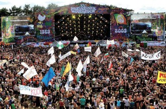
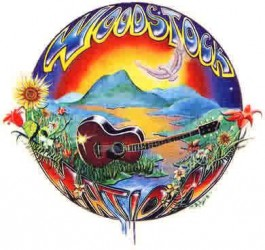

# 从媒介环境学视角看国内摇滚音乐节对青年群体的影响

近年来，国内音乐节产业迅速兴起，以燎原之势从开始的北京、上海等大城市蔓延至全国各大中城市，其品牌也从最初的国内音乐节创始者“迷笛”一家增加到上百家。音乐节不同于演唱会、音乐会，它更像是一个以音乐为载体的巨大派对，以青年为主的观众群体，可以在以摇滚乐为主的音乐中尽情嬉戏、狂欢、宣泄，不需要正襟危坐，也不同于摇滚歌手的个人演唱会，它一般在公园或大广场举办，有多个表演舞台，演出进行时可以在舞台之间和休闲区内自由活动，在形式上提供给了演出者和观众很大程度的自由。早在二十世纪六、七十年代的欧洲和美国，以格拉斯顿伯里音乐节和伍德斯托克音乐节为代表的音乐狂欢就已是规模盛大的音乐盛典，成为了音乐节历史上的神话。1969年的伍德斯托克音乐节上，45万青年在滂沱大雨中、泥泞草地上随着舞台上歌手演唱的摇滚乐一起疯狂摆动、吼叫，他们吸毒、裸奔、做爱，以此表达对战争的反对，嘲笑和蔑视虚伪的政治和平庸的文化。

## 摇滚乐与“摇滚精神”

摇滚乐是一种以反映社会为根本主题的具有宣泄和反抗特性的音乐种类，其本身也是一种媒介。虽然内部流派多样，但有音调亢奋、旋律节奏感强、配乐激昂、歌词不乏思想性的共性，并流行于青少年人群之中。现在国内音乐节的演出阵容还主要以国内乐队为主，虽然当下国内摇滚乐有反叛性逐渐缺失和流行化逐渐增强的趋势，却也始终不乏一批关注社会民生的歌手和他们的音乐作品，如川子、李志、左小祖咒等。他们想要通过音乐传达给人们一种与主流媒体价值观不同的、对生活的反思和反叛意识，从规则的生活中跳出来拥有对自由的向往，而这也是他们在音乐节上演出时想要表达的。当带有怀疑和反抗性的歌词与一种释放能量的演唱方式相结合，它就变成了一股力量，唤醒人追求权利与自由，拥有独立和抗争的意识，摇滚乐也就不再仅仅是一种音乐，更被赋予了“摇滚精神”。

### 音乐节这一媒介传达的到底是什么“讯息”

如果把“音乐节”的这种演出形式看作一种媒介，以摇滚乐为主的音乐是它最直接传播的内容，人们理所当然地认为音乐节传达的就是摇滚乐自由、反叛的“摇滚精神”。在1959年的美国伍德斯托克音乐节上，演出者传达的精神讯息承载了更多的文化内涵和时代主题。当所有乐队和乐迷汇集在一起时，他们共同产生的那一股强力的气流，似乎达成了人们对乌托邦的所有想象：人与人之间自由平等，没有身份和社会地位的差别，没有迥异价值观的冲突，只有最原始的冲动与渴望。然而媒介环境学的学科创始人麦克卢汉认为，媒介作为信息的载体，其影响之大甚至超过了它所传播的内容，“因为媒介的‘内容’好比是一片滋味鲜美的肉，破门而入的窃贼用它来涣散思想看门狗的注意力。媒介的影响之所以非常强烈，恰恰是另一种媒介成了它的‘内容’。”媒介环境学认为，媒介是复杂的讯息系统，它隐含和固有的结构，对人的感知、理解和感情都有着重要的影响，所以我们应该把视点更多地放到媒介本身的形式上。如果以这种观点来看，音乐节这一传播媒介本身的形式，更关键地决定了它传播的内容。

那么如果它传播的（主要）不是摇滚乐承载的“摇滚精神”，那是什么呢？我将会从音乐节演出的形式上试图探究这个问题。

**1.演唱中的视觉元素**

传统严肃的音乐会，必须在高雅和代表主流意识形态的音乐场所内进行，如富丽堂皇的音乐厅或庄严的大会堂，演奏的音乐作品也往往跟主流文化和意识形态合拍，歌手的身体形态和着装也要符合主流文化的审美标准以及社会习俗的要求，观众也自然而然融入这样的氛围里，整个演出过程严肃而庄重。而在音乐节上，可以看到歌手们无论在着装打扮还是身体动作上多数张扬个性，肆意宣泄，为了更好地表达情感，把身体动作加入了演出之中并成为了演出的一部分，而观众也在热烈的气氛中收到鼓动，情绪持续高亢。所以，音乐节在传播音乐的同时，视觉元素的影响是不可忽视的。这时，听觉和视觉共同传播的是一种使人亢奋的氛围，而并非音乐本身，歌手唱出的歌词仅仅是一种发声方式。

**2.观众和观众之间的互动**

观众之间在观看演出的过程之中有大量的交流互动，也是音乐节区别于普通演唱会的重要特点。由于所有观众都在舞台之前的场地站立观看演出，人与人拥挤在一起，向台上的演出者欢呼致意，他们相互之间也有娱乐的方式：跳水（一人被举起后向人群中躺下，被人群高举着慢慢传递）、POGO（在音乐激烈时相互冲撞）、开火车（人与人搭肩排队，随节拍跳动着在人群中前进）……一般来说，参加音乐节的年轻人在同龄人之中属于音乐爱好相对较小众的一类，相比于传播广泛的流行音乐，他们更热爱摇滚乐，更有反叛的特质。这体现了他们自身的不同，甚至也不乏有人以此标榜自己的个性。虽然他们是同类中的“异类”，但也正因如此，更需要找到品好相似的“同类”，相互聚集的“组织”，音乐节成为了他们理想的聚集方式。虽然他们之间也不见得会有想象中那么多的共同点，但却实现了他们对“共同体”的想象——而这种莫须有的东西，把也许并无任何相关性的人们黏连在了一起。它只是这些年轻人的精神寄托、心灵归属，并借以把自己想象成那种特定的样子，以此自我满足。

**3.演唱者和观众之间的互动**

在演出过程中，台上的演出者和台下的观众之间的互动更多是语言和情绪上的，观众的情绪被演出者的演出和语言交流所掌控，观众的回应忠实如信徒，这让整个场面仿佛像个宗教仪式。詹姆斯凯瑞提出了两种传播观念：传播的传递观和仪式观。根据他的描述，传递观强调讯息在空间内的传布，目的在于实现对空间距离和人的控制；传播的仪式观不是分享信息的行为，而是共享信仰的表征，强调文化的共享，目的在于维系一个社会。“如果说传播的传递观其核心在于讯息在地理上的拓展（以控制为目的），那么传播的仪式观其核心则是将人们以团体或共同体的形式聚集在一起的神圣典礼。” 音乐节上的演出本身就拥有仪式的特征，虽然凯瑞的“仪式观”并不特指“传播仪式”，但用“仪式观”来看更能让我们看到——“它（仪式）不是一种传递信息或影响的行为，而是共同信仰的创造、表征与庆典”。然而在演出的“异常”狂热的仪式气氛之中，也许演唱者高呼“信仰”，想要传递“信仰”，但台下的观众在拥挤的空间里随音乐扭动着、POGO着，此时他们的听觉、视觉、触觉、温觉、味觉等等都与周围融为一体，心灵处于陶醉状态中，是一种无意识状态，虽然仪式是“共同信仰的创造、表征与庆典”，然而此刻追求的所谓“共同信仰”（此处可理解为人们追求的“摇滚精神”）实则都是虚幻的。在台上台下互动交流之中，使得整个音乐节的情绪像龙卷风一样，把所有人都卷入其中，使参与其中的观众感觉自己处于其中、属于其中，得到某种欲望的满足。

麦克卢汉说：“媒介是终极的讯息……我强调媒介是讯息，而不说内容是讯息，这不是说，内容没有扮演角色——那只是说，它扮演的是配角。”在他看来, 媒介内容只能触及人的意识层面的思想观念和意识形态, 媒介形式则可塑造人的潜意识层面的思维习惯和感知模式。可以看出，音乐节的表现形式对所谓“摇滚精神”的传扬并不明显，反而有一种集体无意识的意味。通过这“仪式”，年轻人们完成了对不存在的“共同体”的塑造，把自己和其他人归为同类，哪怕实际上他们原本对同一问题的观点也许完全相背。而将他们聚合在一起的人——演出者——他们共同的偶像，成了他们最大的共同点。这时，他们已经与普通的追星族、粉丝并无二样，而在开始提到的那一批具有反叛特质的歌手们则成了这些青年人膜拜的对象，其影响力不亚于“公知”。

中国当今的环境之下，被压抑的自由、被限制的权利让青年们隐隐感到了一种压抑，却又说不清道不明。不知道自己被什么束缚压抑，也就不知道自己的宣泄到底是要对抗什么，但是情绪却极容易被煽点。伍德斯托克之所以伟大，是因为它在当初的时代背景之下，有明确的时代主题和反战诉求，而音乐节的形式把青年人们粘合在了一起，形成一股共同抗争的力量。但在当今年代，需要对抗的对象远没有那样明确而具体，宣泄出的力量无从指向，只能任凭消散。

（采编：彭卓文；责编：杨修）

[【所闻所见】德与才的精神战争：现代艺术与政治的目的化陷阱](/archives/42326)----文学性的作品阐释与德性关注并非老欧洲过时的文化霸权，而是不断展开对艺术中幽微真理“开而弗达”的思考，对永远在途中自足奋进的非目的性的生活进行塑造。

[【所闻所见】普罗米修斯：民主或民粹的启蒙](/zh-cn/archives/42373)----作为“盗火者”，普罗米修斯的形象一直为人所玩味，“火”的象征意义，及“盗火”这一行为本身，都为普罗米修斯增添了一层启蒙的色彩。《被缚的普罗米修斯》这一戏剧作品，又是如何描述“盗火”这一行为呢？
