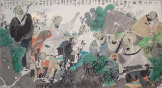

# 德与才的精神战争：现代艺术与政治的目的化陷阱

刊于《东方艺术·大家》杂志2013年8月号

近十年来，不得不说艺术的创造性正越来越乏力，策展话语中所谓的那些语言突破、社会介入、哲学思考，在上世纪纷纭的艺术现象中都能找到模板。艺术家的工作已经难以用“创造性”来衡量了，艺术作品如设计一样在创造力上皆均质化、范式化，此时作品的凸显就只能靠感人的情怀、政治倾向、艺术家的身份与故事——就像一位策展人对年轻艺术家开玩笑说的：你又不是同性恋，又不是黑人，搞什么当代艺术。

当我们回顾欧陆先锋艺术运动与更晚些兴起的英美当代艺术时，可以明显地看到两者之间的区别；前者更强调思考，强调作品的普遍真理性与艺术家作为某种精神领袖的使命感，后者更强调感受，也就是作品的特殊气质与艺术家个人身份的差异性。我们难以想象毕加索或博伊斯时期的欧陆会有南格尔丁式的艺术家获得承认，也难以在英美发现能够与其思想界发生互动，建立尼采-瓦格纳式关系的艺术案例。

这种区别并非在不同文化圈天然形成，而是英美文艺家们确立自身主体性的区别化运动所致。苏珊桑塔格在其1965年的批评作品《一种文化与新感受力》中反复把具有欧洲古典精神的英国评论家马修·阿诺德作为靶子，试图借“新感受力”之名与一种她所描述的文学中心性的欧洲旧文化断裂：

“马修·阿诺德的文化观念把艺术定义为对生活的一种批评——这被理解为提出道德、社会和政治诸方面的思想来进行思考。新感受力却把艺术理解为对生活的一种拓展——这被理解为（新的）活力形式的再现。”

而对艺术定义的冲突也必将引出“何为伟大的艺术作品”的冲突：

“而在一件伟大的艺术作品从来就不只是（或甚至主要不是）某些思想或道德情感的表达。它首要地是一个更新我们的意识和感受力、改变（不论这种改变如何轻微〕滋养一切特定的思想和情感的那种腐殖质的构成的物品。”

桑塔格的意图很明显，即用不论如何轻微的“感受力”之改变，令“思想与道德情感”退场出局。只要仅仅做出了轻微的感受更新，就能滋养植物般的思想或情感，也就生成了伟大的艺术作品。

这种批评进路对中国人并不陌生，在南朝评论家钟嵘的《诗品》中，也针对魏晋永嘉朝的“理过其辞”、“似道德论”、“风力尽矣”做出了批判：

“永嘉时，贵黄老，稍尚虚谈。于时篇什，理过其辞，淡乎寡味。爰及江表，微波尚传。孙绰、许询、桓、庾诸公，诗皆平典似道德论，建安风力尽矣。”

而这里所指的“建安风力”是：

“降及建安，曹公父子，笃好斯文；平原兄弟，郁为文栋；刘桢、王粲，为其羽翼。次有攀龙托凤，自致于属车者，盖将百计。彬彬之盛，大备于时矣。”

钟嵘认为，建安诗风共同体与曹氏政治共同体的兴起几乎是同一的。一个“笃好斯文”的政治中心引起了一场“彬彬之盛”的文化运动。

而在陈寅恪的《魏晋南北朝史讲演录》中，分析了魏晋的政治斗争与朝代更替是以两个核心为主线的；即信仰儒家的地方豪族司马氏与非儒家而出身寒族的曹氏。而司马氏服膺儒教有两个表现，一是文化上“博学好古”，二是伦理上严守名教与孝道；竹林七贤之一的山涛本好老庄，后来为投靠司马氏而改宗信了儒家，导致嵇康与其绝交。

而曹氏代表的寒族为了确立自身政治主体性，也对儒家豪门势力采取了差异化、区别化的文化战略，广发求才令，掀起德才之争——“若必廉士而后可用，则齐桓其何以霸世”，“或不仁不孝而有治国用兵之术，其各举所知，勿有所遗”。

当我们对比钟嵘与桑塔格的文化批判，可以看到其结构上的相似性。钟批判“理过其辞”、“似道德论”，桑则说“伟大的艺术作品从来就不只是（或甚至主要不是）某些思想或道德情感的表达”；钟力倡“建安风力”，桑则言“首要地是一个更新我们的意识和感受力”。而牵扯到其后的政治背景，曹氏代表的寒族与儒家豪门的斗争，则类似于美国与老欧洲的文化政治矛盾。

魏晋时儒家尚德，主要有两个方面，一个是学，一个是孝，皆为后天养成，在知识上践行博雅修身，在伦理上定位君臣父子，充满上行下效的使命感。而曹氏尚才，也有两个层面，一是个人特殊天才在诗作与政治上的无碍实现，二是反对道德教养，放任天生个性的伦理观，两者皆着意先天气质。桑塔格也有两部作品，《反对阐释》可谓反对老欧洲之“学”，反对以文学性的解读在艺术作品中追求普遍真理的努力，《论同性爱》可谓反对旧西方之“孝”，挑战基督教文化的律法教化传统。

亚里士多德在《尼格马可伦理学》中对德性、至善、幸福以及人灵魂的各个部分做了极为复杂的讨论。其一开篇就抛出其影响着西方整个古代世界的目的论，言人与万事万物都有其最终目的，而人的所有实践与选择，都以某种善为目的；人生在世，最大的目的与最大的善就是幸福。而幸福终归要合于具体生活中作为习惯的德行，德行是可赞美与夸奖的，幸福却不可赞美，是毫无匮乏与妄念的完满。

柏拉图对于幸福论-目的论时刻保持着警惕，这体现在《理想国》中对目的论式的完美政体的反讽。既然人的最高目的是幸福，而人又是政治动物，那么用逻辑设计出一套能让所有人幸福的完美政体，然后把该政体作为人类终极目的实践出来不就解决所有问题了吗？目的论式的论证方式如果脱离具体的德行生活，与逻各斯配合往往就会产生虚高的乌托邦主义，而柏拉图早就洞察到这一思想方式的问题，在作品中让一群自作聪明者论证出一个貌似合乎逻辑，内容却残忍诡异的乌托邦。而如果柏拉图知道今天巴迪欧把这个用来反讽的噩梦仍然读成正命题，并要坚决捍卫这个“希腊梦”，恐怕会非常无语。

之所以从德才之争转而谈起伦理学目的论，是因为德才问题的背后与最高生活和理想政治有着更深远的关系。汉语中“才”的复杂涵义很难与西方词汇转译，晚清外交家陈季同曾在巴黎用法语写作向西方人解释什么是“才子”。他写道：“才子从自然中获取灵感，听任情感的宣泄......每个作家都有个性，一种源于自然的性格、一种天赋、一种才具，所以我们才称他们为才子......他们具有高贵的精神，他们的感受正是这种高贵加给他们的......他们也一直在试图实现一个目标，那才是他们的光荣所在......如果我们寻找许多元朝作者试图达到的目标，我们马上就会发现他们出版作品的唯一目的就是通过快乐场面愉悦大众，或者通过悲伤场面感动大众......”

而在西方古典世界的语言中，对“努斯”一词的汉语翻译则更显困难。这个发端自阿那克萨戈拉，经苏格拉底、柏拉图、亚里士多德、普罗迪诺充分讨论，最后帮助黑格尔生成出现代性之普遍性与绝对性的神秘希腊词令翻译家们一筹莫展，只好音译。但作为一种大胆的比较与臆测，我们或许可以粗略地看出，“努斯”与“才”有着几个结构上的相同点。

在亚里士多德的讨论中，努斯是有目的性的，是为着某种目的而推理的东西，而在曹操的求才令中，显然“任人唯才”意味着有才者能够实现政治家的某种目的；另外，努斯包括了明智与技艺，前者多指针对可变事物的实践（亚里士多德以政治家伯里克利作为明智的例子），后者则指制作出东西的工作，而“才”在中国的讨论中则主要由政治实践与艺术创作两方面构成；第三，才与努斯一样，都是天生的，都是不可教的，一个人灵魂中的努斯或才无法跑到另一人灵魂中去。

而与才相对，中国古代对德的定义是“德者，得也”，意指一种已经得到的完满状态，在德的情况下人的活动是不以欲求为动机的，因为有欲求证明自身匮乏，缺乏某物。在德的状态下人也活动，但没有外部的目的；如挤奶工挤奶的行为如果依靠德，那其就是自我完满地挤奶，无论外界发生什么变化也不会影响其劳动品质，其挤奶劳动是自足的；而如果挤奶依靠目的，那么如果其目的是赚钱，挤奶就只是手段，在能增加利润而又能逃脱惩罚的情况下其就会自然而然地添加三聚氰胺。

而在郭店楚简《五行》篇中，子思子对自足性的德与目的性的善也做了地位悬殊的区分——“善，人道也；德，天道也”。

而儒家之所以用学与孝两个方面来培育德，则是有着严格思想设计的。《学记》云：“故君子之教，喻也。道而弗牵，强而弗抑，开而弗达。”牵、抑、达三个词都暗示学是有目的的，但君子之教就是要破除目的性，保持一个对知识永远在途中、永远在提升、永远在打开的状态，这种学即是博雅之学而非技术培训和因信称义。而《尚书》所记载的禅让制第一次发生，就是舜被父亲与后母欺害仍全心尽孝，其德行经尧反复考察后让与帝位。家庭伦理的目的化是非常可怕的，如果人基本的亲人互惠生活都不能完满自足而是为了某种外部目的与欲望，那么文革中骨肉相残与今天各国“兽父”案也就难以避免了。而如果博雅之学和家庭孝道两个方面能够自足完满，基本上可以保证社会主流不会因为人互相冲突的目的与欲望而崩溃。

而桑塔格在《新感受力》一文中，最明显的一个目的就是要证明与工业革命以来的科学文化相比，文学-艺术文化的功能性一点也不弱，她写道：

“我指的是出现在那些热心投身于艺术的人们中间的那种严重的疑惑。有个性的艺术家在创造独一无二的艺术品以愉悦他人、培养其良知和感受力方面的作用，一再受到质疑。某些文学知识分子和艺术家则走得更远，以至预言人的艺术创造行为终将消亡。艺术，在一个自动化的科学社会，将会丧失功用，变得毫无用处。 不过，我却认为，这种结论完全站不住脚。......”

那么在桑塔格看来，艺术的功能与目的到底是什么呢？

“然而，艺术的目的终究总是提供快感......”

我们惊叹地发现，1965年的桑塔格的文化批评与十九世纪末的清朝总兵陈季同对元曲才子作者的评述如此相似。中国才子文化在现代世界的异国找到了金发碧眼的知音，而站在才子文化背后以才攻德的“唯才政治”，是否也能在现代世界找到知音，共吟一曲“周公吐哺，天下归心”呢？

将希腊的努斯与逻各斯发展成现代性历史哲学的黑格尔，有着历史将走向终结的预言。这种终结源于人物质与精神需求的满足，也即是人目的性的实现，而如果艺术的目的是提供快感，在完成这个目标后，艺术创造自然也就完成任务了，任何结构上的创新就都没有必要了；而如果艺术的目的是让作者的非主流身份得到承认，那么在完成这一目标后，艺术同样也就无事可做了。据说美国的艺术院校流传有一套作品公式，例如加入多少色情成分一定能卖掉，例如站在哪个政治立场最可能被关注，例如如何利用自己的民族出身或性取向大做文章。

文学性的作品阐释与德性关注并非老欧洲过时的文化霸权，而是不断展开对艺术中幽微真理“开而弗达”的思考，对永远在途中自足奋进的非目的性的生活进行塑造。人的行为如果以目的与欲望作为最高理由，那就要么偏执地争斗，要么在目的满足后泡在欲望快感中不可自拔，将自我精神封闭在一个所谓的“历史终结处”，成为老生常谈的末人。

世界艺术的中心从巴黎转到纽约算是一个有趣的历史命题，尽管有人愤愤不平写什么“艺术的阴谋”，说中央情报局介入推动美国艺术。但就像曹操不在乎道德一样，桑塔格与“中央情报局”所塑造的“新感受力”美国，其重视的不是学与孝，而是唯才是举。常有人谈论在时势下世界艺术的中心或许从纽约、伦敦转向北京，那意味着中国的文化人需要像桑塔格一样，通过文化政治的排斥与吸纳，建构出一个区别于旧时代的共同体。如果中国不能与欧陆旧基督教文化和英美“新感受力”文化进行差异化、区别化，那就只能待在原地，依旧伸手向他人乞讨律法以规训自己；而非迎接从远方到来的友爱，在天道德性的生活中制作生生不息的世界。

（采编：李以诺；责编：李以诺）****

[【所闻所见】普罗米修斯：民主或民粹的启蒙](/zh-cn/archives/42373)----作为“盗火者”，普罗米修斯的形象一直为人所玩味，“火”的象征意义，及“盗火”这一行为本身，都为普罗米修斯增添了一层启蒙的色彩。《被缚的普罗米修斯》这一戏剧作品，又是如何描述“盗火”这一行为呢？

[【所闻所见】从媒介环境学视角看国内摇滚音乐节对青年群体的影响](/archives/42465)----当所有乐队和乐迷汇集在一起时，他们共同产生的那一股强力的气流，似乎达成了人们对乌托邦的所有想象：人与人之间自由平等，没有身份和社会地位的差别，没有迥异价值观的冲突，只有最原始的冲动与渴望。
