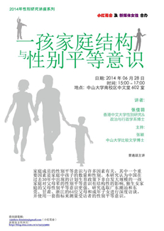

# 性别平等——计划生育政策的“意外”收获？

中国在过去30年中出现的计划生育政策下非自发大规模的一孩家庭，对父母辈的性别平等意识有着怎样结构性的影响？香港中文大学性别研究与政治与行政学系的张佳羽博士通过研究发现，独生女家庭的父母性别平等意识更强。这是为什么？

本次沙龙里，张佳羽将会详细介绍她的研究发现，描绘政策导致的家庭结构变化在中国不同地区、家庭中对意识的不同影响，并解释性别平等意识的变化是如何受子女的性别组成和数量影响而发生的。

###【主题】
【新媒体女性】 性别平等——计划生育政策的“意外”收获？

###【时间】
6月28日 下午3:00——5:00

###【活动嘉宾】
张佳羽，香港中文大学性别研究&政治与行政学系博士

###【主持】
张颖，中山大学比较文学博士

###【主办方】
新媒体女性&小红花会

###【地点】
广州  中山大学南校区中文堂602室

（采编：万晓华；责编：万晓华）