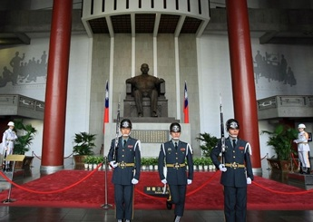

# 台湾政治生态——从“服贸协定”争斗说起

亚细亚的孤儿在风中哭泣 
黄色的脸孔有红色的污泥 
黑色的眼珠有白色的恐惧 

亚细亚的孤儿在风中哭泣 
没有人要和你玩平等的游戏 
每个人都想要你心爱的玩具 
亲爱的孩子你为何哭泣 

多少人在追寻那解不开的问题 
多少人在深夜里无奈地叹息 
多少人的眼泪在无言中抹去 
亲爱的母亲这是什么道理 
亲爱的母亲这是什么真理 

###【主题】
【新知沙龙】 台湾政治生态——从“服贸协定”争斗说起

###【时间】
4月13日 下午2:30——5:00

###【活动嘉宾】
朱松岭，法学博士，北京联合大学台湾研究院教授、硕士研究生导师、两岸关系研究所所长。 

陈星，政治学博士，北京联合大学台湾研究院台港澳法研究所副所长、副教授、硕士研究生导师。 

贾葭，2006年发起成立纵横周刊，任台湾研究员。2008年、2010年、2012年台湾选举官方注册记者。长期研究台湾政治与历史，2013年中正大学访问学者。 

纪彭，《国家人文历史》副主编，新知沙龙发起人，中国国民党革命委员会党员。由于家庭原因，长期关注国民党的历史与现状。 

###【主办方】
新知沙龙

###【地点】
北京 彼岸书店（海淀区花园路2号牡丹科技大厦一层中厅，地铁牡丹园站走路五分钟）

###【费用】
活动免费，彼岸书店最低消费为20元

###【活动链接】
http://www.douban.com/event/21253303/

（采编：万晓华；责编：万晓华）