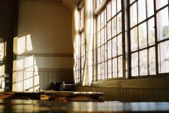
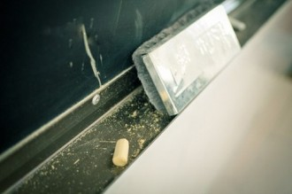
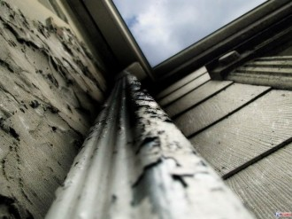

# 丑女阿楠

一  

阿楠是我小学的同学。阿楠是我四年级时两个月的同桌。阿楠永远长不大，因为阿楠死了。

这么多年以后再回看从前，阿楠仍然是小学时代那群孩子们模糊的面孔中，我记得最为清晰的一个。我的相册本里至今还保存着小学毕业的时候的一张班级合照。我隐约记得自己是在第二排的最中间的位置。她，在第二排最右边的位置，和她旁边的那个同学隔着两个身位，看起来像是这个集体之外的人。一个被那个集体排斥的人。一个不相干的人。那张被时光氧化的老照片上，所有的小孩子面容都是模糊的，很难认出谁是谁。可是她站在那里，突兀的令人不得不注意到她。

在整个小学时代，她一直被所有人冷落，排斥，侮辱，漠视。现在，她却用这样一种无心的巧合提醒着所有拥有那张照片的人，她的存在。

  二  

在小学二年级的时候，小孩子们便开始有了美丑的意识。有一段时间大家都纷纷讨论班里哪个小朋友最好看，最难看。我是班里最小的一个，又略自闭，不太愿意同的小朋友来往，也向来不会卷入这样无聊的讨论。有一天傍晚放学的时候，我正在收拾书包，同桌神秘兮兮地拉了我一下，说，你知道班里谁最好看么？

我想了想，大概是杨苑吧。

对呀。那你知道谁最丑么哈哈。

我想了想，小心试探着说，是我么？

是阿楠啊你个笨蛋。她开心地抖出这个没什么意思的包袱，背起书包走了。

我下意识地回头望向教室角落，靠近垃圾桶，阿楠坐的那个位置。她正低着头，不知是有意还是无意地慢吞吞地收拾着书包，乌黑而且油腻的头发散落下来遮住她不知是因为几天没洗脸还是天生的，一块乌一块黄的脸。我注意到她脏兮兮的小手和更加脏兮兮的书包和更加更加脏兮兮的衣服。

果然很丑。我拉上书包的拉链，飞快地跑出教室，好像和她在同一个教室，自己也会变脏变丑变得被人嫌弃。跑到校门的时候，我回头望了一眼。她最后一个从教室出来，慢吞吞地，好像故意落在放学的人群后面，仍然低着头。

 三  

不久之后，阿楠便成了班里公认的“丑”的代表。那时候的小孩子都兴给班里的人起外号，阿楠得到的外号有“臭南瓜”“丑南瓜”“垃圾楠”“丑八怪”“痴巴楠”和“傻楠”。所有的人，包括当时的我，并没有觉得给人起这种侮辱性的称呼是一件多么过分的事情。现在看来，我们往往以为小孩子天真可爱，可其实他们身上反而常常能见到最纯粹的恶毒和恶意。

她唯一被用本名称呼的时候，是老师在课堂点名批评的时候——所有的老师甚至早就剥夺了任何让她回答课堂问题的机会。她常常完不成作业，常常在作文课结束的时候写不完作文。常常被老师展示她的作业本——上面的字幼稚，缭乱，难看，脏污，辨识不清，不知所云。

去年我去拜访小学班主任的时候，曾经问过她，老师，你还记得当年我们班上有个阿楠么？

她疑惑地望着我，迟疑了几秒，然后才想起来。啊，记得，那个弱智。当年除了班里那几个最调皮的学生，就属她最让人头疼。笨的哟，不开窍。后来就干脆不管了，让她在班里当个反面典型，激励其他的学生。你们那群孩子也不喜欢她，谁都不愿意和她同桌，我就安排她自己坐在教室后面。哪个学生要是平时表现最不好，就罚和她同桌。还挺管用咧。

老师你还记得么，我也是当年被罚的学生之一。

  四  

四年级的时候我有一段时间特别调皮。不写作业，不认真听讲，考试成绩也极差。身为教导主任的母亲便知会班主任好好管教我一番。一个周一，最后一节班会，老师宣布调换座位。

阿楠，你到前面来和XX一桌。【XX就是我】

教室里顿时响起了一阵幸灾乐祸的窃窃私语和偷笑声。谁和阿楠同桌，便是“倒了大霉”。

老师我错了我再也不完成作业了。不，再也不敢不完成作业了。我居然一下子站起来大声和老师语无伦次地“认错”以求“宽宏大量”。在我看来，和阿楠同桌不啻最严重的惩罚和灾难。

怎么？让你和阿楠同桌是让你关心同学，辅导辅导阿楠不要给班级平均分拉后腿，不愿意么？老师笑意涔涔。

这时候那股被压抑的，恶毒的笑声终于爆发了。我偏过头看着周围的同学乐不可支的样子，余光看到阿楠已经收拾好书包，从教室后面走过来。她居然也在笑。

她是把老师的讽刺当真了。

我无力地瘫坐在位子上，把自己的文具书本和椅子都向自己这一边拢，缩到整个桌子三分之一的位置上。我不愿意和阿楠同桌。因为她脏。因为她臭。因为她丑。因为她笨。因为她，我也会被大家嘲笑。我在想，她会不会把她的脏臭笨丑传染给我。我要离她远一点，再远一点。

  五  

和她同桌的那段时间，我几乎度日如年。尽管平时尽量不和她说话，甚至不看她，但毕竟相隔才十几公分的距离，我也有了机会细致地观察她。

她是丑——尽管大多数时候她都会低着头把脸藏在一团乱糟糟油腻腻的黑头发下，但偶尔抬头的时候，便能看到她那似乎永远一块乌一块黄的脸。脸很大，单眼皮的眼睛显得格外小，两只眼睛甚至有点斗眼，所以她的眼神永远都透着一股呆滞样。塌鼻子在天热的时候会泌出一粒粒汗珠，她也经常不擦，看起来格外恶心。嘴巴大，薄薄的嘴唇还有点儿向右边歪的趋势。到现在我都认为，她是我人生中见过的最丑的女孩儿，也许没有之一。

她臭，身上总是弥漫着一股垃圾堆的味道。

她脏，手，脸，脖子和头发是几乎从来不洗的样子。课本作业本像是被狗啃过一般。文具盒是个黑乎乎的铁盒子，里面两支铅笔，一把生了锈的削笔刀。一块和铅笔盒一样黑乎乎的橡皮。一支像是从垃圾堆里捡来的白雪圆珠笔。

她笨。所有的科目几乎都不能及格。上课的时候她偶尔抬起茫然无神痴呆的眼睛，望向黑板，发呆。

可是她安静。她永远安安静静的。被人嘲笑的时候也是。被人扔纸团扔橡皮扔粉笔头的时候也是。被班里不怀好意的小混混绊一下，踢一脚的时候也是。被老师在课堂上当着全班的面批评、侮辱的时候也是。安安静静的，缩在我右边三十公分，课桌另一边三分之一的部分。

永远最后一个离开教室，安安静静地落在所有人的后面。

三个星期后，我和她说了第一句话

“这道题这么简单你都不会啊，我教你吧。”

  六  

我也忘记了当时自己为什么要主动帮她补习功课。我应该厌恶她，但是又有点儿厌恶不起来。一方面大概是因为严格的家教从小就灌输给我【哪怕讨厌一个人也要客客气气，不能失了君子风度】这样的观念，另一方面也许是自己小时候太容易动同情心，对她的同情一点一点大过了对她的厌恶。

我发现她并不是真的智商有缺陷，而是一直没有得到正确的指导。我帮她解答问题的时候，她尽管反应慢，但是能够理解的。一个星期之后她大多数原来会做错或者不会的题目都能够正确解答了。尽管还是在平均水平之下，但较之前相比，已经进步不少了。一次数学测验，她竟然破天荒及格了。那是第六个星期。

第七个星期，作文课。题目是《我的同桌》。那次是我印象中唯一一次难以下笔的作文课，到了下课我只憋出了一行字：我有一个同桌。她叫阿楠。我和她同桌七个星期了。

那次也是我印象中唯一一次阿楠顺利在作文课上完成作文。她一边写，一边捂着，好像怕苦苦思索该怎么下笔的我看到。我不经意瞄了一眼，她已经快要把作文纸写满了。

谁写完作文了？觉得自己写的不错的同学可以上讲台读一下。老师说。

“我……”阿楠含混不清地应了一声，怯生生地举起了手。我感觉到班里所有的同学都抬起头来，目光射向这边。我如芒在背。《我的同桌》。我操。她想干什么？

窃窃私语和偷偷地笑声又像蚕食桑叶般在周围响起。

好哇。阿楠上台来读一下你的“大作”。语文老师不怀好意地笑着。

她攥着那张脏兮兮的稿纸，上去了。开始用她那小声，难听的声音，一字一顿地念起来。

她作文的具体内容我已经完全不记得了。大概意思就是说我和其他的人不一样。我没有瞧不起她骂她欺负她。我还辅导她做功课。她很喜欢和我做同桌。她也很喜欢我。

我感到难堪，羞耻，以及自己的虚伪。我的脸在烧，像被人扇耳光。反复地扇耳光。我站起来冲出教室。身后是炸了锅的笑声。

  七  

第二天我刚进门，教室里便陡然热闹起来。教室后面一个尖锐的模仿女声的声音突兀地响起来：“我很喜欢你哦！”顿时所有人都笑成一团。我什么都没说，低着头走到位子上，耳边不停有人说“垃圾婆喜欢你哦”“人家一点都不嫌弃臭南瓜啊”“痴巴楠每天走那么晚，放学后不知在哪儿和他亲嘴呢吧”……各种幼稚而不堪的议论进入我的耳朵。我捂上耳朵开始背单词。过了一会儿阿楠也进来了。教室顿时静了几秒，然后又是一波更加喧嚣的嘲笑。她在旁边坐下来的时候，我压低声音狠狠地说道，离我远点儿。

她怔住了一下，眼泪毫无征兆地落下来，吧嗒吧嗒滴在桌子上。

我能感觉到心中的厌恶和憎恨随着那轻微的滴落声，没有消减，反而一点一点膨胀起来。像一只逐渐逼近的兽，一点点把心全部占满，攥紧。

这时候老师进来了。终于安静下来。

没有镜子我也知道，我脸上的表情已经扭曲了。

下课了，老师一离开教室，议论和嘲笑便又炸开了锅。之前模仿女声嘲笑我的那个痞气极重的家伙又故技重施，还在那乱喊着“结婚吧！结婚吧！”周围的人也随着喊了起来。

“结婚吧！结婚吧！”

“结婚吧！结婚吧！”

我感觉自己像是被突然抛入了一个巨大的漩涡，无能为力，只能捂住耳朵。她仍然安安静静的。安安静静地打开铅笔盒，拿出生了锈的削笔刀。安安静静地从座位上站起来，向教室后面走去。他们停了下来，不吵了。她走到那个家伙面前，举起小刀指着他，一字一顿，小声地，清晰地说了一句话。所有人都听到了。

再敢说一句，我就把你眼睛剜出来。

那个痞子呆住了一秒，似乎没想到这个丑八怪居然敢如此大胆地冒犯他。他猛地一挥手，打落了阿楠的小刀。揪住了阿楠的头发，用力往桌子上撞。一下，两下。血流出来了。阿楠满脸是血，头发被血浸湿，一绺一绺贴在脸上，显得格外狰狞。她像一只野兽一样嚎叫起来，两只手没命地挥舞着想要打那个家伙。

“杀了你！杀了你们！”她嘶吼。

教室里所有人都看着这一幕，没有一个人动一下。没有一个人说话。

安安静静，安静极了。

  八  

有几天，我没再见到阿楠。那次事件之后，再也没有人说什么了。第八个星期，她又出现在教室里，坐在了我旁边。

“疯子”不知道谁轻轻嘟囔了一句。

那天下午放学的时候，我在教室门口等阿楠最后一个出来。她看到我站在门口，有些惊慌。

今儿我爸开车来接我，顺便把你送回去吧。

她摆摆手，示意不必这样。我没理会她，说，就这么定了。

她跟在我后面，我回头看她的时候，她像个犯了错的小孩儿。仍然拼命地低着头。

我坐在副驾，她坐在后座。我头也不回对她说，以后别写那种作文了，太傻了。

嗯。对不起。

用不着对不起。以后也别招惹那几个混混了，你又打不过他们。

可……嗯。

我其实就像看看她住的地方是什么样子，她的家是什么样子，她的父母是什么样子。为什么她会这样子。我也不知道为什么我会突然对这个好奇。也许我觉得那次她挺身而出，我亏欠了她。

她的家在老城区的一个很破旧的公寓楼里。二楼。那栋楼几乎所有的人都搬走了，空空荡荡像闹鬼的地儿。我送她到门口，一个极其邋遢的，浑身酒气的男人开了门，我站在门口望进去，房间里空空荡荡。地面很脏，地板上随意铺着破烂不堪的毯子。墙角一堆空酒瓶和编织袋。还有一些垃圾。屋子里的味道和阿楠身上的味道是一样的。

那个男人搓着手让我进去坐坐，我退了一步，说，我爸在下面等我。只是顺便送同学回来不用客气的。

然后房门就当着我的面重重关上了。我转身的时候，听见屋子里传来那个男人的吆喝，酒瓶倒在地上的声音，还有阿楠的混着尖叫的哭声。

“爸，把后座的座垫换一下。”我下楼对父亲说。

第八个星期。第二天。阿楠终于又回到那个她原本的，教室角落的，靠近垃圾桶的位子。我如释重负。

  九  

好像又回归到了原来正常的生活。我开始牢牢占据成绩单的前一二名的位置。阿楠依然被嘲笑被忽视。我很久没有搭理过她，甚至很久不曾再看她一眼。要不是偶尔看到班里的几个痞子推搡她打骂她，我甚至几乎忘掉了阿楠这个人的存在。

是我在逃避。我也不知道为什么。

一转眼就小学毕业了。班里热热闹闹地搞毕业庆祝。很多人都要表演节目。我不会表演什么，就当观众。

那天阿楠穿的格外干净——至少比平时看起来要干净很多。头发似乎也没那么油腻了。但脸还是一块乌一块黄——估计真的是天生如此吧。她还带了一个黑色的盒子。像是琴盒。

到了她的节目，她走到教室中间空出来的一个小场地，打开了那个盒子。是把……是把像小提琴的玩意儿。

是小提琴，但共鸣箱明显破碎了，用胶带勉强粘好。她拿起琴的时候能听见断掉的音柱在共鸣箱里滚来滚去。琴弦只有三根。没有琴弓。

大家“哗”的一下都笑了。我隐约听见“破烂”之类的词。

她说，这六年过去了，也要离开这个班级了。很舍不得同学们。她说自己准备了一首曲子，想弹给大家听。

我知道又得发生点儿什么了。

其实什么也没发生。她笨拙地把琴夹在下巴和肩膀之间，一只手扶着琴头，另一只手在琴弦上拨弄。

理所当然的压根不成调。

理所当然的，大家再次笑起来，一齐嘘她。喊她的外号。

理所当然的，班主任不耐烦地挥了下手，说，下去吧。下一个节目。

她面无表情。像收起一件珍贵的宝贝把那把“琴”放回盒子。回到自己的座位上，为下一个节目鼓掌。机械木然。

我突然特别难过，挤出教室，跑到洗手间里，哭了。

 十  

阿楠被分到和我一个初中。幸好不是又在一个班，我大大的庆幸了一番。

有几次见过她。她似乎摆脱了之前的种种外号，歧视和不公。人稍微有了一点神采。偶尔也能见到她走在路上，小心翼翼地抬着头。

某个下午上课，我在校门的地方遇到她。我正准备假装没看见，骑车越过她，突然一阵吵闹声传过来。

快跑啊，垃圾婆来啦！

快跑快跑，别被她传染，她有疯病，有痴呆病！

一群人哄闹着唯恐被她靠近一点儿，乱哄哄地四散跑开。

我看到，她一个人愣在那儿，愣了很久。然后转身，往校门外走去了。

那天下午放学的时候，一群人在校园的路上围了个水泄不通。好奇的我挤到人群中央，想弄明白怎么回事儿。

然后我看到了她父亲。那个浑身酒气邋里邋遢的男人，两眼通红。他怀里抱着阿楠。阿楠像是睡着了。胳膊和脑袋无力的耷拉着。皮肤呈现匪夷所思的灰黄色。脖子上一道紫色的缢痕触目惊心。

我跟着那个男人，还有一群人，走过操场，走进行政楼，走到校长室。我踮起脚尖趴在门口的玻璃向里看——那个男人什么都没说，重重地把那具尸体——阿楠，扔在校长面前巨大的办公桌上。

你想干什么！这是什么！校长从未见过这样的架势，被惊吓得从椅子上跌落。

那个男人什么都没说，似乎是什么都说不出。他瞪着满是血丝的眼睛，瞪着校长，瞪着尸体。他走到窗前，干嚎了一声，打开窗子，跨过去，又干嚎了一声，跳了下去。

校长室在行政楼的五楼。

  十一  

一个月后，我循着记忆去了阿楠家。

那栋楼已经完全空了。看起来阴森极了。我大着胆子上了二楼，踹开那扇贴着封条的破木门。犹豫了一下，走了进去。

我到现在也不知道自己到底在执着于什么，为什么要那样做。像是中了魔怔。

气味依然像几年前来过的那次难闻，甚至更加浓烈。家里到处都是捡来的破烂，废品。地上散落着一些一次性的针管和针头。厨房里漆黑一片，所有的东西上都蒙着一层厚厚的油烟灰。在另一个房间里，散落着一些课本和报纸。我用脚拨拉着地上的东西，一一分辨。

然后我看到了一张皱巴巴的，但显然被努力平整过的稿纸。上面的字迹幼稚，缭乱，难看，脏污，辨识不清。可我知道那是什么。

我捏着稿纸的边角拎起来，掏出打火机，点燃了。我看着那团稿纸变成一堆灰烬。

这是关于阿楠，我知道的所有的事情。

（采编：陈静，王卜玄；责编：刘铮）

原文链接：[http://blog.renren.com/GetEntry.do?id=908876637&owner=251486011](http://blog.renren.com/GetEntry.do?id=908876637&owner=251486011)

[【旧少年】坐在后排的兄弟](/archives/38814)——坐在后排的兄弟，睡在上铺的兄弟，一起看毛片的兄弟，互相喂饭的兄弟。

[【旧少年】浪子心声](/archives/38865)——原来少年情怀，稍纵即逝，昔日的翩翩少年，最终都会变成心狠手辣的枭雄。“希望是有，道路却无，我们谓之道路者，乃是踌躇。”

[【旧少年】老枪](/archives/38879)——第二天居委会收到一面锦旗，上面绣着见义勇为四个烫金大字。老枪放下手里面的章，看着那面锦旗，哈哈大笑，笑得主任都发了毛。 “臭娘们儿，开门，老子要看看光景。”
