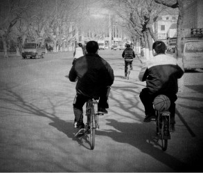
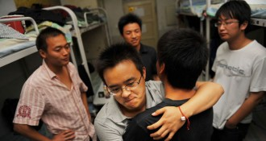

# 坐在后排的兄弟

那年，参加全市物理竞赛，地点在华师大。我看见一男生蹬着板车，车上坐着七八个花枝招展的姑娘。我张着嘴眼巴巴望着一车姑娘消失在丽娃河畔。之后的几个月里，这是我关于大学的全部想象。

旺财说那回竞赛他也去了，没怎么注意姑娘，只惊叹于大学居然有网游社团。旺财的爹妈在法院工作，打小盼望他成长为一名正气凛然的政法工作者。旺财很逆反，铁了心要读物理。

两个懵懂少年，站在大学的门槛上，从各自不同的角度眺望即将到来的日子。

后来我们一起考进交大物理系。令人失望的是，香车美女的一幕再未上演。在这所理工科学校，男生的后座上大多坐着男生。四年室友，我俩合计打了七年半的光棍。有一回在食堂，对面一对情侣忘情地喂饭。不在饿汉面前打嗝，是一种功德。于是我和旺财对视一眼，也开始喂饭。

第一个寒假回家，旺财就很有几分科技工作者的样子。书包里除了硬盘，还装了高等数学、线性代数和力学——准备来年的补考。班主任是个哲学系毕业的老光棍，从此对旺财实行人民专政，安排两位入党积极分子盯人紧逼。一旦发觉旺财没去上课，立即汇报。班主任要么发一通骚扰短信，要么直接冲到宿舍，把半裸迷茫的旺财从被窝里拖出去，场面又色情又暴力。宿管大妈经常在早上八点十分看见班主任冲上楼去，满面红光，兴奋如同捉奸。此后旺财熬夜打星际看毛片，早上按时去教室补觉，日渐憔悴了。

旺财补觉时，我常常拿一本小说坐在他身边，反正也听不懂。曾以为物理不过是大球撞小球，小球撞方块，外加原子弹以及浩瀚的宇宙什么的，哪晓得劈头盖脸一堆微积分和泛函数。如同水浒中的小霸王醉入销金帐，“一头叫娘子，一头摸来摸去”，却摸到“赤条条不着一丝”的一个胖大和尚。我不知道有多少人选对了专业，无论是出于兴趣还是功利；多少人跟我和旺财一样，一面之缘就干柴烈火吹灯拔蜡进洞房。以为遇见真爱，结果被骑翻了打。

旺财想换个专业，打听了一圈才明白，中国的大学有第二十二条军规：成绩足够优秀方能转专业，真正不适应的学生只有两条路，要么退学，要么继续混日子。就像当年的知青插队，最早一批离开农村的，无不是那些处处表态要“扎根农村一辈子”，乃至发了毒誓写下血书的积极分子。

我们在教室后排度过了很多时光。旺财渐渐意识到，爹妈也许是对的。至少，应该尽力去改变什么。他抱着一本厚厚的法律书上专业课，一条条啃下去，同时硬着头皮应付傅立叶麦克斯韦之类的考试。好在物理和法律在他看来是一样的，都是死记硬背而已。那一年熬得真苦。拿到华东政法研究生录取通知的那个夜晚，旺财一个人跑去思源湖，嚎啕大哭了一场。

旺财说，他在物理系四年最大的收获，就是明白自己不适合物理。

最后一晚，我们在宿舍收拾东西，一地的狼藉，音箱放着离别的歌。旺财把几十G的硬盘留给了我，他说估计自己以后用不着了，我还得经常用。我们满身的汗味和酒气，用力地拥抱。一边哭，一边喊着兄弟。

坐在后排的兄弟，睡在上铺的兄弟，一起看毛片的兄弟，互相喂饭的兄弟。

如今，旺财已是一名出色的律师。我站上了大学的讲台，看见后排的你们，刷着手机或打着瞌睡，百无聊赖或昏迷不醒。仿佛看见了当年的旺财和自己。

你不是三好学生，不是积极分子，不是最佳辩手，不是十大歌星，不是学生会干部，不是党史竞赛一等奖，妹子拒绝你，老师忽视你，可你并不是失败者，你的青春没有浪费。至少，你训练了自学能力，培养了临时抱佛脚的本事，你交了一帮好兄弟，收获了一辈子的友情。或许你依然不知道自己能干什么，但你可以知道自己不能干什么。好过成为一个精致的利己主义者，虚伪的既得利益者，聪明的奉承者，优秀的下毒者。

出来混，迟早要还的。可我还是深深地羡慕你们，坐在后排的兄弟。

（采编：朱燚；责编：刘铮）

[【旧少年】丑女阿楠](/archives/38748)——阿楠是我小学的同学。阿楠是我四年级时两个月的同桌。阿楠永远长不大，因为阿楠死了。

[【旧少年】浪子心声](/archives/38865)——原来少年情怀，稍纵即逝，昔日的翩翩少年，最终都会变成心狠手辣的枭雄。“希望是有，道路却无，我们谓之道路者，乃是踌躇。”

[【旧少年】老枪](/archives/38879)——第二天居委会收到一面锦旗，上面绣着见义勇为四个烫金大字。老枪放下手里面的章，看着那面锦旗，哈哈大笑，笑得主任都发了毛。 “臭娘们儿，开门，老子要看看光景。”
