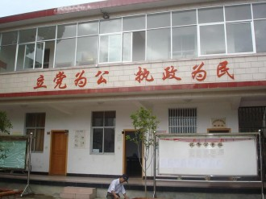
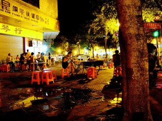

# 老枪

老枪今年三十岁，过着和普通人差不多的日子。他是社区居民委员会的办事员，也算是公务员。他的桌子上有一台电脑，原本白色的键盘被灰渍弄得斑驳，最中间的H键不知去了哪里，剩下空空的框子，活像一只瞎了眼的老猫在瞪着他。

居委会和大妈这两个词本身便是孪生姐妹，果然名不虚传，廉价香水的气味，三天不洗的干枯头发，外贸店里的纱裙，和对面大妈忠贞不二的口臭。

他有一个妻子，长得一副差不多的脸孔，大脸盘子厚嘴唇，蒜头鼻子吊梢眼。邻居都说这是她长得旺夫，他觉得有道理，自从结了婚她管钱以后，家里存折上的数字增长地缓慢，但还算坚定。

老枪知道妻子是奔着死去的爹留给他的房子嫁给他的。还送了八万八的彩礼，租了三辆宝马车五辆凯美瑞，上面用双面胶粘着塑料红花，敲锣打鼓地总算是进了自家的门。

每天的工作很简单，八点半上班扫一遍办公室，不开电脑，桌上摆着一方印台和一个印章，老人来办理低保，或者小学生打扫社区卫生，貌似只有经过他手中的章，才能生效。

来的时候，五十多岁的女主任告诉老枪，小王啊，你的职务是很重要的，你要认真地对待这份工作。

二十三岁的老枪使劲儿点头，感谢主任提拔，感谢主任提拔，主任放心，我一定会依照党和政府的章程办事。女主任满意地笑了，拍了拍他的肩膀以示激励，好像在说，好好干吧小伙子，不出三十年，你也会成为主任的。

人们都说，公章代表权力，老枪一直告诫自己，一定要警惕权力的诱惑，学习了习主席的讲话，要把权力关进制度的笼子里。第二天他八点就去了办公室寻找制度，直到主任提着小笼包来上班，小王来得挺早啊。嗯是啊主任。我来寻找制度。

主任愣了，制度不就在墙上挂着么。老枪看了看蓝色的牌子，一拍脑门，对哦，还是主任有水平。

上午又接待了几个差不多的人，盖了几个差不多的章，又到了午休时间。

下午又接待了几个差不多的人，盖了几个差不多的章，又下班了，该买菜了。

结婚三年了，和媳妇的做爱已经成了例行公事。

今晚整不整？

不整了吧，今天挤公交太累了。

行，那就不整了。

老枪关上台灯，睁着眼睛看窗外的月亮。

第二天老枪又去上班。

老枪坐的位置很好，对面便是大门，透过门可以看见一辆接一辆的摩托车，面包车，小轿车，行走的人。

但是对面的大妈总是嫌吵，影响她织毛衣，她喜欢静静地织，所以门就关上了。每当有人到居委会办事儿，老枪总是抢在那人开门的瞬间偷窥一眼门外的风景，即使他闭着眼睛也能猜到，外面的场景。

有天夜里，老枪和大学的同学一起喝酒，在街边烧烤摊上，旁边两桌人不知缘由地打起来了，周围的人都躲得远远地，老枪没躲。

老枪看着那个满脸通红的小伙子，抡着马扎儿大喊操你妈你妈比再看我媳妇儿大腿你信不信老子抠了你眼珠子。

老枪的眼神开始迷离，晕晕地，那个小伙子被几个人放倒，脸上被狠狠地跺了几脚，鼻孔的血就像开了的消防栓一样止不住，他身旁化了妆的年轻女孩儿在尖叫，大声喊着别打了，女孩儿也挨了一巴掌，开始呜呜地哭。

同学赶紧拉着他走，怕他惹上事儿。老枪年轻的时候，干架也是一把好手，身旁也有一个化妆的姑娘，抡起马扎儿来谁也挡不住，被放倒后还是不屈不挠地喊操你妈，直到对方打累了，最后一句操你妈，一定是老枪说的。

街边摊的周围围满了人，站着的和躺着的，只坐着一个老枪，左手端着啤酒扎儿，右手是一只串儿，细嚼慢咽地，一脸享受的样子，像是磕了药。

老枪看着那名被打的女孩儿，突然间想起了从前。一瞬间年轻的所有记忆全部涌了上来，连带着当时万夫莫当的霸道狠劲儿，他想着当年的姑娘，当年的兄弟，他站了起来。

小伙子，别打了。

你他妈管什么闲事儿。

我说别打了。

你少给老子逼逼。

你认识我么。

你不就一丫盖章的傻逼。

我不是傻逼，当年人们都叫我老枪。

说完，他抄起马扎儿，朝为首的青年头上抡去，每抡一下，就喊一声操你妈，直到全部放倒，周围的人看着这个微秃的，中年人？没有一个人敢说话。

他走到那个姑娘身前，姑娘瑟瑟抖着抽泣着，不敢看他。

老枪捏起她的下巴，说姑娘你看着我。

姑娘看着他，眼里充满敬畏和恐惧，颤着声儿说了声谢谢。

老枪说，客气嘛，我向来看不惯打女人。老枪笑了，笑得特逼，逼劲儿十足。

他指着倒在地上的那几个人，无比认真地说，权力，要装进制度的笼子里。

姑娘，你知不知道什么叫权力？

姑娘摇了摇头。

那你知不知道什么叫制度？

姑娘又被吓哭了。

你不懂，你还年轻。

老枪拿起扎啤杯，又闷了一大口。

第二天居委会收到一面锦旗，上面绣着见义勇为四个烫金大字。

老枪放下手里面的章，看着那面锦旗，哈哈大笑，笑得主任都发了毛，从办公室里走出来，一脸严肃地说小王你笑啥啊。

老枪笑得更开心了，把锦旗铺到桌子上，砰砰砰盖了三个大章。

“老子就是想笑，操你妈。”

“臭娘们儿，开门，老子要看看光景。”

（采编：王卜玄；张山骁；责编：刘铮）

[【旧少年】丑女阿楠](/archives/38748)——阿楠是我小学的同学。阿楠是我四年级时两个月的同桌。阿楠永远长不大，因为阿楠死了。 [【旧少年】坐在后排的兄弟](/archives/38814)——坐在后排的兄弟，睡在上铺的兄弟，一起看毛片的兄弟，互相喂饭的兄弟。 [【旧少年】浪子心声](/archives/38865)——原来少年情怀，稍纵即逝，昔日的翩翩少年，最终都会变成心狠手辣的枭雄。“希望是有，道路却无，我们谓之道路者，乃是踌躇。” 
