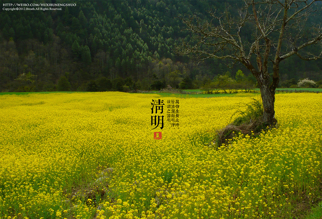

# 【春生】向生而生

“又到了万物复苏，动物们开始交配的季节了……”

朋友们总是这样互相调侃的。侃着侃着，扬州古运河旁的杨柳就从竹西路边扭过来，一直到瘦西湖路畔，散喜糖似的硬往人领口里塞入柳絮。空气里不自觉地涨满青芒味儿，那些生怕失了位置的叶头儿们争先恐后，一不小心就将生的欲望和气息挤了出来。兴许是我馋嘴的缘故，看见了柳枝后面映出的些许桃花，便总能望见那单薄蕊瓣日后结出的圆润果实。

垂柳呢，可以折下来编折在头上，油菜花、桃花也可装饰。但是清明那天，年长一些的人总会喊住你，一脸微怒地将你头上红艳艳的桃花折下来，扔进水里。一面用凤仙花染了的指甲戳戳你的头，告诉你：几朵花，又浪费了几颗桃子。你就暗暗地看着那几朵还浮在水面上的粉色桃花——它们静静的却也不流走。你有些惋惜，像是惋惜头上的的装饰，又像是真的后悔毁了那几个生灵。人们催促你快走些，去用那最朴素的颜色过那最古老的节日。

我以为，清明正处于春天最好的时节。在私人意识中，如此一个节日几乎可以代表整个春天了。我现在仍记得清楚的是，老家那里要穿过一棵垂柳的池塘。那池塘里长满汹涌的水花生，有养的鱼苗常透过缝隙吐泡泡，竭力要为自己的生做些可见的证明。再穿过两旁种满油菜花的麦田。那麦苗长到刚刚好的时段，刚刚好的绿，刚刚好的高度，刚刚好的柔韧度，一切从泥土里生长出来的，刚刚好到极致。人生许多时候是这样——你并不知悉什么时候会最好，揠苗助长或是其它行为都不能达到生的内核。只需要想着，想着该去怎样生，怎样活，怎样向上——一如那些最无言的植物，在不经意间便刚刚好了。

清明，像个缩小版的家族朝圣。路很狭窄，年长的叔伯们会扛着铁锹领着竹篮走在长长的队伍前面。并不是每年都会有清明雨。得幸于天的时候，便有晴空、简单的菜粉蝶以及不远处将息未息的烛火气，恍然如一道长轴画卷。更幼一辈的小孩子们，有时候会不开心地嫉妒大人：为什么他们可以那么高，够到一簇一簇的油菜花？大人们则总是恼：新的春衫常常沾满菜花粉，拍也拍不落，到了下一朵时，它又会悄悄地用自己的花粉同人交换。就这样，一路行去，在不经意间，人就帮助着自然繁衍生息。

当那纸制的彩幡被压在新的泥土下之时，混着杂枝噼里啪啦地响着的纸钱火焰儿兀自窜得很高。有人低下头跪拜，望见火堆旁的青草依然挺着脊梁，愣了神，一下子被火燎了头发，蜷曲起来像是也在头顶上冒出了仍然柔软的新芽。

回望时，像是错觉，又绝然是真实。别家的一行人穿行而来，恍惚如我们刚走过时的样子——就像千百年来，走过的先人那样。整个家族都在一片油菜花间穿行，像一个盛大的宗教仪式，明明是去祭奠死亡，却带着新生的成员。无法言说，清明，或是春天，到底承载了怎样一个死亡的沉淀和生命的托起，只是单纯地觉得美和与安定——必有往者重归尘土铺路，必有来着将新而至传承，而当下者就和油菜花一般自己盛开好，那样弥漫却不至于靡，是向生而生。

归家，闲谈。暮色将昏，犯起春困。

春困，说起来仿佛自己是个又懒又馋的堕汉，幸福地沉溺于春天的梦境里。春日的黑夜明亮而充满战斗力，每一个生灵都意图在第二日的晨曦中焕发新颜，日复一日至此向上。沉睡的人类，将灵魂安置在一个安静舒适的空间，试着再往上生长。犹如一颗被包裹的被子植物——庄生晓梦，梦在脑内行走，行走在梦里。然而意识却是清醒的，破晓时，将突破桎梏——发芽。

整个季节都犹如那颗臆想之中的桃子，怀着生的欲望，生长。

向生而生。

(采编：陈翔；责编：陈翔)