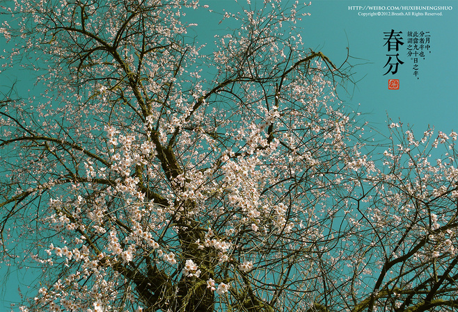

# 【春生】春

春季亦是一个向上的季节，这种向上的力量是无声的天籁。种子破土，磐石动容。

 

被冰雪覆盖的黄色小花，起初默默无闻。

在我的印象里，每年从一月下旬或者二月上旬开始，田埂崖边一簇簇四棱细长的枝条上就零星开出了一朵两朵三朵的黄色小花来，呈喇叭状，明亮的黄色使人产生振奋的情绪。

这种开在四棱细长的枝条上的黄色小花就是，迎春花。

名符其实，每年迎春花开的时候正好就是立春前后，且大多时候也正好就是春节。

迎春花开了不久，柳条上又萌出油绿的芽来。

 

二月中旬，远远望去，一棵棵柳树犹被一层薄薄的烟笼着。有风的时候，柔软的柳条携带着油绿的芽儿乘风飘荡，感觉像是阵阵青烟被风吹着走。也就在这个时节，孩童们便折一段柳条儿，轻轻从这端扭到彼端，然后用牙咬着白色剔透的枝骨往外抽，树皮和骨就断然分离了。我们的方言把这种抽了骨的树皮叫“筒筒”。用刀片把筒筒的两端削整齐，再在一端轻轻削掉树皮的外膜（参考唢呐发声原理）。一件能发出声响的美妙乐器就如此诞生了。声音各有不同，视筒筒的长短粗细而定。当第一朵迎春花开的时候，春天就来了。开满整个二月，村子外的野地里崖边上垂满了黄色的小花。

迎春花唤醒了沉眠于冬的春天，村子里孩童吹起阵阵筒筒。那些深浅高低不同的音律牵引着春的脚步，走上了明亮的舞台。

春天就这样开启了。

 

三月。

三月上旬，粉红的桃花便开了。风吹桃林满树花，喜鹊枝头叫喳喳。春，真是个令人喜悦的季节啊。

春季亦是一个向上的季节，这种向上的力量是无声的天籁。种子破土，磐石动容。麦苗拔节的沙沙声响也似乎响遍整个田野。而此时，孩童们又有了新的欢娱项目。

放风筝，三月里风筝飞满天，那一支《三月三》你可记得？你可会哼唱？

我至今还记得我上小学的时候，每年三月里我都糊一面风筝，有一年是方形的，有一年是三角形的。有时候会请长者出手糊一面老鹰风筝，或者是燕子形状的。然后，和伙伴们欢天喜地地冲向麦田。

三月，笑声在田野。银铃般清爽。

随着桃花的盛开和风筝的飞翔，三月中旬开始，油菜花也零星开了。

油菜花刚开的时候，我们通常都会掐了尖，撕去叶子和外皮，吃那油嫩爽口清甜的尖，百吃不腻。而且，专吃别人家的，和伙伴们商量好，和谁有仇就吃谁家的。太坏了。

和二月的迎春花相比，到了三月底的油菜花才是乡野的主角。

绿色的麦田和金黄的油菜花拼出了春满大地的图画。你站在这个田埂远远去看田野，一大片的金黄和一大片的青绿，就像金黄色是刺绣在青绿色的绸布上。你要是站在梯田的高处往下看去那就更美了，美到我不能修辞了。如果说站在低处的感觉是身处画中，那么站在高处就是在览天地之胜。在晴日的蓝天下，风轻云淡，春暖花开。

此时此刻，此情此景，纵然是面朝大海又如何。

油菜花盛期时，我们又有了新的欢娱项目。

用纸折成一个W型的蜜蜂夹子。

走，夹蜂走。

小伙伴们彼此邀约，每人怀揣一只玻璃瓶子，携带无穷智慧的产物——蜜蜂夹子，浩浩荡荡地向油菜地进发。夹蜜蜂的初始动机是为了一尝蜜蜂肚子里的甜蜜，到后来就演变成为一场罪孽深重的屠杀。阿弥陀佛。那些甜蜜的小灵魂儿，愿你们逝者安息，生者坚强。

在吃遍油菜尖和蜜蜂肚子后，乡里的孩童们并没有歇下来。

 

因为，四月到了。

人间四月天。

四月是一年当中最美丽的一个月，一树梨花压海棠的梨花就开在四月。

而最有代表性的当是桐花和洋槐花。

每年四月初的时候，首先是桐花开了。白色的，粉白色的，紫粉色的。高大的桐树上还没有长出叶子的时候就开花了，粉嫩的香甜味略带一点点类似中药的味道，从喇叭状的花筒里弥散出来，那种感觉就是从高大的树上飘洒下无数香甜的花粉，沐浴着从树下行走的人们和牲畜家禽。整个村庄都在这种不浓不淡的带有中药味的香甜花粉中沉溺了。清早的时候是清清淡淡的味道，香甜味和中药味基本持平，就像某牙膏的电视广告里那样的形容。中午的时候，花粉的香甜味胜过中药味，这时的香甜压过中药的清幽。于是，四月初的每个中午都是一场浓烈甜蜜且烂醉如泥的热情冲浪。而傍晚时分，香甜味已现倦意，清幽的中药味慢慢地从花筒中沁出，我的感觉像是面前有一位老中医正在炉前熬汤药。

四月初的傍晚是清幽的。

我常常喜欢坐在桐树下，感觉花粉落在身上的力道。道者常喜坐于炉前听落雪，我则更爱坐在四月的桐树下闻落英。快到中旬的时候，便会有桐花落下，我便捡起来轻咬落蒂的花筒，顿时就有浓烈的香甜味和清幽的中药味的汁液渗透舌尖，继而扩散至整个口腔。久久地，唇齿余香。

与此同时，洋槐花崭露头角，一串串的白绿色花苞挂在树间，仿佛一串串玉珠子。

在桐花与洋槐花交接班的时候，沉寂了数天的孩童们又开始了新一轮的传统欢娱项目。

竹竿，铁丝，仍旧是自己动手，无穷智慧的传统产物——洋槐花钩子。

走，钩洋槐花走。

于是，小伙伴们再次邀约，扛竿子，挎篮子，集结在一棵棵洋槐树下。这场欢娱项目里，不能缺少了小丫头片子。小男子汉们连树枝钩下来，小姑娘们就负责从树枝上摘花串，一串一串摘放在篮子里。小姑娘们还会挑一些美观的花串递到小男子汉的面前，一伸头，用嘴噙住花串，咯吱咯吱就嚼了开来，钩槐花的手并不停下来。然后她们自己才拿一串细细地嚼起来。

四月，笑声在乡间。银铃般爽朗和清澈。

随着洋槐花的盛开，桐花退到幕后卸了妆，舒展叶子，以迎接清明谷雨到来的雨水。而槐花却盛开成蝴蝶状的花瓣，一串一串挂在树间。桐花的香甜清幽味被洋槐花的清香味取代，成了四月的当红明星，花香弥漫在乡野间，引来粉丝无数。而蝴蝶状的花瓣除了等待着蜜蜂，还在等待着孩童们将已完成大业的自己采走。

孩童钩来的槐花交给大人，大人用面粉包裹住花瓣放在屉上蒸熟，我们的方言叫麦饭。有清香的原味，有加了盐的咸味，也有加了糖的甜味。于是在四月的后半个月里，课间十分钟的时候小伙伴们就开始分享麦饭，你尝我的，我尝你的。课间十分钟很快就过去了，大家匆匆包好麦饭揣到怀里奔回教室上课。有时候心思还在教室外飞过的鹧鸪身上，久久不能回神，舌头伸出来舔舔嘴角的麦饭渣子。半节课就过去了。

洋槐花生吃是清甜的，而蒸熟的麦饭是香甜。

然后就到了浪漫的时节了，四月下旬开始，杨柳飘絮。

“长安柳絮飞，箜篌响，路人醉……”

漫天的雪白花絮轻轻飘舞，气温开始渐渐热了。换上了薄衫或者短袖，花絮飘舞而过，轻触褪去冗重寒装的肌肤，酥麻感和蚕丝感油然而生。你陶醉在和煦的春阳当中和微醺的春风里，细嗅蔷薇。

月季花开了。

在暮春，蔷薇科植物开花了。月季的浓香像深埋地下十八年的女儿红，苦，幽，甜，浓。烈，内敛。

四月收场，月季花的浓香象征着年盛。

 

五月生辉而临。

然后，长夏将启。

（采编：谢逸云；责编：陈翔）