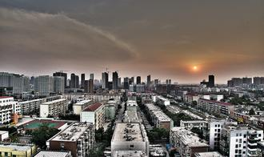

# 故乡与城

早晨起来窗外有雾，窗外的山坡和坟冢在湿气中若隐若现，且有村舍升了火，浓烟从烟囱飘出混到雾气里。打开窗户，凛冽的空气混合森林的湿气和柴草燃烧的呛人味道，有一瞬间人有迟缓的念头，浑然忘记今夕是何夕。

慢慢太阳升起，浓雾散去，世界如大梦初醒。

整理要带走的书，和逛书店一样难以取舍。我又一次回顾少年时是在怎样情形和心态下购得这或好或平庸的一本本。每次回家，都从自己住处带回暂时不想看的书，又从家中把需要温习的书带走。从这个意义上说，父母的家始终是我在这个世界上的base（权且译作根据地吧）。

整理完东西离午饭还有一点时间，陪同父母逛花鸟市。窄窄的一条老城街道两边摆满古玩盆景花鸟鱼虫灭鼠药脚癣药壮阳药，贩子和江湖医生穿梭其中。我人生中第一只宠物鼠就在这里购得。爸妈自从开始打理乡下的园子，每周必到这里购花买草，半年下来家里的光桂花就栽了七八株，另有梅花菊花枫树牡丹百合玫瑰月季等植物和白菜茄子辣椒番茄豆角毛豆等蔬菜若干种，各设一个角落专门培养。又专门辟出地方撒下草籽，天天浇水，隔天就要换上衣服鞋子亲自除草，常常一下午都在院子里劳动。

园子所在的村子是父亲长大的地方。在这里有他作为一个父亲早亡，母亲改嫁，又被划分为地主后代的瘦骨嶙峋的男孩艰难的成长。我懂事的时候他带我去看他在村子角落里已经快要倒塌的小屋，一一指给我看：哪个角落是他睡觉的地方，哪个墙上的窟窿是他放煤油灯的地方，哪里又是他堆为了挣自己高中的学费割来的饲料草的地方。快要半个世纪过去了，他又回来，几乎是在原地一心一意地修建起了自己的诗意王国。出了园子走10分钟，就是他的祖先们的墓碑，其中有他早亡的父亲。

而今天，父母购得几桩上好的为以后制作家具而准备的木头，一株岩杨（一种在岩石中生长的杨树，不知具体学名），十颗百合的根茎。

集市发出的声音和气味，都保持着几十年前的样子。

而在其他的角落，疯狂的改造扩建正在发生。每到一处看见名字稀奇古怪装模作样的楼盘，也不会再惊讶了。本地开发商崛起，外地开发商从更发达地区蜂拥而至。父亲会时常讲起他小时的城，只东西不到3公里两条街。80年代西边“举全市之力”盖起一座两层百货大楼，开业那天盛况空前，开完大会的领导进大楼参观视察，然后开放给在外守候的群众。大楼里那么十几个售货员，个个都是城里名人，众人羡慕的对象。不到我小学毕业，百货大楼已经完全式微，仅仅用来作为地标使用，几经改革易主，还是不免其衰落的命运。

百货大楼的后面，是城里著名的“算命街”， 聚集了所有眼瞎腿瘸无路可走的老城居民，在自家门口挂起算命看相的牌子。总有同样无路可走的人，在一个个倍感绝望后的清晨或者黄昏怀着或多或少的希望走进巷子，花上几十到几百不等的钱，去算他们命运的来龙去脉。

要测算的事情无非那么几种，年轻女子惴惴不安的婚事，子女升学工作，家人健康，中年人的仕途财运，中年女人询问丈夫的风流韵事何时了结，等等等等。

我已经多年没有造访过这条算命街。据说它已经在扫黄打非吹来的一阵又一阵风中荡然无存。然而所有的黄与非，都像是人这一受造无法被无神论和科学观改造的灵魂背阴处，迟早都会在任何光鲜城市的角落滋生。我不愿意斥之为愚昧；人世的重负和命运的无常，总会叫人们在一个诡秘的黄昏在一张纸上写下带有玄机的生辰，像麦克白狂乱地聆听女巫的教唆和预言一样，聆听天机。

下午吃过午饭，乘坐火车前往K市。沿途有绿色山脉和因为连年干旱而水位下降的湖泊，有我熟悉的红色土地和高原针叶林。总有灰色的工厂和城镇布局在其中，城镇呈现出杂乱状，村庄赤贫状。小时候的旅途，总在低头看书听音乐或者玩闹。如今我什么都不做，只呆呆看住窗外景色变换。路过的野外小车站，我也要盯住写着站名的水泥牌子想要记住。我相信人的灵魂和周围的山川河流草木紧密相连。这时代的痛楚和喜悦，丑陋和美好，都能从这一屋一石一田一地看得清清楚楚，我们灵魂的大地和天空，也与它们交互辉映。

父辈把一座一座城连同城的历史交给我们，而我们在城的沉默和暴戾面前要么仓皇逃离，要么手足无措。到了最后，我们都成了城的背叛者。

关于城市，我曾惊心胆颤地读到过卡尔维诺这样写：

“记忆的潮水继续涌流，城市像海绵一般把它吸干而膨胀起来。描述今天的采拉，应该包含采拉的整个过去：然而这城不会泄露它的过去，只会把它像掌纹一样藏起来，写在街角、在窗格子里、在楼梯的扶手上、在避雷针的天线上、在旗杆上，每个环节依次呈现抓花的痕迹、刻凿的痕迹、涂鸦的痕迹。

无论城的真正面貌如何，无论厚厚的招牌下面包藏着或者隐藏着什么东西，你离开塔玛拉的时候其实还不曾发现它。城外，土地空虚地伸向地平线；天空张开，云团迅速飞过。机缘与风决定了云的形状，此刻你开始着意揣摩一些轮廓：一艘开航的船、一只手、一头象……”

火车掠过永远似乎在倾颓的老旧居民楼。像它们的外表一样，它们的住户是落后于时代的工厂退休员工和职业学校教师。我的童年在这样一栋楼里的窄小单元房里度过，因而对这一类的生活形态格外熟悉。最早的时候，居民的住户都保持了每早起床生火做饭的习惯。我总在睡梦中被窗外隐约的呛人的气味弄醒。那栋屋子建于八十年代末，甚至没有卫生间，整个大院的人共用一个臭气熏天的公用厕所——我至今想起那不堪的公用厕所还心有余悸：夏天到来的时候，厕所地面上有各式蛆虫爬来爬去，所以夏天去厕所简直是我的噩梦——地球的另一端的，甚至不能接受厕所里没有隔断、没有卫生纸的英美人，恐怕要将这样的厕所视为不可容忍的人道主义灾难的吧。然而在这样老式的、阴暗潮湿的居民楼里，人们也理所当然地生活了下来。

老旧的居民楼和臭气熏天的公厕当然迟早要被光鲜亮丽的东西取代。火车慢慢进入K城的城郊，一片平地上耸立两栋孤零零密集居民楼，一栋写“枫丹”， 一栋写“白露”，其命名的出发点和用心，再配合这楼的现状，叫我觉得莫测而荒诞。再进入市中，更有开发商 在施工地拉起高端大气上档次的广告，宣传其重金聘请的欧美设计师。其中一人，据说是迪拜某知名酒店的设计者（坐在车上匆匆看一眼，信息不一定对）。不知是否只有我一人觉得迪拜的建筑群大概是人类的品味之恶劣和想象力之匮乏的极致体现。再看这冲着国际化去的城市，车多楼高，小贩和从拖家带口的外来打工人员往来穿梭，小商店门口的喇叭声嘶力竭，空气中暴烈的阳光蒸腾着臭豆腐的气味，人身在其中，会生出“人何以将生存的空间搞至这个样子”的困惑。

我至今认为没有一座现代的城市可以被用“繁华”这样积极美好的词语来形容。奢侈品购物中心，高尚生活设施齐备的高尚住宅区，干净昂贵的写字楼，这些都是使人忘却生存本质的庞然怪物。小城山脚成长的我，在近年才一点点发现了我与成长于都市的同龄人的心境的微妙差别。山水如实记录人类的发展与作为，再不知不觉塑造着我们灵魂的质地。环保不应该是在这个意义上成为我们应该关心的议题，而不是把人类抛开，将环保的价值建立在对人类文明的厌弃上么？

古代的都城如何，我也不晓得。我晓得的，是繁华的样本：

“土地平旷，屋舍俨然，有良田美池桑竹之属。阡陌交通，鸡犬相闻。其中往来耕作，男女衣着，悉如外人。黄发垂髫，并怡然自乐。”

这是以我为代表的现代人再也寻不到的桃源盛世。

（采编：刘迎；责编：佛冉）

[【曾记否】爸爸的年代](/archives/42049)——爸爸的年代，是英雄的年代。我长成的时光就是他们激情打拼的历史。如果我有一个儿子，我就能和爸爸一起，再过一遍青春。
