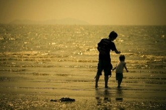

# 爸爸的年代

干爹今年五十九岁了。前些天爸爸吃饭时和他讨论做寿的事情，说起许多往事，三十多年前干爹娶亲时的箩担还是爸爸挑的。两个人慢慢都有点沉默，爸爸不会喝酒，脸上倒是有点醉意，慢悠悠的像在呓语：“一晃啊，当真是做梦哦。”我轻轻把头埋到碗里咽饭，假装没有听清他话音里的落寞，心头转过三句话，“五十年来，终成一梦”，“人间五十年，与天地相较，如梦又似幻”，“最是人间留不住，朱颜辞镜花辞树”。爸爸与说这些话的人生平志业都不能相比，但这一朝老去的感怀并无二致。男人面对衰老的忧愁往往比女子更甚，那是由内而外自信心的崩塌，就像一个老兵因为劈不开敌人的盔甲去怀疑手中的刀，已经对残酷的战场感到力不从心，烈士暮年，壮心已已。我咀嚼着米饭像咀嚼着沙尘，心里的酸痛裂缝般蔓延开来，一个时代结束了。我的爸爸已经四十六岁了。

我听爸爸的小时候，就像在过自己的小时候，不知道他看我的小时候，是不是也在倒影自己的少年时。有时候我多么虔诚地祈求上苍在将来赐给我一个儿子，就像在妈妈怀孕时爸爸的期待那样，如果我有一个儿子，我就能和爸爸一起，再过一遍青春。

爸爸好多年没有照过相了，高中时留下的相片里头是个极其可爱的少年。他脸上轮廓分明，眉眼透着逼人的灵气，头发真浓密，碎刘海的发型一点不落后，那时候还好清瘦，只是骨头架子很大，英武阳刚。骨头架子大的话，身体发福了就能带得住，不容易难看。我出生后几年，爸爸晚上回来带我下河洗澡，衣服一脱下，妈妈就对我嘲笑他：“望你爸爸，像个狗熊！”他是有好多肉，但身子很结实，也没有大肚子，就是感觉整个很大，背好阔。真像个狗熊。狗熊洗澡很厉害的，爸爸先下河，让妈妈把我放到他背上，他努力窜出去游，我像骑在一条大鱼身上，拼命鼓掌喊“驾”，或者学菩萨盘坐在他背上，脚下的坐骑奋身前行，他身上的小子岿然不动，河水被分开两旁，场面像极了八仙过海。渐渐的狗熊支持不住了，游着游着就沉下去，再一下子冒出水面把我举得高高的架到头上，父子两个一齐大声嚎叫，高兴得不得了。

后来我看到电视里播放大狗熊在河里捉大马哈鱼扔给小熊吃的时候，心里总有种不可言说的温暖。等到我念大学，有一年在南京的小学校里代课，班主任要我想个外号和同学们亲近，我说就叫大熊吧。每次那帮小鬼喊大熊或者大熊哥哥，我都要笑眯眯地想起那个在两百公里外的老男人，万分得意。

《水浒传》里头稍稍有点意思的人物多数在大名之外添有诨号，这诨名要突出人的十分本领，念起来威风八面，不唯梁山好汉，便如郑屠之流也要冠上一个“镇关西”。我爸爸也是有名姓的好汉子，乡里人称“橡皮艇”。大约三十年前的一个冬日，他爹爹在人家吃了饭要打牌，叫他送麻将去，左等右等就是不来，大人们顺路摸回去，看到脚踏车停在半路上，麻将撒了一地，我的爸爸站在结了冰的河里摸麻将呢。那时候的打捞船都是橡皮艇，爸爸捞麻将的名号由此大为流传。我小时候身体弱不能同别人打架，每遇上门要行欺侮之事的就大喝一声：“我爸爸就是橡皮艇！谁敢挡我！”小孩子被唬得一愣一愣的，这招屡试不爽。

我进学之后，父亲就开始变凶了。不独是我，父亲的侄子外甥都怕他，他板起脸来眼睛里有束幽幽的蓝光，目光所及之处，一切无所遁形，被他蹬的人皮肤会有灼烧的痛感，心里像打雷身上像淋雨。三年级上学期第二次月考的数学我得了八十四分，从出分开始后的每晚回家就像回到地狱，大魔王问考了多少，小喽啰都只战战兢兢却强作镇定地回答说还没出分呢。过了将近两个星期，父亲来老师办公室接我回家。我坐在摩托车后座上，心里比天上的云还茫然，脚下滚动的路和不断后退的树都成了虚影，一切都在远离，我的世界里只剩下眼前这块宽阔的像田地一样的背，我知道无论什么神都无法从这个烈风一样的男人手中拯救我了。到家停车，我努力活动腿脚爬下来，男人背后有两块地方湿透了，那是我手里的汗。

父亲出奇的没有骂我也没有瞪我，可并没有减少半分我的哀愁，连着好多天都不敢看他的脸。我过了二十岁生日之后经常在照镜子的时候叹息为什么老得这样快，为什么本该有的稚气变成了这幅风霜，我想是谁必须要负这个责任。但是如果说我现在还能够在站出来的时候有点男子汉的样子，那就要完全归功于我伟大的父亲，是他营造出的比死亡更令人绝望的恐惧锻造了我，包括我的表哥、堂弟，不得不承认他那双野牛似的大眼中放射出的蓝光锤炼了一代人。

类似的事情一直延续到我念高二。我在樱花纷纷的季节写满了一整张雪花白纸，满怀憧憬地塞进一只粉色信封送给了一个左脸颊有着红色心形胎记的女同学。那位美丽的姑娘应当被信中的真心打动了吧，她工整地给我回了一封拒绝信。我接到信的夜晚，一篇读罢头飞雪，顺手塞在了抽屉里，蒙头睡了一夜。第二天中午回来吃饭，进门就看到抽屉打开着，爸爸正在往桌上端菜呢。

那是怎样一种无言的痛啊，幼失双慈，老来丧子，民毁其家，君亡其国，陆游别唐婉，清照离明诚，皆不能及也！我只晓得在那个瞬间，昨晚的失落就同窗外的樱花一样蒸发在阳光里了，我这样一个嗜吃如命的竟然闻不到一点饭菜的香味，他说一声“吃啊”，我就拿起筷子闷头吃，他说“吃菜”，我就去夹菜，绝不敢夹肉。汗衫早就沾紧了皮肉，我要不时地抹额头，不能让汗滴到桌上，会惹到他更不高兴的。如果一个人不思考，只是专心吃饭，那一定吃得很快的，一碗饭扒完了，我端端正正低着头坐在那，像个小学生。他问：“还吃不吃？”我摇摇头，他收碗筷。碗筷收完了，我还坐在那。我的爸爸，悠悠地说了句：“你看看人家写的字，多漂亮啊。”

窗外的阳光透过布帘照在爸爸脸上，散发出一股圣洁的气息。爸爸是下凡的菩萨，是降世的天父，他使我获得新生。我像一条冻僵的鱼被放进温水中，我是贫下中农见到了北京的金山上光芒照四方的毛主席！人生四喜远远的让到一边儿去吧，这世上只有一种高兴，就是爸爸的微笑。

当然，我也清醒地认识到，那是人家姑娘拒绝的情况下。是爸爸教会了我要坚强坦然地面对每一次被拒绝，因为我们永远不知道那意味着错过还是幸运。

爸爸的年代，是英雄的年代。我长成的时光就是他们激情打拼的历史，我亲眼看着这一代人光着膀子在这荒滩小镇上起家，干成了多少事业。爸爸自己大起大落多少回，在昔日伙伴纷纷有所成就上岸立足时，他还像当年那个摸麻将的少年，在冰冷的河水里浮沉。母亲总是骂他“直呆子直呆子”，永远扶不起来，他太直爽，赚来的钱只是过过手，又都出去了，却也因此交了许多朋友。不管多少真心假意，在这个地方提起“橡皮艇”，又有谁能说一个不好呢？

可他竟然也开始忧愁了。有好几年了吧，从我发个子以后，我就成了压在他心头的柱子，每长高一点，他的压力就增一分。高三我同班主任干仗，和他在电话里嘶吼再也不读书了，他像个被吓坏的孩子，惊慌失措地试图抚慰我的情绪，“宝宝，你回来吧，爸爸养你一辈子。”我像是重新认识了他一样，在大街上放声大哭起来了。

到我上了大学，爸爸变得更加小心翼翼。我谈了个山西的姑娘，发一个短信告诉他，他没多说什么。回家之后一个叔叔跟我说，你爸爸连夜觉都不睡来找我，愁得整把整把地掉头发。那几天九十公斤重的壮熊瘦到了一百六十多斤，他试图找合适的机会和我谈谈，每次又都欲言又止。妈妈倒是每次等我回家劝我别找这么远的姑娘，以后结婚了实在太不方便了，我脾气越来越大，终于在饭桌上一拍筷子吼道：“我找还是你找啊！”爸爸吓了一跳，看了我一眼又迅速低下头去，对妈妈埋怨：“你逼他做什么。”

我吃惊地望着他，心里慢慢泛起一阵酸苦，爸爸这是怎么了，爸爸竟然要怕我了吗？这还是那个眼社蓝光劈波斩浪的大狗熊么？从那以后，家里同桌吃饭安静许多，一直维持了好几年。

妈妈在爸爸出去以后狠狠地骂：“你晓得你爸爸高血压犯了吗？怎么就这么不懂事呢，哪个也不会害你的，你也不小了！”

爸爸还是来找我谈谈了。他说他上司的闺女特别好，人家也想着我，我说人家好是人家的事，我不要。

“要了她，你什么心思都不用担，将来她家的厂也是你的。”

“我不稀罕。”我简直有点瞧不上眼前这个有些落魄的人了，当年那么豪情万丈的汉子，怎么生出这种心思了？

“姑娘我是了解的，勤力，什么都做，不比你妈差。”

“我不要。”

“我们不逼你，但是你自己想清楚啊。”他有点儿哀求了。

“爸爸。当初奶奶让你要老校长朱国章家的女儿，你怎么没要？”

“你这个不同，我们不一样。”我可怜的爸爸竟然脸红了，别过了头。

“哈哈哈哈哈。”我像得胜的将军，大笑着结束了这次谈话。

终于我没和远方的姑娘好到底，也没要爸爸中意的人。

毕业后也没经太多的波折，顺利参加工作。第一个月工资都没够花，还问爸爸借了一千块生活费，他很爽快地给了。妈妈和我说，“你爸爸夜里躺在床上同我讲，‘我虽然混成这样，有这么个儿子，也够了’”。我正好和同事在码头上巡察，赶紧找了根柱子躲了，江风太大，像是什么迷了眼睛。

我回家去吃饭，他话比以前更少了，就是听我在说。但是我知道等我一走，他一定拉着那些邻居和朋友替他儿子吹牛，像个得胜的将军似的。我说“爸你吃饭”，他点点头只是吃，我说“爸你吃菜啊”，他点点头去夹红烧肉，我一下伸出筷子夹住他的筷子不准他动，再夹起一大团炒番瓜丝到他碗里：“胖子还想吃红烧肉？没门儿！”看着这男

人委屈地笑着吃饭，真是惬意啊。

我的爸爸小时候养过一条很大的黄狗，被人用枪打死在河边，他流下的泪水能让河水流动，从此三十几年没再养狗。最近听妈妈说，爸爸前不久又捉了一条小狗回来养，名字叫阿福。真是个好名字。 

（采编：佛冉；责编：佛冉）

[【曾记否】故乡与城](/archives/41993)——故乡是慢的，新城是快的；故乡里住的是人，新城中重的是楼。故乡的现代化之路，另人手足无措；“文明”的发展，代价难道是人与自然的分离？
