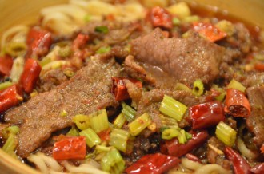

# 做顿好饭菜

记得当年学法语的时候，老师是新中国头几批留学生。有一天上课学累了闲聊，老师说，将来女孩子出国，想起家来会比较麻烦。当时我们几个秃小子问，那男孩子想家怎么办？他说，嗨，男孩想家最好办，自己做顿好饭菜，吃得盘底见天，就什么事都没有了。当时我们不以为然，一是因为不相信男孩的思乡这么廉价，二是更重要的，那时候我们都还不会做饭。如今回想起来，老师说的话里面这句算是我记得最清楚的了。

因为，它是如此的正确。

留学党里面流传着一句话：大多数留学生如果没有在学术上有所成就，起码在厨艺上都很有造诣。出国在外，无论是谁，难免要思家。而每每思家，到炉台旁乒乒乓乓忙活一阵，不管是来个复杂的水煮牛肉，还是简单的下一碗方便面，只要那味道从锅里一上来，就好像黯然销魂散，顿时让人清醒过来：那思念之情都是万里之外的假象，只有锅里碗里的食物才是最真切的。

记忆是一把最好的蒙太奇剪刀，瞬间镜头就切换到最近。五年前就算饿死，我也想不到之后会来到广州这个跟我之前丝毫没有关系的城市。公司要求一个礼拜之内找好房子，我只用了四天。可以说是效率高，但更是一种无奈。每天顶着直射的太阳，冒着三十多度的气温，从城南到城北的跑。见了无数的中介，找了无数的房东。有一天，就这么走着走着，我突然停下来，喝了口水。我想到朋友跟我说之前在北京租房子，不得已和陌生人同住屋檐下的苦涩；我想起在上海地铁站旁那些肮脏的小摊前挤满了赶着上班的年轻人，付了钱拿了一碗东西边走边吃。从那时起，我就对自己发誓，永远不要像他们一样。我曾经无限希望能够到大城市中生活，但后来我看到大城市是这样轻而易举的就摧毁了年轻人对生活的美好幻想。为了保留住残存的希望，我唯一能做的，就是做恰当的事，做正确的事。我对自己说，我要整租，不要和不认识的人合租；哪怕早起半个小时，我要坐着吃早饭，而不是买来路边摊的不知道什么乱七八糟的东西然后迎风边走边吃。

想过这些之后，我继续赶路，寻找下一个房东。我幸运极了，这个房东人很好，虽然钱上面计较一些，但是我也无所谓了。她跑前跑后帮我收拾，还说要给我介绍自己邻居家的大闺女给我认识。我去附近的超市买被子和锅，她找了认识人帮我打折。

我搬到新租的房子里住的第一个晚上，广州下雷暴雨。我躺在床上，伴着轰隆隆不停的雷声，问自己：为什么？我为什么从国外跑回来，跑回到沈阳，又从沈阳跑到上海，呆了每两个礼拜又跑来广州？因为是公司要我这样做的；因为这样，我才可以和我心心念念的飞机发动机们朝夕相处，看着它们上天，再看着它们平安落地。因为这样，我才可以做我喜欢的事情，还有人给我发钱。可是，有这么多开心的事情，我为什么还会躺在床上想为什么？说到底，我为什么这么孤单？我为什么觉得，这个房子不是我的家？楼下小孩子牙牙学语，老人们嘴里嘟囔着家长里短，情侣们口耳呢喃，狗叫猫跳，以及听不懂的白话，这些于我，到底都有什么意义？

赚了钱，住到自己付房租的房子里，这是我有生以来第一次。这种感觉很奇妙，仿佛是名义上独立了出来，但还有某一块不是自己的。和这房子也是。每天下班之后，我跟同事说，我回家了。坐上地铁，有个方向，知道在哪一站下车，往哪里走，摸到哪扇门，用钥匙可以开的开。进门之后，我睡在这房子的身体里，但是它仿佛总有心事，不想跟我说。住房子和处人一样，要有一段时间，甚至总要有一两件事，让你们之间发生共鸣，才能最终成为你中有我，我中有你的好朋友。

前两天和家里打电话，我妈听说我单位的食堂管晚饭，怂恿我吃了晚饭再回家。我爸在一旁责怪她，让她别管我。我心想也是：工作了一天，到了晚饭这种“居家”的时刻，居然还要在单位度过，想想就不会开心。

今天下班，路过菜市场，我想给自己做顿饭吃吧。于是就买了一桶油，一把米，一袋盐，一个苦瓜，一头蒜，两个鸡蛋和一小块猪肉。回来之后衬衫一脱，换上短裤打着赤膊。先把米饭焖上。热油炒鸡蛋，炒得嫩嫩的盛出来，借着鸡蛋的油爆香了蒜末，下猪肉，再下苦瓜丁。最后把鸡蛋倒回去，加点盐。米饭差不多了，飘出来的香味混着苦瓜，鸡蛋和肉的味道，钻到鼻子里，忽然让一切都有了意义：那些楼下小孩子牙牙学语，老人们嘴里嘟囔着家长里短，情侣们口耳呢喃，狗叫猫跳，以及听不懂的白话，这些于我，就是市井气息。生活少了市井气息，便不再是生活，只是程式；同样，家没有市井气息，也不叫家，而是房子。我租的房子，今天晚上用油烟熏过一遍之后，突然温暖了好多。

原来老师说的是如此正确：做顿好饭菜，不仅可以解乡愁，甚至能解漂泊之苦。

（采编：鲸书；责编：鲸书）

[【栖居地】碾取名香作地衣](/archives/48024)--名香积少成多之后可能织就的浩瀚恢弘”的向往和幻想，而在于为自己的脚下铺一张毫不起眼，但踩在上面充满踏实感、充满幸福的地衣。

[【栖居地】某某](/archives/48046)--当你漂在北京，当你孤军奋战与自己打斗。
