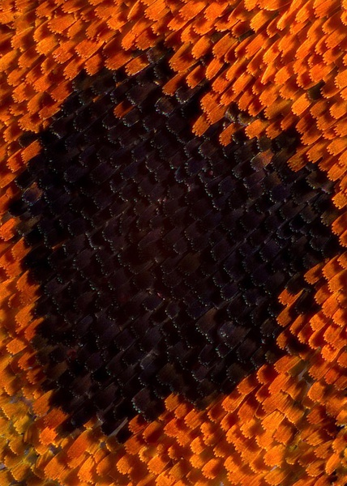
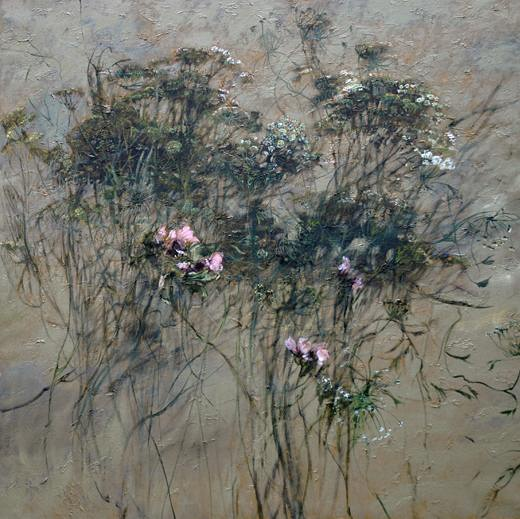

# 某某

某某：

我是来北京，算来不觉已将近一个月。对于北京，我从没期盼会有什么惊喜，我显然无力握住这个庞然大物的脉搏。这个城市的悲喜与我这个异乡客实在难有瓜葛。

我现在在一家杂志实习，寄宿在北语的宿舍里，每天上班坐十三号线转二号线再转一号线，路上要花去一个小时，对于没有座位已是习以为常。十三号线上的人总是很多，疲惫的地铁载着疲惫的行人从地下穿行到地上，车轮与铁轨摩擦产生巨大的噪音。我从五道口站乘地铁，高峰期时地铁口总会聚起一堆人，黑压压的一片，像一团经久不散的乌云，等上十来分钟才能进站。后来才知道因这附近的房源多，大多数漂在北京的人都租住在这里拮据生活。或许也是因此，五道口变成一杯面目不清的混合饮料，一道崭新和陈旧撕扯开的口子，这里的楼房有些像是建在八十年代，一个老旧的电影院，火车经过时拉起的栏杆和嘶吼的高音喇叭，灰色的老楼房；也有高档的大商场、崭新的教学楼，走两步就能看到一个老外。每天我在夜色中回来时，地铁口的夜市正是热闹的时候，面包车后备箱吐出床单、本子、杯子，地摊上摆着各式各样的小物件，衣架上成排成排的廉价衣服裙子，还有我家那样的三线小城市九十年代末街上卖的脏兮兮的烤肠。这里很多乞丐，总是低垂着头，有一个乞丐带着两只小狗，趴在地上，我几乎每天都能看到他，第一天给了一块五毛钱，有天我看见一个姑娘蹲下来问那个乞丐什么时候回家，让他好好照顾小狗。

其实不只五道口，整个北京就像是一个巨大的城乡结合部，各式各样的人都混杂着在这里寻找所谓出路。到北京的第一天，和倩姑娘一起去首师大，地上巨大的油性笔写着“包小姐。”后来我反复在北京的很多地方看到这三个字，用小纸片贴在栏杆上或者直接写在地上，打印或者手写。

我不了解这城市，它是否真的这样欲望满满。

十三号线转二号线时要走很长很长一段路，那是一段上坡的扶梯，非常缓慢，因为过于遥远，没有人愿意走楼梯，大家都站在扶梯上前行，却忍受不了缓慢，人少的时候，后面汗流浃背的黑皮肤男人裹挟着浓重的汗臭从我身边走过，很急的样子；人多的时候，左行右立的规矩被悬置，扶梯上满当当的人，每往前扯上一米，扶梯都要抖动一下，像是剧烈地喘口气，稍不留神会不会所有人一起沉入地心。

十三号线和一号线里的冷气都很足，但是在换乘和等待过程去却会磋磨出一身汗来，做地铁频繁了，就常常能遇上在地铁上唱歌的乞丐，他们总是在地铁两站之间掐好时间刚好走过一截车厢。我遇见过一个袒露着乳房抱着小孩的女人，一对年迈的夫妻，几个小男孩，他们移动过来的时候，拥挤的人群会自动让出一条路来。

这些地铁八十年代末就有了，地板上是老式的黑底白点图案，墙面上贴着白色的长方形瓷砖，灰蒙蒙的。我觉得这座城市这么老，奄奄一息的样子。十几条地铁在它的肚子里穿梭，会刀割一样痛吧。

这里很干燥，来的前几天，不停喝水还是顶不住嗓子里的干痒。手脚都在蜕皮。不是我们三月的烟雨飘摇的南方。

有天我下班，已经九点了，暑热终于稍有消退，路上的人很少了。我去地铁站乘车想要回到住处。远远地望见地铁站门口坐着一个老太太，走近看见她脚边堆着收来的塑料瓶和废纸，满满的两个蛇皮袋。她微胖，一直盯着不存在的远方发怔，她的眼角堆满鱼尾纹，白色发丝在夜风里微微颤动。再走近，才发现她左手食指和中指之间夹着一截短烟，非常短以致我走得很近才发现。她穿着淡绿的上衣和花点的裤子，我走过的时候她没有看我一眼。从头到尾，她一直盯着前方。

去颐和园的时候，遇上一个卖冰棍和水的老太太，精瘦，在桥上。太阳很大，我经过的时候她看着我说：“长得真像我家宝贝。”同伴停下来买她的水，她问我：“你多大了？”“二十。”“很我孙女一样，我家宝贝儿也二十了。”我们付了钱要走，她在背后喊：“今天热，宝贝儿路上要小心，好好玩啊。”我回头：“奶奶再见。”

我是傍晚去后海，一个人摸摸索索地走，到的时候已经八点半，酒吧街上歌声喧腾，驻唱歌手的声音真不怎么好听，有男人站在酒吧外拍跳钢管舞的女人，那女人有点胖，穿着最魅惑的黑纱衣服，取景框里颜色暧昧。我沿着河一直走，转到河那一边的时候，游客就少了，声色犬马褪去，钓鱼的大伯用蓝色的探照手电，丢沙包的小女孩嘻嘻地笑，拉着手风琴的老年人互相配合着唱莫斯科郊外的晚上，爸爸陪着女儿打乒乓球，面孔都融进夜色里。

每天都有新鲜的从地底下冒出来，也有衰老的被分解腐蚀。北京，像是把这些新鲜和衰老搅拌在一起，扔在平底锅里，摊出的大饼。

我太难描摹这个城市的模样了，说起来都是零星的感觉和偏狭的印象，于是只能跟你描摹这个城市中我的模样。

也许是因为每天下班太晚，睡觉总是两三点的事情了。在北京的生活，我坠入了一种更为彻底的孤独。我独自住在高中同学的宿舍里，除了放假时能和朋友出去转转，其他时候都是独自上班、吃饭、睡觉，以及生活。这样一个人的生活居然让我觉得舒适和自由。我常常在想，孤独是所有人都会感受到的吗？从小就有玩伴的小孩会孤独吗？结了婚忙着照顾孩子的妇女会孤独吗？还有你，你会和我一样感到孤独吗？我觉得孤独感是人类都会有的，可是当我体味这孤独时，分明觉得它是我独占的。我甚至有点享受这孤独。

孤独是没有原因的吧，是像暴雨一样突然袭来的，我每次都没有带伞，只能蹲下来抱住头。这种孤独并非因为不被理解，从来都不存在理解吧，你不是我，又怎么能体会我。你体会到的又怎么是真实的我。而更倾向于一种彻底的寂静。

你和我一样吗？你会觉得跟我一样难以对人交付内心吗？我总是徘徊在两个极端，要么沉默，要么迫切地渴望诉说，推心置腹。尤其是面对信任的人，开始滔滔不绝地叙述，不加保留地把自己全部摊开，赤身裸体之后又后悔不跌。会被讨厌吧，自己居然变成自己最讨厌的啰啰嗦嗦的样子，真让人尴尬。而我信任的人又是否真的愿意听我诉说。

你会单纯地喜欢一个人吗？不是因为她美妙的特质，比如很漂亮，成绩好，会弹钢琴，而是彻彻底底的她，因为她分不清方向，记不住数字，她左脸上有一颗疙瘩，她本身。

你会和我一样，认为美好难以接近吗？我不知道怎么让喜欢的人喜欢我，真是让人沮丧。

夜里，我爬上床，有的时候只想嚎啕大哭，没有缘由的，有一天我三点钟爬上床，特别难过，居然躺在床上哭，哭着哭着睡着了。第二天继续去上班。

我越来越坦然地接受自己了，以前我总是想为了别人改变自己，后来才发现我生来如此，我不完美甚至劣迹斑斑，我情绪化无药可救，每天与自己打斗。我知道我的内核，它脆弱得不行，像一团蜷缩的花苞，我想好好照顾它。它就算丑陋不堪，我也不想杀死它。也可能是我根本没力量杀死不了它，它不是花苞而是一头凶猛的怪兽，开始吞噬我正常的器官，我变得古怪起来。可是我真的别无他法，无论是花苞还是怪兽，就让它生长吧。我接受我的畸形。

在三点的时候，我站在阳台上，地铁终于停止运行了，整个城市到这个时候像是才寂静下来，路灯昏黄，路上终于没有了车辆。

我写完这封信，不知道该寄给谁，这才是一种孤独吧，我于是只好在收信人上写着某某。

某某你好，见信如唔。

（编辑：鲸书）

[【栖居地】碾取名香作地衣](/archives/48024)--名香积少成多之后可能织就的浩瀚恢弘”的向往和幻想，而在于为自己的脚下铺一张毫不起眼，但踩在上面充满踏实感、充满幸福的地衣。

[【栖居地】做顿好饭菜](/archives/47881)--留学国外，寄居异乡，何以解乡愁？做顿好饭菜吧。
