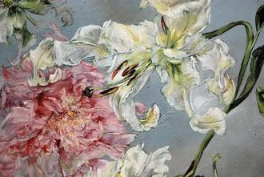

# 碾取名香作地衣

按照工作要求，每周三和每周五需要提交一份工作备忘，一式三份，抄送给公司产业组的总监Z，行政考核的X和主编W。在我的工作备忘里，我言至简意至赅地写着今天采访了谁、谁还有谁，写了谁、谁和谁的采访提纲、写完了关于什么和什么的稿子以及读了哪些书。

有些采访对象很迷人，有些金玉其外，有些荒唐可笑，但这些情绪都在工作备忘之外，就像上面照片里的人们，都在工作备忘之外一样。每天发生在我身上的事情还有很多很多，它们是我生活备忘的部分，出现在我2013-2014年度的Moleskine里。

比方说，我每天八点起床摄入茶叶，九点半摄入咖啡，中午十二点摄入纯净水，晚上十点摄入可口可乐，十二点摄入现榨的西瓜汁。最近天气越来越冷，我开始买梨子来取代西瓜。我摄入很多的水分，希望作为碳水化合物的我生长得闪闪发亮。

我每天晚上九点半开始完成和参差计划相关的一切工作，一般情况下我会先审阅和编辑文章、登陆系统刊载、查看重要的微博、回复邮件里的质询、在QQ里和新人沟通工作，最近因为参差计划的纸质版，只好放下其他工作，每天都在暗无天日地排版。

我每天早晨九点会把前一天下载好的Podcast功放来shadow practice，但因为接下来工作即将开始，我总是心事重重，听不太清楚新闻里到底在讲什么。我从英国邮寄回来的箱子月底就要抵达了，我打算从箱子抵达之后开始把这45分钟花在背单词上面。

每隔两个周末，我就会和Sheltar一起去当代MOMA，我们看了台湾的影展、巴西的影展、德国的影展、西班牙的影展，之后我们会去找一家没有吃过的新餐馆交换一下最近读到的书和参加过的讲座，然后道别回家。这次我们看的是粘土定格动画《传教士》，吃饭的时候，我听说安迪沃霍尔和博伊斯在中央美院办展出，而且还是彭博社赞助的。

每读完一本书我会制订新的大部头阅读计划，之前我刚刚花了两周读完了DW老师要我读的《媒体与权力》。我还穿插着读完了简短但极其动人有魅力的《眠》、简短但乏味无趣的《机场里的小旅行》，接下来我要按照每天两小时的进度开始读我从来没有读过的《红楼梦》，一边穿插着读《布鲁斯特的心脏》，我真的好爱凯撒大帝的那个故事。

_公元前__44__年，罗马执政官凯撒遭行刺，他发现刺客中有自己最信任的助手和挚友布鲁斯特，不由惊呼，__“__还有你吗，布鲁斯特！__”_

在每周没有晚饭邀约、没有采访、没有前一天熬夜到三点的时候，我就会去健身房，跑步到健身房的路程就让我已经感觉到一种回天无力的疲惫，青鸟健身的接待姑娘见到我总会一副很惊讶的表情，“哎，你……来啦？”

每个月我会收到汤姆的一封邮件，汤姆会讲到的话题很多，从生活琐事到体操、旅游和爱情都有，但我写回的邮件大都是在讲我的工作：我实习了，我入职了，我刊发了第一篇封面，我在办公室有了自己的电脑，我的工资还是没有发下来，我被点名批评了……每次我试图讲给汤姆一些我生活里更加生动有趣和更接近于生活状态的故事，可是我发现几乎没有：工作的时候，我在试图还原别人的故事；工作之外，我透过书籍和电影，重新走进另外的故事里。我自己创造的故事那么少，以至于我开始自责。

我的生活是被规划而成的，我对明天、后天要做的工作、要读的书、要遇见的人和可能去到的地方清楚不过，而这种清楚给我确切的实在感和安全感，让我有足够的理由说服自己，每天如蜜蜂、蚂蚁和其他微小的生物们一样碾取名香的生活是有意义的。它的意义不在于对“假以时日，名香积少成多之后可能织就的浩瀚恢弘”的向往和幻想，而在于为自己的脚下铺一张毫不起眼，但踩在上面充满踏实感、充满幸福的地衣。

（**采编：** 鲸书；**责编：**鲸书）

[【栖居地】某某](/archives/48046)--当你漂在北京，当你孤军奋战与自己打斗。

[【栖居地】做顿好饭菜](/archives/47881)--留学国外，寄居异乡，何以解乡愁？做顿好饭菜吧。
