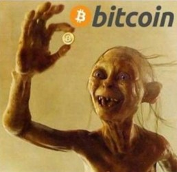

# 比特币的前世今生（1）

** 什么是比特币？可以吃吗？**

简而言之，科学家发现了一种算法，其中能够虚拟产生出“真正有限”的有意义的字符串，并且极具保密性，这就是比特币。至于算法和原理，我建议可以先不管，看了论文绝大多数人会觉得想吐的。但你可以把它形象地想象成网游里的绝世宝器，数量很有限。并且这种“有限”是由算法保证的，它不像是私服游戏那样，可以人手一把屠龙刀，相当于滥发钞票通货膨胀，比特币的算法保证了就算你用尽世界上所有的计算机和所有时间，也只能产生总量有限的比特币。

** 比特币的前世**

很多人觉得不靠谱，比特币是虚拟的字符串，这怎么能当做货币呢？或者说这怎么可能值钱？那我倒是要和诸位分析一下，什么是“值钱”？要知道，现在玩网游，确实一件神兵能够卖到钱，是因为“有需求”。网游也是一种数字信号而已，但偏偏有玩家认，有人需要神兵，所以出现了供求关系，于是就产生“价值”。石油对于古代人是垃圾，但是对于现代人是宝物，这也是因为近现代石油才有需求。世界上没有什么东西是有天生的“价值”，只有人有需求的时候才会产生价格。比特币有什么需求呢？它的算法保证了他的保密性，而保密性被很多人渴求着，比如毒贩，比如不愿意泄露隐私的买家，于是被人需要，于是会有价格。这就是比特币的前世—— 虚拟宝物。

** ****为什么比特币可以当做货币而不是一般物品呢？**

因为它更像货币。首先让我们明晰一点，没有什么是注定的货币。原始部落用贝壳，后来古人用铜用银，叙利亚内战的时候甚至美元成了叙利亚的硬通货，因为它被认可（清末军阀混战的时候，美元英镑马克等都成为通行大陆的货币，甚至比军阀发行的货币还灵光）。货币其实只是一种稍微具有如下两个性质的普通物品：普遍性、兑换可逆性。

** ****普遍性**表现在必须是大家都能在极短时间内认可的东西，比如古董就不能成为货币，因为鉴别需要太多时间，不是普通人能够接受的。而货币，比如银子美元等等，很容易识别。只要是一种普遍被人认可的东西都可以算所是广义的货币。比如石油的期货合同，也就是几张纸，但是由于全世界都需要他，也容易识别，所以某种程度上也可以当做货币。 ** ****兑换可逆性**表现在必须能够几乎随时变成其他通货并在变回来的时候保值。比如人民币可以随时换成美元，再换成几乎等量的人民币（银行之间的兑换更趋于等量）。当然一种货币考虑人民币在中国可以随时购买，但是在非洲可能就不被认可，所以是区域性的通货，而美元更加国际化。 

所以大家要树立一个常识：其实我们身边充斥着人民币以外的货币，比如美元，比如国库券，比如石油期货，比如一家大公司的期权，比如股票，这些纸张或者说数字其实都算是广义的货币。从这个角度来说，比特币可以当做货币，因为它现在被越来越多的人认可，几乎所有国家都能够通过网络买到比特币，北欧许多网络平台可以用比特币直接购买物品（普遍性）。而网上更有许多比特币的交易场所和论坛，可以“可逆”地将银行卡里的钱变成比特币再变回来。所以它更像一种货币。

** ****那为什么经常听说贩毒团伙用比特币做坏事？似乎比特币罪大恶极。******

** **

其实是这和比特币的天生优点有关。刚才说了比特币有极高的保密性，于是没有人能够追查这种货币的来源。与之相对的是普通货币，表面上我们觉得两张纸币是完全一样，但其实它的序号等等都是警方可以追踪的目标，以及普通货币的流向可以从银行查到。但是比特币的算法特质注定了他无法被追踪。而这也是比特币的优点。比如一个超级买家想匿名买古董，或者说有人得了艾滋病要买药但是不想隐私被察觉，所以这种人群会需要比特币为它绝对保密。一旦一件物品被人需要，就会有价格出现，这是最基本的供求关系导致的。而世人普遍是有保护隐私的需求，那么就注定了比特币会被需要。就像一场网游只要有玩家愿意去买屠龙宝刀，那么就一定会有屠龙宝刀的价格出现。

这并不是比特币的坏，因为这是人的普遍隐私需求。我们不能因为毒贩在使用比特币就会因噎废食地放弃比特币，正如不能因为有人用人民币行贿就放弃人民币一样。供求关系不是政策能够决定的，只要世界上有人需要更好的隐私保护，就会有人采用比特币来交易，而且没有替代品。所以比特币注定会成为一种世界硬通货。

** ****历史上出现过很多经济泡沫，比特币是否会昙花一现？**

让我们看看历史上的经济泡沫，比如1637年荷兰郁金香泡沫，人们像疯了一样购买郁金香，因为人们觉得它的价格还会涨。又比如90年代日本的地产泡沫，东京的房价已经超过纽约几倍。最终泡沫破灭，没有接手的下家，最后持有物品的人血本无归。比特币是否也是此类泡沫？

不是，因为泡沫是指超过本身供求关系的稳定值太多，导致为了投资而投资的现象，纯粹是一个“比傻游戏”，也就是觉得还会有更傻的人出现来接手，于是能赚一笔导致泡沫，但是比特币的价值是由实在的供求关系产生。人们确实有需要保护隐私的需要，特别是匿名购买的需要。随着公民意识的觉醒，随着现代社会人们对信息的保护越来越深，匿名购买的需求反而在加剧，可是在比特币出现之前却没有绝对安全的解决方案。

比特币因为其虚拟性，让人多人觉得不实在，虽然有匿名需求但因为不了解而放弃，其实是低估了比特币的意义。这种误解很正常，就好像很多人觉得“金融只是高级骗术，玩玩数字而已对社会没有任何贡献”也是很常见的误解。虚拟的数字的作用很多时候传递的是信号，也是在服务社会。随着更多理性人对比特币产生认识和了解，它的不可替代性会日益凸显，也就是将会有更多使用者，导致比特币相对于其他货币的升值。

(**采编**：张山骁；**责编**：陈澜鑫)

[【校长谈金融】比特币的前世今生（2）](/archives/47968?preview=true&preview_id=47968&preview_nonce=368560e676)--社会真正担心的是政府随意发行钞票。因为发行钞票并不单单是让货币单位替换而已，而同时伴随着某种程度上的抢劫。

[【校长谈金融】现代金融的基石](/archives/48102)——传统银行看到了借贷需求，于是制造出货币市场，满足了双方需要于是赚钱。但这种金融市场其实很初级，中国古代的山西票号和16世纪意大利威尼斯就已经提供了货币市场。
