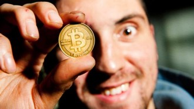
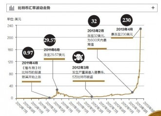

# 比特币的前世今生（2）

** **

上篇（[/archives/47902](/archives/47902)）着重解释了比特币的货币意义，以及其区别于其他货币的优点——匿名性。下面要介绍它的第二大优点——“发行量有限性”，以及更多操作层面的东东。

一战后德国马克为何一文不值？因为发行得太多了，以至于后来印钞机都在24小时印制巨额钞票。其实货币本身的价格高低并不会成为公众诟病的因素，1英镑换9.8块人民币，1日元换0.06块人民币，英镑与日元间如此大的区别，并不妨碍英国与日本同样是稳定的社会。社会并不担心其使用的货币的具体价值，比如全社会所有人的钱都变成一百倍，然后所有物品的价格也变成一百倍，社会还会沿着原来轨迹运作。

社会真正担心的是政府随意发行钞票。因为发行钞票并不单单是让货币单位替换而已，而同时伴随着某种程度上的抢劫。因为政府一旦印制新的钞票，那么相当于政府占原来全社会货币总量的比例就增加了。比如原来全中国共有100万亿人民币，政府持有其中的10万亿，政府手中的钱可以购买全社会10%的物品和服务。但是如果政府增发10万亿的货币，那么政府就占了110万亿总量中的20万亿，政府就可以购买全社会18%的物品和服务。相当于政府侵蚀了人民本该拥有的物品和服务。所以说滥发货币就是变相的抢劫。而众所周知政府很可能很难监督，于是滥发钞票的现象在多国泛滥。

比特币的算法特质导致了全世界只有有限总量的比特币，于是直接避免了滥发钞票这个常见问题。当然随之而来也会有许多疑问。

****

**比特币如何发行？谁来监管？**

比特币这种物品由算法保证了总量有限，采用先到先得的方式，谁的计算机先发现了有意义的数据就能够获得这个比特币，并且算法保证了不会被重复挖掘。于是大家有两种方法获得比特币：1，用自己的电脑跑挖掘程序。2，去市场上买。其中第一种方法过去比较行得通，因为挖掘成本低，只要电脑和电费就可以了，早年甚至用显卡都能挖到比特币，但随着开采量的提升，挖掘比特币的工作越来越难，我建议大家如果不能动用一台超级计算机就还是别挖了吧，电费开销太厉害。

那么监管是哪个机构来完成呢？事实上，不需要监管机构就可以运行。算法保证了比特币的监管和发行甚至比政府更可靠。 当然事实上如果量子计算机普及的话，这种算法也可能不可靠，到时候也许会有新的新型货币。不过我想提醒大家两点。1，量子计算机的实现在物理上由于退相干现象，导致制造有极大的困难，目前还处于实用型量子计算机遥遥无期的状态。2，百年以后量子计算机成熟的话，货币替换也很正常。就像我们看原始人用贝壳作货币很笨，但是在那个年代，也只有这种选择。以后也许会觉得比特币落伍了，但是比靠自我约束而控制的纸币，已经先进不少了，比如纸币的折旧等等成本很高。在我们这个一来没有量子计算机，二来又需要隐私保护的信息时代，比特币有它的固定需求，于是必然会有市场价格。

**比特币为何波动巨大？**

****

这是很多人觉得比特币不靠谱的地方。波动这么大，看起来很像泡沫。但泡沫往往一蹶不振，而比特币经常雄风再起，那是因为这是供求关系决定的。买家和买家的心理波动太大，导致价格不稳定，而不是说比特币像郁金香泡沫一样，属于人为制造的假需求。刚才说了比特币的匿名性是一种刚性需求，确实有很多人需要，于是它有价格。但买家和卖家的心理正像绝大部分人一样，在不了解的时候非常犹豫。一会儿觉得靠谱一会儿听身边的人一议论就撤资了。任何一种新型通货都需要市场的检验，而检验标准就是所有人，比特币不像政府发行的货币有政府信誉作担保，所以变得他的价值是依靠于所有人对它的评价产生，于是波动异常剧烈。就仿佛一个高阶多项式对初值敏感一样，一点信号就会产生极大的心理波动。但每次比特币都能东山再起，是因为他有“实际需求”在支撑。

**我是如何赚到****5****万的？**

也许很多人都不大想听之前的内容，也许就想看这一节。那请容我仔细为大家道来。

首先这是有部分运气成分的，永远没有办法严格区分出投机和投资。因为任何一种投资都是有它的风险，或者说涨落、方差。我能做的之是用理性分析来提高期望值并且降低方差而已。我的投资基于以下几点假设：

1，比特币对美元的汇率会升降；2，比特币对人民币的汇率也会升降；3，人民币对美元汇率相对稳定。

为了避免太大的投机成分，我并没有采用“人民币买比特币，然后根据汇率变化赚钱”的策略，因为这个波动太大了。大家可以看看比特币的波动，很多时候像过山车。我只愿意去赌我能够预测到的走势，而不愿意去过多涉及我无法预料的领域。所以我采用的是现代金融中的核心概念——“对冲”，来消除风险。关于对冲，也许以后我会再另起炉灶重新写一篇《对冲的意义》来详细解释，但现在我只简略说一说：对冲就是通过同时买卖类似物品，而最终使得你的收益仅仅取决于这两种物品的差异点。所以我的策略必须消除比特币过山车一样的涨落趋势，仅仅集中注意力到我擅长的方面，我预测——“上海自贸区到不到社会预期”。 

于是具体策略如下：

把我的钱人民币1.3万分成AB两部分，在自贸区刚刚成立的时候，把A部分在中国比特币市场上购买比特币，B部分换成美元，在美国比特币市场卖空比特币（请一定注意这个顺序不能颠倒，因为中国市场上只有买入和卖出的选择，没有卖空的选择）。然后等待到现在，把比特币在两个市场上分别结清。于是我成功地摆脱了比特币普遍涨落的波动，对冲了全球性的影响。而由于上海自贸区本身有一定程度的金融开放，相当于部分取代比特币的地位的作用（在中国市场金融开放动作和比特币起到了同向的作用），那么当大家普遍对自贸区失望以后，“比特币在中国的需求增长”会高于“比特币在美国的需求增长”。于是成功地对冲了比特币本来的普遍涨落，而把赌注集中压在自贸区对中国的金融作用上。事实上我还用了一点杠杆来放大盈亏，具体细节就不说了。然后，我赢了。

至于为何当初我预计自贸区达不到社会的普遍预期，我就不说了，说多了都是泪，希望这个国家的金融越来越透明和国际化。

最后，非常感谢大家耐着性子把这《比特币的前世今生》上下两篇看完，其中上篇也建议大家再看一次，因为我又添加了一些内容。在中国，很多有趣的事情正在发生，也许你觉得一辈子都不会碰到的东西正在深刻地变革每个人的未来。

（ **采编**：张山骁；**责编**：陈澜鑫）

[【校长谈金融】比特币的前世今生（1）](/archives/47902?preview=true&preview_id=47902&preview_nonce=d356e1bdde)--很多人觉得不靠谱，比特币是虚拟的字符串，这怎么能当做货币呢？或者说这怎么可能值钱？那我倒是要和诸位分析一下，什么是“值钱”？

[【校长谈金融】现代金融的基石](/archives/48102)——传统银行看到了借贷需求，于是制造出货币市场，满足了双方需要于是赚钱。但这种金融市场其实很初级，中国古代的山西票号和16世纪意大利威尼斯就已经提供了货币市场。
