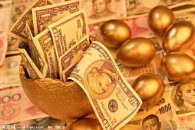

# 现代金融的基石

这是一个谁也离不开金融的年代，也许您没有刻意关注但其实早就参与其中。人人都值得学点必要的金融思想，且让我们从零开始。

### 套利

假设某款小米手机刚刚发售就几乎断货了（这几乎不用假设），此时你恰好在手机市场闲逛。你意外地发现，有家A店老板愿意用2500元收购新小米手机，而有家B店恰好有存货，还在以2450卖新小米手机。机智的你果断决定在B店买台小米，随即转卖给A店老板，50元妥妥赚入腰包，打动了在场所有人。

恭喜你，你已经进入了金融领域。刚才的行为在八九十年代的中国叫做“投机倒把”，而在金融领域，这就叫做“套利 (arbitrage)”。当年咱实行计划经济双轨制的时候，就有很多政府官员在体制内购买原料，然后到市场上交易，其实，他们做了一件最最稀松平常的套利工作。

### 套利存在吗？

也许你会奇怪，这种捡便宜的机会现实吗？确实大量存在。比如同样的一股股票在欧洲和美国市场价格可能会不同，假设某一天1美元值0.80欧元，而某C公司的股票在美国1股1美元，但是在欧洲同样1股0.78欧元，于是，你可以用0.78欧元在欧洲买1股，然后在美国卖掉它得到1美元，再通过外汇市场换成0.80欧元，于是你就相当于得到了一个用0.78欧元赚0.80欧元的机会。但是你放心，这种好事不会无禁止地做下去，因为一旦很多人参与这种交易，那么这个C公司的股票在欧洲市场就会供不应求，于是价格将上涨，最后几乎稳定在0.80欧元，一会儿这个套利机会就消失。

### 套利有意义吗？

可能你会觉得愤愤不平，怎么有人就能靠套利白白赚钱呢？似乎这钱是黑心钱。其实不然，套利也是需要付出劳动的，之所以能够“套到利”，是因为同样的东西在一些地方被高估，一些地方被低估，而套利者其实在做一件非常重要的事情——传递价格信号，表达一种货物真正的需求。比如某地发大水，食品紧缺，在当地粮食供不应求，价格翻倍。那么套利者就会敏锐地察觉到可以通过运输来获利，于是食品就从价低的县市运到了灾区。也许你会觉得怎么可以发危难财，但不妨想一想，如果没有套利者，食品就不会主动被运到灾区，就只能苦等政府救援。并且当套利行为一多，灾区食品供应量一多，价格马上就趋于合理了。用一句话总结就是：套利者因为传递了正确的价格信号，赚到钱是应得的，这是对他的奖赏。但如果他逆势而为，把粮食从灾区买走卖到普通城市，那他就高买低卖亏大了，是对他错误传递信号的惩罚。

### 金融的社会意义

金融的本质其实就是这样，并不是靠概念忽悠人，而是通过调节资源配置造福社会。正确传递价格信号的人得到奖赏，正确预言未来供求关系的人得到奖赏。当然在计划经济年代，价格是政府定的，并不体现资源的稀缺性和供求关系，于是当时利用两种价格套利确实属于钻政策的空子，而在公正的市场经济下，能赚到钱就是一个人的褒赏，赚得越多对社会贡献越大。

### 杠杆

你发现自己已经爱上金融，并且愿意在金融浪潮中大显身手。你觉得用2450块钱只赚到50块钱不过瘾，于是你问身边的好友借了两万五，一口气在B店买下十台小米，然后在A店卖出，还给朋友两万五之后，净赚了500块，恭喜你，你又碰到了金融中的一个核心概念“杠杆（leverage）”。杠杆其实无处不在，很多炒房的人觉得房价会涨于是问银行借钱买了N多套房子。如果赚就会赚很多，如果赔就会赔很多。当然，赚与赔都是合理的，因为这是对价格信号传递的奖惩。现在房价高企，其实是一种信号，是在当下中国城市化进程中的必然现象，因为这是城市房子供不应求的信号，而这些信号只有被传递出来才能激发开发商的热情。大家现在看到很多人从事房地产相关行业、城市大兴土木建房子正是此价格信号的结果。如果这个信号不被传递反而人均住房面积会更少。

### 投资

于是你决定涉足商业，自己开店。你一开始进了一批黑莓手机，结果悲剧了存货卖不出去。这说明你没有满足社会对手机的需求，亏损是对你的惩罚。后来你进了一批香港行货苹果手机，比大陆行货价格便宜太多，于是供不应求，你赚了一笔。恭喜你这是应得了，因为你合理地调节了资源配置，满足了大陆买家的需求。但是一般来说投资并不是如此非黑即白，很多事情是谁也预料不到的，这才是最一般的投资。我们可以用两个概念简单形容一笔投资—— **预期收益率和方差**。比如现在很多银行都有理财产品，里面就有“年化收益率”概念，表示一般来说能够赚到的钱。但是签合同的时候又会说可能上下浮动，这种涨落体现在方差上，说白了就是一种**“不确定性”**。你隐约觉得一笔投资能赚10%，但可能在8%到10%范围波动。而具体的确定波动区间和以及分部概率就是现代金融中的核心问题。

### 金融市场与金融服务

那传统银行凭什么赚钱？它似乎没有参与实在的货物买卖。刚才说到正确传递价格或者满足需求将会得到奖赏，可是这些都需要在一个可以交换的地方进行，这就是金融市场（交换不一定是实体的，网络交换也是一样。过去的股票真的是手中拿着票据在交换，但现在已经可以直接用网络完成）。可是无论是实体的还是网络的，市场是需要去搭建的。食品有人制造有人消耗，所以有商品市场。同样的道理，有人手中有闲钱愿意给点利息借出去，有人有投资机会需要钱，于是这两种人其实也是可以产生某种意义上的交换，那么构建这种交换市场的就是银行。银行一边吸储一边放贷，赚钱其中的利差。某种程度上说放高利贷也是一种金融服务，并且是一种必要的金融服务。之所以中国民间借贷利率过高，其实恰恰说明中国的银行提供的金融借贷服务普遍不足。

### 投资银行与传统银行

传统银行创造了借贷市场，沟通了有闲钱的人和需要钱的人。而投资银行（投行）做的事情也是创造市场，只不过不是传统货币借贷市场，而是制造股票债券市场。比如前阵子“去哪儿”在美国上市，就是由几家投资银行（高盛、德银等）来制造市场。“去哪儿”是自己公司股票的生产者，而有的人觉得“去哪儿”公司前途不错愿意去买股份，而投行就进行价格评估于是产生了一个“去哪儿股票”的市场。当然，现在的投行并不单单制造这种市场，也做企业重组、兼并与收购等工作，相当于有的时候制造市场，有的时候参与买卖。这些都是实实在在的金融服务，投行的收益高源于它们对资产敏锐的嗅觉，只有优化了社会整体的资源配置它们才能赚到钱。当然也不乏投行因为投资错误获得惩罚甚至倒闭的例子。

### 有供求就需要市场

传统银行看到了借贷需求，于是制造出货币市场，满足了双方需要于是赚钱。但这种金融市场其实很初级，中国古代的山西票号和16世纪意大利威尼斯就已经提供了货币市场。企业有融资需要，社会人士有参与企业分一杯羹的念想，于是有了股票和债券市场。农民担心农作物价格波动，农产品收购的厂家也同样担心原料价格波动，于是有了期货市场。而渐渐地人们发现还有很多东西可以制造市场，于是越来越多金融服务被挖掘，越来越多的市场被建立。比如次贷危机联系到的就是次级抵押贷款市场。看起来纷繁复杂，但实质上无非是满足社会人群的金融需求，金融本质上很简单，能赚钱的人也是优化了资源配置的人，所以是不可或缺的。

在了解清楚了这些基本概念后，我们终于可以来开始解读现代金融的核心思想以及核心工具，欢迎品读本文的后续——**《现代金融的左膀右臂——私募股权、IPO与股票期权》、《现代金融的定海神针—— 期货与投资组合》、《现代金融的珍珠—— 对冲》以及《现代金融的钻石—— 高频交易》，**请容校长继续为大家庖丁解牛，金融思想可是非常有趣且实用的哦~ 敬请期待。

(采编：张山骁；责编：陈澜鑫；)

[【校长谈金融】比特币的前世今生（1）](/archives/47902?preview=true&preview_id=47902&preview_nonce=d356e1bdde)--很多人觉得不靠谱，比特币是虚拟的字符串，这怎么能当做货币呢？或者说这怎么可能值钱？那我倒是要和诸位分析一下，什么是“值钱”？

[【校长谈金融】比特币的前世今生（2）](/archives/47968?preview=true&preview_id=47968&preview_nonce=368560e676)--社会真正担心的是政府随意发行钞票。因为发行钞票并不单单是让货币单位替换而已，而同时伴随着某种程度上的抢劫。
