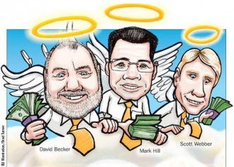

# 现代金融的左膀右臂

继上文（/archives/48102）。套利好似捡金块，捡了就没了。更多时候咱玩不过专业搞套利的人，于是如果想在金融方面赚些钱（或美名其曰为社会的资源配置作优化），有眼光的投资将是主要盈利方式，那么更为专业的金融产品知识您是妥妥应该知晓的。这个可以有！（对了，**有种神一般逆天了的套利方式：高频交易**，堪称“码农特供的金融游戏”）

### 天使投资、私募股权与IPO

假设你有一个绝世好技术，比如远程无线充电的零件，妈妈再也不担心我们找不到电源线了。这个技术几乎百分百能挣大钱，所以你心急如焚地成立了一家公司想尽快生产出来。可是这个零件需要有机器来生产，购买设备需要最少一百万投入。没关系，这种困境很多人都碰到过，所以**有一种人专门给别人启动资金，那就是—— 天使投资人**（前阵子有个大V上央视了，他就是这种天使投资人）。当然这“天使”并不是毫不利己专门利人的活雷锋，而是专门来分一杯羹的投资者。他们是现代金融中很重要的角色。“想法”只有与“资本”结合才可能完成创业，否则就将流于空想。白手起家的创业者和天使投资人和就是这两 种角色的代表。

于是天使投资人会和你商量各自占公司多少利益。分配的方式有很多种，比如“固定资产（设备厂房等）都归你，但未来公司收入都归他”等等。可是这时会有个问题，就是如果别人以后要参与公司，就会涉及到和所有公司成员从新分配的问题。**于是聪明的人类就想到了——“标准化”的分割方法，也就是“股份”，1股是1个基本单位**。比如一个公司一共发行1000股，那么也就是把公司分成完全相等的1000份，那么如果你持有300股，那么你就拥有这家公司的30%的所有内容，包括固定资产的30%，未来收入的30%，甚至是公司需要承担责任的30%，总之是完全按照整个30%的比例获得。

股份化有个极大的好处就是方便交易，和钞票一样，两张一百的人民币效力是完全一样的。新成员不用再和所有成员一一谈判，直接说定比例即可。而一家公司不公开地与他人或者机构完成股份分割与交易，那就是私募股权（Private Equity），与私募相对的就是公开地发行股票，也就是如雷贯耳的**IPO（首次公开募股）**，常常由上篇文章提到的投行帮忙发行。无论是私募还是公募，正是在**股权确定划分这一瞬间，其实完成了一件公司产权与钱财交换的事件，这是一个市场，叫一级市场**。比如于是你的技术占300股，而其他所有投资人投资了100万，价值700股，那么其实这里出现了一次买卖，100万交换700股，这就是一级市场。

### 股票二级市场

标准化了以后，股票是很容易分割与买卖的。有的投资人要减少比例，社会上有人会想参与投资，于是买卖股票的双方产生了一个交易价格，**这个买卖有价证券的场所就叫二级市场**。假设接下来你的公司不但搞出了无限充电器，还研制出了各种其他被社会需要的产品（可控核聚变，量子计算机等等），预期利润各种高，那么就会有更多人想要买你公司的股票，供求关系导致了股价上升。请注意，股票升值不一定是公司此刻盈利增多，而是未来收益的加权值变多。只要社会对该公司未来更看好了，股票就会升值。这个道理很简单，比如金价现在是250元一克，如果全世界都预期金价明天会卖到300元，请问现在金价多少？肯定已经升到300元了，因为套利者会不断买入，供不应求金价上涨，直至升到300为止。

我们心中要有一个牢牢的信念，股票的比例就是公司标准化后的比例，**一家公司所有股票的总值（也叫市值）其实就是社会对整个公司的价值估计**。你会觉得奇怪，经常看到一家公司明明一天之内没有任何的变化，但是股票价格也会显著起伏，那是因为社会对该公司的预期有波动，各式各样的政策和消息会让人们对该公司盈利预期有心理上的起伏。前阵子特斯拉公司（生产豪华电动汽车）的市值在一天之内蒸发十几亿，那是因为有一则新闻报导说一台特斯拉汽车无故自燃，导致社会认为这家公司不如以前靠谱。而其实这家公司在一天之内没有任何变化。

正因为股价是社会预期的反映，导致虚假消息或内部消息将对股价产生明显影响。在股市法规没有完善的时候，经常出现一些人用假消息或内部消息操控股价的事件，但是随着股市法规和监督机制的完善，这种现象会越来越少。

### 股票期权

本来你是公司CEO，一个决策失误股价大跌，所有其他投资者一致决定把你开除出领导层（这很可能发生，因为你只占30%股权），于是换了位新CEO来掌舵。但原来你的利益和公司利益很一致，公司每赚100万你获利30万，所以你全心全意为公司，但为了防止新的CEO拿着固定工资打酱油，**必须想个法子激励CEO为公司前途卖命，比较常用的方法是利用期权激励**。

期权（option）是一种比股票更加抽象的存在，但大家肯定都不陌生：小时候父母说的“如果考试满分，就可以吃麦当劳”，其实就是一种金融产品—— 期权。**期权，即一旦达到某种的要求，就能够行使的某种权利**，所以英文名干脆就用“选择 option”这个单词。期权的激励是很有效的，比如某公司股价现在30元，但是期权协议上写着，CEO有权以50元的价格购买10万股。所以CEO会很努力地让公司股价升值，如果股价只升到40元，那么这个协议就只是一张白纸，但是如果股价升到60元，CEO就可以50元买入十万股，然后在股市上以60元卖出净赚(60-50)*100000= 一百万元，且公司业绩越好赚得越多。经验告诉世人，期权激励往往比固定额度的奖金更能让CEO卖命。

期权有几个必知的有趣内容：**1，期权必须事先说明可行使股数**。比如上例中CEO只能以50元购买10万股而不是更多，但可以更少，因为期权只是一种权利，权利可以放弃。**2，期权是一种双方协议**，分权利方（买房）和义务方（卖方）。本质上是将股票的权利和义务进行分割。权利方（CEO）有权放弃，但如果行使权利，义务方（公司）必须尽义务按规定价格卖出股票。**3，期权分美式期权与欧式期权两种**，欧式期权规定具体哪天可行使权力，好比父母说“元旦那天奖励吃麦当劳”。而美式期权规定某天之前都可以行使权利，好比父母说“元旦之前奖励吃麦当劳”。当然，如果是严格的期权，父母应该说明奖励几次麦当劳（期权数量），你也应该知道你有权拒绝这顿麦当劳（期权可以放弃）。**4，期权可以转让，有价格，**于是有人买有人卖，便会出现一个市场。也就是说你可以把父母许诺的麦当劳转让给身边的小伙伴们，然后换张周杰伦新专辑什么的。全世界第一个公开期权交易市场1973年在芝加哥成立，可惜的是**中国至今没有公开期权交易市场**，说明中国的金融还有很大的发展空间。

之前所说激励CEO的期权，其实是一种**股价高于某值才会行使买入的权利，叫做看涨期权（call option）**。股票涨了的话看涨期权才有价值，购买看涨期权的人往往预期股价会上涨。而与之相对的是**看跌期权（put option），就是可以以某一价格卖出一定数量的股票的权利**。比如现在股价30元，期权规定可以以20元卖出股票，那么当股价高于20元，一个理性人是不会行使权力的，除非股价跌到了比如15元，那么权利方就可以在股市上以15元买入股票，同时利用看跌期权以20元卖出赚一笔。购买看跌期权的人往往预期股价会跌落。有个细节还请大家一定搞清楚：**看涨期权的买方不等于看跌期权的卖方**。这两种期权是两种不同的物品。

### 我不是CEO，关心期权干嘛？

这个问题就好像问投资有什么用？功用大了去了。当您的眼光比别人好，更能慧眼识珠，将会优化社会资源的配置，你调动的资源去了更有效率的地方，就能得到财物的回报奖励。而成功的投资往往需要有超越常人的眼光（至少是超越平均值），这也就是华尔街人士一天到晚挂在口中的：“战胜市场（Beat the market）”。而期权以及之后介绍的其他衍生品将会为大家消除不必要的风险。衍生品之于商业，就好像数学之于物理，工具运用得越熟，越能够在主战场得心应手。

让我们来牛刀小试一下。比如我以500美元的价格买了1股苹果电脑的股票，我这个人极度害怕亏损（有的人的投资策略就是这样），但万一股价跌到200美元我就亏大了，为了保本，我花了20美元钱在买股票的同时购买了1股苹果股票的“看跌期权”（就是我总是有权利以500美元卖出苹果股票）。不同公司期权价格不同，苹果公司社会预期跌的概率小所以便宜，如果是业绩不看好的公司，期权就贵，说到底都是供求关系决定的。于是当股价为800美元的时候我是纯赚的，当股价为500美元的时候我也没亏太多（仅仅亏了点期权的投入），当股价为200元的时候，我还是能几乎保本以500美元卖出，其实还是只亏了买期权的投入。于是有了期权的我不再“无下限”，而是成功地守住了我做人的底线，大成功！

终于我们进入初步踏入了金融衍生品的神奇世界，更多有趣内容还请品读本文之后续——**《现代金融的定海神针—— 期货与投资组合》、《现代金融的珍珠—— 对冲》以及《现代金融的钻石—— 高频交易》**，且容校长继续为大家庖丁解牛，奉上奇妙莫测的实战术~ 敬请期待！

**（采编**：张山骁；**责编**：陈澜鑫）
