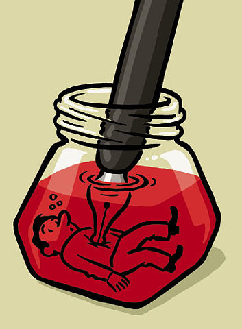

# 坚持，是不愿背叛过去

本科时候校报的学妹，坐一个小时公交车，从徐汇到虹口，请我看电影，用他们杂志社的媒体票。她说这是工作的唯一福利，她们杂志在上海媒体圈是出了名的抠。她比我有勇气，毕业后来到上海工作，租房打拼，在苏南生活优渥的家人们不支持，父亲说要和她断绝关系。工资很少，但是做的是自己爱的事情。是我们都爱的媒体。

谈了很久。其间她感慨，这个工作没有任何可取之处，除了喜欢。讲着讲着，眼眶湿了，谈到梦想这东西，我们都想哭。

她要写多少稿子，编多少版，要清样，管理微博……主编副主编如何发迹，又有多少前员工前赴后继辞职离开。

看《怪兽大学》，让我想起了本科时候，念书、社团、比赛的那些往事。看到大眼怪是如何没有先天优势，又如何努力地要去获得别人认可。他最终还是没有克服缺陷，但是走了别的路，依然坚持付出，最终殊途同归。

在黑黑的电影院，我几次抹眼泪。

无非是因为看到自己的影子。

这并不是一部励志片，它时时刻刻提醒，幸运与不幸，这就是我们的现在。不被认可的现实，奋斗至今尚未起色的人生，以及最终还是没有发生的奇迹。

但是他坚持，坚持到人生终有转机。

毕业时候，请我给后辈们做讲座的老师，当时送了我一盒茶叶作为感谢。老师给我的感觉是，很会做人，很得体。大三时我曾咨询她考研的事，她竭力劝我考去北京，“要出名，得去北京做新闻，上海有什么新闻？”而我，一直不是太有勇气的人，胆量也只够在长三角徘徊，于是选择魔都。以前只知道老师是复旦新闻毕业，年轻时当过很多年的电视记者，去英国念书，后来嫁得好，做生意，在苏城金鸡湖畔有湖景房，一路都很顺。有人说她给人的感觉就是：我也没怎样，然后就很成功。

后来听说，她当年毕业之后，没能留在上海，回到了东北家乡，很想当电视记者，但是没有门路机会，于是费尽周折去了家乡的小电视台，做通讯员。有纸媒愿意要她，她不肯去，一直很坚持电视记者梦。后来，台里有档新开的栏目，她毛遂自荐，做到了电视记者，再后来从小电视台到省台，然后去做生意，结婚离婚，再婚，生活富足，有三个孩子。她很坚持，最终也得到了她希望得到的东西。

学妹媒体公司的老总，最早靠一家杂志起家，是个理想主义者。虽然是做文化娱乐，但是他坚持杂志所有内容都是原创，不用水稿，不用网络内容，于是需要大量的采写工作。记者编辑们苦不堪言，但这也是新闻理想。

她之前实习的游戏公司，老总最早做实体行业，攒下的钱都用在游戏研发，坚持了七年分文未进，最终把游戏事业做到很大。也是一个理想主义者，做游戏因为老总本身热爱游戏，就算七年砸钱也要做自己喜欢的事业。

他们都是理想主义者，坚持想要的东西，很累很苦，很难熬，但是一直坚持，坚持到和你同期的人都放弃了，你最终就得到了。

 

想到一些很俗套的心灵鸡汤，奥普拉在哈佛毕业讲座上说，人生没有失败，失败只是生命试图从另一个方向推动我们，给自己一点时间，为可能失去的东西默哀，向每个错误学习，因为每一段经验遭遇，尤其是你的错误，都是在教你，强迫你进步，然后你才会知道，下一步应该怎么做。

夜晚，送她上了公交车。七月初回苏州见的在光明日报工作的学妹，说念书时候还买得起可爱多，工作后买个可爱多都会犹豫一下，有时想想就算了。今天学妹说，她现在买可爱多都不用考虑，肯定不买，工资太少。这一行克扣新人，因为有爱新闻爱媒体爱电影的年轻人前赴后继。

我们笑称自己已经是转了一圈又回到真爱的人，只有爱过，放弃过，再次爱上，才是真爱。尝试了别的，才知道最爱是媒体。她说佩服我一直都知道自己要的是什么，而我也试过政府宣传部门，就连同样是媒体的电视台，在纪实频道做专题片的这几个月，没有外出采访写作，我觉得自己是病猫，无精打采，浑身无力，脑子里只有推脱、逃避、消极，前途无望。

二十几年来的人生，曾有多个瞬间，想要放弃梦想。撑不住的时候不少，可是我最终还是站在了梦想的门口。如果不坚持所爱，我对不起当时那个苦苦奋斗的自己，对不起当时付出的辛苦、流过的泪、爱过的梦。有时候人们的坚持，未必因为期待未来，只是不愿背叛过去。

（采编：佛冉，责编：佛冉）
