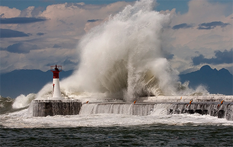
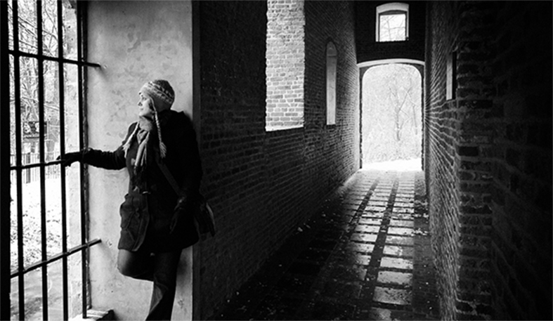

# 十八岁，寒冬夜行人

行人穿梭在疾驰的雨夜，路上看不到其他人，雨水把路面冲刷洁净，行人飞奔在雨幕中。

与往常一样，一个10点钟的会议在前方张开巨口，行人因此匆忙前行。毫无悬念，行人带着一身雨水冲进悄无人息的会场，与会人员转过头来看着他，像是不请自来的客人，又像是荒诞世界的过客。

穹顶底下，几十盏灯灼灼直视，场面上充满猜疑、快乐、矫饰以及什么也不代表的空洞。此刻，行人低下疾行的头颅，径直走向前面，端然踞坐长桌尽头。

这时候一切客人都到齐了，所有人回过头，主持人清除杂音，保持会场的静穆。所有冗余的声音消失在长桌尽头，他们从口袋里掏出打火机，镀金的外壳闪耀着光彩。按照会议的惯例，他们通常是点燃一根烟，发言者从椅子上退下来，烟雾飘荡到玻璃上折回，时间变慢了，隔岸的灯辉璀璨却遥不可及。

第一个发言者哆嗦几下，站起来，慢条斯理打开故事的开头。

故事起始于上世纪末的南京，五台山体育场下面的防空洞里，声音在沿着洞壁的裂缝回旋，年轻人的狂躁顺着潮湿的纹路扩张，在闷热的昼与夜。发言者所讲的是关于一个哨兵的记录，同样由哨兵忠实记录下来，然后再毫无遗漏转述给众人。当然，所有事物的发生都源于一颗种子，它能长出枝繁叶茂上的花朵，也可能根本就没有情节，始终在铁一样的规则下暗流涌动，陨于无形的损耗。这一切过后，哨兵埋首在故纸堆，打开沉默已久的废墟，发现所经历的过往和沟通，并不足以构成一个令人惊叹的结构。

故事是这样运行的，哨兵离开南京以后，坐轮渡到京口。遥望钟山，故国的悲伤并没有产生丝毫触动。那些影像在怀疑中反复折磨，大功坊前石子铺就成道路，新鲜出锅的泥人栩栩如生，玉京道人琴棋书画诸般精通，温润的气候经过莫愁湖畔，草色烟波一万里，双塘荷影浅入梦，钟山的植物几度枯荣，令人隔世而不知归路。如果仅是想象的产物，完全可以构架一个故事的产生环境，甚至可以超越其内容所在。然而事实上一旦接触则毁灭无形。哨兵在炽热的视野里面，没有观点足以表达。

很多类似的情况下，可以原谅哨兵的悲伤，他在脑海中一无所有。那些旧时的照片，儿时的情侣，每天晚上的作业本，离开时泪眼婆娑，以及上面端正又毫无内容的表达，确实令内心饱受摧残。在虚幻的故事中拖着步伐，唯一能做的是戛然而止，以便后一个故事能够让他从烦恶中逃逸。

第二个发言者随即起立，严肃指责第一个发言者的开头。

如果按照这个设想延续，即使所有人讲完之后，仍不能构成自圆其说的故事大纲，不仅读者无法阅读，逻辑纹路，如同大脑中疾驰纷飞的念头，从来没有一种方式能够表述清晰。现任发言者打算转换方向，改为一个魔幻故事。如前所述，哨兵经历此生无尽的曲折之后，终于在敦煌遇见此生挚爱。从大陆的南方行走至今，他遍历饥寒、枯竭、空洞无物，最后到达此地。当他满心幻想以此为人生的结局时，命运却赋予不可言明的机缘。

黄沙在空中组成沙幕，夕阳血红，扫射到黄金砂砾上，尘世已不复往日。他在人间尽其所能而惟一邂逅的奇女子，正在某个洞窟穷尽故纸堆，在古文字中寻找时间存在的证据，以及探索世界运行的意义。她被禁锢在这里，不能哭泣，也无法欢畅地笑，甚至不能翻墙爬树，刺花戴绣。历经的时间如恒河沙粒，她学会与每一种生物沟通，感受每一件事物的悲伤与快乐。但仍旧桎梏于此，不能哭笑也不能开心歌唱，不能像所有世俗的人啊，推车买菜，庸碌一生。

哨兵在明白一切之后，内心的喜悦和满足不能讲出来，也从未想过办法到达目的。在荒漠中奔跑的时候，他忽然和这座荒漠上的废墟血脉相连，车马、建筑、沙丘、飞雁，乃至过往的事情和未来的情势，连接成一张广阔的网，覆盖住这座城池。其间每一个细节的颤动，都将在他的身体中引发不可预估的联想。

哨兵既然已获悉意义所在，总会在某一天，发下宏愿与此生挚爱在俗世中相逢。他从大脑里每一条沟壑开始搜索，经过山川河流，温柔庄严，到记载这块废墟的古老典籍，从沙幕的缺口到残缺的壁画，因他已与三千世界命脉相连，不能计较失去的意义，也找不到见面的合适地点。

第三位发言者没有过多评判前两者对叙述造成的不利影响，照旧表达的不知所云。

既然此前所述未曾达到结局，在妄想的世界里，可以随意切换一种方式与她相遇。第三个故事中，哨兵坐在火车上，穿过华北平原，麦子已被收割，零星的秸秆向后疾驰，黄金头颅挂在破败的枝干之上。村庄仅是过程，他最终进入北京，以熟悉的手艺谋到一份生计。

哨兵开始行走在这座城市，他必须忘掉之前的恩义，重新找到另外的终点。比如在冬夜，他是一个旅人，路过尘世第一等繁华之地，绯色空气中弥漫，哨兵的欲望被激发出来，如同气球迅速鼓胀，醉酒后与女人调笑，睡着后走入渴慕梦境，天黑了去外面浪荡。心中烦恶和芜杂疯长，充满战斗的热情。这是另外一个地狱，奔流如大河，他来去如风。

但不知道持续了多长时间，有时候感觉快如刀割，有些时候的漫长像一条鱼钻出水面吐气泡。哨兵走进街市熙攘，抬眼望见那座宿命中楼台亭榭，错误地觉得自己已经抵达人生第三境。于是，在北方冬天的雪夜里，他穿上厚厚的鞋袜，潜行至此，楼台上灯火温暖，亲爱的朋友在闺房里面静悄悄。哨兵攀爬上围墙，准备闯入那未知世界之时，另外的哨兵端起步枪，枪声在寒夜里响起，令夜行人为之侧目，子弹呼啸而来，准确击破气球，鼓胀的欲望一瞬间消失殆尽，如同一张空虚的皮毛骨肉，从围墙上跌落下来。

第四位发言者沉吟良久，雨已经停歇，夜幕开始泛白。

关于故事，不是记录过去和描述现在，人们通常在此刻已决策其未来。不可能出现的情况是，哨兵站在尸骸遍野的战场上，仓皇四顾，天地间仅剩下独自一人。他恐慌急了，在城市中奔跑，死于无人相送的站台。假设哨兵有两千万，他并不会想去开个网吧，或者小酒馆里的台球桌，或者星空下的蓝与静谧，那究竟有什么不得不去做的计划，在座的人也实在无从得知，在座的人都是世代相传的仇雠。

哨兵在垂暮之年的时候，握不住枪支，像个农夫一样在地里耕作。孤单的人在田野里缓慢前行，与一头老黄牛相伴。稻米割掉一季，长出第二季，他亲手点燃的火焰烧掉深山野林里的荒草。当春风绿过瓜州、京口、金陵的时节里，再度肆虐一个季节里粗生粗长的植物和一望无际的沃野。寒冬时候，劝他喝下一杯白酒，以至轻易进入沉沉睡眠，也有可能远走高飞。

还有最后一个问题，第六个发言者举手提问。哨兵的两千万究竟做了什么，因为毕竟在整个环节中如此至关重要，它们曾经结束了整个虚妄的故事，毁灭了所有的猜疑、苦楚、饱满，以及每一段离别。

第五个发言者长身而起，以沉默回敬对以上五位发言者的无聊。

“我想说的是，我永远都没有什么想说的。”

各自发言完毕之后，人们注意到，哨兵从虚空中组成形体，头颅、肝脏、四肢，乃至血管都清晰可见。几十盏灯虎视眈眈，以至于哨兵最终无法组成人性。于是旁观者听见哨兵的怒吼，从每一个毛细血管中爆裂而出，但总之是源自虚妄的产物，不能具象到足以攻击每一个人。怪物可笑的模样，在隔岸璀璨的灯火中如同目睹一场赛凡涅斯的话剧，哨兵在发泄完愤怒之后，看到众人眼中促狭的笑意，冷静下来，断然放弃得之不易的四肢、头颅，和每一个细节，重新隐入到虚幻之中。

众人在虚空中听见，哨兵提起枪支，将子弹上膛，向端坐在长桌尽头的行人瞄准，打算一击致命。

“如果未来有一天，人开始用脑电波直接感受沟通的障碍，或许交流时记下的文本，是你这样的。”他起码把每一个蜘蛛网上的点，叙述为一个可以读下去的、舒服的想象。当人类开始用脑电波沟通的时候，而不是阅读这种文本。

你看，这次只设定一个读者。

但是，“你他妈你现在就混到和他妈大学生比这个了？”但是，“但你比他们累。”

举目见日，不见长安。

(采编：薛晨如；责编：王卜玄)