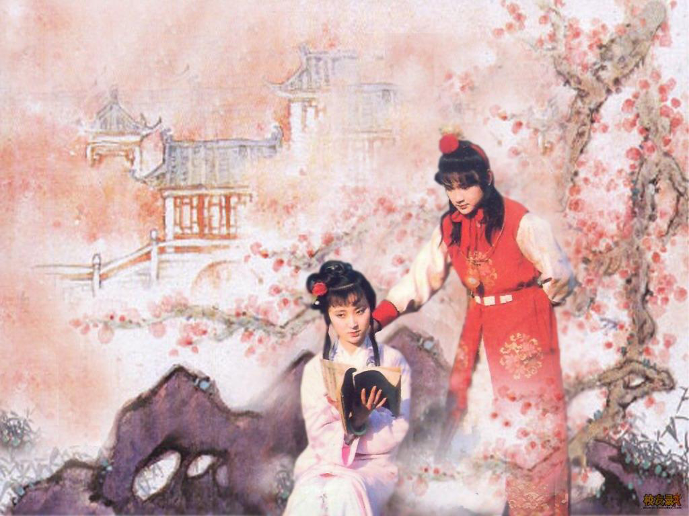

# 大观园事变

如果要为故事选一个开头的话，探春会认为一切始于宝玉他们偷偷溜出去纹身的那天。当时王熙凤在宁国府帮忙，探春暂时接手当家。那个晴朗的下午，紫鹃禀报说，三个主子要去看《那些年》首映。探春被这个拙劣的谎言逗笑了，谁都知道黛玉一向不看主流一线电影，他们无非是想去参加游行而已。但探春还是准了他们出去，又派了侍书暗中跟着。侍书远远看湘云跟着宝黛钻进一条阴森后巷，许久不见出来，于是拍了照片传给探春。巷子中只有一家破旧的小店，紫色的霓虹照片上闪烁着两个字“栊翠”。

探春看了照片，打电话给刺青店的女老板：“是不是太迟了？”

妙玉轻笑：“早都搞掂了。还是你要我一个个再给他们洗掉？”

算了吧，探春说。她想起妙玉店里满墙杂乱的电影海报，永远不停的黑胶金属乐，还有妙玉自酿的，用生在火山上、以雪水灌溉的啤酒花酿出的鲜啤。探春曾扪心自问，如果那天她戳破那个小谎言，故事可会有不同发展，但算了又算，终于发现世事变迁根本不在人的一两个微弱选择之中。

“刚开始的时候，我们的心情，就跟你们现在去音乐节一样。”而当她坐在泽西城星巴克里，面对那几个从西海岸坐了很久的车，慕名来访的留学生时，则是这样开始对话的。留学生们茫然地瞪大双眼。虽然后来的故事不堪至极，但那年的金陵，确实是探春印象中最充满希望的金陵。贾府这种家庭的孩子，将来都是要出国留学的，所以都在国际学校接受英语授课。就连黛玉在进贾府前那段苦日子里，也宁愿和普通人家的孩子一起，去报名参加语言培训机构的夏令营，都不曾中断英语学习。英语培训营的老师贾雨村对黛玉照顾有加，后来还凭此还攀上贾府关系混进公务员队伍，在兵部一个主事的手下打杂。

在黛玉三言两语的回忆中，宝玉对年轻学生的群居生活产生了兴趣：那些人参加社团活动，唱K、三国杀、真心话大冒险，在学校树林里接吻，舍友组团打DOTA打通宵。王夫人拗不过宝玉任性，最终大观园的孩子们浩浩荡荡地参加了一个月的英语培训营。历史学者们称那一个月为“关键的转折点”：沉默寡言的迎春重蹈自己丫鬟的覆辙，谈了一场悄无声息的恋爱，惜春认识了一群艺术生，迷上了现代画派，探春则在那么多年中，第一次真正呼吸到自己生活这座城市的空气。她感叹说，一个月就足以策反一群年轻人；而黛玉答道，只消一秒就够了。

在极权的阴影之下，探春看到贫穷的青年们在群租房里创业，在办公楼里挣扎，在艺术区绘画摆摊，在郊外拍微电影，在租来的小店铺中开读书会、搞网络杂志，讨论约翰·密尔和哈耶克，讨论卡夫卡和博尔赫斯。城市中的野生青年，有的在崛起，有的在垮掉，在高楼林立中青年们捕食、性交、斗争、训练、嬉戏、创作，车水马龙之间埋葬着青年们的尸体。他们叫人喜欢或厌恶，但每一个都很有趣。所以探春后来反问那帮面面相觑的留学生：“那里有帐篷和吉他，诗歌和笑声，有年轻男女和理想主义，这难道不是和音乐节一模一样么？”

“我们以为当时气氛应该是很愤怒，很紧张的吧……”

“至少最开始的时候不是这样的。哈维尔《故事和集权主义》读过吗？昆德拉至少读过一点吧？文学，艺术，幽默，本质上统统都是反极权的。”

学生们开始在广场上聚集的时候，探春正好接管了病中王熙凤的家务，再加上之前在培训营的放虎归山，在广场上扎一个贾家帐篷似乎顺理成章。宝玉从小被元春带大，耳濡目染，本质上是个自由主义者，黛玉这种文艺女青年更不用说；香菱当时正让黛玉教她欣赏非主流音乐，于是也跟了过来；湘云不知从哪找到了个港媒实习生的职位，天天藉口“体验式访问”在帐篷里呆着；探春不放心他们，自己内心又是想来的，于是就默许了；迎春和惜春便也随大伙来了。

最叫人意外的是宝钗。薛家刚进贾府时，宝钗和黛玉火星撞地球的场面至今为世人津津乐道：欢迎筵席上，宝玉看见这神仙一般的姐姐，乐得合不拢嘴，待一众长辈退席，他便唤小厮取出上等红酒。宝钗忙张罗着拿出雪碧勾兑，俨然一大方得体的女主人；惟独黛玉嗤笑说，红酒兑雪碧，是把好物变贱，不识货的才这么个喝法。席间一阵尴尬，宝钗倒微笑说了句妹妹说得是。直到探春当了家，才明白宝钗为什麽要那么喝：外出应酬时，兑饮料让女士没那么容易被灌醉，而把倒饮料的责任握在手中，就掌握了喝多少酒的主动权。

探春以为，宝钗一定会反对扎帐篷，没想到她什麽都没说。对此事的态度，宝钗仅曾模棱两可地对探春提起一次：“有没有想过，为什么古往今来的反专制运动，都有那么多贵族青年参与其中呢？这真是个有趣的议题。”后来某些夜深人静的时候，探春总陷入对宝钗态度的疑惑：她几乎没有受到任何影响，成了畅销言情小说作家，到处签售，加入作协。探春知道自己应该为宝钗庆幸，但她读宝钗的书，看宝钗的访问，宝钗透出那种置身事外的淡然让她难受：大家的青春都于此断裂，人生留下了难以抚平的伤疤，世界观都有所改变，甚至无法面对对方，但对宝钗而言，这件事彷佛没有发生过一样，她还是以前那个温润的大小姐。探春甚至怀疑，从一开始，她就没有真正和大家站在一起过。

最初的广场有点古希腊公共舆论场的味道，青年们轮流演说，讨论卢梭和孟德斯鸠，另一群青年做着笔记；黛玉凭着过人的才情，很快就赢得一众粉丝。青年在出发前写下遗书，压在枕头下，一起呼喊口号，标语挂满了朱红色的宫墙，他们向朝廷要求宪政和法制，要求言论自由，要求选票和监督，英雄主义洒满一地。

没有活动的时候，他们几个就聚在帐篷里做些文艺游戏：海棠花开时，他们成立了海棠诗社，轮流赋诗，林妹妹依然一骑绝尘。后来不少收藏家高价收购黛玉最后的作品，但诗稿都在贾家被抄时遗失殆尽。宝玉和黛玉在闲暇时一起读威廉·叶芝，笑谈这个男人总是一次又一次地爱上搞民运的女人。香菱追着黛玉要推荐音乐，黛玉放了首Radiohead的《creep》，香菱惊呼：“这不是苏打绿唱的吗！”众人皆笑。黛玉说：“你先单曲循环，什么时候觉得他们唱得比苏打绿好了，我再给你推荐别的。”

政治诉求还是当时的第一诉求，但青年们已经不满足于此了，在音乐节一般的集会中，他们已经在讨论灵魂契合的恋爱和性自由，个人主义和追求梦想，信仰正义和不迷信父权礼教了，他们不仅要在政治方面有所收获，更要撕开社会价值观一个口子。

在探春记忆中，快乐到这里就戛然而止了。

朝廷正式通知贾府之前，元春病亡的消息已经在网上传开了。“贾元春”和“贤德妃”在微博上都是违禁词，于是网民编了好多暗语，什么“凤逝”，什麽“朝中再无贤，世人再无德”。贾府几个上网的年轻人早就听到了风声，忧心忡忡却也碍于教养不敢造次，香菱曾慌张地拿着微博给宝钗看，被宝钗一句“不要造谣传谣”压了回去。正式宣布那天，贾府上下哭成一片，长辈们都晕倒了几次，犹如渐沉的轮船。探春当时忙于和凤姐一起料理家事，几天后才知道元春的死同样令外界氛围骤变：学生们相信体制内最后的改革力量死去了，他们称元春为“自由母亲”，手捧她的遗像，宫墙上贴满了她的悼文，甚至有阴谋论认为她的死有蹊跷。音乐节一般的气氛早已消失，悲壮取而代之。宝玉被这种悲壮感染，家中的仪式一结束就马上怂恿姐妹们回到帐篷里，似乎这是他追思元春的唯一方式。场面随之陷入僵局：朝廷似乎放弃了谈判，不再去理睬呐喊声，学生们精力消耗，蓬头垢面，宛如无头苍蝇，却愈发悲壮，喊出了更激进的口号，又开始绝食。网上传言朝廷将出兵镇压， 但没有人愿意相信。

没有人愿意相信，直到最后一夜。

至于最后一夜，帐篷里发生了什麽，当时在场的生还者都三缄其口， 只有平儿在接受记者访问时略提一二。王熙凤当时已经下不来床，但是她听见窗外的枪声和哭喊声，连忙打开电视，只见一片腥风血雨。她在病榻上仍不忘贾母的临终嘱托，叮嘱平儿一定要让宝玉平安回来。宝钗接完平儿打来的电话后，突然走到宝玉面前，一字一句地说：我现在开始就出去，走遍全金陵火力点最集中的那几条街，迎着火光最盛的地方跑，直到你肯出来跟我回家为止。她的眼神是如此坚决，没人会怀疑她在吓唬谁。话音刚落宝钗就跑了出去，留下一帐篷目瞪口呆的人。

宝钗真的是向着火光跑去的：她穿过“孽海情天”巨大牌坊，路过痴情司和结怨司的府邸，枪林弹雨把那里点燃得如同白昼。一路上她经过了很多尸体和惨叫，但这些仿佛都与她无关，她只当自己在做一个大游戏。金色枪火在眼前闪烁，如发光的蝴蝶迎风蹁跹，宝钗一心追逐着蝴蝶嬉戏，竟逐渐兴奋起来。在夜梦司的匾额下一颗子弹擦着她的左腿飞过，在薄情司对面的转角处她被一阵爆炸后的气浪冲击在地，就在那个时候宝玉扶起了她。
　　
“宝姐姐你这是何苦！”

“我只是想让你看看，我也可以不计后果。”

多年以后，探春应邀到普林斯顿大学演讲，讲座结束之后，晚宴开始之前，她在大学图书馆里消磨时光，竟然查到了一本薄薄的中文小书，书名足以令她瞬间眼泪夺眶而出：《海棠诗社集》。这本书里面有他们所有人写过的每一首诗，仔细纪录了主题，年份，作者和注释。在图书馆记录中，捐赠者一栏写的是“蘅芜君”。那一刻，她才真正肯定，这么多年来，宝钗一直跟大家站在一起。

红学家们还在争论，如果当时黛玉也以死相逼，要求宝玉留守，宝玉会如何选 择。但这个问题前提就错了，黛玉当然不可能这么做，任何陷入爱情的自由主义者都不会这么做。当时的情况是，宝玉马上扭头无助地看着黛玉，绝食中的黛玉已经相当虚弱，这个平时的醋罐子盯着宝玉良久，突然笑了出来，说：“等你老态龙钟的那一天，如果你像阿里萨一样开来一艘挂着霍乱旗帜的船，诚挚邀请我的话，我应该会和费尔米娜一样，毫不犹豫地上船的。”这显然毫无疑问，因为黛玉从来都比费尔米娜勇敢。听了这句话，宝玉犹如吃了定心丸，马上转身追了出去；若不计外国记者偷偷运出来公布的录像带，那应该是黛玉留给宝玉最后的影像。

那时候风暴眼中心的学生，已经知道大军正在向广场汇集，一路死了很多人，但内心的恐惧被壮烈淹没，久久不愿撤去。朝廷派去兵部高官和学生谈判，黛玉作为代表之一前往。当她看到那个官员熟悉的身影时不禁一怔，气若游丝地挤出两个字：“老师……”

贾雨村看到黛玉时也一惊，很快便反应过来广场上肯定有一顶帐篷是贾家的。

他代表朝廷提出，只要学生在寅时之前撤出广场，那么广场就不会开火。学生们讨论一番后同意了这个要求，而就在黛玉走出门，和贾雨村擦肩而过时，他在她耳边低声说：“我并没有说广场以外的地方不开火噢。”

迎、探、惜三人，湘云和香菱在帐篷里等到黛玉回来，六人牵着手逃跑，却在枪声中失散，从此探春没再见过湘云之外的其他人。一位年轻的小说家这样分析：先走的宝钗大概救了宝玉一命，却令他陷入此生的大劫。当晚贾府就被抄家，贾家人的通缉令都在网上发布了。惜春第一个回到大观园，也是第一个被捕的，面对突然破败的家和拷在脖子上的枷锁，她一脸木然，彷佛这一切与她无关，因为她此前拖着迎春的尸体走了两个小时。宝钗得知宝玉被通缉，知道大观园是断然不能回的了，薛家应该也不安全，便让宝玉去妙玉的店里暂避，她自己先回家看看家人再去会合。整个金陵天翻地覆，薛蟠竟浑然不知，他喝着酒看完一场英超联赛之后便呼呼大睡，宝钗伸手去拉他，他还在半梦半醒间推开，嘴里嘟囔着：“别闹……”

宝钗扬起胳膊，把一夜的火气都集中在右手，狠狠地抡了薛蟠一耳光。“香菱死了！”

薛蟠猛地捂住左脸，睁大眼睛，久久说不出话。宝钗终于瘫在地上，哭了起来。

探春在平民家中躲了几天，联系上一个外媒摄影师，一番辗转后直接前往美利坚，余生再也没能踏上故土；惜春坐了8年牢，出狱后在金陵开了一家小书店；湘云在次日一早作为港媒第一批撤回香港，此后多年，她着了魔一般地走遍世界，探访每一个亲历者，出了一本又一本关于大观园事变的书。她写过一个学生因为绝食晕厥被送院抢救而避过一劫，后来成为了体育记者，再当上微博著名公知的故事；还有一个真的去搞音乐节产业，年复一年地用快乐复制当年的场景；却惟独没有提及任何关于她自己和贾府中人的经历。

至于宝玉的遭遇，流传于海外网站的野史曾简单提及。妙玉的纹身店因为办过读书会和公民聚餐，已经自身难保，宝玉一去是正中下怀。他被押送到狱神庙附近时，贾芸夫妇前往探视，而官吏据称是被北静王打了招呼，竟然让贾芸带着宝玉成功潜逃。宝玉辗转流亡台湾，和湘云只隔一两个小时的飞机，但他和故人全部断绝联系，从此隐于世间。探春非常了解弟弟，知道他对黛玉的失踪永远无法释怀。

大约在大观园事变一年后，法兰西的传媒流出一段震惊世界的影片。那个大胡子鬼佬记者为了躲过离境时严密的搜身，把录像带打包好几层，绑在客栈茅房的屋顶，足足一年都在祈祷上帝希望它不被发现。一年后客栈所在的那片地被划为工业园开发区，不愿搬迁的住户先是在庭院里发现蛇和蝎子，然后遭到了恐吓、殴打，大胡子发现自己不能再等了，于是在客栈被夷为平地之前，赶回去把录像带救了下来。

在那段1分钟影片里，黛玉背对镜头，身着一袭白裙，手上提着粉色的花囊，歪着头立在画面的左下角，游魂一般的瘦削身姿，挡住了一整条街的坦克龙。为首那辆坦克把炮口对准了她，仿佛在扫描她是谁。黛玉这时却舒展身体，不紧不慢地独舞起来。

坦克龙想绕过她，向左扭了扭头，她一个踏落花动作旋了过去，娉婷步履，摇曳生姿。

龙又向右转去，她一个倚花锄的姿势飘到炮口前，霓裳渺渺，仙影难随。

龙被阻挡了前进的脚步，左右两难，好生尴尬，她旁若无人，蕙质兰心。

舞蹈到了高潮，黛玉一手探进花囊，决然地向天一扬。漫天花瓣纷纷扬扬地撒下，洒在坦克龙的身上。

影片到这里戛然而止，没有人知道她的死活，但那个景象成为经典的历史画面，每个纪念日都被人重发、回味，人们猜测她的身份，“枪口下舞蹈的女孩”和“洒在坦克上的花瓣”是嬉皮们的诗歌里最喜欢的意象。那段舞被谱了音乐、配上歌词，但没人考证过舞曲的真名，探春是为数不多的知情人之一。她在大观园花冢、在英语培训营都看过这段舞，甚至能随着镜头里黛玉的舞姿唱出其中几句：“花谢花飞花满天，红消香断有谁怜？……侬今葬花人笑痴，他年葬侬知是谁？……”

“我一直没打听到她的消息，不过黛玉的话，那时就死了对她来说也许是最好的吧。”手捧一杯摩卡的湘云轻描淡写地说。年近40岁的史湘云一头短发，颈上还带着那只和宝玉那只组成一对的金麒麟，跟对面那几个留学生看起来简直一样青春，岁月几乎没有在她的身体上刻下任何痕迹，随性地穿着少女才会穿的吊带背心和短裤也不显突兀。“跳葬花吟的时候，难道她不是已经把自己埋葬了？我总觉得，她在那时就已经把我们这群人也都一并埋葬了呢。”

“其实我一直想问你。”探春说，“那年你和宝玉、黛玉，偷偷跑到妙玉的店里，都纹了什么图案？”

湘云笑了笑，侧过身子，稍微弓了弓背，露出腰臀之间的部位。

“自由即奴役”。

“我纹的是第二句。”湘云说。

“噢，那我终于知道他们俩纹的是什么了。”探春说。

(采编：薛晨如；责编：王卜玄；)
