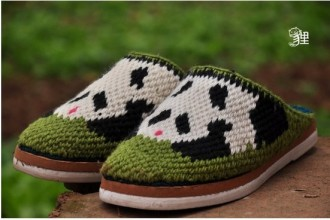
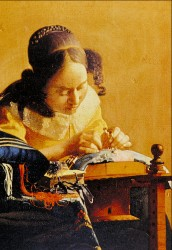

# 一双线拖鞋

五年级还在村小上学，离家不到两里地，春夏秋都可以光脚丫。春天踩着油菜花瓣，夏天踩着滚烫的硬泥路面，秋天冷，但雨后也得光着脚，挽起裤腿，踩着路边的野草，相对于湿软冰冷的泥，野草是温暖的。鞋子是有的，但不能穿，等走到学校找一水洼，水面还没平静，水里悬着泥像受惊的鱼搅起的，也像墨水滴进清水里，只是这水是浑黄的。洗洗脚，从斜跨的书包里掏出布鞋，穿上，舒爽温暖地开始念经般早读。

布鞋是外婆、奶奶或是母亲纳的千层底，母亲有忙不完的农活，外婆和奶奶的服务对象又太多，难得轮上一双，所以得爱惜。那时的鞋没有轮胎底，因为拖拉机都少见，在鞋帮上免上一层白布，把千层包进去，算时髦的。

冬天是雨靴和布鞋的组合。胶靴防水，但里面只有一层薄布，脚放进去跟落进冰窟窿一样，而鞋垫跟小轿车一样稀罕。但什么都难不住智慧的农民，挑新鲜干净的稻草杆子，来回折成脚的长度，塞进雨靴，跟鞋垫一样好使。

稻子收割后，脱去谷粒，稻杆扎成捆，一捆捆又围着一棵树、电线杆或是自家立起的木杆，层层堆叠，冬天的柴垛就有了。柴垛是老鼠们的天堂，它们在垛子中下层做窝，等取用到这些位置时，只剩下满是鼠屎鼠尿馊味的一团窝，小老鼠都已跑远。柴垛是孩子们温暖的支柱，要是雨靴里进了水，拉出稻草鞋垫，再从最近的柴垛里抽一些干净的，又是一双新垫底。

柴垛的腰部经常缺个大口子，口子的高度跟路过的孩子差不多高，鞋垫是费不了这么多的。六年级以后都是去镇小上学，四公里的路对于短腿贪玩的孩子来说，要走一个小时左右，七点半要早读，冬日的早晨需摸黑出门，家境好的有手电，那种用一号电池，身体亮晃晃的。家境相对好的用纸壳子（纸箱子），拆下来一块，卷起来手电那么粗，在灶塘里点燃，冲出家门，留下一串烟，像喷气飞机，停下来时，纸壳子就呼呼地冒着明火。最不济的就用稻草，出门时抱着一捆，一把接着一把燃，一捆是不够的，因此别家的柴垛时常遭殃，但不曾有柴垛的主人出来骂娘，或许他们都教过孩子，用完后扯别家的就行。骂娘的事也会发生，常有调皮的孩子将整个柴垛点燃，主人家就会掐好放学的点，站在垛子旁，骂那个调皮的龟儿子，他仙人的板板也不保的。

半胶球鞋似乎是与充电电筒同时出现的，但都需要购买，这时的家长都将注意力从土地转向了城市，钞票变成一张张汇款单，送进每一个家庭，顷刻之间什么都能买到了，越来越多的孩子骑自行车上学。年底能否有一身帅气的新衣服，全凭那一张烙着成绩的通知书。

母亲早已把学会木活的父亲赶出家门，让他去赚钱，自己却坚持留在家里，她说没爹妈在家孩子太可怜。正因为她在家，我跟姐是没有自由的，连看神龙斗士、葫芦娃、雪山飞狐、新白娘子传奇、西游记都要一次次请假，想要电视是门都没有。而我们家的第一台彩电，按她的话讲，村里最好的，当时我已经上大学。

北京的生活，品质而时尚，不穿个牌子简直无法出门。母亲比我更早地意识到这一点，把我和姐赶进大学后，便只身前往深圳打工了。由于上班时间固定，有了闲暇的时间，她开始给一家四口织毛衣，那时我是不穿的，慢慢她也失去了毛线活的兴致。

一夜之间，四川人开始流行毛线拖鞋、毛线鞋，她不会，试过，织出来不好看，于是趁春节在家跟邻居换工，换回来一双青绿色的毛线鞋，轮胎底的，在家穿过几次，带回学校就搁起来了。

前年春节，回家，匆匆的几日，那时自己遇到感情问题，整天惶惶然。一天爬完山散心回来，见她对着一个骄子烟盒反复看，“妈，爸不抽这么好的烟啊？”“问何二娃要的，我看盒子上的熊猫好看，试着织出来看看，这样拖鞋时尚好看。”“……” 之后的几天，夜深得寂静无声时，父亲和母亲的房间灯还亮着，父亲打着鼾，时不时说几句梦话，她还当真地聊着。 

临回校时，一双绿面、蓝脚面的线拖鞋已经织好了，上面两只骄子牌熊猫极其标致，“妈，你又不会画，怎么织的嘛？”“一针针数啊，什么颜色织几针。”

前几日给她打电话，父亲接的，“妈呢？”“她忙得很呢，吃饭的时间都没得老。”后来问她，原来春节时跟她说去年的三双鞋垫出差时都磨损坏了，她在给我做新的鞋垫。

（采编：万若涵；配图：季节扬；责编：刘铮）

[ 【母亲专题】妈，亲一下 ](/archives/32554)——“母亲突然发现自己得了急性脊髓性白血病，打乱了全家人的生活步调。在一家三兄弟轮班的医院照料时间，九把刀重新回顾检视从小到大关于母亲的点滴回忆，记录下了温馨感人的陪伴过程。” [【母亲专题】万婆](/archives/32634)——“关于久病床前无孝子，最残忍的不是儿女的孝心被繁琐与负担越磨越薄，而是老人在孤独与病痛中积起厚厚的自责与谅解，在对儿女的思念中设想他们忙的理由。” [【母亲专题】王晓华](/archives/32672)——“王晓华只是温柔而平静的说：‘对啊，人死之后，什么都不知道了，什么都看不见，什么都听不到了。’好像这根本不是一件值得害怕或者流泪的事” [【母亲专题】葬礼](/archives/32787)——“在最苦难的年代，老人让小孩活着成人便是巨大功德，完全可以不选择饿着肚子赶孩子去念书，不选择用肌体健康来换地里的粮食。我们到过的很多地方老人一辈子都没到过，看过很多书老人一辈子都没看过，但我们会要用一辈子去学会老人的极端坚强、极端勤劳、极端的爱。”
