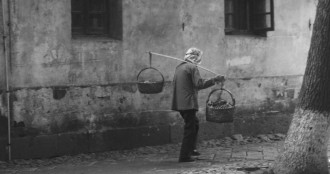
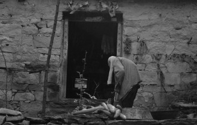

# 万婆

当万婆终于发现真相时，她不再不由自主地流泪了。既然她不能和这个年轻人生活，那么她便去找她的儿子。

而这个年轻人无论如何也想不到她竟然有如此的勇气，最终留给他的是一连串的惊叹号！

********

万叔是万婆的儿子，万叔的老婆是万母，还有一个女儿是万女。这的确是不顺当的一家。

万叔是真的没什么技术，为了一家生计，在万女还极小的时候，万母，不得已出去打工。万叔则在家附近做一些零工以糊口，欣喜地等着媳妇寄的钱回来。可自从万母出去以后便再也没有任何消息传回，但万叔始终还是抱有一丝希望，觉得万母定会回来的，即使不回来，寄钱回来也是好的啊。

以前一直是万母执掌着这一家，万叔一切都听她的安排。万婆也是按时地起床，吃饭，有什么活就帮万母做一下。每天早上万母把万女打扮一番，便领她去学校，再到菜市场顺带把菜买回来。万婆总是老远就接过她手中的菜，坐在门口便开始摘起来。偶尔遇见过路的人也会聊上两句。饭后也会洗碗。扫地之类的小活当然也是她包了。

生活极其的平淡无奇，日子悄无声息地一天天的流走。

要是日子就这样走到了尽头的话，估计万叔也没什么好回忆的，然而生活不愿人的一生那么的平静，为了让人有所回忆，它总会制造一些波澜。

最初的一点水花是由万婆的病激起的。

可能到现在万叔也说不出来万婆到底得了什么病，只知道医生说了一大堆话，唯一听懂的就是要长期吃药，后期还得有人服侍。医生还说，人老了，谁没个病嘛！

这样以来，万婆不再是劳力的输出了，反而是药品的输入，对于万家来说，更重要的是药是要花钱的。

水花激成水浪，不能维持这个家的万母决定外出赚钱，谁也没有阻拦，没有比他们自己更清楚他们的生活了。万母就这样离开了家，离开了自己的女儿。当女儿问她什么时候回来时，她说，很快就会回来的。这句话万叔也听到了，很快就会回来的。

日子一天比一天困难，万婆的药也停了。为此她并不抱怨什么，其实她心里在想的是万母什么时候回来。她知道，万母一定是因为自己才离开了，如果万母不回来了，那么也一定是因为她。她有时怪自己为什么要得病呢？但是正如医生所说，人老了，谁没个病嘛！

自从断药后，万婆的身体就更加不行了。病情最重的要算是眼睛了，现在已经什么都看不见了。每次取东西，都得叫儿子帮忙。起初还跑得挺快的，不是话说久病无孝子吗，久而久之，便拖拖拉拉，能赖过去的就赖过去。 

万婆觉得这个人越来越不像她儿子了，她儿子怎会不顾她呢？有时她甚至会想，面前的这个人不是她儿子，只是她不认识的一个人。

又一次万婆叫万叔给她倒杯水喝，万叔说，这么凉快的天还喝水啊。其实此时已是夏天了，烈日把树都晒焉了。而万婆呢，到现在，如果不是渴的不行了，也不会使唤她儿子的。她知道儿子不乐意了，但她还是又叫了一遍。刚说完，就听到儿子的吼叫：“你就知道喝水，你不知道喝了水还得撒尿吗？还得叫我！”也许第一次听到儿子这么大声地对她说话，她还不愿相信，“儿子，我看不清外面是谁在吼呢？”只听到回声“谁、谁、谁，就是我！”说罢走过来倒下杯水，哐的放在万婆旁边的凳子上，便转身出门去了。万婆只听到水杯放在自己的边上了，但具体在哪也不知道，便用手去摸。东摸西摸，反而碰倒了杯子，开水刷的一下倒在了她脚上。万婆连忙把鞋和袜脱下。怎么也不会想到，人老了就是这样吗？她还在想刚才那人是谁，她越来越肯定了，那肯定不是她的儿子。她儿子怎会这样对她呢？一定不是的，不是那个曾经在她怀里吃奶的孩子，眼见为实，一定要亲眼看见才相信，不然就不是。但不知道为什么眼泪不止地往下流，滴在开水烫过的脚上，竟还带来了一丝清凉。

后来万婆每一次要东西都会伴随着大声的抱怨，直至后来夹杂一两句的谩骂。每次万婆都会不由自主地流泪，但眼泪滴在身上又给她在炎热的夏日带来一丝清凉。

********

而万叔呢，还在等他的媳妇。要说之前他对万母的归来还抱有一丝希望的话，那么在这场洪水后，那仅存的一丝光就在无尽的黑暗中消失殆尽了。

夏天的一场暴雨过后，河水溢到河岸上来了，流到万家里面。于是万家三人开始迁徙，万叔背着万婆，牵着万女，在齐膝的水中艰难地走着，边走边骂天。而万婆全身也都被淋湿了，这是一个夏天以来她最凉快的时刻了。之前那些眼泪怎么也抵不上这盆泼的大雨来的爽快，着实让她好好享受了一回。

终于在水退后他们回到了家中。万叔也收回了之前咒天的话，因为很有可能万母会在听说了水灾以后回来看看，那到时老天可是帮了他的大忙了，还得感谢老天呢！只是左等右等都不见万母的踪影。当回来探家的人又准备离开的时候，他才发现万母是不会回来了的。这一切，不都是因为他那害病的老母吗？从此，他对万婆更不像话，每次取东西的时候都会骂上一番，万婆也每次都会不由自主的流泪。她永远也不会相信身边这人就是她曾经可爱的儿子，但是她的儿子又到底去哪了呢？这个问题在每次流泪的时候都会不自觉地冒出来，愈加困惑。直到有一天，一个大胆的想法出现，她才有所眉目。她的儿子已经死了。为了怕母亲孤单，身前的这人是儿子死之前找来的代替品，只是他并没有成功地扮演这个角色，被老母轻易地识破了。

这下她的心里居然还有所宽慰了。她很快就决定去找她的儿子。怎么找呢？当然只有死去以后才能见到他的儿子。她见到儿子后，还要对儿子说，他找那个人演技太差了。

她最后一次使唤身边这个人了。以前是低三下四的求他，可这一次，万婆突然就有底气了。她对他说，这屋耗子多，要他买点老鼠药回来。起初他当然是不同意，不仅怕跑路，还怕花钱。但这次万婆是下定了决心的，什么也不能改变。最终拗不过她，他只好去买了老鼠药回来。万婆又一次感叹，儿子找的这个人也太不靠谱了吧！他整天不在家，又岂知道其实这个屋里根本没有耗子呢？

午后，她躺在藤椅上，一手拉着孙女的手，一手捏着老鼠药，一把喂在嘴里，水也不要了，嚼都不嚼，就咽下去了。万女问她在吃什么，她说是药。万女问是什么药，她说是治病的药。过了一会儿，黑暗中突然出现了一丝光亮，越来越亮。周围的一切逐渐变得清晰起来。她逐渐看清了身旁的孙女，原来在她看不见的这段时间，万女都长这么高了啊！还有她的儿子也站在她旁边，牵着儿媳的手，在对她笑。

看来她的眼睛好了。原来，医生是在骗人啊。之前花了那么多钱，吃了那么多药都没效，现在吃了五毛钱的老鼠药后，眼睛居然能看见了。

老鼠药才是良药啊！

万母出去这么久，终于又回来了。不过她是回来离婚了。回来就碰到老太太死了，才把万叔叫回来。他们俩站在藤椅旁，不过没有牵手，也没有笑。万叔看着这个状况，也没有什么好挽留的，很爽快地就答应了离婚。

万母带着女儿离开了。

现在只剩下万叔一人了。这还算是个家吗？

大家都说是这个老太婆拖垮了这个家的，要不是她的话这家的光景好着呢。而万叔说：“哪有哪有，迟早都是要散的！还有个回忆嘛。”大家还说他还是挺幸运的，还没等到老婆子瘫痪在床去伺候她。他笑笑说：“哪有哪有，人老了，谁没个病嘛？”

（采编自投稿邮箱；配图：季节扬；责编：刘铮）

[【母亲专题】妈，亲一下 ](/archives/32554)——“母亲突然发现自己得了急性脊髓性白血病，打乱了全家人的生活步调。在一家三兄弟轮班的医院照料时间，九把刀重新回顾检视从小到大关于母亲的点滴回忆，记录下了温馨感人的陪伴过程。” [【母亲专题】一双线拖鞋](/archives/32838)——”有一个缝补浆洗的妇人在家里，孩子寒酸的衣裳也会干净暖和。有一个问问叨叨的妇人在饭桌上，日复一日的单调生活也会安心舒适。有一个昂首盼望的妇人在村口，在外打拼的游子才能记起回家的路。” [【母亲专题】王晓华](/archives/32672)——“王晓华只是温柔而平静的说：‘对啊，人死之后，什么都不知道了，什么都看不见，什么都听不到了。’好像这根本不是一件值得害怕或者流泪的事” [【母亲专题】葬礼](/archives/32787)——“在最苦难的年代，老人让小孩活着成人便是巨大功德，完全可以不选择饿着肚子赶孩子去念书，不选择用肌体健康来换地里的粮食。我们到过的很多地方老人一辈子都没到过，看过很多书老人一辈子都没看过，但我们会要用一辈子去学会老人的极端坚强、极端勤劳、极端的爱。” ** ******
