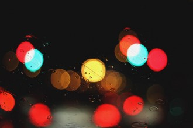
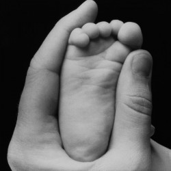
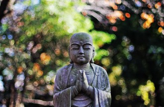
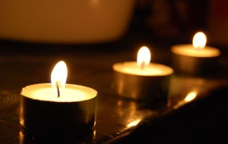

# 妈，亲一下

**2004/11/22 上**

这会是一个完美结局的故事，而妈将替我写序。

现在陪在妈妈身边，时间2004年11月22日，晚上八点四十四分。 

轮到我跟爸。

今天是妈住院的第一个晚上，病因是急性脊髓性白血病。中午检查报告出炉时，医生大踏步走到病床前，对着正坐在我妈脚边的我宣布这个噩耗。

当时我正捧着便当，嘴里都是豆芽菜跟烧肉，盘着腿坐在病床上展现我的好食欲给妈看。医生说出病因那瞬间，我发现病房只有妈、我、弟弟，我顿时成了最高指挥，但我无法承受。

“等一下，我叫我哥过来听！”我匆匆放下便当，冲出病房找哥。

妈病倒后，哥便是家里的支柱，无数亲戚都经由他关心病情。多亏他大学念的是药学系，硕士念的是生药，博士则攻癌症治疗。更多亏他就是一个哥哥该有的样子。

好不容易找到了哥，冷静告诉他我们原先祈祷的“仅仅是严重贫血、积劳成疾”的想法终告幻灭，然后在大厅拦住医生询问接下来该怎么做。

医生人很好，什么都不直说。我的脑袋盘旋着google搜寻引擎与一个医生网友，以及一个前几年母亲因同样病症过世的老友。

怎么办？当时我们都还没从震惊里回魂，眼泪还缩着，心中浮起几支该打的电话。爸、外公、舅妈、二姑、三姑、三叔、小舅……

回到病房，哥倒是老实跟我妈说明了病情，毕竟妈妈年轻时是护理人员，什么都骗不了她，今早还在等候位上翻着刚买的临床医学诊断分析，精明的很。

三个兄弟看着妈。

“通通都不可以哭。”妈说。我则蜷在妈的膝盖上，偷偷抠掉眼泪。

“当然不可以哭，现在发现的早，绝对可以要撑过去。”哥鼓舞大家，弟附和。

说是发现得早，或许是真的。妈在四月份因为身体不舒服，自行到检验所抽血检查，关于血液的各项数据并没有透露什么，直到上礼拜。

“妈，妳是我们最重要的人，真的不能没有妳。”我握紧妈的手：“在网络上我是公认最自大的小说家，自信大得乱七八糟，所以妳一定也要有自信可以撑过化疗。”

“知道了啦，那个是遗传。”妈勉力笑道。

之后，每个人都轮流到医院外的电视区偷哭，然后分配接下来的工作。

身为一个自由作家跟延毕硕士生，我决定从板桥租处搬回彰化，黏在妈妈身边写小说。哥则缓下研究室的步调，用一台十二年老车疯狂来回台北与彰化。老三是最忙的研二，只能嘱咐他排除所有不必要的外务，多回彰化陪妈。

因为是妈妈。家里最重要的人。

一直到躺在病床上，妈都还不放心我们能不能自己照顾自己。“忘了把钱先给你们，记得自己从家里拿五千块再上台北！”一想到妈说这句话时的着急神情，我就无法克制地大哭。

大家弹掉眼泪，振奋精神，回到病床旁跟妈谈笑。说是谈笑，其实妈的气色很虚弱，只是想让大家放心。劝了几句，妈开始尝试闭眼睡觉。

然后我未来的大嫂来了，眼睛也是通红。

趁着哥跟弟跟未来大嫂坐镇，我决定坐出租车回家补牙，然后将快要长成菌菇的头发剪干净。

说也奇怪，昨天下午我在用牙线掏牙缝时，不知为何右大门牙后边崩落了一块，那是以前镶瓷填上去的，牙线掏着掏着，就掉了。掉了当然不能用，因为缺口边缘有新的蛀牙，要将缺洞凿更大补上新的。

躺在牙医诊所舒服的床上，算是偷了点闲，喘口气。在差点睡着的当口，脑中灵光一现，想起以前曾看过的命理节目说过，如果在梦中门牙掉落，现实世界里父母便会有严重的病痛。正是昨天的状况。而节目也提到，这是可以补救的。

我心下释然，好险我决定及时补牙好多吃点东西照顾妈，通过命理法则，妈绝对可以康复。

补完了牙，去了理发店。

一坐下，在小姐舒服的按摩下将眼睛闭上，开始回想关于妈的一切。

妈喜欢紫色。却很少真的买紫色的东西。

妈喜欢梦想买新房子。这个梦想我们在上个礼拜刚刚实现，用力跟银行贷了近乎全额的屋款，即将在下个礼拜我妈生日当天搬进去。

妈喜欢我们喜欢的东西。包括狗，包括女孩子。

对于爱情，我不是家里最早熟的，但对于把爱情挂在嘴边，我应该是独一无二。

家里的浴室与厨房只隔了道垂布，有幸来过我们家洗澡的朋友都觉得很不自在，觉得隐私会随冲澡声泄漏出去。但就因为如此，我们三个兄弟从小就很喜欢隔着这块布，一边洗澡，一边跟正在煮菜的妈说话。

时间大部分是放学，刚好瞎说些学校的杂事，妈的铁耙子翻炒热菜的毕剥叭响与我们的冲澡声混在一块，但丝毫不会打扰母子间的对话。热水蒸气从帘布下不断冒出，我想这是妈一天最开心的时候。

我很喜欢在洗澡时跟妈说“我决定将来娶谁当老婆”或是“我好像快把谁谁谁追到手”这类的话。从国小到大学，我信誓旦旦中的女主角换个不停，但那块帘布只换过一次。

“你这个年纪不要想太多！把书念好就对了啦！”妈总是这么回应，但从来没在语气中表露她的认真。

偶而居然吵了起来，我头顶毛巾、气呼呼抛下一句“吼！以后不跟妳讲了啦！”

走出浴室，就会看见妈在端菜上桌时偷偷掉眼泪，每每歉疚到想妈赏我几巴掌。

也许妈很喜欢儿子对爱情的向往，更可能是单纯沉浸在与儿子的日常对话里。

想着想着，我想替我妈写些东西。

或者，替我们家留下共同的美好记忆。

这段记忆该起什么名字好呢？坐在理发店里的我几乎立刻看见妈小小的身躯牵着脚踏车，腼腆地回头看我的画面。

镜子前的我，根本不敢张开眼睛。

妈，妳一定要好起来。

 **2004/11/22 下**

晚上九点半。

爸走了，待会要换洗完澡的弟弟过来。病房只剩下我一个人陪妈。

呵呵，妳现在应该最紧张了。”我打开ibook，靠着墙，坐在伴床上。

“为什么？”妈奇道。

“因为剩下的是最没用的一个儿子。”我自嘲。在日常生活上我各方面都很邋遢，这是事实。

“不会啦，你有时候非常细心。”妈说的时候，大概发现我偷偷用ibook盖子挡住眼泪，说着说着将头别了过去。

所以我一点都不细心。

我敲着这故事，一边跟妈聊我在网络上抓到的一狗票关于白血病的信息。

“妈，我发现急性比慢性的还好治疗耶，又幸好不是淋巴性而是脊髓性，第一年的存活率有60%，妳一定可以撑过去。”我提醒妈。

“我会啦。”妈说，一只手靠放在额头上，像是遮挡多余的日光灯。这个姿势是妈的招牌动作，我总觉得这着姿势引隐含着痛苦的成份。

然后我跟妈说我补牙的事，关于命理节目那段记忆，我提醒她那是我们一起看的，当时的主持人还是况明洁。

“所以我说真的，我做了补救，所以一定会好起来。妈我再说一次，妳是我们家最重要的人，我们生命的意义都是为了妳。”我说。

“知道了啦。”妈的眼睛闭了起来。

虽然我家跟大多数传统家庭一样，并不习惯把爱挂在嘴边，但有些时刻的感动并不能通过心灵交会达到。我不懂为什么要白白错过这些感动。

妈躺在床上，不时注意血浆滴落的速度。她正在展现专业的护理判断，然后唤来护士。果不其然，血浆快用罄了。

我看着身子小小的妈，她又渐渐睡了。

几个小时前，弟弟说了一句很混蛋的话：“妈，妳这辈子都没睡过一次好觉，就趁现在好好休息吧。”不知怎地，当时很想叫他闭嘴，虽然这是个很辛酸的事实。

我看着妈睡着，轻轻勾着妈插上软管与贴满胶布的手。妈睡觉的姿势歪七扭八，并将这一点毫不保留地遗传给我。

突然皱起眉头，妈的手指掏了耳朵几下，然后继续未完的、不安稳的眠。

妈喜欢掏我们的耳朵，却不让我们掏回去。说到底也是正常，毕竟妈掏耳朵的功力神乎其技，我还亲眼看过一个邻居跑过来请她帮忙，结果掏出一块黑沉沉的耳屎，对方再三道谢离去。

我的耳屎是三兄弟里最多的，有个成语叫“层出不穷”当很应景，但论记录则是哥首次被爸逼“站着洗头”第二天早上掉出来的巨屎。

妈掏耳朵时习惯问问题，我们则被迫伊伊哑哑地模糊回答，每挖出一小片，妈都会刮在我们的手臂上，有时还会将超大的耳屎用巴掌大的塑料套装好，交给我留作纪念或到处炫耀。但几乎都没真的留下，有几个被我以前养的鱼吃了。

近两年我才开始想办法帮妈掏耳朵，但技术远远及不上妈，妈又对我粗糙的手法心存畏惧，常常喊痛作罢，并坚持刚刚的攻坚并没有向我口中说的“妈，那个真的很外面耶！”。

我以前无聊时胡思乱想，要是妈妈老的时候眼睛看不清楚了，我的耳朵该给谁掏？有时我自己拿着耳耙试探性抠抠，却总是不得要领。光这一个小细节，妈便是无可取代的。

弟来了，我交棒。

今天他睡医院陪妈，明天他回台北，换最糟糕的我上阵。

“妈，我正再写一个关于妳的故事。等妳好起来了，记得要帮我写序。”我收好计算机，穿上外套，在格挡病床的帘子后挥挥手。

妈有些高兴地笑着，我刻意不去看她眼睛里的泪光。

明天，是妈第一次化疗。

我很怕痛，这点也是遗传。我很恐慌明天只剩下我一个人的惨况。

甫抵台北的哥刚打电话给我，说他恨不得有好几个兄弟可以一起帮助照顾妈，我脑袋想的，却是电影the symbol“灵异象限”里的预知设定。

“我一直在想，也许妈生三个儿子是有用意的。三个也很好。”我说。

“我知道。”哥说，结束了对话。

**2004/11/23 上**

我硕士班念的是社会学，第一篇小说“恐惧炸弹”也隐含着社会学的意义，这是当初该系列的写作目的。恐惧炸弹这故事说的是符号之于世界运行的重要，所以我安排一个大学生早上醒来发现自己身处一个语意不明的世界，耳朵听到的全是乱七八糟的噪音，文字全部变成扭曲的杂块，招牌、书本、货币、电视，全是错乱的影像。然后大学生濒临自我分裂的疯狂。

会这么架设故事的时空条件，是因为想获悉某个东西的重要性，最快方法莫过于“抽掉它”，让它不存在。一个东西若不存在了，就会发觉这个世界运行的轨道渐渐偏离，或是严重失衡，经由一种茫然错漏去体会那东西之于自身存在的重要意义。

如果上天让妈罹患重症的目的在此，我只能说，未免也太多此一举。

妈的重要，根本不需要任何辅助的证明。

现在是下午两点三十五分，妈进医院第二天。

上午我来接替弟弟，带来妈擦澡用的水桶跟小佛像。许多亲戚都来了，三叔、三姑、三姨夫妇、哥未来的岳丈夫妇，我想这是很普遍的看病高潮。一旦等妈化疗后白血球数目遽减，免疫系统变弱时，到时就要开始下逐客令保护妈妈了。

我看着妈一直跟亲戚讲解自己的病情，再三强调自己的心理准备，逐一安慰来访的亲人。妈很坚强，我暗自祈祷自己身上软弱的基因是“为了成为情感丰沛的作家”产生的必要突变。

亲戚潮来潮去，现在又只剩我一个人。

下午妈接到爸的电话，又开始指点爸家中物品摆设的地点，还有一些药品在架上的位置，巨细靡遗的用字，可以轻易想象爸在电话那头找得茫然的表情。

爸是个很依赖妈的男人。所以爸不会煮饭洗碗，不会洗衣烫衣，不会清理打扫，半夜腰酸背痛时要妈搥打按摩，睡前常开口要吃宵夜。标准的、上一代的幸福台湾男人。我们家没有钱，一股债扛了二十多年总还不完，但爸过得很好，因为有妈为他打点勉强收支平衡的帐，去年甚至买了台新休旅车。

“你晚上饭前饭后的药吃了没……姜母茶粉就放在我们泡咖啡的那个玻璃柜里后面一点……那个电话我抄在……”妈在病床上，还是遥遥监控爸的生活。

除了在生活上，爸对妈的依赖还有药局的生意。

家里开的是药局，妈帮忙打点药局生意的程度远超过一般人的想象。妈很用功，常看见她抱着一本超级厚重的药品全书翻查资料，靠着以前当护士的专业知识不断补充最新的药品用途，还会叫我去网络帮她找几个关键词是什么意思。即使年纪大了，戴上老花眼镜，还是一如往常。

所以尽管许多客人、邻居、亲戚，身体一出了毛病，都很喜欢找妈询问该怎么办、该去哪间医院。妈俨然是社区最受推崇的大咖，药局也成为附近人家的信息转运口，各种无聊的八卦都自动找上门来。

“妈，我敢说妳如果出来选里长，一定可以选到！”我曾提过。

“对啦对啦。”妈没当一回事。对她来说，把家顾好是唯一重要。

护士拿来许多关于化学治疗的宣传小册，里头是化疗后的副作用如呕吐晕眩掉发掉齿等，以及如果化学药剂渗出血管等很合乎逻辑的疏失。总之内容充满恐吓（笑）。

妈坐了起来，跟我一起看这些恫吓性文宣，我看到里头提到喝柠檬水或含姜片，有助于排解接下来的呕吐感，于是赶紧打电话叫爸晚点送来。

“不要怕啦。”妈很在意我很害怕，因为我什么情绪都无法藏住。

“可是我真的很怕痛，一想到妳做化疗的时候只有我在这里，我就很慌。”我坦承，不断揉着妈的脚掌。

然后妈反过来不断开导我，我真不愧是最差劲的看护。

直到哥哥的电话打过来，说他下午到工研院面试完就会回彰化，我才勉强松了一口气。哥嘛，就是很可靠。

在想象里，癌症病人接受化疗后吐的一塌糊涂、痛得哭天抢地的画面，我是无法独自承受的。又很希望电视都在唬烂人。

护士过来为妈打了镇定剂跟防晕剂，然后设定机器，开始注入二十四小时的化学药剂，明天或后天可能要在妈的锁骨附近埋一条人工血管，方便日后施放药剂。护士与妈讨论着这条人工血管的必要性，而妈以非常愉快跟坚定的语气说：“没关系，只要对我的病情有帮助，我都会很尽力配合，因为我已经决定要奋战了。”

然后妈又开始说我们三兄弟的事。一贯的，从哥念博士，今天要去工研院面试国防役炫耀起，然后是我，强调我虽然很不可靠，可是很会写小说（好谜的关联性啊），最后是弟弟，正在师大念研究所，明年会回来彰安国中实习。然后强调三个儿子都快要论文口试、都要毕业了。

“所以我一定要好起来。”妈很轻松地说。

是啊我就说我爆炸性的自信其来有自。

镇定剂发挥效果，妈开始觉得有些朦胧。我说我已经在网络上同步贴出关于妈的故事，妈好奇地问了几句，我说大家觉得感人，我有机会轮回家就将稿子印出来给她看。

妈渐渐睡着，嘴巴微微打开。

我用沾湿了的棉花棒润泽妈的嘴唇。颇有感触。

小时候生病发烧，什么东西吃进嘴里都狂吐，妈会偷偷在家里帮我们打点滴，因为喝太多水会反胃，我们嘴唇干裂，妈会拿棉花棒沾湿，放在嘴里让我们吸吮，然后抹抹嘴唇。一直到前年我因为疝气住院，妈还是将棉花棒沾湿温开水，放进我的嘴巴里。

但我一直到昨天深夜，才猛然想起我们并没有带棉花棒去医院。早上出门前我才问奶奶拿了包棉花棒。

妈最细心。

又或者，妈的爱总是最多。

**2004/11/23 下**

哥快来了。

我们常常在南往北返的车上聊妈。

一直以来我们都很庆幸没让妈失望，我们很清楚身为妈的骄傲，身上一定要有各自的光芒。哥说我的成就来得最早，妈总是很开心跟别人说我出过书，据说在网络上很红，每次去书局买医疗相关的书籍，都会像纠察队检查我的书有没有放在架上。

我总是期待将来有什么大众文学奖等我去抢，站在台上发表讲演时好好谢谢我妈。

妈常说，我的文学细胞来自于爸，然后提起爸以前写给她的情书。这样说也没错，小时候每周末日记本上的作文功课，三兄弟总得乖乖拟上一份草稿交给爸批阅，反复修改后才准腾在日记上。如果爸很忙，圈改的句子少些，我们就爽得一塌糊涂。

但再三修改后的句子，就算凑一千句也组不出一篇好文章。

小学四年级末的暑假，妈突然兴起让我们兄弟去国语日报社学作文的念头，于是牵着脚踏车，带我们到国语日报社报名“补作文”。在那里，每次都得完成一篇文章才能离开，所以并没有谁改完了才作数的情况，所以我尽情地写，认真地写，写出了极兴趣。

不能不认真，不能不尽兴，因为妈妈几乎是榨尽每一分力，想办法让我们才华洋溢。

但在当时我是挺错愕的，虽然小小年纪，却已模糊知道家里的债务状况，妈努力凑钱让我们三兄弟都能补习英文，现在又多了作文，让我感到错愕又内疚。每次老师将牛皮纸袋递上要我拿回家装学费，上面的数字都让我很心虚。

一想到妈决不在教育费用上皱眉头，我的鼻子就会酸到出水。

国小四年级初，在“丁老师美语”上课的三个年头中，妈会买空白录音带让我们去录，好回家复习。有时妈会闲闲跟着我们听，如果被她听到我们在上课时吵闹或乱开玩笑，妈的脸色便会一沉，逼着我们下次上课时乖乖跟老师认错道歉，还会打电话亲自跟老师确认。我想这多少对一个人的搞笑才能有所压抑，但有哪个父母会希望孩子应该学英文时锻炼搞笑功力？

回到作文课。离题再忝不知耻地回防，是我的拿手好戏。

我很清楚在爸的严格调教下，我的文章在同侪中出类拔萃，只是学校的学科成绩普通，遇到作文比赛时老师老是叫前三名的“好学生”担纲重任，我没有机会也没有特别的动机证明自己除了绘画图外的第二专长。在国语日报社学写作，其实没印象学到什么，只是卯起来写。每次发回的卷子都很高分，评语也好，所以老师推荐我去考作文资优班。我资不资优不知道，但就这么有模有样考进去，整整又上了两年所谓的资优作文课。

上了国中后，我不只会写，还多了鬼扯式的幽默，每次乱写的周记都在班上传阅。只要作文课的题目订得有点松散，我就开始借题写小说。上了高中，周记胡说八道的程度彻底脱离常轨，已传到隔壁班轮阅，到了礼拜五才会回到我手中。然后我当了六年的学艺股长，干了六次国一到高三的教室布置。他妈的。

妈很骄傲，并开始适应我“搞笑/大而化之”的个性，常常在亲戚面前把我胡涂丢东掉西的个性搬来搬去。对于我后来立志专职写小说这件事，她也给予近乎豪赌的尊重，并没有一直用世俗的职业观贬抑我、逆向激励我、或是过度担心。虽然我的个性充满太多的破绽。

两年前我第一次投稿小说就得了彰化县磺溪文学奖，次年再得一次。妈超高兴，

认真地将小说看了一遍。妈总是这样，不管我写了多奇怪的题材，她都会戴起老花眼镜，若有所思地慢慢翻着，用很辛苦的速度。

“我最喜欢等一个人咖啡，因为里面的主角讲话根本就是田田你嘛！”妈说过。

那个故事是妈最快看完的，也最喜欢。

“等一个人咖啡的主角……是女生耶。”我愕然。

但想想也是。

也只有妈妈跟我说过这样的评语。在所有的人都没有发现的时候。

“妈，我永远都不会忘记妳送我进国语日报那天，妳戴着帽子、牵着脚踏车的样子。”我说，不只说了一遍。

每次一本实体书出版，每得一个奖，我都会再说一遍。

什么导演来找我写剧本，什么制片来找我合作，大陆众多出版社来邀书，小说人物要做公仔，受邀到哪里去演讲等等，我都会用超臭屁的表情跟妈说，然后欣赏妈替我高兴的样子。

因为妈是世界上唯一一个，不会对我的热血成就感到羡慕或嫉妒的人。我想让妈深刻知道儿子与她之间的美好联系。

一个作家的三元素。情感，灵感，与动力。

我的生命里，妈妈对我灌注的爱，三者兼具。

现在是晚上十一点二十四，化疗的剂量还剩321。妈交代我巨细靡遗记录下各个时间点的药剂余量与她的身体状况，好帮助医生判断。

家人都很担心妈不日后移到隔离病房免得遭到感染时，将独自忍受的寂寞。哥跟爸很舍不得妈，我则非常的慌。

“妈，我先把话说在前头。我是家里最脆弱的一个，所以妳一定要坚强，好好鼓励我。”我错乱说道：“我最担心的不是妳待在隔离病房会很寂寞，而是我看不到妈会很寂寞。”

妈又睡了。还是很奇怪的姿势。没有人学得起来。

除了我。

**2004/11/24 上**

现在是凌晨五点三十八分。

一个小时前，我正做着关于监狱格斗技的热血梦（谁会做这种梦？），房间照明灯忽然大亮，妈跟我被一连串护士急促的说话声给吵起，然后是让我心神不宁的啪啪搭响声。

我原以为是天亮了，预计今天要出院的隔床病人终要离开，仔细一听却是紧急急救声，伴随着病人家属的询问。但是跟电视里看到不一样的是，护士们并没有相互报告什么数据，而病人家属的询问也不焦切，而是茫然跟呆滞。

听声音，是斜角的病人。

我起身坐在伴床上，一边揉着妈的手，一边拿起药师佛照，念起药师咒。

药师咒是我们家每个人琅琅上口的咒语，小时候生病躺在床上，妈妈总会带领我们阖眼念咒，然后跟佛菩萨讲话。有时药粉太难吃也念，打针也念，一次吞太多药丸也念；彷佛念了咒，那瞬间的痛苦就会消失似的。

我反复念着咒语，逐渐让自己心中的害怕稀释在每次呼吸间。听清楚了护士在叫嚷些什么，我爬上妈的床。

“妈妳别想太多，护士说是肿瘤压迫到大动脉，然后什么什么的才会大量出血。这个妳比我清楚，不用骗妳妳也知道我们的病不会有这样的情况，我们的状况就是一场血液成份的比例、跟感染的作战。这不一样，这不会发生。”我担心妈的情绪，但我说的都是真的。

然后那串让我心神不宁的啪啪搭响终于停住，所有多余的声音都消失了。

“今天还听他说做了什么检查哩。”妈感叹，然后双手合十念佛祷祝。

“妈，真的别想太多。我背过那么多经跟咒，唯一不用复习就记得清清楚楚的，就只有药师咒了。我一直相信这世界上没有巧合，所有一切都是齿轮彼此咬着，我只会念药师咒，一定有它的原因。”我信誓旦旦。这是我的人生信仰，如同小说“打喷嚏”最后三十六个画面。

病人被推了出去。每个人离开这世界的方式有很多种，医院只是其中一个。

妈仍有点惊魂未定，毕竟冲击来得突然。

我乱捏着妈的脚，说着这几天原本接了王导演的剧本构思，却因为这场骤变给忘了，一直到晚上邝导打电话跟我谈别的事我才熊熊想起。很自然地介绍起王导跟这次剧本构思我无能为力的原因，然后补充了作品改拍的事。

“妳闭着眼睛听就好了，反正妳只要用听的，就可以知道我的表情啊。”我笑。

妈当然同意，乖乖闭上眼睛。

“如果妳觉得有发烧一定要说喔，妳的感觉一定比护士量体温来的快。白血球数目快速减少一定会发烧，很正常，不可以因为发烧不好就不说。妳一发烧，我们就立刻提高隔离的层次。”我提醒，虽说过了好几遍。

妈点点头，还问爸跟奶奶晚上过来探望时有没有带几盒口罩，显然已经专业地冷静下来。

肚子饿了，记录下化学药剂残量，181。

开了罐蜜豆奶，写下这段很小说的现实。

**2004/11/24 下**

早上回到家，换哥哥在医院陪妈。

为了避免细菌感染，我换上专门跟puma玩的衣裤，抱着牠舒服地在床上补眠。

我很需要puma。而puma依稀知道妈生了病，乖了不少。

睡了两个小时，我将几件琐碎的事逐一完成，包括转寄网友们写给阿拓父母的信，买明天上台北的火车票等。然后决定晚上还是我去陪妈，让哥多些时间休息。洗了澡，换上去医院陪伴的衣服，puma叫了几声讨抱，我用眼神解释了几句，puma懂了，于是缩到椅子下睡觉。

想写些什么，却写不下约好明年要在租书店连载的猎命师。我想我还得让脑袋缓冲几天，让脑袋可以装下虚幻的热血叙事。 毛打电话来关心，嘱咐我要勇敢。

前几个礼拜毛跟我又经过不少风雨，但她很了解妈对我的重要。

“我觉得我现在写的东西不是疾病文学，是陪伴文学。我觉得我在写我妈妈的故事时，情绪获得纾解，勇气也不知不觉生了出来。”我说，意识到其实是妈陪伴着我。

想起了周大观。

人在进行创造活动时会带给自己力量，也会带给旁人力量。至少我是这么期许自己的作品。

陪伴在妈身边写些这个家的回忆，除了排遣我的愁绪跟不断压抑的、对妈的心疼，我更希望这份彼此陪伴的回忆能带给妈力量。对一个完全以这个家庭为重的妈来说，这份陪伴书写能让妈知晓她在我们每个人心中的“意义”，而不是一个模糊的、形而上的“重要”。

然后我想，应该解释我一直提到的，我妈的脚踏车。

妈不会骑机车，不会开车，只会骑学生时代学会的脚踏车。而妈的个子小小的，只有145公分，要煞车时一定得轻轻跳下，在路上十分好辨认。

“妈，打勾勾，如果我考上国立大学妳就要学骑机车。”弟弟是家里最后一个考大学的儿子，成绩不上不下，使他跟妈的约定包罗万象，有骑机车、下象棋、玩扑克牌、打麻将等等。

后来弟弟突破实力考上了师大工教，妈也真的尝试学骑机车。

但就在第一天练车的深夜，妈在家门口前的小街道上努力驾驭铁金刚似的名流一百，一个煞车不及，慢慢地撞上一台出租车。妈只受了点轻伤，但从此不敢再学。

所以妈还是骑着她的脚踏车。

记忆中妈的脚踏车从未新过，妈没坐在椅垫上的时间比真正踏轮子的时间要长。

国小时，如果爸偷懒，妈就牵脚踏车送我们兄弟走路去上学。其实我们家离民生国小并不远，只有一公里左右，但妈就是不放心，尤其当时的“陆正绑架案”震惊了每个台湾母亲。

轮流坐在妈牵的脚踏车上，我们慢慢经过彰化最有名的两间肉圆店，穿过一条专卖过时衣服的成衣街与车站附近的小吃集，走着走着，看见牛肉面店左转，然后小心翼翼穿过大马路，进入靠近学校的两条小巷。书包在妈的脚踏车篮子里晃着，此时我的心会开始扭捏。

那个时期的小孩子多半都很畏惧“在同学面前丢脸”，让父母接送上下学意味着自己被溺爱、不够成熟。跟妈越靠近学校，我就越怕被同学看见，简直是提心吊胆，于是一定不会在靠近学校时坐在脚踏车上。尽管别扭，但我很清楚妈的爱，所以从没像同侪用大吼大叫斥退父母的温馨接送，只是将羞得将拳头捏紧。

矛盾的是，妈送我们到校门口时，我们会很自然地朝妈的脸颊亲一个。

“妈妈再见。”我们亲亲道别。

“要乖啊，不要再让老师写连络簿！”妈说第二句话的时候，几乎都是针对我。

我的国小就是在不断被老师写连络簿的恐惧中干他妈的渡过。

民生国小有三个门。每个兄弟因为各差了两岁，所以离开妈的地点也不同。记得我刚上五年级不久，哥已上国中，弟又先进学校另一个门。那关键的一天，妈独自送我到正门口时，嘱咐我几句就转身牵脚踏车要走。

“妈，还没亲？”我愕然，有点不知所措。

“长大了啦，不用亲，快进去。”妈说，有点腼腆。

我眼眶骤然一红，泪水噙满了视线，几乎要哭出来地走进学校。

忽然，妈叫住了我，我泪眼汪汪地朝妈踱步。

“好啦，过来。”妈说，终让我在她的脸颊上啄了两下。

后来那个瞬间成为妈不断向亲戚说嘴的经典画面，也是我记忆中最动人的一刻。

后来哥哥上了高中，将挂有篮子的水蓝色淑女车除役后，妈就接手，往后又在上面摇摇晃晃十多年。篮子经常装满了菜跟日常用品，有时重的不可思议。

但我们一个个都比妈妈高、重，再也不会坐在脚踏车上头，让妈慢慢牵着了。

那些温馨接送的日常画面虽然不曾留下照片。但我说过，这世界上没有巧合，所有的事物都像齿轮般紧紧咬合，都有存在的重要理由。我对关于妈的记忆特别鲜明，必是为了保存那些动人的时刻。

十点药局打烊，爸来了。

爸见到妈很开心，然后一愣一愣请教妈许多东西的存放位置，露出依恋的表情。

“真想把妳抱回家，实际操作一下。”爸感叹，亲昵地与妈亲亲抱抱。

这次妈身体出状况，来医院检查前爸老是哭，弄得妈眼泪也无法收住。

但爸的眼泪对妈来说意义重大，妈在爸的生命里留下最辛劳的背影。

又剩下我守护妈，靠着微弱的光线，慢慢读着寻秦记的最后几章。

此时我不禁想到回台北上课的弟，有些担心他。

弟一个人在空荡荡的台北， 想必一定很寂寞吧。睡觉的时候一定特别难熬。

想着想着，弟就打了电话过来跟妈道晚安。

此刻的我，非常庆幸能留在妈的身边。

**2004/11/25 上**

早上哥来换班，我坐火车上台北。

下午跟北医约了做核磁共振，检查我坐骨神经痛的程度是不是达到“替代役体位”的程度。明天要去板桥租处将机车与冬天衣物寄回彰化，后天则要去师大座谈会上说点东西。如果有好事发生，周日会多留台北一天。

然后我今天还是忘了打电话给王导，金害。更严重的是，我现在想起来了，也没有劲去做。

这几天奇变陡起，心理的负担使身体变得很容易累。坐在来台北的自强号上，我罕见地停止维持了三年的手指惯性，没有在膝盖上飞快写小说，我一路呼呼大睡。

到了北医挂了号，塞了耳塞，开始我只在电影里看过的核磁共振检查。我安安稳稳躺在时而寂静如空明、时而轰然吵杂的密闭空间中，渐渐的又想大睡一通，可惜我无聊至极张开了一次眼睛，察觉到自己身处一个机八透顶的窄小空间，虽立刻阖眼，但无法忍受的窒息感立刻涨满了我的身体。

我好像动一动，叫一叫，好想冲出去透透气。

这时我才明白检查前要填的单子里，“如果患者无法安静平躺的话，请事先告诉护理人员”这一个看似可笑的选项所谓何来。原来不是指“对不起，我很顽皮，所以无法照办”，而是“我是个密室恐惧症俱乐部高级会员”的意思。

我害怕的东西实在太多了，我的一生彷佛在发现、累积惊吓自己的东西。

怕高，怕鬼，怕别人不相信我，怕puma阖眼时我没抱着牠，怕价值两亿的双手断掉，怕割自己或别人的包皮。

但我可以确定，我最怕没有妈妈。

“你们兄弟凡事都要商量好……不管妈最后有没有好起来。”妈昨晚吃稀饭时突然这么说，害我剧震了一下。

吼，妈妳不要一直吓我。

**2004/11/25 下**

回看昨天的陪伴书写。从弟弟跟妈的约定中，可以知道妈的兴趣很少。

但妈兴趣很少，其实是因为太过操劳，使得培养兴趣的时间变得太珍贵。居然有空闲，妈也会选择睡觉。妈说没有什么比得上好好睡一场觉。

妈真的很需要休息。

这次的冲击其实不无预警，妈容易头痛，没有食欲，胃痛，全身酸痛，半夜无法安稳入睡，手颤……将这些痛苦的画面拆开来看，好像是很平常的劳累病，很容易靠简单的成药就将痛苦缓解，所以便容易忽视，但若将这些痛苦全部组合起来的图像背后真相，竟是如此惊悚。又或者，演变得如此惊悚。

最让我们兄弟内疚的，是病痛后的真相还是靠着妈的警觉、与行动力，才将危机提早揭开，要不实在难以想象。

我深深体悟到，为人子的，应该将关心化为实际的行动。

爸妈一有不对劲，做子女的不能老是嘴巴提醒、口头关心，而是该用力抱起父母……直接抱到医院做检查。这种浮滥的小故事大道理听到听腻了，身体却生疏得很。

更重要的，是有些简单的梦想可以开始实践，而不该放在“可见的未来”。未来如果可见，就失去未来的真正定义。

一直想带从未出国的妈去哪里踏踏，也一直未能付诸实现。

妈总是说药局生意忙，多一天顾店便多一天的收入，很传统、很实际的想法。

对负债一直以百万计的我家来说，妈一直身体力行节俭。这样的对照常让我感到内疚，尤其看见妈一双鞋子穿好久好久。

有次我故意买了一堆阿瘦皮鞋的礼卷，想说钱都先花了，妈总愿意买双新鞋了吧。结果拉着妈到阿瘦皮鞋店里挑鞋，才发现妈的脚比我想象中的还要小，小到整间店找不到合适的尺码。

“没关系，我们有提供尺码订做的服务喔。”店员小姐亲切地建议。

“谢谢，不用了。”妈婉拒，转头跟我说：“这个礼卷还是留给爸爸跟老三用啦。”

最后真被老三用去。

有时跟毛约会，吃着外面的简餐吹着冷气，我便会想，改天该说服妈跟儿子约个会，吃个馆子。但妈只要吃到麦当劳跟肯德基就觉得满足。真要开口请妈吃个贵一点的东西，我反会怕被妈责骂而不敢开口。

很辛酸的矛盾。有时我会因此背脊发冷。

“妈，以后妳跟我住的时候，每天只要负责看HBO跟睡觉就可以了。”我在家里写小说时，偶而跟妈这么说。

“好啦好啦。”妈一贯的回答，挂着笑容。

“妈，那些负债根本就不算什么，好加在妳生了三个儿子，所以什么债通通除以三，就变得很简单了。只要过几年我们都毕业当完兵了，一下子都还光了。”我从大学时期就开始安慰我妈：“然后我们就可以买新房子了。”

妈似乎没有怀疑过我的话，很欣慰我们兄弟的团结。

但距离妈享清福，我在咖啡店写小说，妈在一旁翻杂志的日子到底还有多久？

如果只有计划，却没有“现在就开始的冲动”，就只能一直停留在计划。

人生有太多事够资格成为借口，要上课，要打工，要上班，要谈合作，要回信，每一个借口都是正经八百，都是所谓的正事。一如预料，大多数的人选择与奉献错过，然后不自觉缠在自己结吐出的内疚的茧，永困不出。

有两种极端的情绪会纠缠人一辈子。

一种是自尊心被剥夺的困窘，另一种则是不断沈淀的内疚。

以小说的用语，这两种一刚一缓的极端情绪，会各自制造出两种很极端的人。若发生树欲静而风不止，子欲养而亲不在的情况……我很难想象泪要怎么收止，也很难想象我是否会因失落过多而失却大部分的情感。但这些失落都比不上无法满足妈追求的幸福。

所以我必须破茧。每个子女都该破茧。

但大多数的人看了这篇文章，察觉到触手可及的茧，还是不会拨个电话回家。

因为总是有正事要做。

**（编者注：此文为九把刀日记体陪伴文学《妈，亲一下》前四章）**

(采编：刘铮；配图：季节扬；责编：刘铮)

[【母亲专题】万婆](/archives/32634)——”关于久病床前无孝子，最残忍的不是儿女的孝心被繁琐与负担越磨越薄，而是老人在孤独与病痛中积起厚厚的自责与谅解，在对儿女的思念中设想他们忙的理由。”

[【母亲专题】王晓华](/archives/32672)——”王晓华只是温柔而平静的说：‘对啊，人死之后，什么都不知道了，什么都看不见，什么都听不到了。’好像这根本不是一件值得害怕或者流泪的事”

[【母亲专题】一双线拖鞋](/archives/32838)——”有一个缝补浆洗的妇人在家里，孩子寒酸的衣裳也会干净暖和。有一个问问叨叨的妇人在饭桌上，日复一日的单调生活也会安心舒适。有一个昂首盼望的妇人在村口，在外打拼的游子才能记起回家的路。”

[【母亲专题】葬礼](/archives/32787)——“在最苦难的年代，老人让小孩活着成人便是巨大功德，完全可以不选择饿着肚子赶孩子去念书，不选择用肌体健康来换地里的粮食。我们到过的很多地方老人一辈子都没到过，看过很多书老人一辈子都没看过，但我们会要用一辈子去学会老人的极端坚强、极端勤劳、极端的爱。”
