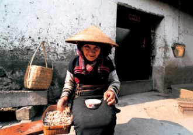
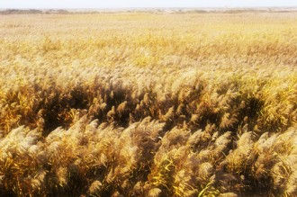
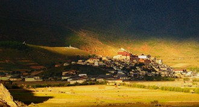
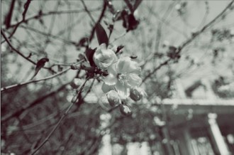

# 葬礼

**一**

小升初的时候，父亲很紧张，我是从村里来到镇上的插班生，十年放羊式教育终于要面对一朝考试的选拔了，前程难料。

镇中学开设实验班两个，并在四月组织全镇小升初学生参加选拔考试，通过者直接升入实验班，且每人奖励人民币五十元。我以练兵心态赴试，成绩出来后差了录取线二十来分。父亲大失所望，彻夜难眠，母亲抚慰他，中学校长不是你的老师么，你去托托他吧。父亲郁郁回答，他考这点东西，叫我怎么有脸去说。我背对他们躺在床上，有点儿心酸。

那个春天一场“非典”不期而至，各地人心惶惶，餐馆生意几近于无，家中弥漫了一股凄清的味道。有一次早上，班主任朱靖芳老师打断了集体晨读，问同学们最近有没有接触过外地回来的人，尤其是北京，山西，广州一带。大家都不知道怎么回事，也没人说话。我没多想，但有一丝好奇心，鬼使神差地举手回答：“老师，我家邻居刚从山西回来，前两天见过。”

后果意想不到的严重，早读刚下课我就接到了停课回家隔离观察的通知。为此祝老师还和语文老师王莹芬闹了别扭，王老师主管统计预防，说这是政治任务，实在不能马虎。祝老师更在意学生升学，认为时间紧迫，此时停课不啻前功尽弃。祝王二位先生都是极关心我的，奈何上面确有政策，不得不照规矩来。

我停课的事，使父亲大发雷霆。晚上吃饭时，大伙端着碗面面相觑，都不吱声，我是犯错的人，不敢碰碗筷，直挺挺地站着，头低在那，像站黑板。父亲一手靠胸，一手持筷夹菜，吃得很快，不张嘴唇而迅猛地咀嚼，间或呼噜呼噜大口喝粥，看也不看我一眼。菜是花生冻鱼，黄豆咸菜，和腊肠炒青椒，面盆里装着小米黑豆熬的粥，我一点香味都闻不到。也看不清灯火的亮光。

啪的一声脆响，我的身子像遭电击似的抽搐了一下，是父亲喝罢了粥放筷子的声音。他这一招很有威势，夹送完最后一口菜，以食指与中指发力并拢双筷，然后这二指在上，大拇指在下，迅疾地朝桌上掷去，在碰到台面的一瞬间抽出拇指，使筷子与桌面充分接触，发出如同惊堂木一样的声响，平时彰显家主脾性中的雷厉风行，此刻完全表现出心中不可抑制的恼怒。

他斜眼看我，恰好捕捉到我仓惶抖动的苦景，顿了一下，一言不发地离开饭桌。

我几乎站立不住，流下来的汗足够洗一次澡，母亲盛了粥过来，我双手打着颤去接，泼了有小半碗在桌上。她叹口气，也出去了。

我不知道自己为什么如此惧怕父亲，记忆里他从未真正动手打过我，但是没法子，就是怕得要死。

半夜里依稀听到父亲低沉的怒吼：“明早让他死家去，别在这丢人！”

于是第二天一早，我有幸在同学们最煎熬的时候，坐着爷爷拉泔水的三轮车死家去了。

**二**

奶奶见到我很高兴，她穿着蓝色印花的布纽扣衫，青黑的圆口布鞋，漆墨的头顶挽着温柔而古典的发髻，手里提着装衣服的小木桶，站在那淡淡地望我。过会儿又轻轻指了指一块突出水面的大木桩，然后带起一抹浅慢的笑，踱着步子慢慢走上水桥。天上的太阳像个姑娘隔着云纱帐半遮半掩，漏了一束光撒到我们跟前，她眯眼轻声宽慰我：“锅里有豇豆干烧肉。”我很欣慰，靠着木桩坐在一树桃花下面看她槌衣服。

细草微风岸，青苗的味道从河上拂过来，比桃花儿香。我数着水面的落红，有仔鱼儿调皮地绕着粉瓣上下翻飞，勾起一丝丝的涟漪。突然想到，以前夏天的午后，这桃树下的水里总有两三条乌鳢来回穿梭，人来也不走。这样一想，倒忆起过去的一点事情。

一年级放寒假前的最后一天，我忘了去学校，邻居家小孩拿了奖状回来，顺便把成绩报告单带给了我。我没有奖状，很不高兴。

我问奶奶，不进学长大了我能干什么呢？奶奶边削萝卜边回我，也没事的，回来养猪，养羊，种萝卜。一听这话我眼泪就止不住的往下流，又抽噎着问，那回来养猪能弄到新娘子么？奶奶两眼眯成一条缝，笑得停下了活计，伸出粗糙的大手帮我擦擦猫儿尿，安慰我，你看小圩那个网龙虾的呆子，到现在也弄不到新娘子啊，没得本事，哪家丫头情愿跟了你？

我仰头向天，伤心痛哭，东风里夹着一点细雨打在鼻头上，感觉未来的生命都失去了意义。

奶奶差点笑岔了气，也不削萝卜了，洗洗手去给我做饭。豇豆干烧肉，香油炖鸡蛋，闻起来香死个人，吃到嘴里一直苦到心底。以后回来种田养猪，这些东西都吃不上了。凄凄惨惨地哼了整个下午，连人家喊去打麻将都没动。

现在坐在水边，再忆童年故事都是笑颜。奶奶也笑，我的心事从瞒不过她。一户人家里的祖孙二人必生有特殊的感应，也许因为她们都更接近生命的原点，都远离繁杂的红尘？关于这点我曾在另一个春天得到过答案。

我问，人家为什么要传宗接代？

她一愣，随即发出一阵浓烈的笑，宽大的面颊像两枚夕阳的碎片。她一把握紧我的手，粗大的指节和残留了泥土的糙裂掌纹挤压得人生疼，用尽力气也挣脱不得，我几乎要哭出来了她才松手。小手被捏得透红，指头里血脉的肿胀和脖颈上青筋的跳动让人眩晕，我的脸像被传染了一样，镀上一层朝霞似的，激动的红。

像夕阳渲染天地一样，一抹红在苍老和鲜嫩的面颊间传递，一张如大地般的沟壑纵横，勾连住另一枚纯净光坦得像一小片天空，用一抹惊心动魄的红。

生命若有色彩，必属于红。幼芽诞生与长成的每一步骤，无不以前人精血耗费为代价，她们把滚烫的、冲动的、鲜活的、充斥着最强生命力的心血倾注到下一代的身体，留给自己平缓安静的流动，慢慢沉寂。

但是红是不变的，只要还有生命在延续。

她一直在笑。就像夕阳虽会落山，却永不消失。因为太阳总要升起来的呀。

我也笑，因为中午有豇豆干烧肉吃。

**三**

姑奶奶们下午回来了，我觉得有些不寻常，因为以往她们回娘家都会带些水果点心，这次什么也没有。大姑奶奶倚着门，朝我笑，露出光秃秃发着褐色的牙床。小姑奶奶坐在凳子上，脚离地有一尺，荡在那，静静地看奶奶刷碗，眼神迷离。都不说话。这很不寻常。

她们都很矮，还不到油菜花高。小姑奶奶嫁到口上，不常照面，大姑奶奶就在前头高圩，我总去耍。有一次在我和奶奶在田埂上找马兰，发现她家地里吹出一股股水汽，像是有人在喷药水，却又看不到人影，我使劲招呼一下，棉花丛里传过来一声大姑奶奶特色的脆嗓门：“哎…！”那时候，棉花才刚滚出果子。

这声音太有特色了，她与人答话，只要不近在跟前，总得像唱水调子似的在话末加上“啊”、“哎”、“嗨”之类，这样话音越到最后越上扬，临了猛的一收，直上了天去震散了霄云，嘹亮却一点不瘆人，你保准能清晰地听闻，乃至意犹未尽地回味。

她每次望见我，隔了二三里也要高喊一句，“三儿啊，来我家耍子啊！”那架势，人家要是拒绝了都不好意思，真要是去了，必捧出最好的物产迎你，殷勤到你不敢再来。其实她一世清贫，到晚来尤为疾苦，却绝不肯失了待客的礼数。这和我奶奶很像，我想，她是真正的沙民。

后来大姑奶奶患上眼疾，视物不清，也就不再远远地呼唤了，但若是近了身见着面，还是要往家里请的。

她们等了一会儿，往叔爷家里去了。奶奶刷了碗用抹布擦擦手，轻轻地和我说：“你太太不好了。”我一下子明白过来，果然不寻常。

我看了一眼奶奶的脸，不苦不悲，不知道她在想什么。要烧水，我下灶去添柴。

家里到我出生后有两位太太，一位是爷爷的母亲，姓李，一位爷爷的姑姑，姓周。姑太太嫁人不到两年，双眼具瞎，人家怕拖着个累赘，把她送回娘家，到死一共做了七十年不出家的姑子。

我母亲上门访亲时家里还是九架梁的瓦屋，地是烂泥夯实的，却没有一点纸屑垃圾，黑油发亮，像是做出来的陶模子。她以为是专为迎客扫洒的，等嫁过来才知道，瞎子不能做大活计，也不愿干坐等吃，平日里除了帮闲就是趴在地上，一点一点地摸，把碎屑杂物摸干净，她沿着墙爬，一天好几遍，长年下来地就黑油发亮了。

到我出生之后有一年春节，父亲把我抱到她床前，让她摸我的样子。她把我搂得紧紧的，因为看不见，生怕失手让孩子掉下去，我被抱疼了就哭，一哭她搂得更紧，颠来倒去地折腾了好一阵。现在我已经不能记得她的样子，只是当时这位瞎子太太感叹了一声至今如在耳际，她说：“阳阳都这么大啦！”

第二年腊月里，即要盖新楼的时候，她和老屋一同上了路。

现在，大太太也不好了，我有点儿难过。大太太是个好人，她的嗓子和大姑奶奶一样敞亮，有气力，像刀磨到最后要离开磨刀石，“噌”的一声豁出来，突起而非突兀，绝不拖泥带水，遥遥的传过去好远：“阳阳啊，来吃柿饼哎！”

真比号子好听。

她逢到过年时会在锅上贴出好吃的蜜糖饼，快要熟时盖上锅盖，然后挪到门口倚着门框坐下，等我一回来就大声而神秘地招呼：“宝宝啊，来，来，弄好吃的把你。” 

打爷爷兄弟们分家，大太太就和叔爷住一起，我不喜欢叔爷，轻易不去他家。是以对这引诱我也不为所动，但是闻到了糖饼的甜味，就在场上打转，不答话。

“宝宝，你来撒，我这真有好的唻！”

我背过身去看奶奶，奶奶朝我伸头，轻轻地说：“你去吧，不要紧。”我就一溜烟地跑过去了。

太太眉开眼笑，拿拐杖支撑起来，挪到灶上，掀开锅盖，焖热喷香的圆饼贴在锅上吱吱冒油，她铲起三个给我，我还往锅里瞧，她会说：“不敢拿了，不敢拿了，要留点给菩萨。”那我就不瞧了。

那饼太好吃，可惜一年只做一次。

她欢喜我，我却不怎么爱她。每次走到家门口，若是被太太见着了，她必然大喊：“阳阳啊，来喔！”

我不乐意和她讲话，有时当做没听见。她就要发急：“宝宝哎，来说话哦！”这声“说话哦”是焦急且忧伤的，像老燕失雏之后期盼的悲鸣，因为她的宝宝不答应她。

我不耐烦地招呼两声就快速逃开了。她槌着拐杖挽留不得，毫无办法。

我不搭理她是有道理的。奶奶嫁到家里，十年不得生育，心中内疚，用上了全部精力操持一大家子，做下的活计顶得两个男劳力。家里来了亲戚，对着太太感叹：“姐姐，你家翠珍真是能做啊！”

太太大气一顺，张口回敬：“管他去呢，我就譬如是请了个伙计回来。”

这是母亲亲口对我说的。我无法想象奶奶听到这话时的心情。

我与奶奶相守共伴十一载，感情深厚得令母亲心里发酸，当然就不待见太太了。尽管我也知道，她三十多守寡，独自抚养了四个孩子。

天知道沙上人能做多少活计，我只晓得这些人老去之后手上的劲头一点不老，尤其是女人。比如那位为了得到尊重追了我半条圩，揪了我半刻钟耳朵的聋子老娘，比如我这位太太。 

少年好武勇大概是天性，尤其在体育器材极其缺乏的乡野，演武就成了我们童年生活的一大乐趣。但是演武需要有器械的，多半是以竹竿、芦苇杆、打造家具的木头边角料作刀剑，而芦苇受限于时节，大人们轻易又不准折竹子，至于人家打造家具更不常见，我少时又体虚多病，虽有上前短兵相接的气性，却实在难有三合之将，通常一照面即败下阵来，确不可力敌，因此我偏好弓箭。

常隐于人后抽冷发矢，十步能中，进可杀壮士，退则保全身，即便不中，也能干扰对家，真乃上佳之选。唯一头疼的是好弓难得，细树枝易折，弓力也太弱，竹片割手不说，韧性大而弹力不足，都不是好料子。论起好弓材，十年我只遇到一回。

那是一株紫皮桑木，光秃秃的主干，末端突起的两枚蒂结正好可以系弦，粗细适中，长到我眉心，真是天生的好材料。我耗了一个时辰把它齐根折断，拖回家去扣弦绳子。

我把桑木一头杵着地，双手撑住主干靠上三分之二处，然后拿胸口抵着上头，用全身的重量压下去，奈何年少身轻，木杆不为所动，稍作弯曲就再不能低头。好比河畔桃树上挂的果子，离手只有一指之距，却任凭你怎么够也够不着，确实叫人心焦。

大太太倚在门口看了一会儿，就朝我招手，也不说话。我实在没有办法了，只好把尼龙绳和杆子拖到她跟前。她要起来，我拉上一把，把她当拐杖用的长矮凳子摆正了，太太坐上去，从我手里接过棒棒和绳子，先系好一头，也杵着地，枯黑的手拿住另一边朝下压。

大木立时成了弯弓。一点没见太太用力，像是往锅上烙一块饼，手按了一下就了事了。把木枝子削成的箭搭上去试弓，弦微动，发至十步，我大喜，如此弓力，予我箭百十支，天下之大也尽可去得。

我狂兴不止，心又上了天去，一下子就对太太既感叹又敬重，老人们真有好本领啊，这手艺，都不差似奶奶用甲鱼骨头做成的小鸟了。老太太安详地坐在那看我蹦跳，许久吸了一下鼻子，慢慢轻声说：“宝宝啊，这个不好对准了人打啊！”

“嗯，吾晓得！”

我欢快地奔出去挑衅了，心里美得很，觉得有这个太太也还不错。

**四**

水就要开，灌满了三暖瓶。我提了瓶子，越过院子，走到太太房门口，放下水瓶，扶着墙看她们。

地上摆好一只大木盆，奶奶们在脱太太的衣裤。她的皮真白，从颈脖子一直连到大臂膀，往下直到大腿，白得像敷了牡丹粉。可惜上至肘弯，下齐膝盖，这白就戛然而止了，如同戴着两副咖啡色的胶皮套，泛着刚出机的豆饼似的油亮，只是这皮皱得厉害，也太松，如果拉直了，定能看见里头包着那芦柴杆粗细的骨头。我觉得这像是蛇要蜕壳，人老了，也是要脱几层皮的。

太太房里朝南的墙上供着一幅观音娘娘的画像，玉面朱唇，白衣青竹，充满了圣洁的气息。画像上了年月，裱纸上裂纹密布，也许是长年敬香所致，把个白莲佛座熏得微微发黄，却无伤菩萨大德金身，反更显得观音大士亲近弟子，人间烟火也可用得。我们最惊奇的是菩萨的一双神目。奶奶曾领我绕画像走了半圈，啧啧感叹：“你看这菩萨，不管人走到哪里，她都看着你唻！”我不停变换方位，竟果真如此，想这菩萨真是菩萨，普度平等众生，连目光也不肯偏颇的。

如今菩萨的眉目依然惹人，供奉的信女却不能再细细参拜了。太太低头闭目，几乎要用额头碰到心口，心门上挂着两片白面煎饼似的东西，她不能动，让奶奶们摆弄着手脚，擦拭身子，像在擦拭一件家具。只是断断续续地发出一声声的哼哼，但又很轻，如果不是没有人说话也没有蝉鸣，旁人是很难发觉的，而现在那一声声如同吟唱般的呻吟如此清晰地穿透每个人的耳膜，让人不得不体会到那种煎熬的痛楚，无法抗拒。

阳光透着玻璃照进来，正好覆住木盆，把盆里的人照得金光灿灿，那人坐的一动不动，身上有水滴滑落，像是披上了唐僧的锦阑袈裟，而木盆里的水也因这太阳成了波光粼粼的莲池。我不敢动弹，耳边的哼哼也越发近乎禅唱，怪不得书里总说大人们成一件大事之前总要焚香沐浴，这实在是一种神圣的仪式，这是她的菩萨来接引她了。我也不知道太太在想什么或者还有没有想法，想来该是有的吧，菩萨面前不打诳语，也躲不过去，这世里的一桩一桩，都随着念经似的轻吟一道交代了吧。

我这可怜的老大人也是出身曹圩，娘家就是圩西李家场上的，也没个名字，做姑娘时不知叫什么，嫁到这户人家便称周李氏。这户人家也没什么特点，只说祖上“出过什么将军”，也都是些积年烂帐，无非同别人家一样租种了几亩地，一样吃糠喝稀，偏偏这家男人没甚本事还要拿起祖宗的腔调，素来好吃懒做，这一切的家务活计自然落到女劳力身上。更稀奇的是一传三代男都一个德行不说，居然都找到了勤力婆娘家来，任劳任怨地服侍，实在是匪夷所思。她们竟还颇以此为荣，譬如我奶奶，每称出阁之后的女子为“女将”，其实我也不知这称谓到底对应哪两个字，但是单论其意，大约这二字不会有大错，女子做得大活计，担得将军名，我也不知道这是夸赞呢，还是无奈？我母亲多曾敦促我勤做事务，她常担心我这样懒惰将来成家怎么得了，我很不以为然：“找个像你这样的姑娘做女将。”

“你没那个命的。”她没读几年书，却太了解我们这代人。

过去人不知道什么叫做苦，反正大家也都这么过，为人妇十年，除了生下七八个孩儿，太太也承包了家里外一应大小事务，男人虽然懒闲，倒也不算败家，农闲也随人家出外挑活做。那时的她确实辛苦，也应当是满足的，本来么，男人这东西，你能指望他什么？

后来有一回这家男人去江边口挑货的时候遇到一伙官军，有个长官摸样的人同大家训话，说什么“保卫上海”、“国家兴亡”之类的，然后要这些挑夫每人挑两框军火过江去支援前线。男人顺从了。也容不得你不顺从，官军明晃晃的刺刀那不是吃干饭的家伙。肩膀上压着三百斤的担子，眼里瞥到黄澄澄的铜壳子弹，这闲汉终于意识到这是要开仗了，这同以往都不一样，那长官不是说了么，这回是打小日本子，那“天下兴亡”后面一句他可是知道的，匹夫有责也。

谁也不知道这男人到底是怎么个想头，兴许是念起自己祖宗的陈年旧事，“匹夫有责”的责被他察觉到了？也有可能因为那年粮食太金贵，实在是吃不起了？总之他到了江南就没再回来，兴许在路上就下定了决心，立时穿上军服，奔赴上海，只托人带了句信家来：我打日本去了，你带好伢儿们。

我这曾祖不过才吃过一顿皇粮，头次上战阵便中了大炮，被运回家里的只有一件当挑夫时穿的烂衣裳，和三块大洋——国民政府阵亡将士抚恤金。

奶奶给我讲这些故事的时候，眼里也是噙着泪水的。一个中年寡妇手里捧着三块洋钱，看着七八个在地下爬的孩子和一个瞎子姑姑，该是什么心情呢？我到现在也是无法可想。后来一直到她死，我也没有问过这话，那双眼目珠珠应经够深邃了，我怕提起这些事，她要哭瞎了。

好在她也是沙民，我就不知道这世上还有什么苦是沙民吃不来的。这位女将也知道这户出过将军和烈士的人家，就剩下最后这一点血脉了，她把孩子们拢到一起，把洋钱换来的黄米一捧一捧分好各人的分量，然后拿上箩担，和男人们一同当挑夫去。当挑夫也只是农闲时做的活计，家里这许多张嘴还等她靠那几亩地刨出吃食，犁地插秧拔草割麦通通都是她一个人的事。那时候奶奶还小，就住在隔壁，常见到天将晚时，这妇人独自踩水车，没有上衣，她人又矮，踏板又低，要踩到底时整个人就像吊在单杠上，踩到上头又被撑起来，活像一只瘦马猴，那胸脯也随这上下运动一会贴着扶手，一会挂落下来。

水车这东西估计现在人见得少了，若要类比，就好似仓鼠跑圈，只是仓鼠跑圈还可以停下来歇息，水车踏板是停不得的，一停下来再要转动需要很大的劲气，只有扎壮的男劳力才能启动。太太每回也都是叫别人转起来之后自己接上，一接上就不敢停了，这上上下下的功夫，真比受刑还苦吧，不过她有她的办法，就是唱号子。她唱：

二八佳人女多娇，芙蓉脸儿杨柳腰。

二八佳人女裙衩，叫人一见动心怀。

犹如观音来出世，好象嫦娥下凡来。

十指尖尖如嫩笋，脚踏花花红绣鞋。

几时同这佳人配，心中莲花朵朵开。

这本是男人们戏细丫头的号子，大约那时候起，太太就没把自己当女子看了吧。

天将晚，夕阳只照了半边天，一个猴一样的女人赤着身子，开山劈海般地车水，用惊破天的凄厉嗓子响彻四野地呼号，是何等一种摄人心魄的情景。这世上就是有一种人，她们或许都没有听过什么命运，但却是实实在在地用承受苦难去嘲讽和打败命运的。

而命运似乎并不想就这么放过这可怜人。不管她怎么努力，这一家子还是吃不饱，等到第二个孩子饿死的时候，她实在是没法子了，找到嫁在口上的姨太太，拜托她帮着找找好人家，就把这些孩子送给他们养吧。

有一个夜里，最小的两个孩子在睡梦中被抱上船，去到遥远的江南。口上一家弄船的夫妻不曾生养，很想要一个带走，太太不肯，说弄船太苦，怕将来伢儿大了还要挨命。姨太太也是好人，和要孩子的女人家招呼了：“姐姐，这包伢儿的衣裳可要还给她呀，实在是没得穿啊。”人家也是好人家，赶忙地答应了。那哪是什么衣裳，说是块破布都嫌夸赞了。

太太把衣裳包好，藏在怀里，一言不发地往江边走，头也不回。直到船离了岸，箭似的射往江北，她才猛然站起来，两个伢儿还没吃夜饭啊。但船已到江中，朝南望去，浓雾滚滚，风吹不散，月也迷离，早看不分清了。她就那么站着，扶着舟篷，任浪打船跳都一动不动，像是钉死在这船上的木头杆子。一直到船靠了岸，行尸走肉般荡回家去。

人世间最不幸的事就在于只要人还活着，不幸就不会断绝。邻居夜间失火，殃及了这户人家仅有的三间容身草房，女人唤醒了孩子，刚扶出瞎子，就来不及再去抢救被服了。若有人能画出那幅场景来，真是对那个世道顶好的写照。一个干瘦的女人，搂着她的四个孩子和另一个干瘦而且眼瞎的女人，她们不着一缕的赤着身子，有些惊慌有些迷惘地看着熊熊燃烧的家，夜色被这火光照得有些单薄，不难看见那里的人影绰绰。

好在草房子也容易搭，邻里们凑了被子和衣裳，日子总还要过下去。她没有掉眼泪，更不曾想着要去死，人生在这世上，谁不是挨命呢？不受这苦，能怎么样，跳江去么？明天伢儿们还要吃饭呢。草屋搭好之前，她们就睡在收割后的地里，这倒又是一副好画儿了，四野是人家的草垛，八面来的风里夹着稻谷的香气，六口人庐天席地，白底红花面的大被子被天上大大的亮月子一照，清晰看到被身细密的针脚，和六张熟睡的脸。

许多人笑她是个疯婆娘，因为她连自己都养不活了，还想供儿子读书。大儿子一共念了五年私塾，她挑了五年船货，挑到吐血，挑出了黄胆炎，那一回真是快死了，她躺在床上，把孩子们又拢到一块儿，指着老大说：

“和儿，你是老大，又念过书堂，你嗲嗲死了，你就成人了；”

“我死以后，你要好好照应姊妹和瞎子姑姑；”

“我们祖宗出过将军，供你读书，你要有出息；”

“哼哼……哼哼……哼！”

“周家子孙，繁荣昌盛！”

她晕过去了。

和儿已经十三岁，又念了几年书，不管这一屋子的哭哭啼啼，立时飞跑出去请先生。

她在家躺了三个月，喝了三个月的茄子米汤，终于没被阎王捉走。

然而今天这一遭是逃不过去了。

奶奶帮她把身上的水擦干，招呼我过去搭把手，把她抬到床上去。我不情愿，也没有办法，走到木盆边上搭住她的背，用力一抬，倒是吃了一惊。这太太的身子怎么这样的轻飘，放佛满身的皮囊下面已经没有一点油肉，而那些支撑老皮的骨头也像是被蛀烂了的朽木，没有一点斤两。

靠到床头，太太终于睁开一点眼睛，慢慢看一遍我们，那哼哼也终于停了一下。

她轻轻地喊我：“阳阳，你来啦。”

“嗯，太太。”我轻轻地答应。

她努力地笑了一下，又把眼睛闭上，好在并没有继续哼哼，只是不多时又有细汗溢出额头。

我握了一下那枯枝般的手指，糙的厉害。外面阳光正好，蝉也开始叫了，我不敢多看她，慢慢退出了房间。

**五**

爸爸的电话向来是催人如催命，我奉命回街上执行复课计划，礼拜天晚上拜别了太太，第二天一早就乘着爷爷拉泔水的三轮车上街了。这一次，她没有和我说话。

我在路边摊上花六块钱买了个双层加厚口罩戴在脸上，然后心怀侥幸地去小学校，也有三块的，我为了坚定老师相信我不具危害性的决心没有买。但只上了半天课，还是被恪尽职守的王老师质疑了，下午不准来，来了也不准上课。

回到饭馆照例是被爸爸声色俱厉地痛骂，照例是汗如雨下，但是他也没办法，而且为了留住本就不多的老主顾，他经常要陪那些叔叔们打麻将，白天没空理我，晚上么，等他进卧室我早都睡了一觉了。可惜我并不因此被少骂。

原因是他爱打麻将，我爱看麻将，他们牌资不少，最后赢家犒给观牌者的花红当然也少不了。我很愿意在旁边添茶倒水，然后等牌局结束收获两三张毛大头。停课期间爸爸就不准我在旁边观战了，我只好偶尔进进那屋子。

“今天在家干什么了？”爸爸和气地问，他打牌的时候一般总是很温柔的，我觉得我的爸爸是这世上最性情的性情中人。一般人打麻将只图消遣，这是较低的档次；有的人以此为生计或是工作职责所在，这感觉就不同了，生不出任何低看之心，总有股微微的敬意；而像我爸爸这样的，属于麻将界里千里挑一的，他对每一张的牌的捻摸总含着对待情人般的温柔，而麻将牌在他手里放佛也都得了灵性，不管怎样的一副牌被他一摆放就变得好看，和谐，好像他们就该被这样摆着，胡不胡倒在其次了。

看他打牌，是种享受。一个对待麻将到这种层次的人，一定是个性情中人。

“做了三张卷子！”其实我一张也没写，但是昨天做的还在，他又没查，总不能不打自招吧。

到下午快散场的时候，我又进来加水。

“今天做了些什么啊？”声音既沉稳又绵厚，可以听出赢家的一点点喜气。

“做了三张卷子！”说完我就后悔了，怎么就把早上说的啥给忘了呢？

“你发了昏了！”又是一声惊堂木，我飞快地跑出门去，没看清他拍下来的是张红中还是发财，总之都是要打出去的，而要是我敢留在那看清楚，被打的就不只是牌了。

我不怪他，性情中人也是人嘛，是人就不能总温柔，何况我又不是麻将。但我也不想做试卷，万幸我这充满了浪漫主义情怀的父亲也并不喜欢翻旧账。

等被隔离的日子凑够两个星期了，爸爸请祝王二位老师来店里吃了顿饭，我也作陪在侧。第二天上午，我这疑似病人就被允许进教室上课了。

复习迎考的日子同坐牢并没有太大差别，我也确实没什么兴趣，这些题目太简单，上次的情况绝对是个失误，不过这话我绝不敢对爸爸说。晚上偶尔做梦，会梦到那枯枝手和一声声的禅唱。

离考试还有十天不到，有一个傍晚隔壁蔡阿姨突然过来串门，我正站在柜台等着吃晚饭，她对妈妈说：“小芳，你家老奶奶……”

“你干什么！”没有听过我爸爸这一声狂吼或是亲身见识过晴天突然响起巨大雷暴的人是决然不能体会什么叫做晴天霹雳的，也决然不能感受经历这种境况之后的生物是怎样的情形，我的感觉是，那一霎那我的心脏跳动了三次，而且震动的幅度肉眼可见，我甚至感觉到心脏跳动时衣服的隆起。与我有同样经历的蔡阿姨几乎被吓得要倒地不起，她连连拍着胸脯，好一会儿才反应过来，朝爸爸怨抱道：“你这是干什么，你要吓死人么？”

我父面色铁青，也不答话，从楼梯上一步步迈下来，我不敢抬头看他，饭来了，我去吃饭。

其实我没听清爸爸吼的是啥，当然也没听清阿姨说的什么，只是不住庆幸自己在这样的环境下竟然还能长到现在，没有死也没有疯，还有肉吃，真是一大了不起的奇迹。

夜里睡觉前看见妈妈进来，脸色不大对劲，我知道有些不寻常。问爸爸去哪里了，她只说有事去了，今晚不回来。这更加不寻常，爸爸夜不归宿这在平时是很犯她忌讳的。我知道有事情发生了，但是她不说，我就不问。当处于绝对弱势的时候，就要会察言观色的生存，这我很明白，才能活到现在，还活得挺好。

之后好几天晚上爸爸都不陪我睡觉，回来也是拿了东西就走，不知去忙些什么。然而考试终于来了。

不出所料的顺利。

爸爸问我：“你能去哪上？”

我趾高气昂：“本县最好的中学是什么？”

他就不再问了，很高兴地笑了一下，但是马上又收回来。他发动了那部大得像牛声音也像牛的本田250摩托，让我上车。

我抱住他的熊背，生怕被飞速的摩托带动的风吹下去。我们不说话，一直到东疆岸，我远远看到家里场院上搭了棚子。

“你太太死了。”

“啊？”风真的很大。

“太太死了！”

这回听见了，给人家当儿子的就是命贱，不被吼还听不懂人话了。

“哦。”我不知道应该说什么。

“死在家里九天了，一直等你考完试，去磕了头，才能下材。”

“嗯，好。”

我撅起头，朝后视镜里看一眼，骑摩托车的男人泪流满面，可能是风沙太大，迷了眼睛吧。

“其实我早就知道了，蔡阿姨来的时候我就知道了。”我紧紧抱住他的背，可以感觉到他的身体在抖动。

不知道太太走的时候是什么情形，有没有拉着和儿的手说：

“周家子孙，繁荣昌盛！”

许是要说的吧。说完了也好，死了也好，不必再哼哼，不疼了。

**六**

我一下车，没有叫人，径直跪到棺材前头的拜垫上，磕了九个响头。丧乐就响起来了，还有唢呐和铜钹，热闹得很。八个壮劳力抬起黑色的大棺材，棺头出门，材尾出门，小叔叔飞身而上，摔碎了挂在门檐上的震阴镜。

葬礼结束了。

（采编：刘铮；配图：季节扬；责编：刘铮）

[【母亲专题】妈，亲一下 ](/archives/32554)------"母亲突然发现自己得了急性脊髓性白血病，打乱了全家人的生活步调。在一家三兄弟轮班的医院照料时间，九把刀重新回顾检视从小到大关于母亲的点滴回忆，记录下了温馨感人的陪伴过程。"

[【母亲专题】万婆](/archives/32634)------"关于久病床前无孝子，最残忍的不是儿女的孝心被繁琐与负担越磨越薄，而是老人在孤独与病痛中积起厚厚的自责与谅解，在对儿女的思念中设想他们忙的理由。"

[【母亲专题】王晓华](/archives/32672)------"王晓华只是温柔而平静的说：‘对啊，人死之后，什么都不知道了，什么都看不见，什么都听不到了。’好像这根本不是一件值得害怕或者流泪的事"

[【母亲专题】一双线拖鞋](/archives/32838)------"有一个缝补浆洗的妇人在家里，孩子寒酸的衣裳也会干净暖和。有一个问问叨叨的妇人在饭桌上，日复一日的单调生活也会安心舒适。有一个昂首盼望的妇人在村口，在外打拼的游子才能记起回家的路。"
