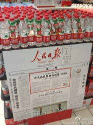
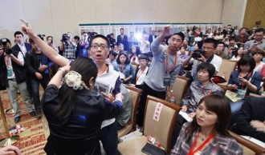

# <七星视点〉第三十八期：媒体与不公平竞争

提到食品安全，人们就会想到那些触目惊心的苏丹红鸭蛋、三聚氰胺奶粉、地沟油、瘦肉精、福尔马林小银鱼……虽说“太阳底下没有新鲜事”，毒食品的花样却似乎不断在推陈出新。国家监管机构的局限，使媒体爆料客观上成为了揭露食品安全问题、保障消费者利益的中坚力量。然而，在这次的农夫山泉事件上，公众却少有地站在了企业的背后，对一向被视为正义化身的媒体监督进行了质疑。这是怎么一回事呢？媒体对企业的监督，存在着哪些问题？

** 事件回顾**

从2013年4月10日开始，在27天的时间里，《京华时报》创造了媒体批评企业的记录：共使用了67个版面，向农夫山泉的标准门事件开炮，称农夫山泉标准不如自来水，引发了不少市民对饮用水问题的强烈担忧；农夫山泉也不甘示弱，在反驳质量问题的同时，还指出此间的一系列争论背后是国有控股饮用水企业——华润怡宝蓄意策划的，这让这场媒体与民营企业之间的矛盾更加让人感觉意味深长。令人费解的是，国家安监和质检部门在论战中几乎完全失语。农夫山泉的水到底符不符合标准，应该通过权威部门的检测，凭证据说话。可是权威部门却完全隐身，任由两家当事者各说各话，让人不可思议。

2013年5月7日，农夫山泉在北京就标准问题召开新闻发布会，期间，遭到《京华时报》记者多次打断，几度让会议现场陷入尴尬，这也引发了其他媒体记者的不满。期间，农夫山泉董事长钟睒睒表示，5月3号《京华时报》最醒目位置刊发北京桶装水销售协会发布下架农夫山泉的消息，而只有国家执法部门和政府执法部门才有权决定和执行产品下架，民间组织无权决定某一产品的下架。此前，农夫山泉官方微博披露，已经向北京市中级人民法院提起诉讼，要求《京华时报》赔偿名誉权损失6000万元。

那么，这次媒体与企业的争论，究竟是不是像农夫山泉所说的那样京华时报存在着恶意报复？这里我们暂且不讨论标准问题，不讨论到底谁对谁错，我们想问的是，为什么媒体对企业的食品安全披露会演变成企媒互斥对方“毫无根据地诬陷”？为什么一家报纸会旷日持久地批判一家企业，而这家企业的问题却不是产品质量问题只是产品执行的质量标准问题？媒体对企业的监督是否应该有界限？如果媒体变成打击竞争对手的武器怎么办？

**媒体的角色**

@路霞：个人认为，对于公众甚至竞争对手的质疑，农夫山泉应该抱着一种"有则改之，无则加勉"的态度。而非将重点放在指责竞争对手诬陷上面。如果农夫山泉能够抱着一种真诚的态度，向公众澄清一切，纵使农夫山泉的标准的确存在问题，那么凭着认识错误并承诺积极改进的勇担社会责任的态度，也会重获公众信赖——毕竟公众的监督目的为了促使企业为公众提供更好的服务，而非刻意将其一棒子打死。还可借机向公众传递一种踏实、积极听取意见并一直努力进步的企业形象。人们都喜欢谦虚地勇于承担责任的企业，而不是着急撇清关系的忘记自己责任的现在的农夫山泉。

应该说，在许多事件中，这种“有话好好说大家都是为你好”的态度并不少见，问题是，面对食品安全问题的指控，企业能抱着“有则改之，无则加勉”的态度吗？

这样的报道对企业的伤害是致命的，大多数消费者并不会去关心白热化的论战，他们看到报道后做的第一件事，就是本着“宁可信其有不可信其无”的态度拒买也许有问题的产品。漏洞百出的谣言都能让人们疯狂抢购食盐、板蓝根，白纸黑字写在报纸上的消息的无疑更有影响力。甚至，即使到最后企业自辩成功或者相关部门认定了其产品并无问题，恐怕也没有立竿见影的效果。“世界之大，又不是只有你一家出来卖。我买别家更安全”，企业要想扭转已留在消费者心中的不良印象，需要一个非常缓慢的过程，很多企业也就因此蒙受巨大损失。

所以，媒体在食品安全方面的披露报道必须小心严谨，不专业而导致的逻辑不严密甚至完全失实的报道既对企业造成伤害，也有损媒体的信用，更严重的是破坏了市场的合理竞争环境。

如果说媒体因为求证不严谨伤害了企业只是无心之失，那么抱着其他目的刻意打击企业恐怕能称得上性质恶劣了。

@刘新征：《京华时报》挖地三尺，历时数十天，用了70多个版，和农夫山泉隔空对骂，却始终无法证明农夫山泉的水有质量问题，而只能纠缠在农夫山泉使用的标准有问题，所以等于反向证明了农夫山泉没问题，而这个证明方法是最可信的。

5月2日，事情有了转折点。北京市桶装水饮用水销售行业协会下发通知，建议北京市桶装饮用水行业销售企业对农夫山泉品牌桶装水进行下架处理。京华时报头版头条报道了这个消息，一时间人们以为终于有权威部门对这场争端定调了。

然而，人们进一步发现这个所谓行业协会是个类似中国牙防组的“皮包协会”，更让人震惊的是，该协会的联系电话和北京华润怡宝水站的电话竟然是一样的。登陆该协会的官方网站：[http://www.tsxh.org/ ](http://www.tsxh.org/ )可以看到网站除了“建议下架农夫山泉”的通知外没有其他信息，甚至连个二级页面都没有，好像整个网站就是为了这个通知架设的一样。

事实上，农夫山泉之前就有声明，直指此次事件是竞争对手华润怡宝为扩大市场份额的刻意抹黑，还塑造了一个民企对抗霸道国企的悲情形象。华润怡宝回应称农夫山泉是在转移公众视线，保留对其采取法律行动的一切权利。

其实我们并没有足够的证据严谨判断怡宝是否是幕后黑手，但一个来路诡异的民间机构为何有权力宣布将某个商品下架，媒体对机构的权威性不加确认就头版头条刊发其下架通知是非常值得深思的问题。

不止如此，人们发现自称是在“行使法律赋予媒体的舆论监督报道权，维护消费者利益”的《京华时报》竟并不是利益无关的第三方：《京华时报》特供水承接北京城八区的业务，服务网络更延伸至昌平、大兴、门头沟、房山等郊区。广告称其“依托京华时报品牌影响力、信誉力、传播力及‘京华小蓝帽’渠道等优势，我们自2002年起开始运营桶装水项目”。

在农夫山泉宣布退出北京桶装水市场后，《京华时报》特供水无疑是直接受益人之一。这样的巧合未免让人浮想联翩，有这样利益诉求的媒体写出的揭露竞争对手的报道可信度到底几何，恐怕也要打一个大大的问号。

小结 

在维护消费者权益的时候，媒体的位置应该是怎么样的？可以说，这次事件进行到此，不光损害了企业的利益，亦是损害了消费者的利益。事件发生后，龙夫山泉董事长钟睒睒在新闻发布会时说：

“我们不会在北京再开工厂生产，我们只有对不起北京的10万消费者了。因为这样的环境是不可能让一个企业在这样的环境之下生产，员工们不能以正常的心智在自己的工作岗位上。农夫山泉的尊严比金钱更重要，农夫山泉的责任心，我与其说生产出不合格的产品来，影响北京的消费者，北京市民的健康，我不如说我现在就关闭这个工厂，因为一个产品的协会就可以让一个公司的产品下架，一个产品协会的决定就可以让《京华时报》把它登在头版头条，这样的环境农夫山泉只能退出。农夫山泉的尊严比金钱更重要。”

消费者权益的保障，可以说主要是通过市场竞争、优胜劣汰来达到的；在市场中，为了克服信息不对称等问题，需要媒体和政府作为客观的第三方的监督。然而在大众传媒掌控着人们的信息来源的背景下，不够客观或另有目的的报道、通过偷换概念误导普通读者的行为，极易让信息的偏差更加严重，形成不公正的市场环境。更令人担忧的是，在食品安全层出不穷的背景下，这类报道一出，许多人本能地就给农夫山泉贴上了“黑心企业”的标签，使得之后的回应丧失了部分效果。农夫山泉离开北京，将给消费者带来怎样的损失、为当地市场环境带来多大的负面影响，我们不难想象。当我们拷问企业、指责企业家的时候，媒体表现出来的非理性和不专业，最后都无益于社会经济的发展。因此，媒体必须自重，保持独立性和客观性，而不是成为不公正竞争的工具。

（编辑：张山骁，郑浩；责编：刘迎）
