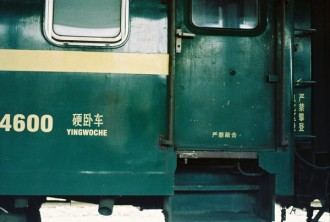
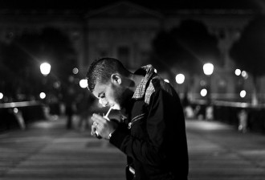

# 操火车的人

我第一次见到马可，是在一辆去某地的绿皮火车上。这相遇颇有些欧洲傻逼喜剧的意味——半夜，因为车实在受不了车速的我起来瞎晃，撞见他在车厢的连接处打飞机。

我吓了一跳，说，哎哟不好意思我过会儿再来。

马可头也没回，一边撸着一边说，没事儿，马上就出来了。

于是闲得蛋疼的我就站在一边等着他，隔着火车车厢连接处那好像皱起包皮一样的地方，隔海相背，划江而治。

我心叹果然是条好汉。年华不过一捧细沙，说撸就撸莫忍它。

马可后来说，就是因为我站在原地没走，他才觉得和我一见如故。

我说我早知少侠撸管时一腔寂寞凭谁诉，我便执剑立帐外静候将军将门开。

马可点头，说果然一见如故。

我是个特别喜欢火车的人，主要原因不是因为我喜欢看窗外向后掠去的景色，而是我穷。要是我说我目的是看景色那一定是在装逼，因为从西安到任何地方都得过无数的隧道，你看你妈啊你。

每当火车要进入隧道的时候我都觉得整列火车在与山洞性交，山洞就是大地神秘的入口，火车就像那男人的下体。蜿蜿蜒蜒地慢慢溜进那黑暗的深处，有节奏的铁轨撞击声好似那晃动的床铺一般迷人。一切的工程学就是为了人类对抗大自然而产生的，征服狂风征服河水征服天空，现在我们在征服脚下连绵广袤的大地，征服如梦中女神乳房一般高耸的山脉。

火车一直都在操大地，今天却被马可操了。在绿皮火车特有的汗味、厕所味、泡面味的空气中，在那软软黏黏的地板上。

五分钟后，已经站在那里抽烟的马可问我，你就不想问问我为什么半夜在这里撸吗？

我说，因为车已经开了两天半了，你已忍不住你年轻的躯体。

马可说不对，你再猜。

我说，因为你是学艺术的。

马可说你为什么这么猜。

我解释说，因为我觉得一切特别厉害的行为都是可以用学艺术的来解释。例如这个人为什么头发这么长，因为他学艺术；这个人为什么在裸奔，因为他学艺术；这个人为什么半夜在这里打飞机，因为他学艺术。总之一切我解释不了的行为我都用因为他学艺术来解释，就像大家所有不爽的现象都归结于体制问题一样。

马可说，哦，我就是学艺术的，你说的这些我很认同，我们不太在乎这些和外表有关的东西。

我一边点头一边拒绝了马可递来的烟。

马可见我不抽，一脸严肃地说，同学，点燃这支香烟，让光亮爆炸这黑夜。

我说不是我不觉得激情仍在向上飞跃，主要是你刚撸完没洗手。

学艺术的马可批评了我：“我们学艺术的都不在乎这些，来让我们唱完这首超载的歌。”

我反驳道我们学过生物的特别在乎，而且后面我不想唱了这歌总是手啊手的，对单身的人不吉利。

马可说，算了，我只是心情不好，我被女朋友甩了。我本来打算挽回她的，但我失败了。

我说，所以你现在要回去了吗。

“不，我这趟是过来不是回去。”马可摇头。

“她说，要让我24小时内出现在她的面前。她说完我就去买好了车票，现在这车他妈的已经开了五十来个小时了，操铁道部。“

我说那你干嘛不给她打电话。

马可说，我手机系统是安卓，前天上车过了会儿就没电了。

据马可那时候给我透露，这是他第十七次长途跋涉去哄她女朋友。在说这个的时候他挺起小胸脯，给我展示了钱包里厚厚的车票。车票的背面还有马可自己写的诗，诸如“我把我的心思包成汤圆，煮上一锅思念，又滑又甜的陪你失眠到六点”。

我一边安慰他没事我也是安卓我也没电了，一边感叹不愧是学艺术的，文学功底就是和我这种只会算算术的有质的区别。

马可义正言辞地纠正我说，我是学景观的。

我说这他妈不就是艺术科吗。

马可说不，这是悟道。人皆草木，万物不过风花雪月，天地两仪四象八卦皆在景观之中。你看学油画的，他能反映天地吗；你看学国画的，你敢让他给你画像吗。只有我们学景观的才能将人与自然和宇宙的美感完全结合。

我不屑地说你说的这不就是风水么。

马可说，操你妈。

这就是我和艺术学生马可的相遇。

不知道是不是我长得太过和善还是太像大风车董浩容易让人放心，半小时后马可开始给我诉说他的爱情故事。

这之前我曾想弄清楚故事主人公的姓名，可最终失败。在我问马可叫什么的时候，他告诉我，我叫马可，波罗的那个马可，的海的那个波罗。

于是我硬生生忍住了问他你前女友叫什么的冲动。

又半个小时后我觉得这个故事确实太无聊了，就是两个人从高中好到现在嘛。

马可否认，不，是我俩两情相悦到现在，不是好到现在，我们总有短暂的分手，我觉得王力宏那首歌就是给我唱的，情人总分分合合但我们却越爱越深。说罢马可给我扬了扬他的钱包，我知道那里面有十七张火车票。

我说分分合合那都是傻逼，顺便你赶紧切了这首歌不要再唱你的歌，太你妈难听了。

马可说你别急，下面才是重点，歌声都是铺垫。

由于马可在这个故事中一直都用她这个词在代替他的女朋友，我决定在转述的时候起名为李二鸡。一方面因为这个女的比较二，一方面我觉得比较像鸡。

艺术家马可六岁的时候，在值日的过程中认识李二鸡。

在我拍画片满地打滚三八式投篮刚开始爱着贝克汉姆的年代里，早熟的马可在这六年中一天天看着李二鸡的胸部发育起来，春心暗下。但由于李二鸡那时五官挤着像一个质点，追求完美的马可没有动手。

我们知道，宇宙是由大爆炸产生的。当李二鸡长了一阵子以后，她那质点一样的五官像百亿年前的宇宙一样爆炸四散开了。最亮的星星做了眼睛，眉毛像银河一样柔顺。由于马可说李二鸡口活儿很好，我觉得李二鸡的嘴就是黑洞，这样，一个宇宙就补完了。

高中校园中二人重逢。在大宇宙面前，小宇宙熊熊燃烧的马可再也抑制不住内心的冲动。

遥忆初相见，回首尽红尘。在本就交错的世界上两次成功对接，尤其是跟一长得还不错的妞对接，马可春心又动，于是仗剑长虹，将李二鸡夺到手。

无奈马可图样图森破，一切只是马可一厢情愿。李二鸡是个意识很超前的女人，在高中时期就懂得了“我也无所谓我看他对我还不错我就谈谈呗反正更好的来了我就分”的绝世神婊道理。我一直觉得，一厢情愿的恋爱这种事情有个物理模型可以解释的十分贴切，就是氢原子。孤独的电子围着自己的女神转，一圈又一圈，茫然错失，错综复杂，乃至不知自己下一步，转得汗泥和泪到黄昏却又寸步不离。

马可说，虽然李二鸡和很多人上过床，但是李二鸡声称自己从没背叛过他。

伴随着风从车厢某处灌进来的声音，马可无奈地说确实真的是这样。

火车到了一个小城市，站台停靠两分钟的灯光映着艺术生马可的脸，马可逆着光，把一个个字吐进黑暗中：每次她跟我闹分手，她就说我们分手吧，然后去和别人上床，上完了在和我复合。

我靠着车厢笑得跟傻逼一样。我说我操你这不是扯淡吗，感情你24小时内不回去她就和别人上床啊我操，上钟呢这是。

马可抖了抖身子，说，根据我的计算，现在可能已经高潮了。

那半年里我一直以为马可是瞎说，直到后来我接连听到了两三个这样的例子，我才不由得相信他的故事。然后我问马可，那你为什么还不分手。

马可问我道，身体和情感出轨你更不能接受哪个。我说少侠我哪个都不能接受。

他默然。

马可问我说，你有没有觉得有个人，你俩在一起的时间太久了，就怎么也分不掉，再分也得合回来，什么事儿都得合回来。

我说对，这个叫欠操，她跟你操蛋，你日一顿就服了。要是一直这样，你干脆就别处了。

马可说可我觉得她厌烦了，所以找别人。

我说那你甩了她得了。

马可摇头，不，她堕过胎。

“活逼该！快甩！”我振臂高呼，像十X大上的核心一样鼓掌。

“ 不，是我的，那次我根本没陪她去，她成这样就从那时候开始。”“所以都怪我，你让我能怎么办。”

我说这尼玛上钟这么多次都两清了赶紧分手吧。

马可说不，我们学景观的注重人和，我们不轻易破坏这个平衡。

我说去你妈，绿巨人，你俩真傻逼。我要去睡了。

至今我铭记和我共度了一整趟列车时间的马可，只因为这段故事。通俗易懂地来讲，每个你好了又分分了又好的女人背后都可能有一打她被别人日的故事。

临走前的时候我问马可，你到底刚才为什么在打飞机。

马可说，我在想她的身体，若是那时候她真的在和别人上床，加上我也是3P。

我说操你个傻逼同时操你这个无趣的故事祝你俩分手快乐你可以找到更好的。

马可接着哼着他递烟时候的那首歌，和我一个向硬座一个向卧铺走去。我那时居然觉得马可步履轻盈，心中一点都不沉重。

躺在那里我开始想马可的故事，想我是不是也有过这种难受的跟狗似的却死活不想放手的时候。可想来想去都没有马可这么惨烈。

我醒来的时候已经是中午，昨日马可撸管的地方站满了抽烟的人。被马可操过的火车行驶依旧，如同马可被操过的女友最终仍然会和他和好一样。

可我总觉得有什么要给马可说，是劝他还是什么，或者告诉他其实我觉得那首歌挺好的。

马可临走前最后告诉我，我们学艺术的，爱恨悲欢，青史风尘，都不太注重。你能确定睡你旁边的媳妇儿没干过对不起你的事情吗？你不能。你能确定你遇见的任何一个人在你不在的时候没干过恶心的事吗，你不能。反正都是怀疑，最终步入原谅。我们学艺术的，大梦似长歌。

这真是我人生中听过的最傻逼但最不好反驳的话的第二名，仅次于“你说他不行，你行你上啊”。突然我也想学艺术，就算活不到漫步江上月悠悠舟里人那份上，也得体验一下心似双丝网中有千千结的傻逼风范。

此后我又坐了好多次火车，再没坐过绿皮。不是我心里有阴影，主要我怕手机没电。有时候列车窗外能看到一辆绿色的火车或停或缓缓行驶，我都会想上面有多少个不顾千里就跑回来见自己女朋友男朋友的人，又有多少是徒劳。一列列火车载着思念载着信息载着怨恨乃至载着精液，丁零当啷远去，那些你该考虑的在一起不在一起，就像你做爱时候床铺的旋律，就像你握着下体时想念那个人的名字一样，随着快感和其他担忧的节奏，渐行渐远，直到慢慢看不见了。

采编：陈静；责编：刘铮

[【求不得】《孔雀东南飞》：沉默的好爱情](/?p=37460)－－直到夫子的教化被推翻，直到“千秋万古，为留待骚人，狂歌痛饮，来访雁丘处”，直到此时此刻，你和我，以及其它所有人都能够自由地用一切溢美之辞来赞美爱情的时候，我们能有比焦仲卿更圆满的爱情吗？

[【求不得】黄依依 ](/archives/37678)－－于是街道办出现了两个声音，女性职员说黄依依连耿市长都骂，真是人人得而诛之。胆小怕事的几个男性职员则说黄依依连耿市长都骂，真是千人骑万人压的贱货。

[ 【求不得】蓝移](/archives/37726)——老杨是小镇的骄傲，县中的佼佼者。如愿考上这所百年名校，读他钟爱的物理。春秋是乖巧的上海女孩，一路顺风顺水，一分之差没进管理学院，调剂到物理系。

[ 【求不得】曲奇](/archives/37824)——侦探先生受托调查一位丈夫的外遇，却发现其情人是自己妻子。他检讨自己疏于陪伴，搁置工作回到家中，试图挽回女人的心。勉强维持了几日尴尬而平和的居家生活，妻子的手机突然响了……
