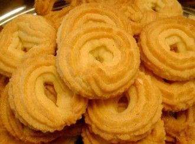
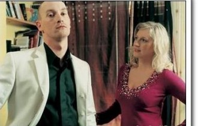
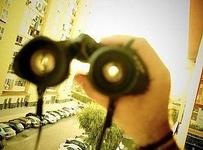

# 曲奇

我从妻子的身体里抽出疲软的阴茎，脑中即刻浮现出她和那个男人在床上翻滚的场景。为了缓解内心的尴尬，我让她含住我光秃而丑陋的龟头。看着那漂亮的脸蛋，我的心情也渐渐舒缓了下来。抓住她的头发，摁下她的头，随着被含进的部分越来越多，我清醒过来，告诉自己：什么都别说，不会有什么坏处。“啪”地关掉床头灯，房间便如同合上的情色小说一样暗了下来。尽管纸上仍旧写满了龌龊的字句，但只要我假装没事，一切便又体面了起来。

我们的婚姻来到了第五个年头。五年从来不是一个很长的时间，但却让我从一个年轻警察成长为受人认可的私人侦探——可这又怎么样呢？我能敏感地觉察被调查者的一举一动，对自己妻子的所思所想却一无所知。我甚至不能确定，在这五年里，上帝是不是把露丝调包了：收走了她，又派来了一个看起来一模一样的女人。只要我足够粗心大意，我依然可以与她拥抱、接吻，可以蹭她的额头，可以对她挑三拣四——如此地粗心大意，就像我一直做的。

而现在，这个女人，不，还是我的妻子，正一丝不挂地躺在我身边，半梦半醒着。我慢慢把身体从被子里挪出来，微微直起上身，把脑袋靠向床头。看着她，柔软而紧实的身体随着呼吸的节律起伏着。我把被子拉到她的肩头。她便把脑袋埋在松软的枕头里，只露出半张脸——温驯、乖巧，像极了一只小奶猫，那么地惹人怜爱……她怎么会背叛我呢？

五年的婚姻里，她给我的感觉一直都是这样平静和舒适。她从未成为希望的一部分，也未曾给我的生活带来过什么希望。但至少，我不必调查她，不必接到街道来自她的委托电话，不必像对待房东一样提心吊胆，不必像面对老父母一样顺从而担忧……她几乎什么都不是，但她的确把我的忙碌奔波暂停了。这就是生活：在房子里放个女人，看上去就像在疑问句后面放一个问号一样自然而然、不足挂齿。可是，却真地有出乎意料的美好效果，不是么？非要说的话，她唯一的缺点就是做不出好吃的曲奇……不是我在挑剔，但那玩意实在是太难吃了——她几乎是带着某种宗教狂热在坚持做那么难吃的曲奇。

直到此刻，我依然无法接受这样美好的妻子竟然就是被调查者的外遇对象。但是，看着她的面庞，正和照片上的那张脸一模一样……更不用说那件熟悉的外套——我多么希望我弄错了点什么，但是……我却是个私人侦探。

我坐在床上，呆滞地看着前方，像一只忧郁的猫头鹰，看着卧室里的陈设开始从黑影里一点一点地浮现出来，分成黑色和灰色。我感到自己在参加一场葬礼：露丝和我这场婚姻的葬礼。是啊，它就要完了，就要被埋葬了。她和霍利先生的婚外激情？到了这种时候，再讨论这些又还有什么意义呢？无论流感，还是癌症，只要最终死掉，这些就都不再值得一提了。我开始回顾这五年里的细节，像将死之人回味自己的一生。的确，我陪伴她的时间太少了：忙于经营事务所，一连十来天不回家的事情时有发生，近一年来更是如此。或许，我要做的，只是停下手里的工作，多陪陪露丝。或许这样，她就会离开那男人。或许，我也应该做好最坏的打算——我真的在这么想。我无法轻易地埋葬这段婚姻，想必是它还没有彻底死掉。哲学家们很早就发现：埋死人要比埋还差一口气的那些容易得多——这甚至成为了医院判定临床死亡的“黄金标准”。

“也许吧，亲爱的？” 想着，我小心的钻进被窝。大概多少受到了一点惊扰，露丝在睡梦中伸出胳膊抱住了我，嘴里发出粘滞的哼哼声，旋即又安然入梦——我想，我真地应该抽出时

间多陪陪自己的妻子。兴许，一切都会回到往昔。只要我假装没事，她就会离开那个男人，婚姻生活又再一次体面起来。我闭上眼睛，感觉到她呼吸轻柔地扑打在我的脸上。

我这么闭上眼睛，直到天明却都未能入眠。仿佛始终有一个看不见的男人盘踞在床边，盯着我的脊背。

“是你么，理查德· 霍利先生？”

我很想这么问。可是，我假装没事。

回到家中的第四天，像前面三天一样地正常：太阳升起来，什么都能看见，大家都在忙碌，狗张开嘴巴，没有发出“喵喵”的声音——非常正常。随后，太阳渐渐收起光线，我倚在沙发上，享受着这尴尬的和平年代。露丝应我的死缠烂打，在厨房里烤着曲奇。我热爱这种日复一日，特别是在确认露丝外遇之后。我不愿意出门，即便留在家里无所事事也比出门好。即使这种无趣的循环吞噬了我的青春和笑容，也比可能出现的新情况让我安心。再说，我也没有什么青春和笑声可供吞噬了——不是这样的么？我的对手，不是露丝从出轨中获得的激情，而是妻子对婚姻的厌倦。我需要多一些时间。或许，我会有办法把日常生活变得像烧开的水壶一样活泼。

露丝终于从厨房里走出来，像一个登上舞台的歌剧演员，把一盘曲奇放在茶几上。随后，她用表演般的夸张强调说道：“亲爱的，尝尝这次的曲奇烤得怎么样。”

“考虑到牙齿……”拿起一片曲奇，我朝露丝做出一个掰不动它的姿势，“我想我还是吃盘子好啦。”

“吃东西的时候闭嘴很难嘛？！”露丝叉起膀子，故意做出生气的样子。

“不难不难，嘴里含着这种曲奇哪里还是在吃东西……”

“知道太硬了还磨着我要吃。”

看着她的神态，我仿佛回到了和她新婚那会儿，我笑着与她争执：“知道太硬了你不还是做了五年都没有改观么？”

“闭嘴，吃！”露丝无奈地笑起来，坐在我左手边的沙发上。

“含着这么硬的曲奇，让我怎么闭得上嘴。”

“牛奶。”她把桌上的牛奶推到我的面前，脸上是俏皮地假威严，“喝，不要说话了，你被关禁闭了，张嘴就挖苦我的混蛋。”

“不过，亲爱的。”我拖腔拖调，对露丝做了个鬼脸。

“无趣的家伙……”

“你知道谁最喜欢你做的曲奇么？”

“谁？”她把身子往前一倾，去摸电视遥控器。

“埃及人。”

尽管我故弄玄虚地顿了下，但事实证明这是自取其辱——露丝的表情不茫然，也没显露出什么继续下去的兴趣。我只得给

自己打了个无比尴尬的圆场：“好吧，因为他们要修缮金字塔了。”

露丝没有接话。她打开电视机，把频道换到自己最喜欢的电视剧开始看。我无聊地继续靠在沙发上，打量着茶几上盘子里的曲奇。从相识开始，露丝做的曲奇从来没有好吃过。更加可怕的是，这种不好吃连细节上的变化都没有过：不是从一种难吃到另一种，而是始终如一的。慢慢地，你会相信：一个一直做这样曲奇的家庭主妇，也不会对改进自己的厨艺有什么期待了——当然，作为“曲奇战士们”长期以来的活靶子，我，也是一样。然而，我却会不断地为了如此难吃的曲奇对妻子软磨硬泡，她也会一再推脱却一直做下去，然后又是电影经典对白般的挖苦和抱怨……乐此不疲。我们想必都相信：这是属于我们的“经典对白”、“独家回忆”。

这几乎是由人类庸俗的本性决定：我们总是要渴望不同的，每个人。同样的，我们希望我们的爱情也能成为“独一无二”，希望彼此都是不可替代的。我猜测，正是出于这种心态，情侣们才热衷于用宠物般的名字称呼彼此，猪狗牛羊。大概只有用这样极端肉麻，以至理智尚存的人都不会采用的方式，才能赋予爱情一点点个性。露丝和我的“曲奇对白”也是如此——一种属于我们婚姻的“地下趣味”。开始的时候，一切运转良好，可

是最终，露丝还是腻味了。而我这边的情况，目前看来，似乎也不甚理想。 但至少，试着用这样夫妻间的“独家记忆”来唤醒背叛的妻子对婚姻的热情，兴许还会有点作用，不是么？我踏着拖鞋走进厨房泡了杯咖啡，端着杯子走出来。露丝依然直愣愣地盯着电视机屏幕，尽管还是节目前的广告时间：一个女孩儿正在公园里慢跑——真是蠢透了！好像她假装没事就真的健康起来了似的。

“亲爱的，能把电视机关掉么？”我喝下一口咖啡，问道。

露丝依然没有看我一眼的打算，她盯着电视反问：“怎么了？”

“它开太久了，我觉得它快脑死亡了。”我努力找到了一个跟曲奇没什么关系的句子，然后自作聪明地卖了个关子，继续说，“我想我也差不多。”

电视机依然开着，露丝心事重重，想必是刚刚的对话让她感到沮丧。而原本便很沮丧的我痛苦地发现自己根本无从插话，变得更加沮丧：什么都没有剩下，除了曲奇，狗娘养的曲奇。我把咖啡杯放在曲奇边，一屁股坐进沙发。伸手取了一片，奋力咬下一口，像长颈鹿一样表情扭曲地咀嚼着。我几乎能感觉自己两侧的咬肌正在二次发育。我盯着电视机屏幕，任凭电视剧里的角色吃喝拉撒，在我眼前合力摇晃着双人床——完全不为所动。此时，我的脑海里只有一句话：什么都没有剩下。

露丝的手机响起来。迅速拿出手机看了眼屏幕，她并没有接起，而是起身径直进了屋。脚步轻快自然，没有丝毫地迟疑：仿佛秘密仍旧是秘密。我望着她的背影，想象着睡袍下湿润而温热的身体，那曾经深深陷在霍利先生床中的身体。这样想着，此刻，我心中竟然没有了一丝怒火。取而代之，我的阴茎悄然直立了起来——倘若她不是我的妻子，而是我的情人，那还有多好啊！想到这里，我方才妒忌起那个叫做理查德· 霍利的男人。

我想操她，不是做爱，而是操——像夜晚寂寥的路边窜出来的陌生男人那样，而不是丈夫对妻子：我会从身后抱住她，她必须挣扎，她必须尖叫……而我会扯开她的衣服，把她摁翻在地；我会在她的嫩脸上抽耳光；我会掐住她细长的脖颈……直到她停止反抗，哭喊着“不要”、“放过我”，我才会粗暴地分开她的双腿，把又脏又硬的阴茎插进她因为恐惧而干涸的阴道。撕裂般的疼痛和心中的不甘使她哀嚎，直到她的下体渐渐湿润，嚎哭开始被喘息取代。她依旧会求饶，仿佛一个贞洁的女人。我会逼迫她叫我“霍利先生”。我会告诉她，只有这么做，我才会考虑放过她。她会在羞耻中达到高潮，像一堆烂泥一样躺在地上。一切到此为止，我会挺着我的阴茎站起来，看着地上的她。唾弃？辱骂？嘲弄？不，我只想笑：

“哈哈哈哈哈哈哈哈哈哈哈哈哈哈哈哈哈哈哈哈哈哈哈哈哈哈哈哈哈哈哈哈哈哈哈哈哈哈哈哈哈哈哈哈哈哈哈哈哈哈哈哈哈哈哈哈哈哈哈哈哈哈哈哈哈哈哈哈哈哈哈哈哈哈哈哈哈哈哈哈哈哈哈哈哈哈哈哈哈哈哈哈哈哈哈哈哈哈哈哈哈哈哈哈哈哈哈哈哈哈哈哈哈哈哈哈哈哈哈哈哈哈哈哈哈哈哈哈哈哈哈哈哈哈哈哈哈哈哈哈哈哈哈哈哈哈哈哈哈哈哈哈哈哈哈哈哈哈哈哈哈哈哈哈哈哈哈哈哈哈哈哈哈哈哈哈哈哈哈哈哈哈哈哈哈哈哈哈哈哈哈哈哈哈哈哈哈哈哈哈哈哈哈哈哈哈哈哈哈哈哈哈哈哈哈哈哈哈哈哈哈哈哈哈哈哈哈哈哈哈哈哈哈哈哈哈哈哈哈哈哈哈哈哈哈哈哈哈哈哈哈哈哈哈哈哈哈哈哈哈哈哈哈哈哈哈哈哈哈哈哈哈哈哈哈哈哈哈哈哈哈哈哈哈哈哈哈哈哈哈哈哈哈哈哈哈哈哈哈哈哈哈哈哈哈哈哈！”

想着，我拿起剩下的半块曲奇丢进嘴里，直到妻子带着笑从房间里走出来。仿佛那里面有个男人，刚给她带来了莫大的满足——而那个人，不是我。我看着她坐下，心不在焉地继续看电视。我焦虑地咽下嘴里的曲奇，不顾它们划痛我干燥的食道。可张开嘴巴，我说出来的却是：

“谁的电话？”

“嗯？”露丝笑着，却用极快的语速说，“好朋友哦。”

“好朋友？”我努力克制心里的轻蔑，继续说“我也想做我老婆的好朋友。”

“高中同学啦。”

“是么？哪个高中同学？”

“哎呀，问那么多干嘛。说了你也不会认识的。”

听到这些，我感受到了自己的愤怒。无法再做出轻松的语调，转而追问：

“男的，女的？”

“还用问，当然是女人啦。”

还用问，当然不是。即便真的不是霍利先生，我也更愿意相信是另一个男人——尽管这种可能性很小：她不是那种人尽可夫的人。我确信这点……不过，如今，谁知道呢？是否要拆穿谎言带来的犹豫彻底打乱了我的思维，我不知道要不要问下去，也不知道要问什么。就算我最终想到了，也不再有这样一个时机：一遍遍的刨根问底，既不能让她觉得舒适，也无法使她痛改前非。露丝默默盯着电视机前的地板，我端起咖啡，积累吃下一片曲奇的勇气。

“亲爱的，这么多天了，都不去事务所么？”

露丝忽然开了腔，这轻描淡写但意图分明的问话像一颗轻巧的子弹，若无其事地穿过沉默钻进了我的大脑。天呐，我死了么？没有，那我得交出一个回答才好。

“没关系的，难得在家，当然想多休息几天。只要能陪着老婆，就算是变成鲨鱼，我也会把曲奇吃完的。”

“混帐。”她自如地笑着，撒了一个比曲奇还硬的娇，“陪着我就这么痛苦么？”

“啊……”我如是应了一声，仿佛暗恋中的少年被旁人无心地说中了心事。

“喏，去做自己喜欢的事吧。”妻子的脸上浮现出一种人生导师般的慈爱，“你看你在家那副没精打采的样子。”

我想我说点什么岔开这个话题么——我可不想被从我的家里支走。可是搜索枯肠，不那么尴尬的，也就只有曲奇饼。我们的婚姻就剩下这些无用之事了么？我最终绝望地抬起头看着我出轨的妻子，莫名其妙地说：

“谢谢。”

“当然，我可是成功男人背后的那个，唯一的那一个。”她开心地说着，那种骄傲的神态终于令我感到恶心，“哪个女人希望自己的丈夫明明有重要的事，却因为要照顾自己天天在家无所事事？我可不要。”

“但是……”我不得不哀求，“我还是陪着你吧。”

“弄得我好像很任性似的。”她在向我撒娇，仿佛她依旧是我的女人。

“没有没有……哪怕是做曲奇，展示出的也是超乎常人的毅力。”我想着未来，象征性地做最后一点无味的抵抗，好让自己看上去不那么狼狈——像是个寻找借口的孩子。

“好好做自己的事业吧，亲爱的？”

我耸了耸肩，说：“嗯，你赢了。”

“这才对嘛。”她开心地几乎要栽倒沙发后面。

“是啊，”我端起咖啡，“看来我真的有事要做了。曲奇端走吧，我实在吃不下去了。”

事务所的办公室里空荡荡的。我坐在办公桌前，对着电话机发呆：它才是这个封闭的房间里真正的大门——一切从这里走进来，从这里走出去，来自这个城市电话所能接通的每一个角落，去往我视野之内之外的任何地方。只有在这里，我会感受到“私人侦探”这个角色给予我的权力：窥视秘密。阳光从背后的窗户穿过，落在脚下，墙壁上的挂钟告诉房间里的所有人：现在是下午两点。 大约半个小时之前，当我向我忠贞不渝的妻子，露丝，告别。她的脸上绽放出孩子般明媚的笑容。是，这就是那个站在我背后的女人。一直以来，孩子气的她

也可以让我感到平静。而现在，一切都变了——别相信孩子：比起成年人的处心积虑，他们有过之而无不及。同时，出于无知，那种伤害更加深重、强烈。

我拿起话机，拨通了露丝的手机，忙音，家里的电话，两声以后，接了。

“亲爱的。”我说。

“嗯，怎么了？有什么东西落在家里了么？”

“你还在家里么？”我问着，不自觉地，带上了工作中冷漠的口气。

“当然，不然我在哪儿？”同样地冷淡。

“我今晚不回去了，事务所里忽然接了几个新的委托。”

“真的么？好。”

顿了一会儿，露丝补充说了本来等着我回家一块儿吃晚饭，以及种种。我没有应声，“啪”地挂掉了电话。 真的么？这不重要。她一定没预料到事情会如此顺利：支走我的第一天，我便给她提供了见情人的机会。一块儿吃晚饭——多么温馨的说法，听上去还真的充满了妻子对丈夫的情真意切哩！当然，我也相信过。而如今看来，我不得不说，我可真是蠢到了家——我甚至蠢到乐此不疲地吃那肮脏的曲奇！

我靠进办公椅，摸出一支烟叼在嘴里，打着火机，点燃。干燥的咽喉几乎快被呛得着起火来。我错怪她了么？或者这一切都不过是我神经兮兮的想象？我叼着烟，低头打开抽屉，拿出那一沓照片。烟雾翻滚着升起，挡在我与照片之间——但照片上的一切却依然清晰，比烟雾更加刺眼。

两个月前，我收到雪莉· 霍利的委托，负责调查她丈夫的婚外情——这对于私人侦探来说，无比寻常，委托，或是遭到背叛：即使你依然美貌，家业殷实，也很难保证自己的男人循规蹈矩。而一个月辛苦的调查以后，霍利太太的猜测得到了证实。很难说这是好事还是坏事，特别是在她没有下定决心摊牌的时候。看着照片上怀抱着别的女人走进情人酒店的丈夫，雪莉嚎啕大哭，以至于我不得不说些什么，给予她一点安慰。但是，她不知道的是：她丈夫怀里搂着的那个女人，正是我的妻子。在接下来的一个月，我坚持着把手里剩下的委托处理完，反复确认那个令我痛苦和愤怒的事实，并为今天回到这里做了一些准备：所谓“最坏的打算”。

我一遍又一遍地回想这些，根本不知道自己吸了多少根烟，也不知道自己当时是先认出了不忠的妻子，还是先拍下了作为证据的照片——后者么？因为我是个尽职尽责的私人侦探。可真是个莫大的嘲讽，我不禁微笑着点燃另一支烟。有时候，嘴里的烟卷几乎烫到了我干裂的嘴唇，我才反应过来，把它在烟灰缸里捻灭……直到烟灰缸被塞满，时针指向四，霍利太太打来电话，我才从无法停止的回顾中清醒过来。

“您好，考克侦探么？”

“您好，贾维斯· 考克。”我漫不经心地回答着。

“贾维斯，是我。”

“怎么了，雪莉？”

“他半个小时前出去了。”雪莉顿了下，用后半句更加完美地验证了我的猜测，“他说他今晚不回来了。”

“这样啊，”我几乎笑出了声，“他有说他去干嘛去了么？”

“没有，我没问。可是，谁又不知道他是去干嘛的呢？”

是啊，谁不知道呢？我笑着想，同时用关切的语气说道：“别难过，雪莉。我待会儿开车去你家，到时候我们再细说。”

“帮帮我，贾维斯。”雪莉几乎带着哭腔，“我真的地很想你。”

我挂掉电话，对着面前的空气愣了一会儿。而现在，我只想笑。我把那些照片放进外套口袋，同样的，还有桌上的车钥匙。我拿出和妻子新婚之时的合照：那里有露丝，有我，有微笑。虽说照片上表现出来的情感，出于保存的目的，总是要比真实的版本更加夸张。然而，谁又能否认，那时候的露丝和我是发自内心地相爱着呢？看，照片里年轻的夫妇笑得多么甜美——哪怕是装，我现在也装不出如此开怀的笑了。我笑着把照片丢进纸篓，拨通了露丝的手机，两遍以后，她才接起。

“露丝，你在家么？”

“嗯……”她应着，“当然啦。”

“那可真好，真不愧是我的妻子。”

“快说，怎么了？”

“哦，这样……”我抬起头看了眼墙上的挂钟，“我今晚回去吃饭。事情有点变化，没那么着急了。”

电话里安静了几秒后，传来露丝的声音：“那大概几点到家？”

“最迟七点。”挂钟指向四点半，“做点曲奇哦，亲爱的。”

“可能来不及吧？”

“怎么会？这才几点。”

“不是……那我出去买一点，好不好啊？”

“好，我知道了。”

说着，我挂掉电话，走出了办公室，去霍利家。

五点左右，我到了霍利家。雪莉帮我开了们。关上大门，当这委屈隐忍的少妇转过身准备走进客厅的时候，我一把抓住了她的胳膊，从她身后将那柔软而压抑着欲望的身体搂入怀中。

“天呐！……不要！……你说过不会再这样！……考克先生！”

雪莉·霍利魂飞魄散般地叫着，在我的怀里扭动、挣扎着，却从未把我在她身上乱摸的双手推开。我继续吻她的脖颈，霍利太太沉静抑制的呼吸变得急促，饱满的胸脯在渐入昏暗的空气里起伏着。她的挣扎渐渐停下。我松开抱住她的手，开始解她衣裙在身后的纽扣。这时，霍利太太一直回避我的嘴唇也随着转头轻轻凑了上来——那饱满的嘴唇几乎为接吻而生。

衣裙滑落在门前，再没人去管它——无论是我，还是已经被征服的雪莉·霍利。当我抱起听任摆布的雪莉走进卧室，她的身上已经只剩下了胸罩和内裤而已。我将她扔到床上。她看着我在黑暗中脱去衣裤，随后向床上的自己靠近。霍利太太颤抖着身体，想要支起胳膊。可惜，甚

至未能将上身抬起，她娇小的身体已经被重重地压在床上。脱下她内裤的时候，这女人竟拉过被子的一角遮住了俏丽的面庞，留下湿热的下身暴露在我面前。这种偷情女人的羞怯令人发笑，她却轻轻地说道：

“我发誓，你是唯一的一个，而这是最后一次。”

我揭开被角，分开她的双腿。心想：谁会在乎这些呢？

一个小时以后，霍利太太那散发着芬芳的身体已经彻底地化在了床上。我打开灯，赤身裸体地在屋里走动着，像男主人一样扫视着每一个角落，享受着胜利带来的愉悦：床上躺着理查德· 霍利的妻子。我拆开一包他的卷烟，抽出一支，点燃后衔在嘴里，又倒了一杯白兰地。我端着酒杯向床边走过去。喝下一口酒，我开始收拾衣衫。床上裸着身体的女人几乎用含着眼泪的温柔眼神望着我，倾下身体，索要一个拥抱和吻作为安慰。我穿好衣服，再次将她抱进怀里，没有再松开——我对安慰女人并无兴趣，只是时间快到七点了。

逼近了击碎他们天堂的时刻。

当理查德· 霍利先生站在卧室门口的时候，时针凑巧指向七点，不多不少。我想，露丝应该已经到家了；我想，霍利先生已经看到他妻子留在门前那些衣裙了；我想，他已经看到自己赤身裸体的妻子了——那女人向疯子一样尖叫起来，指责我欺骗了她。

霍利先生，你看见我嘴里衔着的烟了么？你看见我手里端着的白兰地了么？它们都是你的，刚刚在我身下尖叫的女人也是你的。喔，霍利先生，看你震惊的样子。我想，你大概还不知道：过去的几周里，我时不时就会这么在您家和您的妻子做爱，就像这样……我想，我应该把这些如实地告诉您。请不要恼羞成怒，霍利先生，更不要扬言离婚——您的生活已经被我变得比您所能理解的复杂。我想，您大概不知道自己外遇的证据正在我的口袋里。现在，我把这些告诉您，霍利先生。无论如何，请您振作起来，让我多享受一会儿这种快乐和满足。

当我最终开车离开霍利家，身后留下的，是巨大的混乱——当然，这还不够。

衔着烟，我回到事务所。挂钟指向九点。拿出手机，一个未接来电：露丝打来的——我原以为会被她打爆呢，哈哈哈！亲爱的，我今晚不回去了，明天见……我的离婚协议书哪里去了？哦，在照片下面。我想，我应该给我的律师朋友打个电话，约她出来再好好聊聊——是的，她，我的新女友。

（采编：刘铮；责编：刘铮）

[【求不得】操火车的人 ](/archives/37613)－－我第一次见到马可，是在一辆去某地的绿皮火车上。这相遇颇有些欧洲傻逼喜剧的意味——半夜，因为车实在受不了车速的我起来瞎晃，撞见他在车厢的连接处打飞机。

[【求不得】黄依依](/archives/37678) －－于是街道办出现了两个声音，女性职员说黄依依连耿市长都骂，真是人人得而诛之。胆小怕事的几个男性职员则说黄依依连耿市长都骂，真是千人骑万人压的贱货。

[【求不得】《孔雀东南飞》：沉默的好爱情](/?p=37460)－－直到夫子的教化被推翻，直到“千秋万古，为留待骚人，狂歌痛饮，来访雁丘处”，直到此时此刻，你和我，以及其它所有人都能够自由地用一切溢美之辞来赞美爱情的时候，我们能有比焦仲卿更圆满的爱情吗？

[ 【求不得】蓝移](/archives/37726)——老杨是小镇的骄傲，县中的佼佼者。如愿考上这所百年名校，读他钟爱的物理。春秋是乖巧的上海女孩，一路顺风顺水，一分之差没进管理学院，调剂到物理系。
