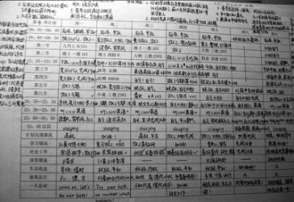

# 蓝移

老杨是小镇的骄傲，县中的佼佼者。如愿考上这所百年名校，读他钟爱的物理。

春秋是乖巧的上海女孩，一路顺风顺水，一分之差没进管理学院，调剂到物理系。

大一时，大家仿佛都没什么心思念书，只有老杨苦读不辍。大家一窝蜂地参加学生会，又一窝蜂地退出，老杨坚持了下来，成了一名摄影干事。系里配给他一台老式海鸥牌相机，几卷柯达胶卷。虽然只干了一年，也让理工男老杨增添了几分文艺情趣。老杨的作业和实验报告是可以随便抄的，这种普渡众生的情怀在学霸界尤为难得，这关系到一个学霸的自我修养。有了这种修养，老杨就不再是一个普通的学霸，而是一个文艺的学霸，一个有道德的学霸，一个脱离了低级趣味的学霸，一个有益于人民的学霸。

春秋号称物理系百年第一美女，这是实话。当然，本校前50年没有物理系，后40年的物理系没有女生。只是近年来物理系沦为调剂专业，每年总有一两个女娃从管理、软件之类的热门掉下来。虽说聊胜于无，到底狼多肉少。到了我这届，居然凑齐了七个女孩，人称“葫芦七姐妹”。春秋排名第一，是理所当然的大娃。能不能从学长那里搞到全套的实验报告全靠她了。那时上专业课，第一排坐着七个男学霸，第二排坐着七个女生。怎么说呢，每个成功的男人背后都有一个女人。

老杨是正派孩子，大一时我们在宿舍集体观摩爱情动作片，跑来串门的老杨吓了一跳，好久憋出一句，“不犯法吧？”。往后每回看片，老杨准时串门，不是找老汤讨论高阶方程，就是问我借小说，借完还赖着不走。大二时老杨已经熟门熟路，进门招呼都不打，直奔傅同学那台五毒俱全的电脑，打开D盘“学习”目录下的“刚体运动”，津津有味地欣赏起自己喜爱的女影星。大三时“刚体运动”下新建了文件夹“老杨的最爱”，老杨羞涩地表示毫不知情，硬说是我陷害他。大四时老杨用奖学金买了台电脑，从此再没找我借过小说。倒是有一回把自己关在宿舍苦学英语，大声朗读音标“喔～喔～喔～啊～啊～啊～呜～呜～呜”，声情并茂栩栩如生。门口围拢了半个楼道的男生，都以为老杨想开了，以身作则自导自演。

春秋是个绝顶聪明的女孩，平时不显山不露水，也不见她如何用功，考试成绩却总名列前茅。春秋的功夫在考前三天，她“傍”上一男学霸，借他的笔记，一块去自修，还眨着水汪汪的大眼睛，“偶霸，这道题再给人家讲讲嘛”，“偶霸，你好厉害哦，这样的方程都会解”。“偶霸”顿时酥软了。咽了咽口水，把自己珍藏的小经验小秘诀一股脑儿传授给了春秋。一门考完，正打算找春秋一块去回民餐厅吃炒饭，顺便聊聊自己多年来在熵函数方面的心得，却心碎地发现春秋跟另一个“偶霸”自修去了。成绩公布，“偶霸”们发现自己居然考不过春秋。此时的春秋已恢复女神的作派，举手投足间不再春意盎然也不再暗送秋波。懊恼不已的“偶霸”们想起《天龙八部》中那个专吸高手内力的丁春秋，“春秋春秋”就这么叫出来的。

那年冬天，一场狮子座流星雨如约而至。我们在操场上铺张报纸，一边仰着头一边冻得瑟瑟发抖之时，老杨利用“前干事”的职务之便，带春秋去了物理楼的天台，居然摆了两张躺椅和一个热水瓶。两人喝着热茶数着流星没准还唱着歌，老杨说，看见那颗蓝色的星吗？正在靠近的恒星，发出的光是偏蓝色的。春秋说看见了，那叫蓝移，偶霸你说过的。老杨又问，知道星星的等级怎么分吗？春秋说不知道。老杨告诉她，最亮的是O星，随后依次是B星A星F星G星K星M星。那是星星们在说，Oh, Be A Fine Girl, Kiss Me。黑暗中，他感到了春秋温热的嘴唇。

从此，老杨成了春秋的固定“偶霸”，我们担心老杨的童子功抗不住春秋的吸星大法，没准哪天早上喝着一碗冷粥就撅过去。临近毕业，老杨日见忧伤。散伙饭上，两人旁若无人地拥抱，春秋的眼泪打湿了老杨的肩膀。老杨直升本校，攻读天体物理，春秋远赴美国。走的那天，春秋的爸妈不让老杨去机场送她，从不喝酒的老杨醉倒在天台。过了很久，有一回大家说起春秋，我开玩笑说不知在美利坚，春秋的吸星大法还管用不。没有人笑，回头一看是老杨，一双血红的眼睛死死盯着我。

又过了很多年，春秋嫁给了华人教授的儿子，又拿到博士学位留校任教，再回母校已是“访问学者”的身份。讲座结束后，稚气的小摄影干事忙着给她和领导合影。春秋想起了老杨。她向系领导提了一个要求，想看看当年老杨拍下的胶卷。胶卷好不容易找来了，和那台海鸥牌相机一起锁在一个落满灰尘的柜子里。春秋回到芝加哥，在全息实验室把胶卷全洗出来。除了那些正襟危坐的领导，春秋看见自己一本正经地做着实验，竞选班委时怯生生地演讲，运动会上举着“物理系”的牌子，舞会时搂着别的男生的腰，听着无聊的学术报告打瞌睡。那么多那么多，全是她。梳着短发，青春逼人，那是她在老杨眼中最初的样子。

每一张照片，记录的不过是镜头后那双深情的眼睛。

她想起了那场遥远的流星雨，想起星星们说的话。蓝色的星光代表我爱你。可惜相隔多少光年，即使是光速，也要多年后才抵达你的眼睛。那颗星或许早已湮灭，消失在茫茫宇宙里。

她向夜空望去，那颗已经不在的星，依然发出温暖的光芒。

**原文地址：**[http://blog.renren.com/blog/223694016/898275193](http://blog.renren.com/blog/223694016/898275193)

(采编：陈静；责编：刘铮)

[【求不得】操火车的人 ](/archives/37613)－－我第一次见到马可，是在一辆去某地的绿皮火车上。这相遇颇有些欧洲傻逼喜剧的意味——半夜，因为车实在受不了车速的我起来瞎晃，撞见他在车厢的连接处打飞机。

[【求不得】黄依依](/archives/37678) －－于是街道办出现了两个声音，女性职员说黄依依连耿市长都骂，真是人人得而诛之。胆小怕事的几个男性职员则说黄依依连耿市长都骂，真是千人骑万人压的贱货。 

[【求不得】《孔雀东南飞》：沉默的好爱情](/?p=37460)－－直到夫子的教化被推翻，直到“千秋万古，为留待骚人，狂歌痛饮，来访雁丘处”，直到此时此刻，你和我，以及其它所有人都能够自由地用一切溢美之辞来赞美爱情的时候，我们能有比焦仲卿更圆满的爱情吗？ 

[ 【求不得】曲奇](/archives/37824)——侦探先生受托调查一位丈夫的外遇，却发现其情人是自己妻子。他检讨自己疏于陪伴，搁置工作回到家中，试图挽回女人的心。勉强维持了几日尴尬而平和的居家生活，妻子的手机突然响了……
