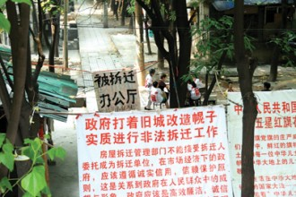
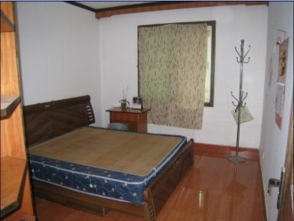
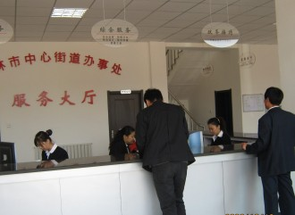

# 黄依依

黄依依穿着件黄色小短褂儿，豹纹贴臀短裙，黑色纯棉连裤袜，端坐在无靠背金属转椅上，认真地玩弄着自己的长发。

“还我住房！我要回家！”用标准的大同话例行公事地完成这几句对白后，黄依依便从楼道走回到某关街道办的服务大厅，坐回自己专座，摇曳着一边玩头发，一边注视着来往的每一个人。

服务大厅最显眼的位置，就是正常人站在门前一眼望穿空气必然会看到的位置，盲人从门外进入时一把扶穿空气必然会摸到的位置，贴着三张素色海报。第一张是白底黑书的非印刷体大“冤”字；第二张是黄依依买房时签订合同的扩印版，其中按手印的地方尤其碍眼；第三张是黄依依的控诉书，包括她被强拆的经历，以及政府对她的处理意见，“放藏獒、炸楼房、骂耿市长”等官方描述被她用红色笔触勾了出来，成了海报中仅有的一抹亮彩。黄依依坐在前面，活像个招摇的人肉招牌，苦心经营着占据着她当前生命大部分时光姑且可以被世俗称之为事业的东西。

黄依依和街道办的所有人一样准时上下班，同时吃饭，养老保险的、劳务关系处理的、纠纷裁决的，所有工作人员都对她的存在安之若素，她也叫得出每个人的名字。群众上门办业务要找某主任、某干事，办事员以工作太多为由对咨询不过问时，她多半会热心告知谁是谁，然后继续玩弄长发。在与各种主任们每天千百次的照面中总会迸发出百十次的相视一笑。

徐主任会在周一的下午抽空回不远的家处理一些家务，有时说是安门铃，有时说是炖骨头，其实可能是趁儿子不在家和老婆行颠鸾倒凤之事，再意犹未尽地回到单位和同事们寡言几嘴，胡干事见状总会调笑道：“徐主任等你回来家里的骨头汤都化了吧！”小吴则一边伏案写几个落地即飞的字，抽空说着：“听说徐主任在海南买了套房，刚兴许是回那个家了吧。”徐主任总会不好意思地主动提出送胡干事回家。胡干事说老公来接她，要送送黄依依回吧。徐主任下意识地瞄了一眼黄依依，看她毫无反应，心里不免有些失望。

黄依依四十不到，面目清秀，妆容厚实，戴眼镜，纤瘦，有风骨感。小吴和王主任总会不经意关注她那不肥硕却紧绷的臀部，运气好赶上穿凉鞋，露在外面的大半截嫩白脚趾也是一大景观。小吴总会想方设法走出服务柜台，从她身边一次次经过，想像着黄依依不穿衣时的样子，然后到卫生间待上大半个时辰。而徐主任在回家之外的时间里也多半规划着如何从不同角度以不同姿势侵犯她的肉体，他老婆却意外地成为了这种规划成果的直接受益人。就这样，男同胞们乏味的工作常常莫名其妙、不知不觉就过去了。

直到一个人把他们的所有设想一并实现。

少年第一次来到街道办时，黄依依刚好没有坐在那个显眼的位置，他进来一段时间才听得楼道里有人喊冤，只是偌大的大厅里无人对此反应，少年也不好太大惊小怪。过了一会，少年发现这女子一直在看他，不知她是个个都看，还是看他多过别人。少年也忍不住看她，不知是看她的脸孔肉体多一些，还是在想这脸孔肉体莫非和刚才的呐喊正好对应多一些。总之黄依依是先对少年开了口，然后两人相谈甚欢。

小吴平日里再平常不过的抬头意淫竟失去了效力，他看见黄依依草草地收拾了行头与少年相伴离开，感觉像被莎士比亚的毒箭从头顶射穿了身躯，直至裤裆。

少年自称作家，理所应当地对黄依依的遭遇表示了关切，并答应了为黄依依写一篇文章。又考虑到黄是无家可归的女人，便说：“跟我回家吧。”

两人坐在出租车的后排，少年无比紧张，因为带一个大自己十余岁的疯女人回家，实在是件再刺激不过的事了，更何况还是个“放藏獒、炸楼房、骂耿市长”的疯女人。

既是到同一个街道办事的，自然住得不远，黄依依的家拆了盖城墙，而少年的家拆了盖绿地。区别在于少年没有索要地段费，没有按照国家政策要求平米上的补助，没有骂耿市长，而是乖乖迁到了近郊的安置房里。于是在黄依依推门而入的那刻，她想起了自己以前的家，装饰一新的墙面、地板，桌上散乱堆放的文具，温暖的坐便器，还有，热血沸腾的男人。黄依依耳边回响起了自己每天在楼道里大同腔的对白：“还我住房，我要回家！”恍惚间少年已经脱了个精光站在了面前，黄依依抚摸着少年炽热的肌肤，疯子样地扑了上去，依稀当年放藏獒、炸楼房时的飒爽英姿，只是在云雨彼端，这种疯狂再歇斯底里也不为过。不知她在抽插之余是否用颤音问候了耿市长。

不久，少年离去，黄依依一如既往地撕扯着头发，只是众人对她的态度已大不一样。小吴常会把她拉到大厅北侧的休息室里，待上大半个时辰，再衣冠不整地出来。后来老王也加入了进去，有时三个人一起进去，一待也是大半个时辰，来办事的群众因为找不到人，常会把墙上的所有员工职位表看完，当然还有黄依依的三张海报。女性职员就没那么好的待遇了，享受不到工作时间性爱的刺激，还被迫承担了更多的政务。黄依依与马主任这样的女主任照面时，已不再有相视一笑这种玩意。

徐主任这样的领导，自然不屑与小吴和王主任同流合污，只是每个处理家务的下午，黄依依总会与他一同消失。之前只需支开儿子，现在则需连老婆一并支开，再炖上一锅骨头，高压锅高潮时的轰鸣声刚好盖住黄依依的呻吟，有时则干脆在车里翻云覆雨，然后往常一般回到单位，黄依依除了玩弄头发外有时还需用毛巾擦去发间残留的精液，而徐主任站在一旁一边和同事讨论着家长里短，一边回味着千百次进出身边这个衣冠楚楚女人的身体的景象，对于他这个年龄这个身份的男人来说，对人生的追求已不能更多。

于是街道办出现了两个声音，女性职员说黄依依连耿市长都骂，真是人人得而诛之。胆小怕事的几个男性职员则说黄依依连耿市长都骂，真是千人骑万人压的贱货。但当后者真正骑到黄身上时，真的能有人记得市长姓什么吗，怕是连亲爹姓什么也忘了吧。

至于黄依依的事业，也就是那几张海报，当然还有她的头发，并不能因此出现任何转机，她并不指望街道办的各种主任各种干事能帮她解决实际问题，正如她并没有指望少年真的为她写文章一样。真正能使事情发生转机的，是她有朝一日和耿市长发生关系，可惜耿市长已调离，那种一边和市长做爱一边骂他的设想是不存在的。还有一种是她和某个微服私访的大官发生关系，可惜已然假新闻了。

胡干事的丈夫是中医，时常和女患者搞在一起，她和徐主任闲聊老公会来接她时，老公多半刚提起裤子，并嘱咐女患者明天按时来就诊。比此更重要的是，胡干事从老公那里得知了龙胆泄肝丸这种药，有色无味，掺在茶水里不会被觉察，长期服用可致失明。于是她每天都会帮黄依依沏一杯茶。坚持了一周左右。

一个周一的上午，服务大厅里人满为患，工作人员明显不足。突然北面的休息室里传来踢门的声音，接着是一阵大同话的嚎叫：“还我住房，我要回家！”大厅里无聊又排不上队的人瞬间聚集到了休息室门口，只见黄依依夺门而出，手里抓着一把衣服直接扔在地上，休息室里两个赤裸的男人忙不迭关门却被大伙儿挤开。徐主任看着里面的人露出轻蔑的笑，胡干事端着茶杯呆呆地走到黄依依身边，黄伸手去拿，胡没有理会，黄依依头也不回地径直坐在无靠背金属转椅上，轻抚着自己的长发，如一切从未发生那样。

_原文地址：[http://blog.renren.com/blog/224314182/902226778?bfrom=010203041](http://blog.renren.com/blog/224314182/902226778?bfrom=010203041)_

（采编：陈静；责编：刘铮）

[【求不得】《孔雀东南飞》：沉默的好爱情](/?p=37460)－－直到夫子的教化被推翻，直到“千秋万古，为留待骚人，狂歌痛饮，来访雁丘处”，直到此时此刻，你和我，以及其它所有人都能够自由地用一切溢美之辞来赞美爱情的时候，我们能有比焦仲卿更圆满的爱情吗？

[【求不得】操火车的人 ](/archives/37613)－－我第一次见到马可，是在一辆去某地的绿皮火车上。这相遇颇有些欧洲傻逼喜剧的意味——半夜，因为车实在受不了车速的我起来瞎晃，撞见他在车厢的连接处打飞机。

[ 【求不得】蓝移](/archives/37726)——老杨是小镇的骄傲，县中的佼佼者。如愿考上这所百年名校，读他钟爱的物理。春秋是乖巧的上海女孩，一路顺风顺水，一分之差没进管理学院，调剂到物理系。

[ 【求不得】曲奇](/archives/37824)——侦探先生受托调查一位丈夫的外遇，却发现其情人是自己妻子。他检讨自己疏于陪伴，搁置工作回到家中，试图挽回女人的心。勉强维持了几日尴尬而平和的居家生活，妻子的手机突然响了……
