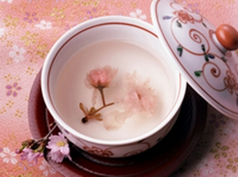

# 抹茶

“此君一节莹无暇，夜听松风漱玉华。万缕引风归蟹眼，半瓶飞雪起龙芽。香凝翠发云生脚，湿满苍髯浪卷花。到手纤毫皆尽力，多因不负玉川家。”

抹茶文化从明代开始逐渐衰落，却在日本被完整地传承下来，在中国本土只有仅存的几首诗还能找到些许蛛丝马迹。新绿色的茶粉在冷热水交替中，用茶筅（编辑注：读xiǎn，茶筅是古时烹茶时的一种调茶工具，由一精细切割而成的竹块制作而成）打出细密的泡沫，香气在茶汤与空气的接触中蒸腾而上。最初的茶叶并非随着一道道饮用后被丢弃，而是在石磨中磨成粉尘，与烧开的泉水一起送下，滋养着人的五脏六腑。

我们这一代人接触抹茶的机会，大约是从十年前开始，某个奶茶店的新品“红豆抹茶”，或者是冰淇林店中奶味香浓的抹茶冰淇林，为彰显抹茶产地的高贵，不忘加上“宇治”二字。茶粉与奶油混合搅打成好看的薄荷绿，看似奇怪的组合，却很少有女孩子不喜欢。茶味本涩，牛奶又过于腥膻油腻，茶多酚和动物油脂反应，那味道简直要把人的魂魄夺走似的。茶饮料似乎在潜移默化中选择了它的主人，冰红茶选择了满头大汗的篮球少年，蜂蜜绿茶选择了默默低头看书的学霸，而抹茶往往被羞涩的男生捧着递给他暗恋的女孩，或是陪伴着闺蜜们放学回家的路。许多食物的风靡都只不过是昙花一现，抹茶这种东西，不知道从它出现的那一年起，锁定了多少人日后吃甜点时选择的口味。

然而很多年过去了，除了与牛奶的混合产物，我都没有喝过真正的抹茶。朋友去了日本，我问起京都一带抹茶茶道的事情，得到的回复是“正宗的并不好喝”。若要用“好喝否”的标准来鉴赏茶，想必多数茶比起它的饮料制品来说都不能及格。此时此刻，“抹茶”的概念已经被模糊化，许多加了香精、色素的绿茶粉、茉莉花味茶粉也混淆其中。最初这种饮料带来的幸福感，渐渐的就这样消失了。当然，抹茶饮料还是为多数人喜爱着，像绿袖子姑娘一样，成了永不褪色的经典。

寒假回到上海，在某日本料理店中歇脚，席地而坐，一碟渍物，一份扬物，一碗茶泡饭，这么清冷的一餐，却是昂贵的很，吃的我几乎忘记了随手点的抹茶。本以为又是装在长长花式玻璃杯中的饮品，却未想到服务员端上了一个手绘的深色陶碗，碗中浅浅的一抹绿色，浮着泡沫（后来知道这叫薄茶），旁边是一份和果子，和一个尖尖的竹制挑棍。

耳边又响起朋友的话“正宗的并不好喝”，不禁笑了：论适口的话这里的食物也许还不如街边的章鱼烧，但“正宗”二字，无论适口与否，都算是对制作人与食物本身的一种尊重与肯定了。即便这不是我的那杯茶，喝了之后，都不失为人生的经历。香甜的食物味道大抵相似，茶、药物与剧毒这些含着复杂生物碱的东西，却都有着各自不同的味道。

非要我说说那碗茶的味道的话，非常苦，但一口豆沙馅的和果子就把苦味都冲散了。牛奶遮盖了抹茶本身的海藻、粽叶与谷物的清香，只有饮清茶时，味蕾才能发现。茶筅扬起的泡沫十分绵滑，这或许就是古代人的cappuccino了。那诗人看着庭院里的花被风吹得簌簌落，一边搅打着自己的那杯茶，花瓣飘进碗里，他随茶汤一并饮尽。这样的茶，断然不能缺了糕点，甜或不甜都好，莫辜负了造物主先造粮食再造茶树的心。茶碗见底时，电话响了，男友发来短信说：“回去之后在干什么？”

“喝茶，想你。”

“下次喝茶的时候一定要有我陪哦。”

“想着你的时候，茶也很好喝。”

的确，如果有他在的话，这案前便会温暖很多。心里这样默念着，坐在门口穿鞋——茶是热的，膝盖以下早已冰冷。

所以说，你喝下的，是你自己那时的心境。人在记忆的时候，味觉往往比视觉好用的多。无论是那年街角奶茶店的塑料杯，还是面前这画着白色一撇图案的茶碗，一个是回不去的少年时代，一个是有牵挂的现在。廉价与昂贵，粗略与精细，那一杯都是抹茶，都叫幸福。

（采编：王品，责编：佛冉）
