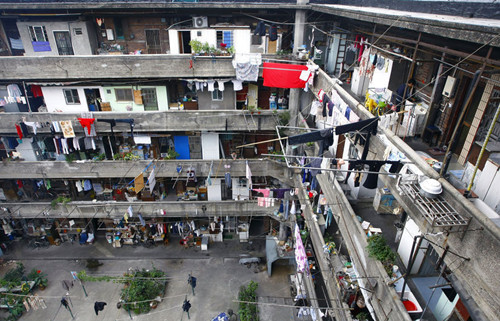
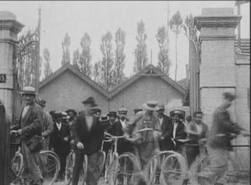
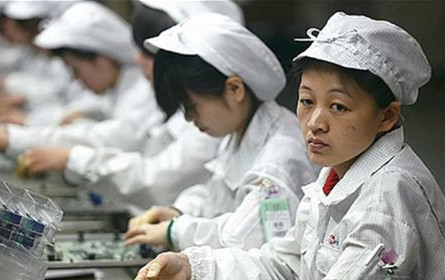

# 工友三事

其一 彩事

周末干活，最好之处在于监工大多偷懒不来，所以气氛活跃，大家聊着天听着歌，干活也没那么累了。

不过工友聊天，左右不过几个话题，翻来覆去，无非家长里短，柴米油盐，鸡毛蒜皮，听过几次，也没什么新鲜了。

大多数话题，都是有指向的，比如聊孩子，那就是那几位三四十的欧巴桑最热衷的，那几位刚生了孩子的年轻姑娘就只是安安静静地听，发言权是没有的。偶也有外人插嘴，大多被阿姨们柔和而蔑视的目光给顶回去，不受内伤已是功力深厚。

又或者球赛，那是断断没有女人插嘴的，仿佛有什么晦气似的。而聊的起兴的那几位，声音必然越来越大，你能感觉他们聊的不是被踢在脚下那颗直径69cm的球，而是挂在他们两腿之间的那对。我总会想起《光荣与梦想》里描述杜鲁门的那句“他大摇大摆回到白宫去的时候，你可以听到他的两个睾丸碰得叮当作响”。

极少数话题能让大家都热衷，彩票算一件。

一般前一个话题的结尾是，“唉，咱怎么这么穷啊，要是能中张彩票就好了”就好像一滴蜜滴落，蚂蚁们远远近近都会聚过来。

然后会有人抱怨他的彩票号码没有中，引来大家一致的嘲笑，这是一个主客合谋的开胃菜，没有人会厌烦这样的嘲笑，也总有人愿意把自己置身于这种嘲笑之中。

然后大家会简单地探讨一下选号技巧问题，然而这种话题也仅仅是头盘的冷菜，大家各凭所好，随意下箸，除了那几位狂热者，没有人会真的在意。

真正的主题是，如果我中了，我该怎么花。

据说人对于金钱有一个阈值，当超过某一个数字后，我们就没办法准确理解这笔钱的真正意义。我一直认为这个阈值应该是当前时间最流行的彩票的最高奖的值，因为大部分人在面对这个数字的时候，都没办法正常思考。

大家的答案很好猜，买一栋房子，投资一笔生意，再也不用受人白眼，仰人鼻息。

想起那个很出名的关于陕西农民跟蒋委员长的笑话，“肯定是顿顿捞一碗干面，油泼的辣子调得红红的。”这就是人想象力的界限，目力所见，再无他物。

他们会觉得那些分钱的人都是傻子，“一定要握在手里，死前看谁对我好就留给谁点”。也偶尔会有捐资慈善的想法，目的则是“我也要捐个小学，然后就出名了”。

看到这里，你或许觉得我在丑化劳动人民了，我哪里敢，毕竟我自己就是他们中的一分子，读过几本书后，我自然不会说这种话，就算真的心里这么想，也不会说出来，自己还会美化为一些更加良善的愿景。当然，我也不会傻到说什么拿钱环游世界、拯救山区儿童。这简直是自绝于人民。更关键的，我学过概率。

现在已经没有人爱在我这里找不自在了，我也早已放弃无谓的说明，工友们尽管有些没能上过高中情有可原，也有些已拿到成人本科学历，算来已经比我还要有学问了，可要给他们解释概率、独立事件、数学税这些抽象的东西，大家便仿佛看到某种怪物，犹疑着躲避。

初时他们也会与我辩论，“我从来没见过1234567这种号码”“从来没有两期号码完全一样”，当我告诉他们数学与心理学上的概念时，他们嗤笑着摇头，愈加深信我的可笑，后来便完全放弃，觉得我是朽木不可教，不再理会我了。

然而我也明白了，他们并非不明白这样的道理，或许明白的比我还要清楚，倒是我，一开始就弄错了一些东西。他们不是在做投资，也不是在做生意，他们是在烧香。

到二十多岁的时候，我们就得开始学会面对曾经傻逼的自己，比如幼时训斥家里人封建迷信，以传播科学唯物主义为己任。齿龄渐长，人也油滑的多，现在我会跟那些信科学的人说科学不是唯一的世界观，而跟那些信神的人解释中医为什么是伪科学。看似是精神分裂，其实不过是狡猾。另一方面，我也没那么确定，真要是有神的存在，总要给自己留点后路才行。

我的工友们，他们其实都很相像，每个月挣城市最低标准工资加上不太靠谱任人宰割的奖金，到一定年龄，会娶一个省钱的老婆，他们搞不懂指数、杠杆、市盈率，这不影响他们把积蓄投入资本市场，被割一刀后匆忙地撤回，从此不再冒险，安心攒房。但他们总有畏惧，畏惧生病，畏惧买房，畏惧失业，畏惧赡养，他们其实没有真正的欲望，所以他们总把畏惧当作愿望。

家里人从小给我灌输了一个很不合时宜的观念，“只要是钱能解决的事，那就不是事儿”，之所以不合时宜，是因为我家很穷，或许比不上我的某些工友，但终归是很穷，于是我的成长期所见总是矛盾的，一方面一切困难都不是事儿，一方面外界总能刺痛我那不值钱的自尊心。所幸当我工作的时候，那些不是事儿的事终于少了很多，于是愈加狷介，当偶尔事儿找到自己头上了，终于明白，对钱的渴望。

作为读过书的人，我自然不会烧香，但我也会幻想，权当放纵自己，醒过觉来，又会觉得吃饭一个月四百买书一个月两百有房子住没女友的生活完全不用奋斗了。

其二 公事

在我工作过的地方，有些人是属于注定挨骂的职位。

比如排生产计划的，排的多了工人们觉得累，骂，排的少了工人们觉得穷，骂，计划老是变生产上骂，计划不给变供应跟研发上又得骂，所以做这份工作，要么得七巧玲珑心，十面八方都能打点好，要么跟我一样，长得憨厚老实，或是楚楚动人，让人不忍心骂。

再说QC，一般叫做品质检验的，也是个倒霉催的职位。别的不说，这工作本质就是挑错的，不管挑到谁头上，谁还会有好脸色。[改为“谁都不会有好脸色”][不改比较妥]大家都是打工的，我在这里干活，你在这里挑错，谁心里平衡啊。

还有一个外行大多不知道的，叫工业工程改善，我们那儿不管男的女的都喊“阿姨”的就是了，“阿姨”者，IE（Industrial Engineering）是也。干这活儿的，别说外行人，就是在工厂里的人也有不少人搞不清楚他们到底是干嘛的，只看到有“阿姨”常年在产线上闲逛，偶尔见到漂亮的小姑娘就盯着看，一盯就是半个多钟头不动弹的。

干改善的当然不都是臭流氓，官方说法是“IE是这样一种活动，它以科学的方法，有效地利用人、财、物、信息、时间等经营资源，优质、廉价并及时地提供市场所需要的商品和服务，同时探求各种方法给从事这些工作的人们带来满足和幸福”。听起来是不是觉得在胡扯，照我说，他们干的活，其实就是协助资本家最大程度的压榨工人剩余劳动力并不让他们发现就是了。

有幸了解过他们的工作，然后觉得，这真的是一份挺好的工作，如果说车间里能学到哲学的工作是计划排产，那干改善的则是能学到与发挥创意的工作。你把一份工作用越来越少的人力完成，一点一点接近极限地提高单人的生产效率，在我看来，这接近于艺术。

不过就我所知，大多数人绝对没这么想。当你忙得焦头烂额，而另一个人还在你背后背着手像大爷一样看你工作，大多数人只会想到某些绝非善意的祝愿。就好像骂国足一样，在车间里，你骂改善总是政治正确的，群众喜闻乐见的。

我其实是想说责任的问题。

我觉得人工作有些事情必须得搞明白，你为谁服务，你工作的直接目的是什么，达成你要做的需要哪些条件，这些东西合起来，应该是你的工作职责。热爱工作这话实在太奢侈，但我对自己的标准是敬业，也就是尽责。把该干的事情干了就对了。

敬业其实也挺难的，到目前为止，我就时不时觉得自己挺对不起老板的工资的，但好歹，我总还记得标准在哪里，为谁服务、目的、需要的条件，所以我大多数时候只是没做好，而不是做错了。

当你搞错了方向，你跑得越快就越滑稽。这就是我看到的。当你指责一个IE不帮你干活的时候，你就犯了这样的错误，当物料员为了自己仓库的整齐影响到物料的供应的时候，你就犯了这样的错误，当你只是加快自己的速度而不考虑瓶颈工站在哪里的时候，你就犯了这样的错误。

所以说逻辑是很重要的。这个跳脱的结论源自我的思考途径。一个逻辑清晰的人，你看到的工厂其实是一个钟表，发条启动，一个齿轮带动另一个齿轮，严丝合缝，不留余地，你可以很清楚的看到力沿着轴从起点传送到末端，当你试图改变，你也可以清楚的看到瓶颈所在。无论再复杂，你总能看到这样一条路径，顺着它走下去，你就能得到结果。

不过逻辑似乎已经成为奢侈品了。大多数人都只能看到两步远的地方，那是他们尸体埋下去所能占的大小。

无聊的时候，大家都会说，自己当了领导，我会撤掉那个***，给***多发钱……

如果这事发生了，我会立刻辞职的。

其三 婚事

婚，形声，字从女，声从昏，古人多黄昏嫁娶，是取其意。

在古代，据说光属于奢侈品，若是黄昏嫁娶，古人日落而息，怕是有成全新人之意。

不过事情早就不是这样子了，现在拿来解释，只怕是说当女的发昏的时候，便是了。

每当看到那些好歹二本学历、现在或将来有份正经工作的小青年们争着自认屌丝的时候，我总想起我工友们的婚事，你们真的觉得自己是社会底层？那是没有看过那些埋在土里的故事啊。

他们爱起来总是很容易，完全不像我一样，左顾虑右迟疑，生生放走春花秋月，整日大煞风景。或是一两日协作，或是下班时意外同行，或是饭桌上几句调笑，几天的秘密后，大家便看他们拉起手来。

年纪都不算大，与我同龄的却有的已有四五年工龄了，虽然是刚够法定结婚的年龄，家里却也不知已经催了多少遍了。我没法理解，他们却大多觉得理所应当，他们告诉我，这是对家里人最大的安慰。

然后三个月的恩爱未满，双方的家长便已经见面了。

都不是什么有钱人家，不然哪会来这里工作，但总还是要挑挑拣拣，女孩子若是长的清秀些，家里人的傲慢多半也会增加些。

据说，第一次父母见面，我们这每对情侣都为这事冷战过，或短或长。挨不过寂寞，大多数人也还会牵起手来，只是便已无初时的蜜恋，这算是一关。过来的情侣，情话少说一些，感情却似乎深了一些，不再嬉笑，男的开始努力工作，广谋财路，女的则似乎在身上贴好标签，不再属于异性公有，安稳平静，让人忍不住喊她某太太。

然后？便是房子，没几家会有，没几家会不要。当那些年薪5-20万的屌丝们说自己买不起房的时候，这些月入不过两千的人都是怎么做的？

先是拖，谁都不愿面对，随着女方家里语气越来越严肃，男孩子也开始学着成人一样皱着眉头上班，他们告诉我他们想下班去夜市摆摊，他们在做保险兼职，他们周末要去洗车店打工。最后是，无论他们怎么做，市面上的房子他们一概买不起。

然后他们每天都在看网上的交易信息，看看哪个离市区有半小时车程的三手房出现白菜价了，一次一次的去问，一次一次的犹豫。谁会想，用尽家庭的积蓄，未来的担保，买一间自己根本不喜欢的房子？

我见过几次了，每到这个时候，两人总是频频吵架，某一天，女方下了最后通牒，男孩子请了一上午的假，下午回来告诉我们，他买房子了。

偏远或是无产权或是二手或是兼而有之，几年打工寄给父母的钱又被寄回来，加上父母微薄的积蓄，再加上二十年的贷款。

于是一切的不快烟消云散，婚姻进入快车道，没过多久，他们已经在预告婚期了。

作为单身人士，婚宴场所是最讨厌的所在之一。然而不能不去，去了不能不拿钱，拿钱了还不能不喝酒，喝酒了被人调戏还不能不……是不能生气。

于是花钱找不自在，莫过于此者。

话说回来，那些结了婚的男民工们确实不一样了，眼神坚毅，工作勤奋，神情忧郁。

我说上面这些乱七八糟的事情，其实是想说，只要，只要这些人还存在，只要这些人的丈母娘还存在，我就对中国未来的经济有信心。说到底，经济来自生产力水平，生产力水平很多时候除了科技问题，就是态度问题。

有人会说中国要进入中等收入陷阱？我觉得纯属胡扯，如我这般的二线城市小青年，天天见到工友们对财富的渴望足以融化财富本身。只要他们还要结婚，他们必然会坚毅而忧郁地继续保持这种渴望，我不相信这样的人可以进入什么中等收入陷阱。当某一天，我的工友们不再为了结婚决定去夜市摆摊/卖保险/洗车的时候，我会卖掉我全部的指数基金，认真的考虑经济衰退的问题。

我希望这一天早日到来。

(采编：张蔚涵；责编：刘铮)