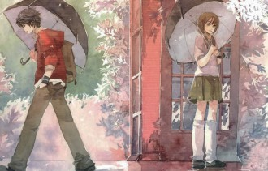

# 七年之痒

昨晚做了一个很长很长的梦，梦里我和一个从来都没有存在过的姑娘谈了一场唯美的柏拉图式的恋爱，可惜我连她的手都还没有牵到就醒了。

睁眼一看已经中午十二点了，猛然想起今天又是一年的1月31日，掰着指头一算，那件事情不知不觉已经过去了七个年头。

七年前的今天应该是大年初三，我和家人报了个一日游的团一起去福州周边郊游爬山。我是个懒人，当时被老妈拖去玩还有些老大不愿意，觉得还不如在家打打游戏来得有意思。坐了一个小时左右的车到了地方后，我一路小跑去上了个厕所，当我提着裤子从厕所出来的时候，我看到了有生以来最难忘的一个画面。从对过的女厕所里走出了一个姑娘，我第一眼看到她就被她的气质给深深吸引了，然后我就这样手放在拉链上瞪着人家看了有足足半分钟。我很庆幸在那个过程里她始终都没有朝这边看过，不然我估计也没有了后来的故事了。

其实关于这样的一幕，很多人会把它归结于一见钟情或者情窦初开之类的东西，但现在回想起来，我却觉得并不是这么回事，这甚至和青春期荷尔蒙之类的生理名词没有半点关系。当时我好歹也16岁了，虽然处男一枚，但也是见过姑娘的，这绝逼不是我第一次喜欢姑娘，因此谈不上什么情窦初开。而一见钟情这玩意我向来是不信的，当时我单纯只是觉得那个画面很美而已，尽管那个地方的确挑得有些不合时宜，但或许恰巧是因为上过景区厕所见过满眼秽物后的第一眼便是这姑娘，才把她衬托得如此超凡脱俗。

不过很讽刺的是，从那以后我再也没有在提起裤子后爱上一个姑娘了。

言归正传，那天的旅程从那一刻开始就立即从一场囧途变成了少年CC的奇幻之旅，一路上我的目光始终都没有离开过那姑娘，她的举手投足一颦一蹙全都映在我的眼中，然而当时还未见风尘的少男心却不知该如何去和她搭讪，于是我做了一件非常具有前瞻性但在当时却显得蛋疼无比的事，那就是：和她妈妈聊天。于是整个剧情立马就在此反转了，一路上我和她妈妈聊得很开心，但是和那姑娘却一句话说不上。她偶尔也会看我一眼然后冲着我笑，可是我不知道她究竟是在向我示好还是以为我喜欢上了她妈。总之，一直到旅途快要结束的时候，我也依然只能在一旁默默看着那姑娘，然后言不由衷地和她妈妈有一搭没一搭的聊着。

最后返程的时候，出现了一个天赐良机。因为来的时候我和她并不是在一辆大巴车上，所以我直到下车上完厕所才发现了她的存在，于是当时我灵机一动，回去的时候默默跟着她上了同一辆车，还坐在了她旁边。正当我满心欢喜地想和她说第一句话的时候，我妈在这个时候像一个瘟神一般地降临在了车窗外，她很诧异地看了我一眼道：“你怎么在这里，一直找不到你，你一个人坐这辆车干嘛，我们一家都在另一辆车上呢。”

你们能想象我当时万兽奔腾的内心吗，我甚至都没来得及跟她解释我目前的处境。于是我只好一边内心冲着我妈嘶吼你儿子还没谈过女朋友，一边硬着头皮看了一眼那姑娘，装作并不是冲她来的样子很轻松却僵硬地笑了一下，说了句“噢好吧”，然后努力维持潇洒的步履头也不回地下车了。结果回到另一辆车后，差点让我吐血而亡的是，同行的舅舅舅妈看到我后和我妈说，既然人家都坐好了，何必麻烦让他过来，反正都是回去的，坐哪辆不一样。

正可谓“风萧萧兮易水寒，壮士一去兮不复还”，当时的感觉不仅仅是悲壮，更多的是凄凉与无奈。我很矜持地笑笑然后坐到了位置上，但已经没人听得到我内心快要响彻云霄的咆哮声，如果让我代替张飞站到当年的长板桥上，那估计吓死的就不是一个两个那么简单了。后来的归途我感到了从未有过的疲惫感，我一个人把头埋到大腿间一句话也不想说，就像是个委屈的小学生。我脑海里想着如果刚才我妈没有那么多事的话，现在估计连QQ号都已经问到了，我心里真是各种悔恨交加，也感叹命运弄人。

最后的最后，到终点时我下车环顾了一下，只看到她从另一辆车下车，然后头也不回地走远了。我就那样看着那个背影一点一点地变小，最后消失不见，眼神里写满了哀怨。从此后我再也没有见过这姑娘，我甚至不知道她的名字，她的年龄，她的喜好，直到终有一天我忘记了她的样子。我为此在家里闷闷不乐地躺了很多天，想了很多的事情，也问了自己很多个如果——假如自己一开始就大胆一些去找她说话，假如我妈来找我的时候我厚着脸皮赖着不下车，那结局会不会有所不同呢？我很难过自己就这样被命运给狠狠玩了一次，也难过自己或许此生都再也见不到这个姑娘了。

从此往后的每一年，我都会在1月31号这天条件反射地想起这姑娘，转眼之间一晃七年过去了，我竟然依然记得这件事情，虽然她的模样我早已忘却了。我在想，这样一件现在说起来可能有些喜剧色彩的故事，为什么会变成我的一个情结呢，几年前我甚至还会上网搜索一下这姑娘的信息，妄图从别人日志里的游记中找出一些线索，还会偶尔神经质地跑去当时她离开的那个方向望着那里发呆等等。而也正是从那时候开始，我隐约觉得我妈是我情感的灾星，以至于现在我妈给我介绍对象让我去相亲我都会想也不想地拒绝掉。这些影响听起来也许很可笑，但却是真实存在的。

我在想，或许很多时候人对于一个故事念念不忘，并不在于这个故事的精彩程度和意义大小，而在于它始终没有说出的那个部分。我后来七年的情感经历，远比这一天所发生的故事要曲折也狗血得多，我相信很多后来的那些姑娘肯定有比这个姑娘更漂亮的，我和她们也有过更浪漫的情节，但她们却和这个姑娘给我的意义不尽相同。其实现在想来，即使我当时和她认识了，要到了她的QQ号，也不见得会和她发展到什么地步，当时我只有16岁，还没上高一，智商上尚属可圈可点，但感情上就是个白痴，加上当时学习又忙，我和她就算能成为朋友，但多年后也许也会变成QQ里万年不亮的陌生人。这个剧情无论如何发展都让我完全看不到任何的good ending。

但是就像迟到一分钟没赶上飞机与睡过一小时醒来后发现误机了给人的感觉差异一般，有时候差一点得到，比完全没有机会的失去更让人魂牵梦绕与难以释怀。我后来那段时间最放不下的点其实全集中在自己当时因一念之差失去的那些机会，比如我如果事先就和她搭讪、如果我坚持不下车，那后来的那些剧情就不会那么的惨淡，我很介意那些被命运藏起来的情节，那些被各种巧合给反转的桥段，这感觉就像后悔自己如果早出门两分钟就能赶上飞机一般让人扼腕叹息，但事实上我也知道生活中有些东西该失去的就是失去了，没有那么多的如果假设。

因此人有时候就是这样的矫情，我就这样把一个素昧平生的姑娘记了七年，从那个毛都没长全的年纪一直记到了法定婚龄都过了。或许这姑娘现在都已经嫁人了吧，她会不会也记得曾经有过这个奇怪的人呢？不过我其实更想知道当时她看着我灰溜溜下车的背影时是怎样的表情和心情，我真希望我当时背后能长个眼睛，不然也不会让这故事就这样变成一个永远的悬案了。

总之，我不知道我写这篇日志的目的在哪里，我想表达的东西有些模糊不清，如果你愿意把倒数四五段当做这篇文章的中心，那你的语文阅读理解题应该会做得不错。但我个人更愿意把这篇文当做一个男孩年少时的萌动来读，里面有青涩有遗憾，有许多回不去的青葱岁月，还有一个靠不住的老妈友情客串，我想这是个好故事，至少对于我自己而言如是，值得我多年之后再细细品味。

我就这样和一个不存在的姑娘谈了七年的恋爱，今天是我们的纪念日，却是我一个人的七年之痒。

（**采编**：薛晨如 **责编**：王卜玄）

[【浊流】爬黄山](/archives/43069)——当清晨你去采摘带着露水的熟透了的樱桃，你应该就会想像得到她红红的嘴唇。这总让我想起Cherry，不知道她在国外怎么样了，是否习惯了啤酒和肉肠。

[【浊流】理科班望](/archives/43003)——曾几何时，理科班里也会有人回望。有一个老故事：一个理科女生与一个患偷窥癖的诗人，隔着数倍空气对望并且含情脉脉。而新故事，也在发生。

[【浊流】绿茶婊](/archives/42972)——宿命终究归还予宿命，栽种必将得到收获。
