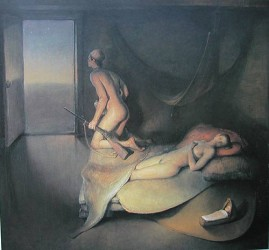
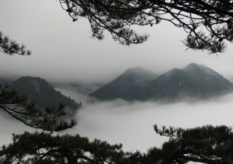

# 爬黄山

（一）

自打记事以来我就很忧郁。母亲总是嘀咕说你小时候不哭不笑不知道跟列宁学的天天皱眉闷闷不乐。幼儿园老师倒是很喜欢我。她是个大学生，自然什么都不会，面对一群发狂的孩子只退到门后哭泣。我从不属于那群孩子。于是当做最后一根稻草她把我带到无人的角落盯着眼睛给我讲故事。那些故事全听不懂，每个字能懂，每句话能懂，连到一起就不懂，但身处的位置和氛围让我隐约感觉不太妙。我远远盯着她直到她哭着讲完后趴过来亲我的嘴唇，有时还把舌头伸到我嘴里，可惜那时还不知道女人舌头的香甜，后来每当我获得小小成功时就努力回想这个，后悔不迭之中心就冷了。在这位失恋女大学生滔滔不绝的情愫浸泡我心智渐渐成熟。冬去春来五岁毕业，小树苗在她口水浇灌中长大啦，临走还送我一本她高中时候的生物课本第一册。那本书里认识的字不多，但彩图不少。

翻开第一页茫茫宇宙中九大行星是最初的记忆。根据图片显示，太阳在当中被不同颜色的圆点围绕，还象征性地标出了椭圆的轨道。瞎看了几周后，出现了上古时期的地球：火山遍地，暴雨伴着雷和闪电，最后安安静静下了几万年。在姥姥家我让姥姥给我读鹦鹉螺和三叶虫那一部分。学前班第一个学期结束，一辈子都忘不了的是黑白的始祖鸟以及下面的文字：身上有羽毛，翅上有爪，不会飞。我整天翻看这张图片。始祖鸟站在高处向下俯视恐龙，那景象在二十年后我蹲在礁石上向大海的另一边远望的时候，仍然会想起。

最后一个夏天，血液中有红细胞、白细胞、血小板这个知识点的时候，母亲告诉我上小学了。在巨大教室中我低头写东西而常被老师视为纪律破坏者，你可能不会知道这种感觉，那就是一旦被老师这么认为就意味着学校生活不那么有趣了。诲人不倦的时候我忧郁的眼神令老师怒不可遏，她说你这么调皮捣蛋将来不会有出息，我点头默认，然后偷偷把写的东西撕掉，因为觉得太差。

好在上学的第三年因为父亲工作我转校到郊区。新学校的同学们淳朴得可爱，我的各种沉稳、卖乖、写作给他们留下了不错的印象。参加完各种竞赛，母亲受邀到学校交流经验，获奖作品是《龙爪槐》“到了夏天丑陋的龙爪槐摇身一变成了一把绿色的伞。看起来确实不错，不过假设在大雨的日子躲到下面，会大失所望，这个道理很有可能在我变成大人的时候可能会看的更透彻。”我记得母亲在前一天晚上还问我龙爪槐到底是什么。我说是一种小树，教学楼后的小花园里就有，离我的傻哥哥吃巴豆中毒那个地方不远。另外明天别忘啦，那篇作文我用的是倒叙。

我就是在那一年褪掉最后一颗槽牙。那之后突然明白以前忧郁是因为那颗槽牙长偏了顶得牙龈疼。这种疼痛从我记事起像个无声的幽灵伴随我长大而我只能习惯这疼痛，不明就里。我的性格就在那颗牙掉落之后发生了急剧变化：身轻如燕，像是卸掉了多么沉重的包袱。很快我兼任了班上几乎所有职务，每天早晨收作业讲笑话，晚上布置作业，周体育课上足球和乒乓球虎虎生风，周末和几位小小姑娘一起画黑板报。生活的乐趣我如饥似渴地感受，偶尔会产生“这种生活如果能永远继续下去该多好”的想法。这种错误的想法在将来还会闪现很多次，但那时候我确实认为小学的生活永远也过不完，而另外一个我超脱于人世之外，满怀喜悦地看着我生活。

这种感觉本来会一直持续下去，直到我爱上了班上那位新来的转校生。长头发、白皮肤，小巧的身体，小巧的五官，玲珑可爱。重点在于她跟我以前一样不哭也不笑，除了忧郁看不出别的。袭来的阵阵喜爱的感情阻止了我去问“你是不是也还没换牙？”这种问题。只要一眼我就爱上了她。

那一年我九岁。最后一颗牙齿自然掉落（未来还会拔掉不少）。手指第一次挫伤（未来总共有六根手指遭受挫伤）。那年我写过《摘樱桃》：“当我盯着她的嘴唇的时候总会想到某年在父亲战友的樱桃园里第一次摘樱桃的情景。炎热的夏天让人躲到阴凉的樱桃树下，挂在树上的樱桃像是一粒粒精雕细琢的玛瑙温润晶莹，碰上去是凉丝丝的触感，像极了她的嘴唇。”我故意尝试写得充满肉欲。当然在参赛之前我十分满意的隐喻让长头发白面皮的语文老师兼班主任微笑着删掉了。

爱一个人越深就越容易陷入孤独。我看鲁迅的书里面有一句，“寂寞的长蛇缠住我”。对，确确实实缠住了我。偷偷看她的一举一动已经无法满足变态的欲望，我收发作业时候故意在她身边站很久，很久很久，为的是记住她细而亮的长发，还有那冷峻的眼神。当然她成绩很好，中规中矩的作文也得了学校的一等奖。她从来不跟我说话，就算在一起去考试的路上，安静的校园中只有我俩从教室里出来穿过安静的校园，我们也没说过一句话，而我盯着她洁白的脖子眼神又开始忧郁。多少年后才知道有的人永远都没有情敌，他们只爱自己。可惜当我得知这个道理的时候已经上了大学，听说她在高中谈了恋爱，初恋，之后考上某市的交通学院，而现在在某个寒冷的欧洲国度读她看似无穷无尽的研究生，英文名字叫Cherry（樱桃）。

记得非常清楚是因为那一年我正着手写一部小说叫《白熊湾》。故事讲的是男孩去某个寒冷国度寻找去世父亲的隐秘情史，最后男孩变成了男人，没有回来。“他左手和右手各向湖中丢一块石子，小小的波浪起伏，层层叠叠、叠叠层层，似乎会一直持续下去，只要他的眼睛不离开水面。越是微小的细节越难以消失。这也就是为什么父亲临死前要他回来找存在的痕迹。”很可惜这位小学情人长大后就没写过有一丁点儿文采的东西，不过这不影响她将来在我的作品中多次出现。

（二）

“请问有奖信息先生在吗？”

那的确是我的网名。

急促的敲门声响起，我一个激灵跳起来。把笔记本电脑电源拔下收好，背上双肩包，拉开窗户，向门口喊了一声“等等等等，穿衣服马上就来！”展身跳到窗外墙头，沿墙走远。半个小时以后我坐上了去黄山的火车。

谁都知道我前女友是某市交通大学的。那所大学出名不是因为铁路巨人詹天佑，而因为不论在一穷二白的建国初年还是现在兵荒马乱的当代，铁路工作都是个油水十足的肥差。不过在这个动荡的年月里，铁路也正在发生巨大的动荡。这动荡静悄悄的，伴随高官落马而成为烫手山芋。交通大学里还曾经发生过著名的罗曼蒂克事件：一个家境富裕的公子哥儿在某个月圆之夜爬上了学校里最高的教学楼楼顶——足足二十三层，为他心爱的女孩点燃了几万块钱的焰火。

两个小时里震耳欲聋的爆炸声不仅惊扰了从高傲的校长到卑微的辅导员的美梦，也穿过大街小巷，吵醒了半个城区的人。四射的光芒点亮了宿舍楼、点亮了街道、也点亮了消防总队的门脸儿。那天夜里学校里无人入睡，为哪个女孩这么幸运而议论纷纷。那个幸运的女孩则握着手机激动不已，短信是“请跟我永远在一起”。但其实校园里收到这短信的女孩不下一百个，聪明的男生觉得这是个百年不遇的表白机会。在这个年代百年不遇的事情让我们一次又一次地碰上，这一次终于轮到了好事。只有一个人真正因为这进了公安局——两个小时后闻讯赶来的警察们冲到楼顶一脚把公子和他父亲的老司机踢倒在硝烟弥漫的夜空里。这时交通大学的学生们还在回忆、规划他们乌七八糟的爱情。

结局我有所耳闻。Cherry欣然接受了他的追求，只是有点心疼那些焰火。第二天男子被无条件释放，带着女孩看遍了包括黄山在内的世间美景，最远一次是九寨沟的大峡谷。不过后来他们还是分手了，Cherry去了遥远的欧洲某国，那里的人们特别热衷于啤酒和香肠。我也不知道是什么原因让她走这么远，唯一解释就是那里离北极更近。她走后留下了供校园几代人传递的故事，至今我独自回到大学走在校园中站着看报刊栏时，还会听到晨读的少男少女在情话中掺杂了对这种不切实际的浪漫的期盼。他们们讲述这个故事，设计着他们自己的爱情和未来，然后在未来分手寻找爱情。公子放烟花取悦美女的故事告诉我们，金钱创造很多、时间洗刷很多。

在去黄山的十二个小时的火车上，我有时候会想，大学里肮脏腐烂的气味从这个积贫积弱的国家建立起一直蔓延到现在，臭不可闻。而那位公子选择了从大学中用金钱博取配偶的这种行径，是不是就叫买春。

话说回来，交通大学学生会最近办了校刊，急需优质投稿，前女友恰好负责文章的审查。于是我把马尔克斯新出的小说翻译成中文，原封不动地发过去——原封不动只是个象征说法，里面的外国名字当然要入乡随俗，什么阿卡迪奥改成老赵老钱，什么布恩迪亚改成孙小明李老二——最后署名：有奖信息。我一直为这个笔名沾沾自喜。

杂志出到第二期的时候我就急不可耐地给学校党委写匿名信投诉，说贵校校刊简直就是一个抄袭者天堂！如果再这样下去有人会告到法院追究贵校领导的法律责任！匿名信写得深入浅出，最后上纲上线到人性高度国家道德败坏之类，在这个摇摇欲坠的国家极具煽动性，完全可以让一爿猪头明白其中的威胁性质。领导们屁滚尿流了与否无从考究，只知道《校刊》死掉再也没出现过。

现在，有一帮怒不可遏的学生会流氓带了一帮人来敲我家门想必也就说得通了。而几天后当他们意识到我并不是死在屋里而是已经没影了的时候我正在黄山光明顶上给前女友写信、给在欧洲旅行的Cherry写信，最后又给某位移情别恋的姑娘写明信片。无论是信中还是明信片中统统把黄山翻译为“Yellow Stone”。

（三）《黄山颠答前女友问》

你好！ 

当年各大名门正派集结全部人马围攻光明顶，无奈“剿匪不力”。总结原因，是没料到光明顶居然如此陡峭。他们在山脚喝完酒踌躇满志，挥舞大旗怒吼着冲上去，结果半山腰就有人腿肚子抽筋选择撤退。及到了山顶，个个累得跟狗一样，瘫坐在湿漉漉的草地上呼哧呼哧喘个不停。小昭很调皮，扛着一丈多长的棍子，蹦蹦跳跳出来迎战。她远远的朝那些大师、掌门、师兄、方丈肋下死命一捅，众高手便把持不住，气息全乱，躺在地上滚来滚去，模样十分难看。故事的教训是登山不能着急，太着急的话就丢掉了看风景的力气。我爬黄山基本情况是这样。

翡翠谷看着溪水哗哗流淌，自然而然就想起那年夏天一起去的黑龙潭。三年前的你青春年少，对生活积极热情，却被某种绝望的情绪反复折磨。你穿着短得不能再短的短裤，露着大腿，在河之洲，于是我除了湍湍的流水声，什么都听不见了。分手后，每天晚上都想着你的面庞和身体自慰，然后平静睡去。人类最初的动力——性欲正在我身上慢慢变得纯粹。白天不去思考与感情有关的事，在给别人面试时也告诉他们要抛开感情，全心工作，同时也催眠自己。就当我认为已经遗忘一切的时候，有一天夜里在梦中哭醒。戒指、发卡、手机、鞋子等这些寄托的思绪的意向纷纷在梦中出现。坐起来抓起手机记录梦中的话：“原以为我的心坚强冷漠，不再害怕任何创伤，但现在看来我错了。”任凭泪水打湿屏幕。后来刘林告诉我，当肉欲过于强烈的时候，就会在幻想中寻找一个异性来发泄，学名叫春梦，所以不必焦虑。

是啊，不必焦虑。你看你，正在向前迈步，而且终有一天会步入婚姻的殿堂。你将成为某人的妻子，你将有一个孩子（或者两个）。你和丈夫会互相照顾，过着原本就衣食无忧的生活。你将会给孩子喂奶，换尿湿了的尿布，用母性的语言鼓励他早晨出门，向前走，别胆怯。然而当你看到他渐行渐远，在自己的怂恿下真的去闯荡世界的时候，又提心吊胆起来，害怕他永远也不会来。这就是生命的延续。

这次一个人来黄山，感觉眼睛确实不够用了：跟山水泼墨画完全一个模样，用语言难以形容。云海里波涛汹涌，却安静无声，正隐喻了当下这个社会。尤其美妙的是翻滚云海不会完全遮挡山峰，总会有青黛色的山尖露出来，恍若老版西游记里面的神仙居住的天上。各种各样的松树弯曲生长，让人分不清是扭捏还是妖娆。所有的山和水都是我的，可以尽情吸吮天地间的空气，欣赏它们的姿态，胜却大师手笔。站在山巅想那年你把我甩掉的种种细节，脱口而出的却是一句对不起。为你的青春、你的眼泪还有你的感情道歉。另外谢谢你送的礼物，这双鞋陪我走了很多路，破的不成样子，但十分舒适，现在还在陪我爬黄山。谢谢。希望你能和你的男朋友一直走下去。一路走好，吃顿好的。

“他一声不吭地搬运，在一座巨大的城堡里。城堡建在高山山顶上。高山遮挡了满月。月亮又大又圆，偶尔还有乌鸦穿过的影子。不寻常的是乌鸦很安静听不到声音。从飞行情况来看似乎是受了惊吓，从城堡里被赶出来。这是这个男人自己的记忆城堡，他在每一个房间都堆了炸药桶，准备在午夜引爆，消灭一切。‘终于可以结束了。’他爬到城堡最高处的阁楼楼顶开始抽烟。在月亮的背景之下变成了黑色剪影。”后来我醒了，也不知道他最后点火了没有。

某年6月13日

于火车卧铺。

（四）

你在想什么？是细节。各种各样零零散散的细节。它们像午夜旷野中的一座旋转木马。固定好底座，木马一匹一匹安上去，还有支架、镜子、彩灯，以及一些乱七八糟的小玩意儿。一旦组装完毕，拉出电线，一按开关，彩灯瞬间绚丽绽放，流光溢彩，在这荒芜平原上就有了一座旋转的城堡，尽管一个孩子都没有，却是这午夜寒冷与黑暗中的唯一一点光明。这光明若是温柔，就似暗中的一支烛火；这光明若是伟岸，则像夜空里的一道闪电。细节像碎片一样被人为地安插在意识的荒野，排列、组合、打乱、镶嵌。这时如果突然有什么事，一闪而过的颜色也好气味也好，让这些碎片结合成一个整体运动、旋转起来，那你将会像见到无边无际的平原上的旋转木马一样欣喜若狂。

也有可能拼凑起来的是某个本来亲密无间突然变得陌生的朋友。这个突然可能是三年也可能是一天。夜深人静的时候抽烟写信，笔在手中停了好久，抬头思索着自己何时丢失了什么人，那个人值得自己千言万语去描述却无从说起，印象已经模糊却牢牢占据某个位置。没有颜色，也没有味道，没有任何东西在此刻刺激零散的回忆，于是这次回忆便没有了结：人生如舟，速度不一致的人终究不能在一起。那时候我望着窗外的月亮，风在窗外温柔地吹，就像谁在低语。

每当我回忆起亲爱的Cherry的时候，欣喜情愫就像熏炉营造出的奇异氛围，慢慢扩散。那位安静小姑娘的形象在脑海中渐渐浮现。柔润的身体，白净的脖子和漂亮的锁骨。闭上眼睛幻想那一头乌黑的长发雨丝一样轻轻盖过来，冰凉而馨香。触感从脸移动到胸口继而移动到小腹——如果你没经历过姑娘的头发，你就永远也无法想象这种触感的美丽。心脏将血液上下两个方向拼命挤压，尿道口的那种蠢蠢欲动十分微妙，仿佛下半身也有了思想。忽然司机停了车，车门缓缓打开——到终点站了。脚下便是这个生我养我的灰色小镇，之前我不止一次地提到。我伸展手脚站了起来，阴囊像灌满了水的胃袋在晃荡。手表显示现在是晚上十点，抬头却看不见一颗星，只有将近午夜涌动的暗红色的天空。雨淅沥沥下起来。深呼吸，满是家乡泥土被雨打湿的气息。这气息沿着鼻腔进入大脑，启动了荒原中的那架原本零散的、刚刚组装好的旋转木马。

我的最初记忆是一辆快散架的自行车后座，听奶奶在前面吱吱嘎嘎蹬车，那时我怎么也想不到未来某天自己会坐在大学图书馆里一本接一本地读江户川乱步和杰克伦敦的作品。图书馆座位是半固定的，每个人都有属于自己的一片小小领域，而坐在我对面的恰巧是位皮肤嫩得出水儿的小女孩儿。这种鲜嫩让人想到女孩在和情人亲吻过后浸透内裤的那种情况。当清晨你去采摘带着露水的熟透了的樱桃，你应该就会想像得到她红红的嘴唇。这总让我想起Cherry，不知道她在国外怎么样了，是否习惯了啤酒喝肉肠。恐怕回到这个动荡不安的巨大国家后自己的高雅情趣会难以为继，一位娇嫩姑娘会迷惘何去何从。

想不到的事情还有很多，奶奶骑车带我去幼儿园的路上，愣头青横冲直撞，奶奶躲避不及，自行车向一侧狠狠摔倒。这次事故留下两个印记，一是奶奶在自行车倒下的瞬间用右手挡住了我的身体，导致了右手大拇指被地上的石头砸断，鲜血直流渗出了灰白色的纺织手套一滴一滴地往下滴，今天抓住她的手还会看到虎口之间的伤疤。尽管很疼但还得送我去幼儿园。仔细检查我安然无恙之后匆匆扶起车子继续赶路，从而忽略掉她自己隐隐作痛的腰。这直接导致了她现在行动困难。我给她捶背的时候总会摸到她腰椎处有一个凹陷的坑，然后我问奶奶现在还疼吗？

奶奶，我那被赶出家门的可怜的奶奶哟，侧着头笑着说，不疼，一点都不疼。过惯了苦日子拉扯大四个儿女又照看了他们的儿女的老人，一块馒头一碗稀饭一碟咸菜就能过一天的老人，即使在被赶出了自己的家门，仍然会有这种微笑。这种微笑在上下楼梯的时候却没了，疼得满头大汗，汗水从额头往下淌，直到下巴，我劝她停下来擦擦汗，否则她会一口气冲上五楼表示自己并非累赘，进家门后坐在沙发上大口喘气，半个小时也难以平息。奶奶在我家住的那个夏天我的寂寞正无处释放。朋友们都在外地经营着自己的生活，他们每天都会读书、看小说、听音乐、弹钢琴。至少在我的希望当中他们正在这样生活。我内心复杂却讷于言语，反复演练的开场白最终流入空白。把她拦住之后汗水从后背淌下来，宛若奶奶那年手上的血。

“您好，您好漂亮，我是大一文学系的，看您这么漂亮，就拔不动腿了。”

“你好，那你看林志玲的时候什么反应？”

“您的皮肤真棒，平时有保养吧？其实您像我的一位小学同学，她叫Cherry。我坐在她后排，书包挂在桌边，每天都会被想偷偷蹭她的男生碰掉。她也是我后来手淫幻想的对象。”

“所以幸好我没跟你一个班啊？”

我拍一拍手中的《金甲虫》，“你喜欢看书，认识交流一下吧？”

她也晃了晃手里的《考研必备》。

“可以哟。”

大一那年我长个儿结束。父母给我量完身高后不再惊喜，有时有一点失落。我的身高永远定格在一米八五，身体变化除了发型，就只有下面的勃起与瘫软不断循环。同一年期末我和大五岁的美丽姐姐交往了一个月，之后她成功考上研究生，而我则从海边搬到了另外一个校区。五年后我到了她最美的年纪，却流年不利。我屈服地意识到生命就是不断去面对这种境况：变大变小有钱没钱的循环。那些日子别人赊给我太多而我除了坏运气没有什么能还账。我整天躺在床上闭目养神，构思那部《白熊湾》，一如既往地虎头蛇尾，难以下笔。

每当我想动笔写父亲是如何生活的，思绪就牢牢将我拉回白熊湾旁边的小屋，只是呆坐着听睿智而健壮的白胡子老猎人给我讲用鲸油和鲸须捕捉白熊的传说。那毕竟是传说，老人边笑边咳着说，哪能那么抓熊。抓熊要用猎枪，发现白熊后三五个人披着熊皮盖住气味，把煎好的鲸鱼肉扔过去，白熊吃的时候打几枪，然后跟踪血迹找到白熊体力不支的地方，抓住。白皑皑的一片冰天雪地里，映着一座座小巧的红瓦房，墙壁都有一英尺厚。这些屋子的烟囱冒出白烟时是烧木柴，冒黑烟则是在烧鲸鱼脂。结果五年后我还是没写完。下班我独自回家，继续幻想遥远的殖民星球发生的一系列奇闻异事，那个星球叫蛇夫二。有钢琴课的日子我就去上课，然后在钢琴教室的旁边小咖啡厅呆三五个小时，把儿子带着父亲的遗愿去北极寻找情人的构思写到一个黑色小本里，然后回家躺着，继续数自己勃起瘫软的次数。

（五）

我去了一趟黄山，评价是不虚此行、美不胜收，要是别人问我怎么样，我就这样回答，这辈子去五到十次，不吃亏也不上当。想到就要回到我那破败拥挤的故乡，我感到恶心想吐。为了消除紧张感，火车上我掏出一副磁石象棋到处寻衅滋事，直到凌晨三点钟遇上了一位穿着邋遢的工人大叔。三点到早晨六点的几个小时里五盘全败。隆隆火车声中窗外从普通漆黑变成了死亡丧钟一样的灰白。我的心被失败一次一次踩在火车里肮脏的地面上，头晕晕乎乎不知道干什么，最后连收音机都丢了。倒是那位大叔乐呵呵帮我收棋子，摆到盒里，递给我。

“这招叫什么啊？”

“铁桶炮。”

“真厉害啊？”

“这算是偏门，知道破法就行了。”

“您这是回家啊？”

“回去看看我孩子。”他挠着头，嘿嘿笑。

要不是因为他要回家看孩子，我就把他从车上推下去了，这样世上又少一个棋力比我强的了。他的孩子救了他。

我揉着涩得跟干面包一样的眼皮，在厕所旁等人出来，心中想的却是她湿润的下体，温柔的曲线。阴唇入口即化，热得发烫，掀开之后散发二十岁小女孩儿特有的香味。要是眼睛能像那样淌水源源不断该多好。厕所里的人吐了，我进去后发现满地狼藉，尽量去分辨呕吐物中的食物成分，还有氤氲的酸味。回去后躺在低矮的上铺，又累又困，连性幻想都进行不得。估计这次的挫败感让我很久都不会再想碰棋了——面对必然的失败逃避才是最好的办法。我洗脸，又洗了一只芭乐。还没啃一半就随着摇摇晃晃的床铺睡着了。梦里回到了小学。语文老师在毛玻璃黑板前教大家呆板这个词。

“呆在这里是个多音字，读矮。跟我读，矮板。”

“矮板。”

“集中注意力！矮板。”

“矮板。”

…………

老师其实也并非万能，尤其对于一个小学老师。她可能想不到六年之后时代就变了，既没有当初许诺的美好社会，“呆”也没有了“矮”这个读音。我心中向往的小巧姑娘此时脸色苍白地坐在第二排，坐得很直，低头在语文书上写写划划。因为是好学生，老师看到了装作没看到，掰下半截粉笔扔坐在最后排的正朝窗外看落日夕阳河岸芦苇的捣蛋鬼。之后我去偷看她的课本，上面只有几句话。其实夏天的时候我总是偷看她及膝裙下偶尔露出的一小段大腿。整个夏天都在鼓起勇气想要拍一下她的屁股。我打开语文课本，看到上面寥寥几行字，“十五年后我会变成什么样？做什么工作？嫁给谁？”纤细秀气的笔迹与十五年后她从冰天雪地的欧洲寄来的明信片上的没什么区别，不过三个问题却都无从了解。

毕业那天这群六年级的小学生都高兴极了，互相追逐打闹让学校成了一个动物园。混合了朝气、热情和隐隐约约含苞待放的情。不出十年他们就将成为野兽，拼命寻找有关异性生殖器的图片和资料，男孩女孩都为了这个而暗自面红耳赤却无法停止。我也说着胡话，我高兴是因为再也不用回到这个愚蠢的地方，再也不用参加考试竞赛，再也不用画黑板报，再也不用维持惨不忍睹的纪律。不过再也见不到她了。这种预感让我十分沮丧。就在犹豫着要不要告诉她自己真实的想法高贵地请她理解并且拉手在校园中逛一圈的时候，队伍已经缓缓走出校园，她向左而我向右。

除去最后一个，上述这些“再也”于未来一一破灭。在初中我艰难地用拳头维持惨不忍睹的纪律，有时候也被人揍，初中毕业时已经练成裸拳碎砖；高中时做黑板报，试图画一只四不像：既不像鸟也不像龙也不像骆驼还不像梧桐树。“那到底像什么？”别人追问我，急了我就回答是啊像你内心那个恶魔。大学仍然逃避不了无尽的考试，唯一一次期末考试的逃避，让我留级两年。我醒来的时候已经是上午十一点钟，推车卖盒饭的乘务员满身的味道，跟昨晚厕所里的一样。半只芭乐掉到下铺乘客的皮鞋里，他蒙着被，还没起来。

（采编：薛晨如；责编：王卜玄）

[【浊流】绿茶婊](/?p=42972)——它是彻底属于烟霞镇的世界。我在田野里构建直到天与地边际的网络，城池由构建者的想象构成，芜杂而远久，以至于所有试图表达的情绪组成了烟霞镇，最终被烟霞镇吞噬，导致最后失去了社交网络，从此无人聆听远道而来的往昔。

[【浊流】理科班望](/?p=43003)——文科生是什么？常年累月，我望的是理科班，熟人都是理科生，解题依靠的也是理科思维。我根本不认识文科班，叫我从何说起？如果李寒之不找一个文科女友，我会省事许多，麻烦都是这个女人招来的。照理，我应该把他的女友绑上，严刑拷打，逼问她什么是文科班。而我怀疑，她大概也没有答案，文科班的人不清楚什么是文科班，或许文科班压根不存在？

[【浊流】七年之痒](/archives/43091)——或许很多时候人对于一个故事念念不忘，并不在于这个故事的精彩程度和意义大小，而在于它始终没有说出的那个部分。
