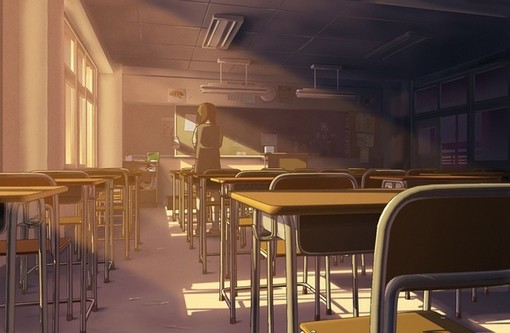

# 理科班望

教学楼里立着一吊人影，具体方位是走廊的尾。走廊呈凹型，人影据在左翼，恰好右翼是理科班的教室。人影贴在扶栏上，稍稍前倾，拟出一个“望”的标准站姿。六点二十分，楼里的人散得干净，于是人影处在黑暗单薄得如一页纸。你应该猜到，人影即是我。我即是人影。

我望着理科班，眼里是一道繁琐的题。我在解题，用笨拙的数理逻辑，把字母解成数码，把数码组成公式，把公式套进前方的世界。结果呢？我得出一地的水泥钢筋。教室里的人不多，他们都伏着头，也许是在解题。他们解纸上的题，头左右摆动，远远的像一把黑灯在晃。我在解他们的题，解得一塌糊涂。

其实，上述动作是我每天的必须。出入教室我也要望去一眼，望去一眼很方便，收回来却没那么容易。我总是被某些东西定住，以致于整个人都被钉住。钉住的时候我一动不动，四肢僵硬，脖子后拗，目光呆滞。看上去像是雕塑，我记得有一件雕塑，摹的就是这个形态。你完全可以把我当成雕塑，雕塑在座位上时，两手托腮，目光不住往右偏，我想长期下去会得斜视，但我却改不过来。对面的教室必定有让我神往的物事。

以上叙述可以颠倒。理科班在望着我，我站在显眼的位置，让它望得更清楚点。理科班是建筑，建筑是死的，它的视角也是死的，我必须在死的视角里呆住，否则它会丢失目标。颠倒之后，我和理科班竟成镜面内外。在物理学上算是反射，或是散射，总之我不懂。如果我懂，那么我也就不会望下去，因为它少了神秘感。

六点四刻，日夜交分。我望着理科班，理科班也望着我，互望彼此的感觉是莫名的。这时，李寒之站到我背后，使劲拍下我的右肩。疼痛刺进我的神经，只是瞬间，我又失去感觉。李寒之当然不休手，他又拍了几下，直到我转过身。我应该啐他一脸，可惜我没有。我向来比较克制。

李寒之是个理科生，是我的朋友。他既是理科生，又是朋友，身份悬殊。他像是一个被撕裂的人，和我说话的是一半，而另一半住在教室里，嘴角流涎——这是我的假想，我假想每个伏案苦读的人都应该死盯住习题纸，划着笔，磨着屁股，嘴角还流着涎。涎往右作垂线，每个理工生都应该看得懂，这段描写直指生活，生活又是他们的生活。不过他们又时常怀疑。

我的朋友李寒之在我出神的时候拍我肩膀，力度很足，我很疼，够得上偷袭的罪名。他拍我时，控力不是盲目的，每个理工生都很精确，他们精确地答题，精确地拍人。李寒之还是校篮球队的，他会精确地打球，精确地投篮，精确地投空。不过，他只是半吊子理科生，尚不够精确。以上是论点，以下是论据。

论据是在一个月前，李寒之失了恋。说起来有种失荆州的味道，但李寒之不是关羽，他的女友也不是一座城。反之，那是一个大活人，以致于李寒之没能守住。所以没能守住，不单是大意，更因为不够精确。李寒之没有算准一些事情，毕竟他不是孔明。他到底是什么，我很糊涂。据前文，李寒之是校篮球队的队员，校队打球的机会较多，李寒之露脸的机会也多。他在打球中认识了他的女友，正印证我的说法：李寒之有两半，一半在打球，一半认识她女友。

他的女友我见过。两人是在球场外认识的，不然我就得假想，他的女友也打篮球。那是一个矮个子女生，扎一团头发在脑后，像是一颗瘤。其实这是流行的发式，说明她也很时尚。改过裤腿，紧箍在她脚裸上，再穿一双白帆布鞋，形式鸭爪。女生给人的印象是小巧，说法不大得体，事实上她下盘粗壮。没有人形容萝卜根小巧，除非是李寒之。李寒之在这一点上已经犯下不精确的过错。

李寒之不只一次有失精确。最后一次是在二个月前，时间是晚八点，地点是宿舍背面的小树林，两人约好见面。结果女方爽约，李寒之苦等一晚，怏怏而归。女方的解释是，她八点还在洗澡，出来打扮半小时，途中遇上好友应付半个小时……李寒之信了。如果他坚持精确，便会发现，再周密的谎言里也有破绽。破绽是，等待耗掉的时长是两个小时。等式前后不平衡，在数学上叫不等，或是误差，我不清楚。

此后一个月，不管李寒之精确与否，该发生的一切均已发生。误差再小，也会胀大。正常的讲，误差会被时间放大，而在数学上，误差会被诸如平方一类的撑大。李寒之在若干次方后，被女友给甩了。在这道题里，李寒之是一个瘦小可怜的几次方根，他的女友是硕大的根号，原本李寒之数值很大，被他女友一来二去的开过，我已经认不出他是多少，总之很小很小。以上计算足以令我头疼一宿。

晚餐时间，我例行公事的在走廊上，凝望对面的教室。凝望的大多是诗人，诗人一脸的诗意，诗意写在脸上，就像泼上脏水。诗人一脸的脏水，透过脏水看去，教室在水雾里一派朦胧。

曾几何时，理科班里也会有人回望。有一个老故事：一个理科女生与一个患偷窥癖的诗人，隔着数倍空气对望并且含情脉脉。而新故事则是，有人留意到我异常的举动，并萌发浓厚的兴趣，直到最后把我爱上。此类叙述总是含混不清，以数学的逻辑，我应该搜出相关的记忆，再罗列、分点、陈述。

我在口袋里找到一张纸条，一张揉成团的小便条。纸条上绢秀的字迹，不用猜，肯定是一位女生。至于女生的字迹如何深入我的口袋，又是一个故事。至此，共计是两个故事。两个故事可以链成一个故事，也可以拆成更多的小故事。我有一堆的故事，却不知从何开始。可能这正是缺乏理科思维的不幸。

我链起两个故事，得到如下的场景：女生在我痴痴地望着对岸时，悄悄绕到我背后，拍了我一巴掌。巴掌很轻，打在我左锁骨上，只是稍微一麻。我掉过头，就抓住了女生的全貌：一个青春少女，马尾辫、瓜子脸，皮肤糯白。眼睛在目光底下流动，脸颊小心翼翼地红着。我看得心旷神怡，在很长的时间里，居然忽略对面的理科班。不，压根没有忽略，我盯住一个理科班的女生，于是很难分辨，我盯的是理科班，抑或女生？

演员和时间组合成剧本，一系列的场景接连掠过我眼前。我仿佛平躺在荒原上，四肢抒张，秃鹰飞在我眼前数十米的高空上，投下意味深长的掠影。记忆让人脱离时间，我忘了在做什么、该做什么和是什么。

实际上，我还是立在理科班对面，形如一樽雕塑。我望着理科班，情绪莫名，时而低平时而起伏，时而激昂壮烈。难以解释上述的心理活动，不如回到美妙的记忆里。女生作为我的女友，是在一个月后，从现在算起则是一个月前。如上的数字令人混乱，而抛开数字，我会发现一切重叠着，并行着。我的恋情、李寒之的恋情……惹人惆怅的恋情。

我早忘了女生叫什么。女生在理科班，偶尔的瞥一眼窗外，偶然的瞥见一个木讷的男人，正在十几米外眺望。女生爱上了他，原因不详。而中间发生的却在我的记忆之外。我铺开那张纸条，又仔细地扫过一遍：

“明天中午，食堂，老位子。”

一个世纪前我是一名地下工作者，赶赴与上线约见的地点，却被埋伏的特务一枪崩掉。再往前，我可能是一名骑士，为公爵小姐而去决斗，被人定时定点的砍成两截。而现在，我却忘了自己是个什么。在我的记忆里，有一位诗人，有一位理工女生，他们之间肯定有过纠葛。女生问诗人：“你在这里做什么。”诗人答：“没什么，闲呆着。”女生又问：“那你盯着我们班干啥？”“我也不知道。”诗人摊手。

女生觉得诗人很有趣，所以没再回去，而是陪他站着，问这问那。诗人心不在焉，但还是一一的答完。六点半，夜已经黑掉半幢教学楼。女生把诗人带到食堂，两人聊起来，很起兴。诗人丢掉理科班，眼里只剩下女生。后来是两人结为朋友，再后来是两人越过朋友关系……我的记忆就此打住。六点二十分，我在教学楼里形只影单，视线射穿十几立方的空气，溶解理科班青幽的灯光里。灯光下是若干人头起伏波动，像玻璃瓶里的跳蚤。我想是时候离开了。

我忘了李寒之还在身后，他要去食堂。以往，他的身边陪着一位女生，去食堂时肩并肩而行，感觉温暖舒适。如今他找我作伴，我不便拒绝，但说实话，我不是好的替代品。两个大男人挨着肩走在冷清的校道上，看见的人不免怀疑。我建议他去找个女伴，他思忖片刻，又笑了。

故事还在继续。空间转换到食堂内部，飘浮的油烟腻腻的滑进我的鼻孔，我呛了一口，局烈的咳嗽起来。食堂总是不讨人喜欢，我却还是津津有味的嚼着一根老菜，和李寒之来回闲扯。我们没说什么，只是有意无意的提到一些事，两人一并陷入回忆，又变得神情恍惚。

李寒之的女友说，她愿与他天长地久。李寒之听后很高兴，觉得她到死都跑不了了。这里的李寒之又犯了不精确的错误，因为她只是说说而已，他应该立刻掏出纸笔，写好契约，要她签字、画押。不过，就算立了契也不一定管用，因为“天长地久”是一个文学词汇，在文学里意指很长很长一段时间，而在文学之外什么都不是。如果它在文学之外依然成立，那么李寒之就得死后准备化成鬼继续相爱，永世投不了胎。这未必是一件好事。

当然李寒之并没有考虑这些，此刻他坐在我面前，与我四目相对，口中嚼着一片干肉，没有吞下去的意思。他说他期末考得不错，又说他竞赛一等奖，周一公开表扬云云，简直语无伦次。说完这些，他的干肉还是没有吞进去。他在等待什么？反正我等不下去，一扭头到望出窗外。李寒之说，他和她会有一个美好的未来。这当然不是指死后的事。他说他打算考个好大学，争取当高级工程师。我才想起他是个理科生，我居然和理科生在聊天？不可思议。

两个月前，一个理科生坐在我面前。她说她爱我，下一句是……可能是要嫁给我，未免为时尚早。我判断她说的是“想和你在一起”，这一句正常许多。而我的回答，却迟迟记不起来。总之，该说的她都说完了，剩下的是我的事。唯一肯定的是，我点了头，她轻盈的一笑，眼神飞上半空。

和理科班的人打交道，时常要警惕公式化和数字化。你应该想到，在你眼里活生生的人，在人眼里你却被拆得七零八落，简化成公式和数字。这可不是什么解构主义。和李寒之对话时，我尽量避免直视，眼神飘乎不定，他就抓不住我，我也不会被他大卸八块。和理科女生交谈时，我不得不直视，只好把灵魂一抽，留下干瘪的躯壳与她对视。所以她经常说，我的眼神很深邃，几乎要把她吸进去。此外，你得少用数字，哪怕一颗火星，都足以把一个理科生的大脑引爆。李寒之问我时间，我得用时辰代替，说出来的都是子丑寅卯。文字是理科生之大忌，久之李寒之便不敢再问我时间。而理科女生方面比较棘手，两人约时间，她问：“八点……”我立马补上：“准时。”我必须准时赴约，否则她就会指着手表，大声问我：“迟到多久了？”我陪着笑，喃喃的说：“很久很久。”宁死不提数字。

事实上，即便我提几个数字，也不会有什么大问题。但我一旦想到，自己被人卸成若干血淋的肉块，就禁不住的打颤。

李寒之分手的时候，女友向他坦白：“我爱上别人了。”李寒之大脑艰难的转动，他记起一些诸如地久天长、海枯石烂之类的恐怖的字眼，但又吐不出口，只能在沉默中目送女友在走廊的末尾一拐，从此消失。李寒之的计算器上多出一个定量，少掉一个变量，等式就此崩溃。

细看李寒之的等式，你会发现落差早已存在。一周前陪女友出去逛街，女友说想买LV的包，李寒之摸进裤兜，指甲在钞票上拨了两回，才确证钱不够。他自然不能坦言：“我没钱”，或是劝她：“能不能买个打折的。”李寒之脑子一热，竟直言不讳：“钱不够。”当时，女友只是瞪他一眼，没有别的表示。他庆幸风平浪静，殊不知女友早就釜底抽薪。

除数钱外，李寒之精密的数学头脑可以应用到许多地方，算帐、解题、测绘……李寒之无一不通。唯独他对女人一窍不通。他的女友不是理科生，我刚好想起来，她是一名文科生。自此，篇中出现第二个族群，不见首尾，从天而降，叙述越发的困难了。

文科生是什么？常年累月，我望的是理科班，熟人都是理科生，解题依靠的也是理科思维。我根本不认识文科班，叫我从何说起？如果李寒之不找一个文科女友，我会省事许多，麻烦都是这个女人招来的。照理，我应该把他的女友绑上，严刑拷打，逼问她什么是文科班。而我怀疑，她大概也没有答案，文科班的人不清楚什么是文科班，或许文科班压根不存在？如此一来，故事不免脱离生活，没有生活等于没有意义。有生活的故事里，只存在理科班和非理科班、理科生和非理科生，多出来的文科班，我不知如何处置，除非我能逃到生活之外。

我是非理科生，非理科生在走廊上驻足，眺望十倍空气后的理科班。人形从我背后穿过，没有人理会我。我是雕塑，被划在世界之外，时间静止，一切变得玄秘、奥妙。我的视野里，一个班的理科生正坐在教室里，驼鸟似的把头埋下去，钻到习题里。他们在干什么？问题比哥尔巴赫猜想更令我费解。

我的前女友是一名理科生，她对我说，理科生的未来是工程师。他们拼尽全力地计算、解题，为的是一个名牌大学，毕业后顺利入坐办公室，当上工程师。她又说，非理科生的未来她看不见。明摆着，非理科生的未来是非工程师。若干年后，世界分化成两大阵营，即工程师与非工程师。工程师测量、设计、规划……你想得到的他们都能做。而非工程师干什么，没人知道。

问题有关前途，我不由得忧虑起来。我的未来是非工程师，非工程师同非人一般，无处着身。未来令我不寒而栗，我极力回想，企图找出一些另外的选择。我在前文里找到一个职业——诗人，虽然我不认得什么是诗人，至少希望是有的。

我说我可以是一个诗人，但她不懂，她问我什么诗，什么是诗人。我很为难，因为概念模糊不清。她突然觉得我很可怜，我是个皱巴巴的非理科生，被压缩在角落里，一文不值。她想说几句安慰的话，同时盘算起如何才能摆脱我。大可不必，只要她一挥手，我就会顺从的离开。我正在思考诗人的问题，不希望有人打扰。我们分了手，各自东西。

李寒之的女友是文科生，而我的女友是理科生。这是种精确的分配，还是个有趣的巧合？不得而知。李寒之失恋后郁郁寡欢，想去当工程师。我失恋后不知所谓，更不知何去何从。我和李寒之在食堂里对视时，脑中的情景大致如此，此外无他。

结尾是我在教学楼里，薄如一吊人影，默默地望着对岸的教室出神。我在想诗人的事，外表失魂落魄。一道题只有一个答案，故事却有若干个结果，这就是不同之处罢。

(**采编**：薛晨如；**责编**：王卜玄)

[【浊流】绿茶婊](/?p=42972)--它是彻底属于烟霞镇的世界。我在田野里构建直到天与地边际的网络，城池由构建者的想象构成，芜杂而远久，以至于所有试图表达的情绪组成了烟霞镇，最终被烟霞镇吞噬，导致最后失去了社交网络，从此无人聆听远道而来的往昔。

[【浊流】爬黄山](/archives/43069)——当清晨你去采摘带着露水的熟透了的樱桃，你应该就会想像得到她红红的嘴唇。这总让我想起Cherry，不知道她在国外怎么样了，是否习惯了啤酒和肉肠。

[【浊流】七年之痒](/archives/43091)——或许很多时候人对于一个故事念念不忘，并不在于这个故事的精彩程度和意义大小，而在于它始终没有说出的那个部分。
