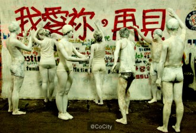
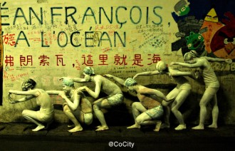
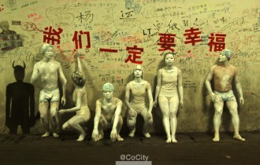

# 墙——记芙蓉隧道行为艺术行动与保育联萌修复活动

5月24日凌晨3点钟，芙蓉隧道“我爱你，再见”主题涂鸦前，七位“青年艺术家”，全身“涂白”，如大理石雕塑一般错位站开。一场以名为《墙》的行动艺术正在隧道里白色的灯光下有条不紊地创作，“用行为来体现心境，回顾这几天的事情和你们的想法，并真诚地表露出来。”身前摄影师的提醒令大家很快进入到肃穆的艺术创作状态中，快门——定格。行为艺术表达的内容，往往超越它本身所具有的形式。

约10个小时后，由几位厦大校友、在校生一同创建、运营的人人主页“芙蓉隧道保育联萌”发出一条状态，大意为：这个名为“保育联萌”的“民间组织”将在芙蓉隧道组织涂鸦修复活动，号召厦大学生自愿加入。

有关“芙蓉隧道涂鸦”的舆论风波持续多日后，如何“行动”成了新的主题。

一、

七位参与“活雕塑”行为艺术的表演者，多是厦门大学的校友与在校学生。Roman';">21日的芙蓉隧道涂鸦“涂白风波”爆出之后，他们在参与舆论声讨的同时，更觉得有必要行动起来做点什么。厦大校友大吉木（化名）最先提出了做行为艺术的构想——反对“涂白涂鸦”的他们，打算将自己全身“涂白”，在隧道涂鸦前展示人体“活雕塑”。

经过一晚的商讨，十余人陆续加入其中。为保证活动顺利，他们决定择日凌晨出发。接下来的两天，他们开始准备器材，做颜料人体耐受实验，论证创作方案，为的是确保行动顺利完成。

23日晚，七名“行为艺术家”和同行的四名负责场记工作的志愿者集合完毕。

而直到此时，对于几个小时后即将付诸行动的细节，参与者互相之间却仍有争论。

参加这次活动，众人并非没有顾虑这只是一次纯粹的艺术活动吗？“涂白”既已取消，活动的目的又在何处？

也是此时，记者第一次听到了大吉木对于这些疑惑的解释，选择行为艺术，是“因为它的表达形式和语言很有独特性”。在他看来，艺术要扎根落地，不离社会生活，理性温和地关怀现世一直是他的创作理念。这也许只是一个行动，“艺术“一词去掉也罢，他更看重的是行动本身的象征与互动过程——期待年轻一代，可以用更多元的方式表达自己；可以用更柔和的方式传达讯息；可以用更幽默、沉静的态度参与公共事件。

谈及“隧道事件”本身，他的愿望其实很简单：通过身体与墙的对话，让大家以更理性、幽默、温和的方式来继续关注、讨论这次事件。”这次行动的成果会在微博平台上发布分享，与公众互动。“至于结论，不能左右。”大吉木强调。

或许，行为艺术带来的结果本身就是不可确定的。

24日凌晨一点半，出发前大吉木再次征求大家对创作方案的意见并一一询问是否退出。这次活动的执行原则是“一票否决”即一人不同意则原有方案作废。在得到所有人确认后，创作团队踏上出发的道路，消失在茫茫夜色里。

接近凌晨3点，他们进入芙蓉隧道。七名表演者在负责场地工作的志愿者的帮助下将身体涂上白色水彩，事前穿好的泳衣泳帽则被丙烯抹白。负责摄影的大吉木调整好了机位和镜头。大概半个小时之后，喷绘完成，7人俨然如7尊凝重庄严的白色大理石雕塑。

第一个创作场景便选在此次风波中备受瞩目的“我爱你，再见”主题涂鸦前。众人在涂鸦前错落站开，姿态各异彰显张弛有度的力量感。而之后在绘有“弗朗索瓦，这里是海”字样的涂鸦前，七个人依次排开，做出卷舒有致的海浪状。

实际上，对于参与者本人而言，“用身体与墙对话”的过程并不轻松。大多数人第一次参与这种形式的行为艺术表演，染料对皮肤产生的刺激感觉令他们并不适应。一位参加者事后告诉记者，水粉颜料粘在皮肤上十分难受，风干后龟裂脱落时会连汗毛一起粘掉。即使如此，在整个过程中众人神情依然肃穆，全无懈怠。

四点半，天空泛白。在隧道尾端，最后一组照片拍摄完毕。一行人细心地将用过的染料碟、画笔与瓶瓶罐罐装入事先准备好的垃圾袋中，静静地走出芙蓉隧道。

出口旁的值班室内，保安正在酣睡。

二、

5月23日，“物机男”主动修复“我爱你，再见”的照片在微博与人人上广为传播，同样深入人心的还有一句评论“爱不只是嘴上说说，行胜于言！”这件事给了徐浩辰等大四毕业生和远在北京的宋权爽、张启斌等厦大校友一定启发，他们决定拿出更多行动来展现自己对母校的热爱，其中一些想法得到了部分在校生的支持。自“涂鸦清除风波”爆发以来，他们在舆论中一直很热心、很活跃。

当天中午，由他们牵头建立的一个名为“芙蓉隧道保育联萌”的人人主页，开始了第一次更新。“保育联萌”的行动主体，多为即将毕业的大四学生。

24日，中午12：59，“芙蓉隧道保育联萌” 以诙谐、可爱的语气发布了一条通知状态——“亲们中午好～从今天起请叫我小萌萌～有人联系小萌萌说愿意为大家免费提供颜料画笔等修复工具，小萌萌顿时觉得此萌主高大威猛，么么哒～心动不如行动，何况有人如此贴心～欢迎大家拍照上传并@小萌萌。哦，对了，据说现场会有大量萌妹子出现。”

得到“学长基金”资助的“保育联萌”，自备了画笔、染料、丙烯等材料，在隧道入口处邀请志愿者与之一同修复涂鸦。这一次被修复的部分，不只限于“我爱你，再见”。呼吁很快得到了回应，不少学生自发加入。由于大多数人并非专业，他们的主要修复工作还是将原本空白处被污染的部分重新染白。当天的修复活动持续到晚间十点，芙蓉隧道的咖啡馆帮其安排了修复过程中所需的场地。

第二天（周六）“保育联萌”的微博开始更新，修复活动继续进行。他们在带来的白板上写道“免费发放修复材料，请各路萌主卖萌加入。”越来越多的志愿者加入进来，甚至一些游客也加入了修复的行列。随着不少积极热心的女同学加入，“联萌”也自然兑现了“现场会有大量萌妹子出现”的承诺。

修复活动按计划持续了三天。

三、

5月27日晚，新浪微博@CoCity 发布了大吉木他们的行为艺术组照，他们将自己的作品取名为《墙》“我们尝试用身体与整个隧道空间互动，开展一次人与墙的对话”，大吉木解释道。

记者再次想起大吉木出发前说的话：“我希望这个社会更加自由，表达更加多元。”

（荐稿：周拙恒；责编：张舸）

[【涂鸦春秋】隧道风波 ——厦门大学芙蓉隧道涂鸦事件](/archives/38028)

[【涂鸦春秋】<七星视点>第四十期——“整洁”之罪](/archives/38086)
