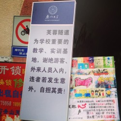

# 隧道风波 ——厦门大学芙蓉隧道涂鸦事件

2013年5月28日之后来厦门大学观光的游客，无不惊诧地发现：一度被网友视作“来厦大不可不看的风景”的芙蓉隧道摇身一变，成了学校“重要的教学、实训基地”，隧道口立起的公示牌引来众多游客驻足围观，公示牌上“谢绝”、“自负其责”等字眼，微妙地挑动着周围人脸部肌肉下的神经。

这是一个月来众多有关“芙蓉隧道”的新闻中稍显平凡的一则，之前围绕隧道引起的众多轩然大波显然让这个“重要的教学、实训基地”背负了太多它承受不起的重量。

“被污染”的涂鸦？

“空白是激发人创作欲望的原始因素”，青年艺术家甄士隐向记者说到。

2007年隧道竣工后便有人陆续开始在两侧的内壁上开始涂鸦创作，经过几轮刷新修复，累积至今已在两侧的空白处留有数百幅学生自主创作的涂鸦作品。“空白”所激发的还有更多人的涂鸦欲望，用黑色马克笔写下的“陈鹏飞，生日快乐！”字样在隧道里重复出现多次，河南某游客留下的“到此一游”字样大约200米出现一次，还有某游客留下的疑问“怎么不在隧道中间修个厕所？”引起了众多人在下方的调侃和呼应。同时，也有人选择用这样的方式来表达意志和诉求：“我们是同性恋，我们需要祝福！”仔细观察，“祝福”二字上还有黑色的×号。

“他们这是在污染校园，他们根本不配进厦大！”一位厦门大学在校生向记者抱怨道。但也有校友在微博上发表状态称：“互动本身就是涂鸦文化的特质，游客的涂写也是一种创作，是文化景观的一部分。”显然，大家对“污染”的看法不一而足。

作为产权的所有方，学校当然也没忘了这块“宝地”，截至4月27日，各学院陆续接到中共厦门大学纪律检查委员会等五部门下发的《关于举办2013年度“校园廉洁文化”绘画作品大赛的通知》，准备在芙蓉隧道设立“廉洁文化创意墙Roman';">”，征集到的作品将在5月21日到6月20日展览、评分。21日中午，校学生会督导部官方人人发布日志《寻找芙蓉隧道涂鸦作者》，含蓄表明隧道口多幅涂鸦将因此事涂白，引起舆论广泛关注。

学校这样的举动对于在校生们来说并不陌生，2012年“十八大”前后，学校将芙蓉隧道内三幅作品涂白覆盖，代之以“爱党爱国”主题的涂鸦。一位在校生曾发表日志《请“政治”滚出芙蓉隧道》，文中称：“在我看来，文化应该是自由的，是触及人心的，是表达人性的。它不应该被有目的的有意识地‘政治化’。”有评论指出，学校这种行为可能是变相的“政治污染”。学校是时并未作出任何回应，但文中的一处反问句“下一轮的宣传攻势来的时候，又如何保证“政治宣传画”不会占据新的板块呢？”如今看来充满了预言意味。

  

谁的涂鸦？

关于芙蓉隧道“污染”问题的争议由来已久，也许有必要回到本质的层面上来讨论。

自芙蓉隧道竣工以来，两侧墙体便开始陆续出现各类涂鸦作品，毕业学生也越来越倾向于用涂鸦创作的方式表达对母校的留恋之情。曾经功能单一的通道逐渐被赋予文化内涵。在大部分眼中，芙蓉隧道成为了厦大独有的人文景观。今年年初，芙蓉隧道内还新开设了一家主题咖啡馆，面向公众开放，更加丰富了芙蓉隧道的功能。

随着隧道功能的增多，使用群体变得复杂。芙蓉隧道开始夹带着涂鸦文化的标签深入人心，最初在这块新奇的“画布”上开垦的那批涂鸦创作者们，恐怕没有想到多年之后，有关的权益问题也逐渐凸显。

厦大某校园媒体早在今年4月8日发表了一篇名为《谁家的芙蓉隧道》新闻报道，该报道反映了学生对于商家在芙蓉隧道中贴广告和游客在隧道内壁上涂写等现象的探讨，并在结尾中写到：“它是我们的芙蓉隧道，是属于每个厦大人的芙蓉隧道。”前文所提及的《请“政治”滚出芙蓉隧道》一文也指出“政治的归政治，文化的归文化。”二者都在侧面牵扯到了芙蓉隧道的主体问题。

就此，一位厦门大学法学院老师告诉记者，芙蓉隧道的产权属于学校，学校是芙蓉隧道的所有者，学生有长期的使用权，但该使用权仅是学校让渡而来的。

但在厦大芙蓉隧道的涂鸦问题上，事情显然没有那么简单。舆论中的各方在表达立场时，都在隐隐表达着这样一个疑问，谁才有在隧道里涂鸦的权利？

“涂鸦的意义不在于画得多好，而在于谁都可以画，画什么都行。”一篇署名为冯诚的文章在众多“倡导清除游客字迹，归还纯净校园涂鸦”的呼声里显得格外突出。网友@谢老师绘本馆则在微博中表示：涂鸦文化最重要的是自由文化，我认为刻意地为了我爱你，再见，而把其他人（游客）的涂鸦（签名也好，随意写也罢）以白色涂抹掉，是对涂鸦文化的不尊重，既然是涂鸦墙，是大学，那应该是自然状态的，即使哪天那五个字被掩盖了也是自然的！刻意就变味儿了。

厦大某校友则在文中反驳：“我坚决不认为游客是在和作品互动，那完全就是美丽菜肴上密密麻麻的苍蝇！这是个人感情问题，不想讨论。”另一名校友张启斌则在转发谢老师绘本馆的微博时评论道，游客首先是不尊重一幅景点作品，涂鸦自然是要不断更新，但不是恣意践踏。并且在他看来，“校方大面积毁掉涂鸦用于政治宣传”和游客的随意涂写都属于一种践踏。这与《请“政治”滚出芙蓉隧道》的作者不谋而合。

《请》一文的作者还在文中表达了自己的恐惧和思考：“令我恐惧的是文化的自由将不复存在，尽管没有办法证明隧道最后会变成“一言堂”，但是谁也无法保证隧道不会变成“党建隧道”？尤其是如果这一切的幕后来自于学校上层的话，又有几个敢去把那几幅“宣传画”给刷掉呢？”。

据此便产生了新的疑问：涂鸦墙使用权的归属是否是无可置疑的？

倘若校方对芙蓉隧道的使用权力是无可置疑的，那么“力排争议”地强推“廉政文化宣传”上墙理也应该是无可厚非的。然而，为何此次举措却会引起学生舆论如此之大的反对批评呢？

消失的“管理办法”

“管理办法”，全称为《厦门大学学生会督导部芙蓉隧道涂鸦管理办法（暂行）》，但记者于5月22日登录厦门大学学生委员会网站时，点击查看该办法时，只能下载到一张申请表格，办法内容无处查询。厦门大学信息公开网上也未查询到相关内容。

经过反复询问，终于在5月23日一位不愿具名的学生会成员向记者提供了上述《办法》的电子版文档。同时记者得知，自5月21日晚，督导部已开始制定新的“管理办法”准备替代这份略显“笼统”的老《办法》，但当日未通过团委负责人的审核。截至发稿日，记者尚未从厦门学生委员会等公开网站上查看到“新办法”。

关于管理办法，与校方“犹抱琵琶半遮面”的态度相对应的则是微博，人人等社交网站上爆发的大讨论。

厦门大学校友@cs队长老徐通过微博表达了自己的观点：建立一个独立的管理实体，这个实体是纯民间没有任何实权的，只是希望通过表达自己的存在以后通过倡议来影响芙蓉隧道的良性运作。但是在自己的长微博中，@cs队长老徐又在醒目的位置说明，“隧道是校方的，实权在校方，该实体应该首先努力获得校方的授权。”

而自21日起，同为厦大校友的陈堃，张启斌等人便开始着手拟定“厦门大学芙蓉隧道涂鸦管理及维护办法草案”，草案内容侧重两点，“1、搭建公开的网络平台，及时更新涂鸦动态，征集广大师生对涂鸦的意见和建议并妥善做出反馈等。 2、督导部负责涂鸦作品的“备案”，包括事前备案和事后备案，就是涂鸦者可以选择涂鸦前去督导部备案，以方便日后联系。“事后备案”就针对涂鸦者自由涂鸦和已经存在的涂鸦，督导部要及时对所有作品进行“补充备案”，目的是为了保留记录，也方便日后联系”。

在草案中，“申请“一词不见踪影，代之以“备案”这一概念。

24日，陈堃又针对“备案”一事，发布微博提出两点建议：1、个人涂鸦行为、覆盖涂白行为不需要备案和公示。2、只有官方部门（包括学生会等准官方部门）发起的涂鸦行为、覆盖涂白行为需要公示讨论。张启斌做了补充解释称，个人涂鸦是不受任何约束的，官方清除是改变了涂鸦自由创作自然演进的性质，所以才需要公示讨论。

可是，草案最终却没有公布。问及原因，张启斌回答道，“因为本身自己追求的是不受任何约束，提出草案的原因只是为了限制公权力的过度干预”。他担心公布草案会“适得其反”。“另外有更加坚持涂鸦文化的同学也认为涂鸦不应该受到任何管制和审批，”他补充道，“所以我认为这些讨论的内容，对于已经行‘管理’之实的督导部不应该缺席。”最终他们将草案一些核心的内容发给督导部。

然而，我们也听到了另外一种声音：“一个颤颤巍巍，瞻前顾后，心存畏惧的涂鸦者又如何是一个合格的涂鸦者呢？一个被束缚了的涂鸦墙又有什么意义呢？”《请不要保护涂鸦墙》一文的作者冯诚在文中写到，国内涂鸦艺术家张大力曾在公开场合称，“作为一个有批判性的、具有社会意义的涂鸦艺术，慢慢被公众接受，甚至有地方政府设立涂鸦一条街，涂鸦已经从边缘的、非法的艺术,成为了合法的、时尚的艺术,对社会问题的自由表达功能逐渐退去,消遣式的把玩和意识形态的传播功能侵入涂鸦，涂鸦之所以存在的意义也已经基本丧失。”

“异化”的涂鸦

“芙蓉隧道涂鸦清除风波”并未因一条略有疑点的状态而迅速平息，相反，公众舆论的讨论域渐渐拓宽，开始审视涂鸦文化的本质意义。

25日“芙蓉隧道关注组”主页发布日志，开头粘贴了两则源自维基百科的涂鸦定义：[涂鸦指在公共、私有设施或墙壁上的人为和有意图的标记。](http://rrurl.cn/9MkeqC)[涂鸦原本是人们不分场合、出于不同目的、随意取材、信手涂抹的行为状态。后来发展为一种以绘画和书法为主体的边缘艺术样式。](http://rrurl.cn/akJpa6)

24日凌晨，冯诚在他的日志《请不要保护涂鸦墙》中，开始提出了对涂鸦本身意义的探讨，“上帝的归上帝，凯撒的归凯撒，本就代表自由精神的涂鸦，就让它自由发展下去好了。”“涂鸦的意义本身就在于所有人只要拿起笔就可以自由的表达自己的想法。”涂鸦不是阳春白雪，而只是下里巴的艺术形式。

“什么是涂鸦”确不是什么难题。什么是涂鸦的文化内核？自由、放纵、叛逆、年轻……似乎也没有太多争议。但是，众人在如何对待隧道“涂鸦”的问题上，却产生了不少分歧。

“物机男”修复“我爱你，再见”的照片在网上走红后，一些学生与校友纷纷呼吁拿出行动保护涂鸦。厦大校友邱靖曾建议，“芙蓉隧道在黄金周寒暑假处于游客高峰期，很需要有志愿者组成维护队，防止游客乱涂乱画乱丢垃圾。”“芙蓉隧道关注组”“芙蓉隧道保育联萌”等民间组织也活跃起来，后者，从24号到26号，自发地展开了为期三天的隧道涂鸦修复工作。很多学生在微博、人人上发状态表示支持。

正如冯诚所说，“经此一役，很多同学意识到了厦大涂鸦墙的珍贵意义，于是动起了做些什么，保护厦大涂鸦墙的念头，甚至有人还想发起成立保护基金，要派专人定期维护。”但对于这种做法，冯诚的态度并非力挺，“如果你成立一个保护委员会，甚至一个基金，告诉大家哪里可以涂哪里不能涂；应该画什么，不该画什么；哪片涂鸦需要保护，哪片涂鸦需要清除，这就和涂鸦本身的理念完全背道而驰。”他甚至在日志中提出“请大力的宣传并鼓励新一代厦大的同学们勇敢的刷白前辈的作品，涂上他们自己的。”在他看来，保护厦大涂鸦墙，更重要的是保护这种文化的精神意义。既然是涂鸦，更新越频繁，就越有生命力。

作为针对性的回应，宋权爽发表日志《驳<请不要保护涂鸦墙>》，之于冯诚对涂鸦“自由表达”的内核理解，她基本同意；但是，之于为冯诚反对的修复行动，她选择支持，“这背后是一种公共参与，这是很赞的事情”。

其实，在很多厦大人眼中，涂鸦有两种。一种是芙蓉隧道里的涂鸦，一种是其他的涂鸦。

后者，是作为“街头艺术”的涂鸦。

甄士隐评论道：“涂鸦艺术就是个廉价艺术，想怎么涂就怎么涂。”记者继而问道，如果你的涂鸦被涂抹覆盖了，你会接受吗？他从艺术创作者的角度说道，“既然要在墙上涂鸦的话，就应该做好被涂抹的准备。”他并不支持修复隧道涂鸦的举动，“艺术品放在美术馆和在芙蓉隧道里并不一样。涂鸦完成，留下作者签名，以照片的形式记录下来，这种街头艺术品便进入后创作时代。”换言之，已经完成了它在艺术史上的使命。

至于前者——厦大芙蓉隧道的涂鸦，已然异化。

一如张大力所言，当“消遣式的把玩和意识形态的传播功能侵入涂鸦,涂鸦之所以存在的意义也已经基本丧失”。

在厦大学子眼中，它扮演的是毕业留念、青春纪念册、校园记忆、母校景观的角色。

在游客眼中，它是厦大景色的一个特征符号。

在学校眼中，它必须“符合校园精神文明及和谐校园的要求”。

至于涂鸦最初的“后现代艺术”与“街头文化”之意，已退到聚光灯外。

  

涂鸦，该何去何从？

对于现实中已经异化的芙蓉隧道“涂鸦”，我们是否有必要按照纯粹的涂鸦艺术标准做以要求呢？倘若厦大“涂鸦”当前的最大价值正是“校园景观”与“青春纪念册”，我们需要做的是，想方设法矫正这种认识，还是细化管理章程，抑或继续对“我爱你，再见”做好自发修复呢？

在甄士隐等人看来，涂鸦不是壁画，没有哪一幅是“神圣不可侵”，不需要“修旧如旧”的考古性还原修复。

同时他认为，理想状态下，应对涂鸦予以管理，他称，在涂鸦艺术发达的英国，在公共场合绘制涂鸦作品需要将申请递交给文化部，后者会判断其是否属于艺术品。管理主体是当地社区。公共场所的涂鸦作品，著作权归作者，所有权归公众。破坏涂鸦也是违法的。他称，英国的政策出台也是在冲突与争议之后做出的，但他认为，当前的厦门，出台针对涂鸦的专门政策并不容易。

他从自己的经历出发，阐述了一条更具具现实操作性的建议。

厦大一条街“消失”前夕，甄士隐曾用相机将整条街道做以记录。如今，当隧道涂鸦面临更新换代问题时，他指出了一条类似的道路：建立一个“电子博物馆”，将芙蓉隧道的涂鸦拍照记录，上传网站。涂鸦墙早晚会被画满，涂鸦也迟早会被覆盖，但却可以作为影像资料，被长期记录在艺术史上。

5月28日，CoCity团队发布行动摄影作品《墙》，与芙蓉隧道涂鸦“对话”，看到该作品的设计师Oliver Ding提出建议——建立一个专题网站，“把这个墙搬到虚拟空间去，让大家都可以和这个墙对话。做成新媒体艺术”。CoCity团队随即响应，称愿提供Google街景设备，“招募技术、设计和摄影牛人加入 ，实现新媒体艺术的想法”。

几位艺术工作者的设想不谋而合。

尾声

在“芙蓉隧道涂鸦清除风波”中，主要涉及三方主体，姑且按其诉求指向或观点，分别称之为“秩序党”“挺修派”“反修派”。

“秩序党”希冀以成文的管理章程维护隧道涂鸦的秩序稳定；“挺修派”支持修复已维护异化为校园景观、“青春纪念册”的“涂鸦墙”，对母校情感是他们更多的考量；反修派把隧道涂鸦看作最纯粹的涂鸦艺术品，反对修复，尊重艺术的自由与纯粹。

但是，尤其引人注意的是，区隔三者的标准绝非是身份，而是价值。也是因此，三派的范围并不固定，不同的人在不同时间点可能处于不同的派别。

比如，张启斌等人起草法案，希冀按照系统的规章管理隧道涂鸦，看似站在了“秩序党“立场上，然而终因担心背离“不受约束”的初衷而未选择公开草案。徐浩辰曾参与保育联盟的“修复”工作，但是他也在26日称：“的确需要更稳健的管理机制的出现”。甄士隐等“艺术家们”在修复问题上是坚定的“反对派”，但也承认理想状态下需要一套合适的管理办法。早先声明反对修复涂鸦的冯诚，在日志发出的两天后，也在微博上承认，在涂鸦文化的活力尚不足时，对涂鸦做出修复未为不可。在围绕隧道涂鸦的问题上，不同的价值互相纠葛，每个人都不是封闭的、顽固的、单向度的，彼此的想法与价值相互影响，辩驳的过程有时也是互相理解的过程。

不同的主导价值导致了不同的认知、论调以及最终身体力行的办法。

至于哪一种观点更具意义，哪一种方法更为合理，恐怕任何人难以作出准确的价值判断。只有一点我们可以确定，相比较去年年末的隧道涂鸦风波，厦大人在五月的这场风波中有了更长时间的持续关注，更广话题的公共讨论，更加切实的公共参与。这或许本身就是一种成熟的进步。

如今，风波平息，隧道里依然有急促的车铃声响和行色匆匆的往来学生，站在隧道西口往里望，这条1455米的隧道显得幽远而漫长。

（荐稿：周拙恒；责编：张舸）

[【涂鸦春秋】墙——记芙蓉隧道行为艺术行动与保育联萌修复活动](/archives/38054)

[【涂鸦春秋】<七星视点>第四十期——“整洁”之罪](/archives/38086)
