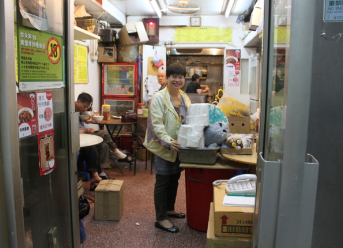
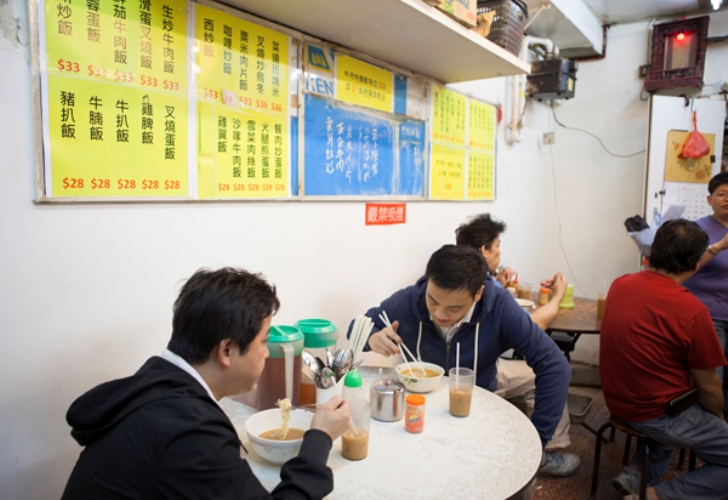
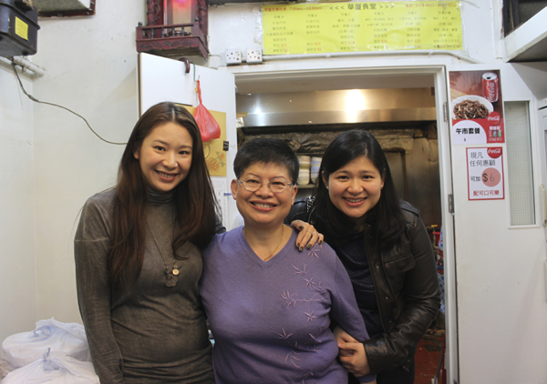

# 再见，工厦食堂

大时代不断掀起汹涌浪潮，未能熄灭小人物的斗志与温情。

街上飘来萝卜牛腩的香气，但你怎么也找不到它们来自哪里。

从大道拐进小巷，在楼与楼的缝隙里穿梭……若没有熟人带路，那些藏身在工厂大厦底层车库，没有招牌、简陋却美味的“食堂”，你便要错过了。

香港人叫它们“工厂茶餐厅”，或者“工厦食堂”。五六十年代香港经济起飞，制造业蓬勃，制衣、制糖、塑料、印刷……工厂大厦在港九各处汇集成区，成千上万的工人聚集在这里，“工厦食堂”应运而生，跟着工人们的上班时间，提供早6 点到晚6 点日常餐饮。“食堂”多半在工厦内部，铺面大的，可以坐四五桌，小的，只够一两桌，多是做外卖生意。餐饮也以set 餐为主，点起来轻松方便。据行家考证，此后发扬光大的港式茶餐厅文化，正是从这些小小的工厦食堂演化而来。

只是世易时移，茶餐厅走出工厂，成了消费都市的一景；食堂却随着八十年代工业北移，本地制造业衰落而步入黄昏。在急速流动的都市，工厂大厦飘出的牛腩香，像是只存在于时间凝结住的平行宇宙，在你找到它之前，它已消失不见。

这篇文章，记录一间开了20 年的“工厦食堂”的最后12 小时。

它叫“华厦食堂”，在太古船坞里一间曾挤满印刷厂的工厂大厦里。这20 年里，华厦食堂见证着伙计和客人从少年变成中年；见证着工人食客慢慢减少，白领慢慢增加；也见证了周围小区的“士绅化”，乃至最终自己在这历史里出局。

开业的最后一周，食堂在门口挂出招牌：“光荣结业，无拖无欠。青山流水，有缘再聚！”熟客络绎不绝，和老板娘、老伙计拍照留念。最后一个下午，一个年轻人走进食堂，看见结业招牌和正收档的师傅，愣了一愣：

“你们……什么时候走啊？”

“明天啊。”

“明天这么快？！”

“是啊。是不是有点舍不得我咧？”

“丢……”

7:30 am

戴眼镜穿运动衫的男人进门，还未说话，店里的阿姐点点头，冻奶茶随即送上。接着是牛油方包、餐肉蛋，火腿通粉。他摊开一份免费报，沉默地吃。

隔壁桌很热闹，金正恩的八卦和三星手机的降价消息在桌面飞来飞去。三个男人西装笔挺，聊得兴起。门口又进来一个型男，齐整七三分头，白衬衫束粉色条纹窄领带，皮鞋擦得明亮，看见这桌，便大声打招呼：

“喂，你们这么早来霸位啊！”

“是啊，想着最后两餐了嘛，最后冲刺！”

“要趁最后冲刺把散钱都花掉！”

……

“之后吃什么啊？”

“早餐二十几蚊还有哪里可以吃到？”

“STARBUCKS 啦不如，反正不论怎样……最后都是这样。”

8:00 am

师傅买菜回来，西红柿、薯仔、洋葱、牛肉、鸡脾，装了满满一筐，拖着进门。

“事头婆”也回来了。老板娘兰姐，60 岁出头，小脸，有很精神的短发，穿一件金融公司的广告外套，再套上围裙，在食客中熟络地招呼起来：

“你要迟了喔，帮你点啦！”

“中午来不来？来啦，留鸡脾给你啊。”

“坐外边啦，门口位好不好？”

“是啊，今天最后一天，中午来吃啊。”

8:30 am

一过8 点半，店里挤得满满，聊天声却少了。人们埋头吃饭，快速买单。

到了8 点50 分，人流速度显著加快，大部分客人打包即走，“A 餐冻柠走冰”、“冻啡走奶餐蛋面”……暗号穿梭。五分钟后，店里一下子空了。人们像约好了似的一齐消失不见，剩下伙计们闲散地收拾杯盘。

“都是赶住9 点打卡……”兰姐冲我笑笑：“你不急的话，慢慢吃。”

一时间无事可忙，兰姐跟我讲起了食堂往事。“这店是1993 年的愚人节开张的，4 月1 日。”兰姐说，那时她正在荃湾另一间工厂大厦做一个更小的食堂，没有铺面，只够做外卖。老公盘下了这里，铺面较大，不会太逼仄辛苦。

“后来我跟老公分开了，在这里一个人凑大三个女儿。”

“1993 年的时候，食堂租金一万五，97 金融风暴后经济不景气，降到一万三。后来慢慢涨到一万六千九。1994 年炒粉卖26 蚊，现在36 蚊。”

兰姐说自己记性不好，但讲起租金、菜价清清楚楚。

“我不想关店的。大楼10 月中第一次找到我，说租金要涨八成，还必须重新装修，桌椅要换掉，改门面，改设计。这哪里能做得下去？我问他五成行不行。上个星期（11 月19 日）再约我，告诉我必须八成，五成不可以。”

“19 日告诉我，月底就必须要我走人。拿一堆英文材料来给我看，我又看不懂……”兰姐下意识地整理桌上的酱油醋瓶，长叹一口气。

说到这里，身边不知什么时候站了一个年轻女孩。“我是看不惯这些人欺负我妈不识字，说什么程序，还要讲英文，逼到她走，连准备的时间都没有。”

她是兰姐的二女儿，30 岁出头，在华厦食堂长大，连老公都是在这食堂来来去去的客人中相识的。女儿一边利落地处理合同、押金、水电煤气种种文件，一边宽慰兰姐：“其实不做都好，我妈妈身体不好，很久以前就叫她不要做。她是舍不得这些客。”

兰姐再叹一口气：“讲真，加五成我都撑下去了。我好舍不得。”

10:00 am

早餐和午餐的空档，伙计们忙着收拾店铺。阿伯小心翼翼地撕下整面墙的照片，坐在桌边一点点刮照片背后的墙皮。

起先我以为那些是明星照，就像很多茶餐厅会挂出明星帮衬、或是媒体访问时和老板的合影。阿伯一一指给我看，我才知原来是兰姐、伙计和多年的熟客逢年过节一起出去旅行的照片。

“以前这里楼上都是印刷厂，我们这里的菜牌，都是客人帮手写，帮手印。我不识字的啊。你看这个结业通知也是客人写的——龙哥！”兰姐一面说，一面喊起隔壁桌坐着喝咖啡的西装男：“龙哥，来来来——！”

客气地换了名片，才知道“龙哥”其实是“隆哥”。“隆哥”黑黑壮壮，西装笔挺，颈中一道金项链，颇有大佬风采。“光荣结业，无拖无欠。青山流水，有缘再聚”，江湖义侠气的结业陈词原来是出自他的手笔。隆哥一早就来店里吃早餐，坐到现在。他说自己95 年、96 年开始在这间华厦食堂吃饭，这么多年几乎没有换过地方。

“喜欢这里煮餸（编者注：下饭的菜）的味道？”我问。

“其实你说饭菜香，和别处差别能有多大？吃的是这里的‘人情味’。”隆哥说。

“事头婆不容易，一个人在这里凑大女儿，快20 年了，我们都是看着她一路过来，看着她的女儿从小长大。事头婆人好，常来常往的客人都记着。你看我们进来都不点菜，她都记得我们吃什么。我们这些客人也都不用麻烦老板，吃完了自己收起来，自己放钱在前台，有时候还帮她收别人的碗，别人的钱。放假了也会约着一起出去玩，一家人一样。”说多两句，隆哥显得有点伤感。“光荣结业，无拖无欠。如今这个世道，你知道的，做到前两句真的不容易。”

12:30 pm

午市最繁忙时，很多客人带着相机来拍照。墙上手写的每日餐牌，咖喱鸡扒、茨仔炆鸡、咸蛋肉饼、南乳猪手……桌椅、日历、小小的厨房、兰姐和伙计们，都成了镜头入画的素材。也有人在一旁笑，“别影啦，影了也没有用……”

2:30 pm

兰姐和伙计们开始整理店里堆积多年的杂物。米、纸巾、油盐酱醋、辣椒油、维他奶、柠檬茶……一箱一箱往外搬；搬完了拆不锈钢的大柜子，一边拆兰姐一边心疼，“好贵啊买的时候……”

一边收，一边还有人进来吃饭。兰姐一边招呼着，一边嘱咐师傅给盛些“靓的”牛腩。

“我以前在荔枝角的纱厂做车工，缝衣服。那是六十年代了，香港那时候有好多纱厂的。一天挣六十块。后来厂都没了，就到了荃湾，在工厂大厦做外卖。然后就来了这里。以前这里好多工人。店开了没几年就是金融风暴了，那时候真是很惨，你看过道这里很多人捡纸盒卖，我们这种食堂吃饭的人都少了，很多人都自己带饭。然后是03 年SARS。现在这里的印刷厂已经很少了，都关门了。你看我们这里来吃饭的，工人都很少了，都是在附近写字楼上班的客人……”

手头一闲，兰姐就坐下来给我讲过去的事。她的记忆线条很粗，很多细节都回想不起来，于是时光简化成了一帧一帧的简笔画，轻轻浅浅，却份外清晰。

5:00 pm

女儿QUEENIE 来接妈妈。她是三个女儿里最小的一个，华厦食堂开张时，她才8 岁，在这里度过了大部份的童年和青春时光。

“念书的时候放假了就会来店里帮忙，搬可乐、洗碗、送外卖，什么都做。我送外卖没有姐姐厉害，姐姐好厉害，客人说一遍就全部记得，几个客人一起说也记得清清楚楚。我不行，我拿起电话，人家说一遍，我要再问一次……啊？”

QUEENIE 说，小时候记得每天中午11 点半开始，外卖电话是不断的，“一收线就响，一收线就响”，“现在你看店面生意不错，但外卖其实少很多了。开了几十年的几家印刷厂都结业，好多客人都走了。”

比起手忙脚乱在店里帮忙，QUEENIE 更记得是站在店门口，看外面车库里不同印刷厂的司机打架：“印厂生意好的时候，时间是不能耽搁的，司机就会抢车位抢送印。抢着就打起架来，打着打着，有时还会进来店里借菜刀！”

妈妈的食堂就像一个小小区，形形色色的人也教女孩们认识了社会和江湖道义。“小时候真是什么都见过，所以现在公司上班，别人觉得很严重的事我看来都不算什么……”QUEENIE 说。最难忘的还是在这里认识的人：“妈妈那辈有一圈朋友，我和姐姐也有自己的年轻朋友。妈妈的朋友在这里看着我长大，我也是看着他们从JUNIOR 到SENIOR，从单身到拍拖到结婚生子，再看着他们的儿子长大。我姐姐和姐夫也是在这里认识。记得刚毕业的时候，新人找工不容易，很多客人都说要请我去他们公司。我妈拦着说不要啦，她搞什么都会忘掉……”

“我明年婚礼，一半多的朋友都是妈妈在这茶餐厅的朋友、客人。我不喜欢社交，是个连生日会都不会办的人，但结婚我愿意摆酒。妈妈这么多年养大我，我没什么能做的，算是回报妈妈。”QUEENIE 笑得潇洒十分阳光的样子，神态中却自有一股倔强。她记得九七金融风暴，妈妈回家说要减她的零用钱，她很生气，差点跟妈妈闹翻。“我说你店里那么多工人，你减我这一点点零用钱？但妈妈坚持一个人不炒，一分钱不减人工。她说每个师傅家里都有一家人，再难也要一起撑过去。”

华厦食堂两个师傅，跟了兰姐十几年，两个阿姐，也一起做了好几年。还有一个伯伯，每天在店里帮忙，端茶倒水，收钱扫地。兰姐说，阿伯不是工人，是以前店里的客人，在大厦里上班，天天来帮衬食堂。后来阿伯退休，一个人生活，兰姐叫他继续来店里吃，说年纪大了有个照应，食堂做饭也可以特别做软一点。阿伯于是继续来，兰姐不肯再收他的钱。他便留在店里帮忙，一直到今天。

6:00 pm

食堂的老客人们，在不远处的海鲜酒店订了两桌，要给兰姐饯行。

大家拥着兰姐，在收拾一空的餐厅合了影，然后吵吵嚷嚷地离去。厨师最后一个走，关煤气，关电，拉闸，锁门。一切都寻常地好像下班一样。

在海鲜酒店的包房，挂着“华厦食堂光荣结业街坊联谊会”的自制牌子。包房里点缀着纸花、彩带，彷佛是刚刚进行过婚礼。“生意不做了，朋友继续做！”隆哥说，张罗着大家开始计划，圣诞节要一起去哪里旅行。25 个人，从四面八方赶来，坐了整整两桌，你一言我一语地说起来，热闹非凡。

兰姐给自己倒了杯清酒，听着朋友桌上的一两个笑话，也笑了起来。

一边笑，她一边碎碎地跟我聊天，又画起了她的时光简笔画：

“女儿小时候很反叛，觉得我没有时间陪她。我没有办法，患上情绪病，夜夜晚上没有办法睡觉。我心里急，以前我们很苦，没饭吃，没书读，现在生活好了，我不想女儿学坏，给社会多一个包袱……”

【文：张洁平；摄：Kei So & 张洁平 】

原文刊于《号外》

（采编：房帅帅；责编：刘铮）