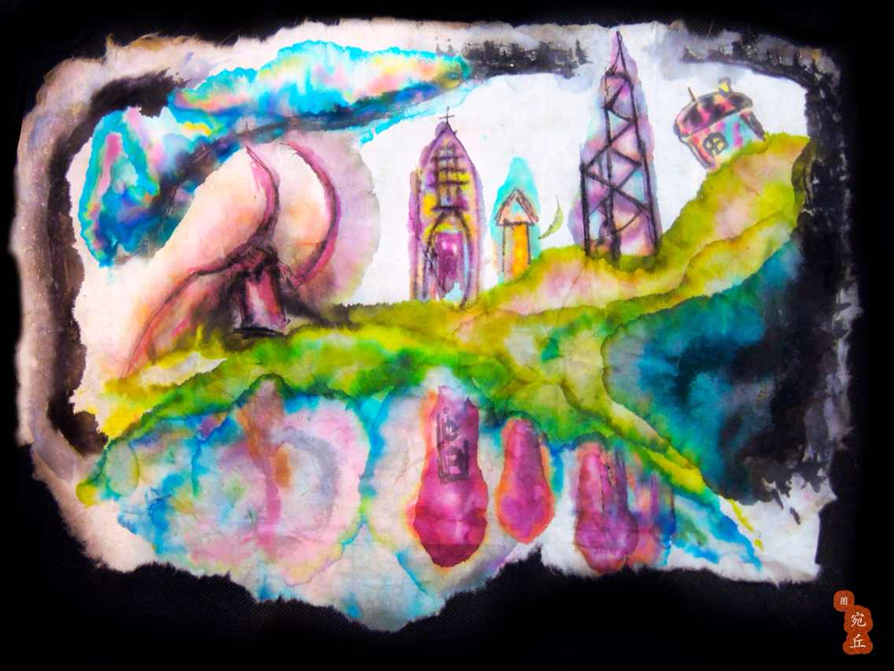

# 强奸

在通往全球化发展的不归路上，这辆列车已经没有什么乘客了。都市站在车厢的一角，妆容精致，打扮性感，一袭闪着亮片、半透明的司法制度，衬托出她凹凸有致的曼妙身姿：傲人丰满的购物中心，凸起的闪烁招牌在夜色中若隐若现，交通路线修长而笔直，金融系统吹弹可破、赏心悦目、我见犹怜。
	
漫长的车程中，都市一心一意地翻看着恒生指数，跳舞跑马，不曾留意世界变化，从未意识到一场犯罪即将来临。
	
皇城已经留意了都市很久，大概有足足半个多世纪，直到此刻列车终于驶进一条漆黑的隧道中了。没有多余的动作，皇城默不作声地走到都市的身后，径直把权力向下探去，伸向了都市敏感的经济腹地，隔着她穿那一层薄如蝉翼的新闻自由，粗鲁地摸索起她的民生建设。被侵犯的都市感觉到异样，正想回身查看，却发现一把冰凉的达摩克利斯之剑抵住了她，锋利的剑锋一划，包裹着她的法规条例应声被挑破，流水一般滑落到地上。
	
都市全身上下的民意都紧张起来。商人的资产一点点转移，移民申请纸满街纷飞，大片大片的担忧被制成爆竹，燃放于纸醉金迷的享乐之中。她想大声呼救，放眼整个车厢没有別人；她想转身离开，但皇城的暴力机器将她死死钳住，使她动弹不得。冷静，冷静，想想办法，都市告诉自己。她试图凭藉经济发展挣脱皇城的控制，皇城却对这点微不足道的力量毫不在意，甚至变本加厉，挺进了昂扬的军队，紧贴住都市的政治中心，上上下下地磨蹭着她的廉政机构，想要消磨都市的意志，待她臣服于自己的魄力之下。
	
但是都市并没有像三流黄色小说写的那样，在皇城的挑逗下，忍不住发出享受的呻吟。她只是咬住自己的历史真相，沉默地怒视着皇城。这个贱货！皇城恼羞成怒，彻底失去了假装调情的耐性。强奸就强奸了还装什么怜香惜玉？他先是扬起宣传部门，连扫了都市几个耳光，再揪住她那一把柔顺纤长的政治诉求，狠狠地往车厢墻壁上撞去。咚！咚！咚！压抑的都市依旧没有吭声，但鲜红的秩序渐渐从伤口渗了出来，从餐厅流淌到银行，从酒店流淌到图书馆。一辆救护车闻讯出警，却死于街头枪战；一批记者匆匆赶至，却在交通灯丛林中身中数刀。都市还想忍痛挣扎，皇城迅速拖着她重重摔到地板上，顺势一个弓步，横跨过他们的契约，将整个身体骑了上去。
	
嗞啦一声，他毫不费力地撕碎了都市的言论自由，这是她最后一道防线。
	
都市此刻与皇城赤裸相对，已经毫无招架之力。她伸出独立自治权，试图遮挡住私密部位，但在皇城浩瀚的权势前无济于事。皇城用巨大的财力压制住都市的胴体，每一条潜规则都在她全身上下游走，尽情感受着她徒劳的扭动。直到最后一刻，都市仍没有放弃她不值一提的反抗，独立乐手在商业街弹着歌曲直到天亮，住宅小区标语闪现，投票站像蘑菇一样此起彼伏地从角落里生长出来，儿童们拒绝进食。
	
太幼稚了，我让你看看什么是真龙天子，什么是当家作主。
	
皇城这样想着，挺着每一根高高耸起的下水管道，迫不及待地插进了都市的大街小巷。

在那一瞬间，一只麻鹰划过天际，都市终于发出第一声惊天动地的哭喊。防空警报响彻云霄，车辆的汽笛凄厉尖叫，电视信号被中断插入，每一个台都在现场直播，每一份报纸都刊出号外，市民们如丧考妣，奔走相告，呼天抢地，我们被强奸了，被强奸了！仿佛他们上一秒才发现这个事实。从那一刻起，都市惨烈的哭喊就再也没有停止过。

求救声惊动了隔壁车厢，异域、他乡和邻国们聚集到车门边，透过玻璃门往里面看了看。皇城的下水道还插在都市里，他一边不紧不慢地蠕动着，一边挑衅地朝着门口冷笑。邻国愤然地敲了两下门，然后摇了摇头，回到自己座位上草拟了一份强烈谴责的声明。

法学历史上，对于如何认定强奸罪的犯罪既遂，有三种学说主张：（性器官）接触说、插入说和射精说。皇城心里很清楚，自己已经成功将生米煮成熟饭，这一刻再也没有谁能够阻止他。他开始渐进冲击，第一下把下水道插进了政府办公楼，将书桌和电脑扫得东倒西歪；第二下捅入了立法和议会机构不断搅动，大楼玻璃震碎，西装革履的议员们狼狈逃窜；最后皇城一探到底，深深顶到了都市的地下铁，入侵了渗着汗味的拥挤人潮，闻到恶臭的乘客们伏地干呕。再也没有人可以置身事外了。高耸入云的写字楼被连根拔起，拧成蝴蝶结的形状后砸在天桥上，车窗里映出白领们扭曲的尸体；证券市场每一个指数都在自由落体，惨绿的箭头冲出LED灯屏幕，突然直插入职员和客户的心脏；购物商场像气球一样膨胀、升天，再在半空中自爆，高级名牌时装、手袋和名表的碎片闪耀成烟花的形状，撒进了当晚正在热播的电视剧；酒吧和夜店像被点燃的蜡一般融化了，微醺的男女们诧异地看着自己的皮肉滴滴答答地掉落，连同吧台一起被消化，只留下满脸的难以置信。都市已经失去了思考的能力，她只能感觉体外传来一次次有节奏的冲击，滚烫而坚硬，每个冲击都让她痛苦万分。

皇城加快频率，夹紧都市的本土文化，一阵猛烈抽插。他在抽插中享受着胜利，快感如海浪般向他阵阵来袭。都市的身体也加快了抽搐，甚至已经谈不上屈辱，语言的巴別塔在地震中灰飞烟灭，博物馆被火山熔岩吞没，歌手、编剧和摄影师们在舔了最后一口都市涂鸦后，口吐白沫中毒身亡；游泳池变成滚烫的油锅，街市变成斩首的乐园，每个人带着自己的儿女，带着终极恐惧，躲回自己小小的家里，门窗紧闭。而就在那一刻，皇城在抽动中到达了高潮，他发出一声舒畅的怒吼。我要让全世界看到我对你有多少付出！我让你获得了幸福！我让你飞速发展！我让你欲仙欲死！那一刻皇城所有的下水道同时将几千年积攒的污物尽数喷出，所有的非礼勿视，所有的肮脏不堪，所有的权钱交易，所有的杀死异议，全部射在了都市的身上。

这便是发生在末班列车上的最后一宗罪案了。皇城在发泄完毕后扬长而去，并于次日发表了一份严正声明：他与都市是合法夫妻，而现行法律对婚内强奸并无相关界定，因此上述事件纯属内政，不容许外部势力以任何藉口插手干涉，对此他表示强烈不满。这就是他对事件的全部回应，收录在史书毫不重要的一个章节中。

（感谢宛丘同学的配图！）	

（采编：张山骁；责编：刘铮）