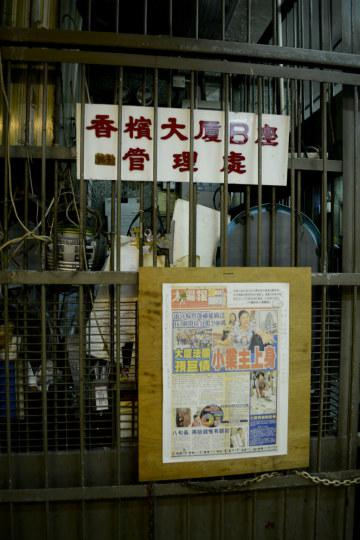
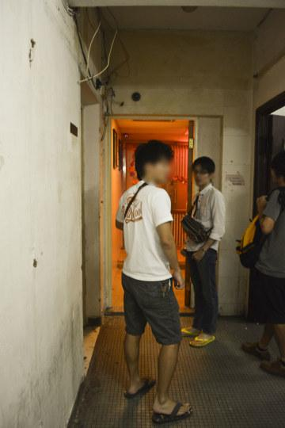
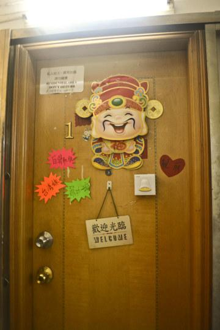

# 香港“一楼一凤”实探报告

香港性产业以其合法的“一楼一凤”而闻名。所谓“一楼一凤”，是指在一个住宅单位中只有一名性工作者。香港法律以任何处所超过二人用以卖淫用途，才可被视为“卖淫场所”，“一楼一凤”可谓是在法律的缝隙中发展起来的半公开的性产业。“一楼一凤”又有“一楼一”，“one floor one”、“141”等众多别称，通常聚集在同一栋物业之中，也常与普通民居相比邻，并且以sex141等著名网站作为信息的集散地。一部分“凤姐”会通过网站发布个人简介、照片乃至视频供顾客事先检索。我在进行实地考察以前也通过网络搜集到了不少信息，但是据说网上的广告不可尽信，还是眼见为实为好。
　　
香槟大厦是香港素来富有盛名的“凤楼”，位于尖沙咀的黄金地段，我抵达的时候正是熙熙攘攘的周六夜晚，一路穿过充塞着小商品、游客、酒吧与荷尔蒙的金巴利道，终于找到了这处目的地。与其驰名中外的声誉不相一致，香槟大厦的外观相当低调，甚至有些老旧，在灯红酒绿、光怪陆离的尖沙咀夜市中显得毫不起眼。入口处没有任何显示“特殊性”的标示，昏暗的管理处中并不见管理人员，只有一条狭窄的走道通往电梯间。 

香槟大厦一共8层，顾客们的惯例是从顶层往下逐次“扫楼”。因此8层是最有人气的所在。一出电梯间，便看到几个20来岁的年轻人在走道里观望。主流的刻板印象总是将嫖客们想象为40岁以上的猥琐中年男人，但是事实上正如性产业在香港不过属于正常商业活动的一种，加之“一楼一凤”通常价格适中，便成为普通的消费者亦可购买的服务。我并非要为女性的物化而辩护，然而亦认为无论对这些消费者还是性工作者都无需以有色眼镜相待。

香槟大厦每层大概有30间“凤巢”。楼凤们对于门房的布置终究与普通住宅不同，也显示出她们的不同趣味。有的会在自家门前的走道上方悬挂粉色或紫色的霓虹灯，营造出暧昧的气氛与挑逗意味。有的则在房门上张贴各式各样的广告，显示自身的特长以吸引客人造访。

若是门上挂有这样的“欢迎光临”或者“请按钟”的告示，则说明房内的凤姐现在空闲。若告示是“请稍候”，便是正在接待其他客人。除非有特定相熟的对象，大多数客人都选择“货比三家”，敲门后看姑娘是否合意，询问价格，若有特殊要求须事先提出，双方达成一致后才可入内，否则便需要继续碰运气。由于敲门前并不知道房内姑娘的姿色如何，即便事先在141广告网站上已经见过某些姑娘的照片，也常会有“网骗”的状况，所以每一次敲门都是一次冒险，据说亦是一种乐趣。 

走道中的顾客们自然是清一色的男性，偶尔可见凤姐相互串门，毫不冷清。凤姐们的打扮虽然各不相同，然而也是一水的性感短裙配高跟鞋。笔者虽为女性，但是穿着保守，手持相机（后来发现这里到处贴着“不许拍摄”的告示后便收了起来），依常理又绝无这样的嫖客，因此显得颇为格格不入。我观望了一会儿，终于鼓起勇气按钟，第一次便吃了闭门羹。虽然门上挂着“请按钟”的牌子，里头传出的女声却表示“现在不方便”。由于那声音也让我殊无好感，便就此作罢。下一家按铃以后，一个妆容明艳的年轻姑娘出来开门，房间中粉色的暖光从她身后透出。她看见我之后非常吃惊，我不及说明来意，她脱口便道“不知道女孩子之间要怎么做呀”。我连忙表示只是按摩与聊天，会依常价结算，她仍然表示“不接女客”，便只能放弃。       

逐层往下，5楼全层是普通住宅，4楼的走道里便冷清了许多。最里头第一间看上去十分低调，我抱着试试的心态再度敲门。门后出现一个身材高挑的姑娘，穿着白色的蕾丝内衣，面容相当美丽，目测大概二十八九或三十左右，一头黑亮的长直发令人印象深刻。她虽然也十分惊讶，但是听我说明来意以后，便欣然同意我入内。在香港这样寸土寸金的地方，室内空间自然不大，只能容得下一张单人床与一条并不宽敞的走道，然而收拾得十分干净，柔和的淡紫色灯光令人心情放松。床头放着一台闭路电视，显示出走廊的实时状况。与床相对的墙是一整面相当大的落地镜，上面粘着花花绿绿的彩色贴纸，清晰地标明了价格：600元30分钟，800元+按摩，1300元+推油全套。她友好地请我换下衣服躺在床上，同时不忘提醒我“要按钟收费哦”，并指了指上方的挂钟。我请她以惯常的方式帮我按摩肩背，一边与她聊天。她是一个十分健谈的人，一直以流利的粤语与我交谈。我凭记忆将聊天记录整理如下，考虑到大部分读者的理解，对粤语口语做了书面调整。

－－－－－－－－－－－－－－－－－－－－－－－－－－－－－－－－－－－－－－－－－－－－－－－－

我：你是哪里人呀？来香港多久了？

凤姐：我是重庆人，来香港十几年了。

我：你的粤语说得真好！

凤姐：（笑了笑）是还不错啦，但还是有些口音改不掉，不过也能冒充是本地人。

我：为什么会从重庆来香港呢？

凤姐：我之前的老公是香港人，跟他过来的，不过后来离婚了。我的女儿都10岁了呢！

我：天哪！你看上去好年轻，完全不像有一个10岁的女儿！

凤姐：（大概是经常被如此夸赞，便笑道）是保养得还不错。

（我仔细观察她的外貌，她有一张小巧的瓜子脸，五官标致，化着烟熏妆，眼线漂亮而流畅，只有下巴的线条略微有些松弛。她的乌发十分亮丽，大侧分的直发衬托出成熟的魅力。胸部不算太大，目测在B-C之间。可能是生育过的缘故，她的腰也不算纤细，但是在连衣裙式内衣的修饰下，这个缺陷并不突出。裸露在外面的双腿十分修长，显得身材仍然很匀称。总的来说，完全显示不出她实际上30-35左右的年龄。）

我：除了女儿，家里还有哪些人呢？

凤姐：我父母也来了香港，家里就四口人，住在公屋里。（注：“公屋”是香港的住房保障制度，由政府向低收入者提供廉价的公共租赁房，但是对申请人的收入有严格的限制。可见，性工作者的收入不被政府备案，自然也不需缴税。）

我：之前做过什么工作呢？

凤姐：我之前是卖化妆品的。来香港之前在深圳做过幼教。

我：原来你还是老师！

凤姐：算是吧，我读大专的时候是学师范的。

我：为什么要开始做现在这份工作呢？

凤姐：离婚以后要养父母啊，女儿又要上学，这个工作能赚钱。

我：做这份工作多久了？

凤姐：我来香槟大厦做“一楼一”也才两三个月，之前做过半年的酒店妹。（注：所谓“酒店妹”就是向酒店住客提供的应召女郎，一般由经纪公司组织，或可通过电话预约。）

我：为什么做了半年就不做了？

凤姐：做酒店那行很黑的，这边要轻松得多，时间可以自己安排。之前我因为帮一个朋友替工了一个星期，觉得挺好的，就继续做下来了。

我：不用强迫自己每天完成一定的工作量？

凤姐：我从来不苛刻自己，想做就做，不想做就不做，挺自由的。

我：这边的房租怎么样？

凤姐：楼上7、8层比较旺，要贵一些，一个月一万五吧，我这里一个月才一万一，因为很多客人看到五楼是普通住宅就以为下面没有了，经常只有熟客找过来。

我：不担心这里生意不好吗？

凤姐：生意还可以吧。我做熟客生意比较多，也不喜欢逼自己接太多客人。

我：客人们主要是通过什么途径了解你呢？有没有在网络上发广告？

凤姐：没有啊，在网上发广告是要很多钱的。香槟大厦这里很有名的，不需要做什么宣传就会有挺多客人了。

我：最不喜欢什么样客人呢？

凤姐：（脱口而出）猥琐的。

我：但是可以拒绝吗？

凤姐：其实是有办法拒绝的。你看这个闭路电视，客人来的时候我都会看一眼，不喜欢的人就不开门。比如阿叉（注：对中东人和印度人的统称）我是不接的 ，他们身上有股咖喱味，我受不了。其他外国人我也是不接的。

我：如果开了门以后发现不喜欢这个客人，还能拒绝吗？

凤姐：（笑道）那我就说30分钟3000块，他就一定会走啦。或者我有办法提供给他绝对不会想来第二次的服务。

我：有没有被客人暴力对待过？

凤姐：有的人会有一些癖好，比如喜欢打屁股这样的，如果不是太严重，也可以忍受吧。但是不能超出我的底线，我不是什么都能做的。以前我做酒店妹的时候，接过一个法国人，一开始他只是打我的屁股，我还忍了，但是他越来越过分，后来直接一巴掌盖我脸上。正常人的第一反应都会觉得要反抗吧，我就一巴掌甩回他脸上。他当时就愣住了，好长时间都没反应过来，可能是没有想到我会这么做吧。我马上收拾东西就跑出去了。

我：（暗地叫好）你后来没有被公司找麻烦吧？

凤姐：公司也不好说什么，这个客人事先没有说明特殊要求，是他自己的问题，公司也不能为难我。

我：那你还有哪些是不做的呢？

凤姐：正常的sex是可以的，其他就要看情况。后庭我是不做的，接吻或者不是“保险吹”（注：指无套口交）一般也不做。我不敢说做这行以后从来没有和客人亲过嘴，但只对关系比较好的熟客才会。有一次一个很丑的人来敲门，问我“能不能亲嘴啊”，我看他满口黄牙，都想要作呕了，鬼才会答应呢。这里有的女孩为了笼络客人，很多过分的事情都肯做。比如双飞是犯法的，有的人只要加钱就会做，我就不会做。

我：一般接待客人的流程是怎样的呢？

凤姐：就是进来先冲凉，上床，再冲凉，如果要按摩的话要加200块钱。

我：30分钟不够用吧。

凤姐：很多人都用不着30分钟呢，20分钟就差不多了，加上按摩也就是加15到20分钟。做1300全套的会比较细一点，会有推油和踩背这样的。

我：那对于不错的客人会更加努力吗？

凤姐：当然啦，我的熟客都是我觉得不错的，干干净净的体面人。你别看男人来这种地方，其实也不是纯粹来找肉体关系的。很多人是下班了以后腰酸背痛，要来按摩放松一下。这里有很多女孩都是不做按摩的，她们觉得累啊，但是我不怕这个累。也有一些客人，有些话他在家里不敢说，来这里才敢说，他就愿意和你聊聊天。用相貌笼络客人是不长久的，楼里那么多姑娘，真是什么相貌都不缺，要有点头脑，最好能和客人有点精神交流，才有回头客。我这个人，你也看出来了，话特别多，也算是念过书，和什么人都能多少谈得来，所以我的客人很多都愿意回来。

我：大概有几成是熟客呢？

凤姐：大概四成吧。男人嘛，这里诱惑这么多，你不能指望他次次都回来找你，十次能来找你三次就算不错了。

我：熟客的话，一般多久会来一次呢？

凤姐：有些结了婚的男人，回家要给老婆“交功课”啊，可能一两星期来一次。有些单身的，就来得勤快些。

我：你的父母知道你做这份工作吗？除了同行的姐妹以外，别的朋友呢？

凤姐：父母当然不知道，我还是说在卖化妆品，以前的朋友也不知道。

我：和这边的姐妹们关系好吗？

凤姐：也不算不好，但是没有太深的交情，不会深入谈自己的事情。

我：打算做到什么时候就不做了？

凤姐：这行都做不长久的，存够钱就不做了。

我：对以后的生活还有什么打算呢？

凤姐：肯定会找一个正经的工作啊。我有考美容师的牌照，可能会去美容院吧。我还在考保险的牌照，工作肯定是可以找到的。也可能会做点小生意吧，具体还没想好。做生意也是要有想法的，钱不好赚啊。

（她按摩的手法非常娴熟，有着不输美容院的专业水平。不过可能是由于我吩咐她不用特意改变自己惯常的方式，所以当她坐在我的腰上为我按摩的时候，我想这大概就是美容院不会做的了。）

我：平时没有客人的时候，自己会做些什么事呢？

凤姐：我就上上网，看看新闻这样。

我：不会出去和姐妹们一起逛街吗？

凤姐：没有时间啊，我中午要给父母和孩子做了饭才过来，晚上10点就回去了。

我：也就是说你不住在这里，其他姑娘也是这样吗？

凤姐：有的人到晚上两三点还会接客人，我是不这样的。有的人也会住在这里，因为如果要到别的地方再租房子是很贵的。

我：住在这边安全吗？

凤姐：安全还好吧，锁好门就没事了。不过保安是没有的，楼下只有一个看门的阿伯。

我：有没有遭遇过或者听说过一些危险的事情？ 

凤姐：前两周7楼好像有个女孩子的房间被偷东西了，也没办法啊，这边太乱了，真是鱼龙混杂，你开门以后可能遇见各种各样的人。这边的治安问题很多都是阿叉搞的，所以我不接这样的客人。

我：如果和客人发生争执怎么办呢？

凤姐：我就会直接叫他走人。

我：都会这么好摆平吗？

凤姐：实在不行就叫，旁边的人会过来帮忙的，互相之间还是有个照应的。

我：这里的姑娘们之间有组织吗？

凤姐：什么组织？

我：就是会不会有一个人做头儿并且话事这样的。

凤姐：没有，我们也不需要。只有那些没有户口的人才需要中间人，帮她们处理偷渡啊、住宿之类的事情。我们都有户口，自己的事自己可以搞定。

（这时她的手机响起了铃声，她说了声抱歉，拿起看了一眼便放下了。）

我：我打扰到你了吗？

凤姐：没有没有，只是一个朋友问我要不要一起吃饭？

我：是男性朋友吧？

凤姐：哎呀，其实是一个客人。

我：你会和客人保持私下关系吗？

凤姐：其实不会，我不喜欢这样。

我：为什么呢？不会考虑进一步的关系吗？

凤姐：还是觉得真正值得长久的关系不会在这里遇到。如果可能的话，希望正常地认识然后交往。（她想了一会儿，又说）不过也不总是这样的，我有一个很好的朋友也做这行，她现在嫁人了，老公就是以前的客人才认识的。

我：好神奇！她现在怎么样了？

凤姐：她和老公去国外了，一开始经常半夜打电话来给我诉苦啊，抱怨这个抱怨那个。因为她不喜欢他，纯粹是因为物质和生活的考虑才答应嫁给他的。但是她现在也有小孩了。前阵子有天给我打电话，很兴奋地跟我说“我拍拖了”，我还以为她和别的男人搞上了呢，没想到她是说“我和我老公拍拖了”。

我：哇，为什么会这样？是因为怀孕了吗？

凤姐：也不是吧，感情都是可以慢慢培养的。

我：真好呀。那你是怎么想的呢？以后想找一个什么样的男人？

凤姐：换回正常的工作以后，找一个成熟有担当的男人吧，现在不会像年轻时候那么冲动了。

我：那你觉得对于一个女人来说，婚姻和家庭是必须的吗？

凤姐：什么意思？

我：就是说，你会不会认为，一个女人一定要有婚姻和家庭，才是所谓“完整的”呢？

凤姐：（陷入了深思，半晌才说）你这个问题比较深呢，我觉得好难说，可能是也可能不是，只能说如果是我的话，有可能的话还是想要一个家庭。

我：那你觉得，性是一种表达爱的方式吗？

凤姐：夫妻之间性和爱的融合当然是很重要的，但是在这里工作，性和爱一定是分离的。

我：以后如果又结婚了的话，会告诉老公自己曾经做过这份工作吗？

凤姐：当然不会啦，就算感情很好，知道了以后心里总是会有芥蒂的。其实男人也一样，没有男人会主动和你说他曾经来过这种地方。

我：以前的老公是怎么样的人呢？ 

凤姐：我以前的老公很有钱的，是做生意的，但是后来破产了。

我：是因为这个原因离婚了吗？

凤姐：也不是，两个人不合适的地方太多了，比如生活习惯上吧，他这么多年从来不吃鸡鸭鱼肉，也不是因为有什么宗教信仰，蔬菜也是一点儿都不吃，经常牙出血，说他也不听，我这么和你说的是最小最普通的矛盾。两个人相处，矛盾是永远都会有的，你要是以后结了婚就会知道。

我：这里的姑娘大多都是结过婚的吗？

凤姐：是吧，要不然她们怎么能拿到香港户口呢？没有户口就是犯法的。假结婚也是有的，那就是个交易。但是这里的姑娘基本都是真的结过婚，很多是感情破裂才离婚，又没有什么本事赚钱，就来做这个了。所以“一楼一”很少有年纪特别小的，有很多人都有孩子了，甚至有些40多岁了还在做。你在141的网站上看到的那些电话预约的年轻女孩，很多是没有户口的，是有专门的中介到大陆去挑一些高素质的女孩，包吃包酒店，把她们带过来，还请专门的写手去网站上写广告，但是这种都做不长的。这里的3楼也有一些是没有户口的，拿的是旅游签证，叫“7日鲜”。她们收费很便宜。我这里收30分钟600，算是均价，她们只收一半这个价，真是扰乱我们的市场，幸好她们的生意并不特别多。

我：为什么呢？

凤姐： 因为警察查得严啊，经常去查那边，她们是犯法的，查到了就要被带走。客人虽然是没有犯法，但是也要被带到警察局去问话，还要通知家里人，多丑啊。所以大家不愿意冒险。

我：香港本地的姑娘很少吗？

凤姐：很少。

我：我在楼上有看到一片区域标着“陀地区”呢。（注：“陀地”指香港本地人。）

凤姐：那都是装的。（笑道）以前有几次有客人敲门，一上来就问我是不是“陀地”，我一开始都坦白说自己不是，人家一听到就掉头走了，我也觉得好挫败啊。后来再有人问，我就假装说自己是。反正我的口音其实不大听得出来。

我：“陀地”的收费会更高吗？

凤姐：不会，价格都差不多的。

我：那“陀地”到底有什么优势呢？

凤姐：物以稀为贵吧，本地人做这个的很少。而且香港女孩子大多都比较独立，她们的工作能力也比较强，完全可以做别的工作，不用靠男人，男人觉得和她们是平等的，就会更看重她们一些。我以前做酒店妹的时候，公司里的其他女孩子都是“陀地”，只有我一个大陆来的，还是靠着朋友介绍才进去的。她们都会说英语、日语、韩语好几门外语呢，很厉害的，不过我的英语也还可以。

我：既然她们有比较强的工作能力，为什么要做这个工作呢？

凤姐：这个工作来钱又快又多啊。我认识一个女孩子，家里都请得起菲佣的，应该条件算不错吧，就是因为要买一个十几万的包包，就出来做这个，把买包包的钱赚到了，还是继续做。

我：那是因为买了包包还要买鞋之类的吧。

凤姐：是啊，欲望是无止境的，有的人花钱大手大脚惯了，总是有东西要买，做其他的工作哪有这么多钱。钱赚了也是花掉，她们一般都比较年轻，对自己的人生没有想法，真是要以后受了伤才会懂得。

我：一个月一般能赚多少呢？

凤姐：（有点调侃地反问）你猜猜？

我：大概三至五万？

凤姐：（很爽朗地笑道）哪有那么少！我以前做酒店妹的时候，第一个月赚了18万呢！

我：天啊，竟然有这么多！（陷入了深深的震惊）

凤姐：我做酒店妹的时候，一次收4600呢。但是要和公司四六开，公司拿六，我们只能拿四。

我：这也有差不多2000块钱啊，比楼凤赚得多了，为什么不做下去呢？

凤姐：做酒店很黑的，除了要四六分以外，我们上头还有四个经理，每个月都要给他们红包，每个人要给2万，我第一个月扣掉给红包的钱，只有10万了。而且红包是一定要给的，因为客人只能是公司来帮你联系，这些经理如果不给你接活，你就没工作。新女会经常上，客人都喜欢尝鲜，公司也会捧新人，但是以后做长了，就不会给你安排这么多客人了，所以真不是每个月都能做到18万的，红包却不能少给，所以说酒店的中介很黑。虽然以前做酒店的时候，客人的档次都很高，都是一些大老板啊、和政府有关的人啊、或者是有钱的外国人，还经常有明星。楼凤的客人的档次要低很多，但是可以自己挑，自己安排工作，很自由，而且没有中介费。所以我还是喜欢现在这样。

我：这么说也是。

凤姐：是啊，而且以前会积累一些熟客，他们现在可以单独联系我，约我出去，我只收3000块。出去结束以后，我还回到这里来，挺方便的。有一个TVB的明星是我的熟客，我就不说是谁了，他每次都给我5000。他说一直找我不为别的，就是觉得和我谈得来，相处起来轻松没有压力。

我：（大概聊到这个时候，才突然反应过来，问道）是不是已经到30分钟了？

凤姐：（笑道）是到了，没事，我再给你按10分钟吧，今天晚上不忙。

我：星期六晚上不是应该很忙吗？

凤姐：不是啊，这是规律。星期六晚上男人要么回家陪老婆孩子，要么出去拍拖，来这边的人反而比较少，不如上班时候多。

我：你的作息规律吗？

凤姐：我很注意这方面的事情，所以还好。

我：平时去哪里吃饭呢？

凤姐：我在家吃过中饭才过来，晚上一般就在外面吃。

我：会在这方面节俭吗？

凤姐：吃饭上也省不了多少钱，而且不能省啊，身体是自己的，要对自己好。

我：其他姑娘也是这样嘛？

凤姐：差不多吧，爱花钱的姑娘更不会在吃这方面节约了。

我：会担心自己生病吗？

凤姐：我很注意健康的，每半年会去医院做一次身体检查，尤其是妇科啊。平时我也很注意个人卫生。

我：对于疾病的预防有什么心得吗？

凤姐：有啊。比如说每一个客人我都会亲自帮他洗澡，反正待会儿都是要上床的，有什么好怕羞的呢。主要是有的姑娘想偷懒，就让客人自己洗澡，但是我觉得趁洗澡的时候检查一下对方的身体是很重要的。尤其是要清洗阴茎，那可是要放进自己身体的东西，像龟头下面那个地方容易藏污垢，一定要洗干净，如果发现有不对劲的地方，我会马上要他离开。

我：可以中途把客人赶走吗？ 

凤姐：这很正常啊，有病的人我为什么要接？有病就不应该出来找。

我：可是有些病是看不出来的呀。

凤姐：所以危险的项目我是不做的。（想了一会儿，又补充到）确实细菌是你看不见的，所以我平时很注意。你知道我们做这行都是要用润滑剂的，有的人就直接用手来上润滑剂，但手是洗不干净的。你想，虽然我的床单每天都会消毒干洗，但是毕竟客人用过，再用手去碰，手上的细菌是看不见的嘛。所以我都是用一次性针筒来上润滑剂，轻轻打进去，每次用完就换。

我：同行们之间会彼此分享这些心得吗？

凤姐：我自己的心得一般不会主动说，彼此之间一般没有多深的交情，有些关系好的才会。比如我以前就告诉过一个姐妹，每天工作结束后都要按摩自己的小腹。因为性交其实是会把大量的空气带到身体里，必须要通过按摩把这些空气排出来，否则久而久之就会得病的。做这行的人经常做不长，很多都是因为自己不注意就得病的缘故。

我：你的腿好细，皮肤也好好，一定也是因为注意保养吧。

凤姐：（笑道）这个倒是天生的。

我：做这行的姑娘有去隆胸之类的吗？

凤姐：假胸太多了，不过香港人是宁愿找胸小的，也不愿意找假胸。但是我有朋友去韩国做自体脂肪移植，就是把你身上其他地方的脂肪移到胸上，那个完全摸不出来。

我：（心想不能再耽误她的时间了）最后一个问题，对于这个行业的管理来说，有没有你觉得政府本来可以做到却没有做到的呢？

凤姐：（思考了一会儿）这个我真想不出来。

（我承认我的问题太抽象了233）

－－－－－－－－－－－－－－－－－－－－－－－－－－－－－－－－－－－－－－－－－－－－－

在我终于要离开的时候，已经超时将近20分钟了，但是最后她只收了我500元，并表示这样的交谈对她来说也十分难得并且愉快。至始至终我没有询问她的名字，也不敢提出拍照的要求，不免有些遗憾。且不说对我而言，这次的到访是绝少有的机会，即便得以故地重游，她也可能已经搬至别处，或者离开这个行业而开始新的生活。看得出来，她对自己的生活有着清醒的认识，也不乏人生阅历。最令我动容的是，她并没有放弃自身的尊严和进取之心。即便香港的性产业已经半公开化，然而性工作者作为弱势群体仍然未能得到社会的承认。她们并非纳税人，没有来自政府的福利保障，由于香港性产业的“非刑事化”与“合法化”并不相同，这个行业没有得到特殊法例的相应管理，而是处于相对的“无政府状态”，因此，她们虽然免于遭受组织性的操控和剥削，却必须作为刑事犯罪的高危人群而独自承担人身安全的风险，同时仍然承受着主流舆论的道德指责。在我看来，她们并不需要居高临下的、作为施舍的“同情”，而是需要平等的尊重和理解的关怀。对于大陆的性工作者而言，更迫切的则是基本生存空间的改善，这将是一个更加漫长无期的过程。

(采编：黄理罡；责编：刘铮)

