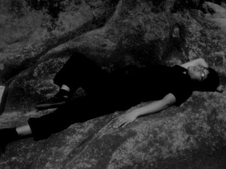
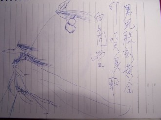

# 与父书

父亲大人钧安： 

孩儿上封家书已是十六岁，算是数年来家人对我担忧和失望的开始。在家时多次在抽屉中翻到，却一次也没敢打开来看。打那起和家人交流越来越少，但我不想就这样抱憾下去。于是有了第二封家书，字字肺腑，毫无遮拦，望父亲静心来看。

第一封具体言语已记不清，但大意这辈子也忘不掉——“立誓弃功名而求道”。六年过去，孩儿成年，经历了至少家人认为失败的高考，读完大学拿到一纸证书。“男孩十一自挣自吃”，孩儿懒惰，但数年来生活费不够至少都没有让家里知道，一律自己打工兼职补全，近一年方完全经济独立。世味初尝，当然对这句少年激愤语有了新的理解。

孩儿自幼被父亲口授读书，读书为明理，十余年来唯有此道未曾弃离，未曾苟且。现在愈发感受到一个公式的精准无误：精进×工夫（时间）=功夫。之前血气横冲直撞，困兽自斗，面壁求破，功夫虽浅，上身已久。今年藉助学拳之机缘，辅以诗学，方见应验。

父亲不知，孩儿毕业回家三日，将无极桩教与父亲，父亲苦功修习并立有见效，实为孩儿数年来第一快乐事情。须知一切身病皆心病，孩儿之前不肯妥协于父母意志活成一庸碌之徒，又苦于无法将自己的想法无碍传达给父母，一直担为心头第一大恨事。太极拳便好似孩儿与家人之间打开的一扇窗，虽还须日后勤加护持，但已见光明之途径。以下皆道理直陈：

何为大丈夫？尽性立命四字而已。性为先天，为天道，是宇宙间不可抗的大规律、秩序；命为后天，为人道，是我们在世间的存在形式。不是孩儿有意逃避功名，而是一旦真实自见，虚妄已不须破除，早零为脚下泥土。父亲一生勤俭，无烟酒等嗜欲，可那是你真心所趋，还是迫于外界的身心二重影响呢？中医讲“通则不痛，痛则不通”，人欲主无限扩张，强行压抑自然会成病灶，而父亲的病灶正集中在了孩儿身上。孩儿也曾一味仇视父母坚持的“对我好”，但现在已意识到了那时的浅薄幼稚。教育的失误半在时代，半在孩儿，与父母完全无关。时代那一半已成既往，固不可改，另一半孩儿却敢担在身上。于己孩儿已做好（至少已识门路），于父母却还要父母的协力相助，诚心向学。

修道不可妄进，孩儿也不会对父母一味谈玄，便从最能目见耳闻的说起。父母极想有个好身体，每晚坚持散步，可看上去傻瓜一样的无极桩却有了意想不到的健身功效。这便是孩儿对父母的第一企盼：破成见。人是其过去的总和，人的价值也由其生活经验积累而成。可父母比孩儿多活二十余年，就敢将孩儿这二十余年一棒打杀么？半辈子囿于弹丸之地，与庸人推排往来，连“世事洞明人情练达”八字都做不到，父亲日处办公室，以饮水默坐为恬淡，母亲转蓬劳作，以论较儿辈学业为能事。当然父母年轻时代吃过孩儿没吃过的苦，但你们仅把它们当做现在安稳生活的筹码，为了忘却的纪念，和用来规劝孩儿惜福毋不知利害的恐吓。当然任何人都无权评价另个人的生命，但孩儿如此说是为了能与父母在最真实语境交流，也是为父母和孩儿自己负责。

孔子讲朝闻夕死，一旦明了，过往的任何弯路和迷途都会成为真正的财富。孩儿今日之所得，需要父母潜心跟进；孩儿身上尚缺的，需要孩儿上路亲自求索参证，也需要父母的理解宽容。苦难是男儿第一财富，父亲也曾说要孩儿做搏击长空之雄鹰，毋做蜷缩屋檐之麻雀。万法唯识，从太极技击原理上讲，一个人挨打完全因为自己的紧张，真若做到境随心转，则不会受到任何作用。如前所说，人欲趋利避害，主无限扩张，而丹道原理正是生命的逆过程，“顺则人，逆则仙”。孩儿初断七情六欲，无物能害。执着人道，那是向死，“心死神活”，“外其身而身存”，“损之又损，至于无为”，至于无可死，正是置之死地而后生的道理。这些话可能暂难理解，但父母只需想下无极桩最初的令人难以置信便好，孩儿只不过又比父母先进一步。世间本有神奇，人不自知罢了。父母对孩儿所有担忧皆是无谓，皆是妄作，徒损道行而已，愿从此根绝。

再回到父母“为我好”的初衷。现在是孩儿此生活得最好的时候，心中一片空明，且此状态与外物截然无关。儒说“反求诸己”，释说“止观”，道说“内视”，三者正为孩儿身心实践。这难道不是父母想要的么？社会地位、权势财富都是父母对“好”专断的定义，当然也是主流价值观对“好”的买断。孩儿若无放眼无物的定性与魄力，哪敢轻说成佛作祖？孩儿在路上定会设法满足自己基本生活需要，且保证不做违法乱纪伤天害理之事。待得有所契悟，即回家探望父母。

邻家有子，既富且贵，前程锦绣，夸示于父母。父母若脱不得桎梏，只得孩儿自骂狠心，亦无良策；若能炼到心如古井，波澜不起，只“由他去”三字足矣。龚自珍有句“功高拜将成仙外，才尽回肠荡气中”，不须分别，所求不同而已。

李老师讲“读书、习拳、悟道”，三位一体，孩儿不在父母身边时，若信得过孩儿，日夜功夫不舍，自有果报。孩儿立志如此，望父母深识笃行。

（采编：刘铮；责编：刘铮）

[【父亲专题】继父](/archives/28950)——当你能够看透并怜悯敌人时，你才算真正战胜了他。当你能够平静地回忆并叙述时，你才算真正战胜了自己。 [【父亲专题】为君细写一联春](/archives/35046)——回首前尘，想起多年来父亲对于写春联、贴春联、读春联的用意变化，才发现他的孤愤嘲诮一年比一年深。我现在每年作一副春联，发现自己家门口老有父亲走过的影子。 [【父亲专题】父亲](/archives/35210)——我们每个人的意识深层都有对父母老去的恐惧，时间在运行中仿佛作了个交换，子女逐渐强大的代价是父母的迅速衰老，意识到这一点会让我们带突然陷入惊悚与战栗中。 [【父亲专题】我和他](/archives/26164)——当我们毫无挽回地长大，猛然回首，发现父亲就在那儿，在家里的沙发上，在我们的血和心上。 [【父亲专题】他们（独立影像第五十期）](/archives/35365)——父爱如山。因为不善于表达，他们总是被误读。本期介绍的四部是有关父亲的电影，他们有着不同的国籍，但是父爱没有国籍。 [【父亲专题】父亲的手笛](/archives/35312)——父亲的手笛里，有他一生的欢喜和柔肠，他执拗地吹奏，却不再被懂得。
