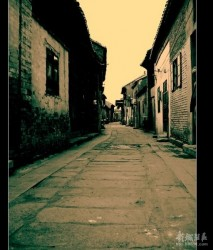
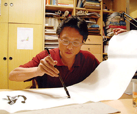

# 为君细写一联春

据说我祖家大门的一副对子是请雕工给刻的，长年挂着，一到腊月底，卸下来朱漆雕版墨漆字，重髹一过，焕然如新。联语从来就是那么两句：「诗书继世／忠厚传家」。父亲来台之后，配舍在眷村之中，便改了字号：「一元复始／万象更新」有时下联也写作「大地回春」。我最早认识的大约就是这十二个字。在还没有上学认字之前，父亲总是拿这些个字当材料，一个字配一个故事。多年下来，我只记得「象」的故事，大意是说有个善射的猎户，受一群大象的请托，射杀一头以象为食的巨兽。那猎户一共射了三箭，前两箭分别射中巨兽的两只眼睛，第三箭等巨兽一张嘴，正射入牠的喉咙。此害一除，群象大乐，指点这猎户来至一片丛林，群象一卷鼻子拔去一颗树，拔了一整天，林子铲平了，地里露出几万支象牙来。那巨兽有多么大呢？据父亲说：一根骨头得几十个人才抬得动，骨头上有洞，人还可以往来穿行。

说这些故事的时候，多半是走在路上。大年下，父亲牵着我在纵横如棋盘的巷弄之间散步，经过某家门口便稍一停步，看看人家的春联写了些甚么。偶而故事会被那些春联打断──走不了几步，父亲便分神指点着某联某字说：「这副联，字写得真是不错。」或者：「这副联，境界是好的。」

等我唸了小学，不知道几年级上，自家大门口的联语换了，成了「依仁成里／与德为邻」。父亲解释：这是让邻居们看着高兴。就我所知：没有哪家邻居会注意到我家大门边写了些甚么。我家与邻人素来相处不恶，应该是往来串访不多、难得龃龉之故，跟门上的春联显然不应有关。但是我注意到一个细微的变化：父亲同我再闲步于里巷之间的时候，竟不大理会人家门上新贴的对联如何了。有时我会问：「这副字写得怎样？」或者：「这副联的意思好吗？」父亲才偶一掠眼，要不就是说：「这几个字不好写！」要不就是说：「好联语难得一见了。」

上高中之后，我开始读帖练字，父亲从不就个别字的结体构造论长短，偶有评骘，多半是：「〈张猛龙碑〉临了没有？」或者：「米南宫不容易写扎实，飘不好飘到俗不可救。」那是1971年，我们全村已经搬入公寓式的楼房，八家一栋，大门共有。彼时我们父子俩几乎再也不一道散步了。有一年热心的邻居抢先在大门两边贴上「万事如意／恭喜发财」，我猜他看着别扭，等过了元宵才忽然跟我说：「赶明年咱们早一天把春联贴上罢。」

这年岁末，父亲递给我一张纸条，上写两行：「水流任急境常静／花落虽频意自闲」，中间横书四字：「车马无喧」。接着他说：「这是曾国藩的句子，你给写了贴上罢。」一直到他从公务岗位上退休，我们那栋楼年年是这副联。

父亲退休那年我腊月里出国，到开年了才回家，根本忘了写春联这回事。这一年大门口的联语是我舅舅给写的，一笔刚健遒劲的隶书：「依仁成里／与德为邻」，横批是：「和气致祥」。

我问起父亲怎么又邻啊里啊起来，他笑着说：「老邻居比儿子牢靠。」我说这一副的意思没甚么个性，配不上舅舅的字，父亲说：「曾国藩那一联，做隐士之态的意思大些。还不如这一副──」说着又掏出一张纸片，上头密密麻麻写着：「放千枝爆竹，把穷鬼烘开，几年来被这小奴才，扰累俺一双空手／烧三炷高香，将财神接进，从今后愿你老夫子，保佑我十万缠腰」横批是：「岂有余膏润岁寒」。我笑说：「你敢贴吗？」父亲说：「这才是寒酸本色，你看看满街春联写的，不都是这个意思？还犯得着我来贴么？」

回首前尘，想起多年来父亲对于写春联、贴春联、读春联的用意变化，才发现他的孤愤嘲诮一年比一年深。我现在每年作一副春联，发现自己家门口老有父亲走过的影子。

(采编：刘铮；责编：刘铮)

[【父亲专题】继父](/archives/28950)——当你能够看透并怜悯敌人时，你才算真正战胜了他。当你能够平静地回忆并叙述时，你才算真正战胜了自己。

[【父亲专题】我和他](/archives/26164)——当我们毫无挽回地长大，猛然回首，发现父亲就在那儿，在家里的沙发上，在我们的血和心上。

[【父亲专题】父亲](/archives/35210)——我们每个人的意识深层都有对父母老去的恐惧，时间在运行中仿佛作了个交换，子女逐渐强大的代价是父母的迅速衰老，意识到这一点会让我们带突然陷入惊悚与战栗中。

[【父亲专题】父亲的手笛](/archives/35312)——父亲的手笛里，有他一生的欢喜和柔肠，他执拗地吹奏，却不再被懂得。

[【父亲专题】他们（独立影像第五十期）](/archives/35365)——父爱如山。因为不善于表达，他们总是被误读。本期介绍的四部是有关父亲的电影，他们有着不同的国籍，但是父爱没有国籍。

[【父亲专题】与父书](/archives/35424)——邻家有子，既富且贵，前程锦绣，夸示于父母。父母若脱不得桎梏，只得孩儿自骂狠心，亦无良策；若能炼到心如古井，波澜不起，只“由他去”三字足矣。
