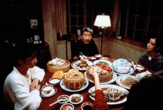
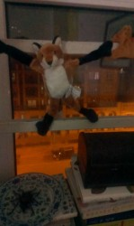
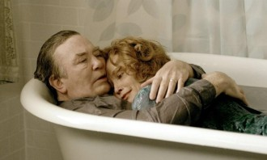

# 父亲

**一**

父亲老了。

我渐渐察觉到这一点。当他每天晚饭的时候在餐桌前坐下，打开两瓶啤酒，剥一小碟儿花生米自个儿独酌独饮，一坐就是好久，从原来的一个小时，到两个小时，到三个小时……后来他经常将一顿饭以一种独特的慢动作吃到该上床睡觉的时间。大部分时间都低着头，眼睛不知是盯着盘子还是桌子还是某处空气，似乎吃饭并不是晚饭的主题，喝酒才是，回忆才是，动作的形式才是，空无才是。

四十八岁了，犟脾气还是不减，家里人谁要是说他两句催他快些吃，他便慢慢一抬眼睛，露出恶狠狠的眼神。有时候他举起的杯子在嘴唇前一厘米的地方停住，夹着花生米或者已经冷掉的饭菜的筷子也在半空中停住，似是在低着头闭目沉思，而不一会儿，却响起了均匀轻微的鼾声。直到随着叮当或者啪嗒一声响，筷子夹着的东西掉在桌子上，他的身体才猛然一震，从不知什么梦境中醒过来，带着些许困惑盯着掉在桌子上的食物。然后继续他以慢镜头进行的晚餐。

再比如当我决定搬去那个自己的小公寓自己住的时候，父亲自告奋勇要和我一起。我的书、光盘、衣服、杂物整理了十几个箱子。父亲走到一个箱子前，拎住捆索，想要把箱子放到车上。可是他一发力，箱子居然纹丝不动。他似乎感到有些意外，搔了搔头发已经有些稀疏的后脑勺，打开捆索，从里面搬出三分之一的东西，然后打包好，再拎了一次，这次箱子晃动了下，刚刚离开地面，我抱着另一个箱子经过他，看到他已经涨红的脸和脖子上暴起的青筋。他有些沮丧地向我这边望了一眼，我假装什么都没看到。他像个贼一样，背对着我，偷偷拿出了三分之一的东西，把箱子封好，然后拎起箱子，扔到了车上。到了寓所后，我用余光瞄见他又从里面拿出了两三本书，然后抱起那个箱子，递给我。

我接过来，胳膊的力用了个空——箱子已经特别轻了。

**二**

搬完家后，我开玩笑地朝他肩膀拍了一掌。手下居然能感到他的骨头和突起的老筋，似乎我再用一点力气他就会受伤。他也似乎不甘示弱地在我胳膊上打了一拳，我捂住胳膊，装作受伤的样子。其实一点都不疼。

“出门溜个弯儿吧”他说。我点了点头。

并排走着，一路默默无言。沉默是我和父亲最常用的一种交流方式。回家的那段日子，自己刚刚失恋。父母虽然也猜到，但一直没有挑明。生怕三言两语不合又是一场争吵，接下来几天剑拔弩张。而我对他们的知晓也是心知肚明。由于工作和上学，我、父亲、母亲，我们仨常年不住在一起。只是偶尔见面。并不似常见的家庭关系。

“别太放在心上。”他突然没头没脑来了一句。我自然明白是什么意思，随便应了一声。

“你知道我最满意你妈什么地方么？”他继续自顾自的说。“你妈呀，虽然生活上懒一点儿，家务活都得我来做，心气儿也高，脾气也不好，可她就是有一点好，这二十多年，你妈从来没骗过我，从没对不起我过。”他点燃一支烟，吸上一口，缓缓吐出淡蓝色的烟雾。

我斜着眼睛看了他一眼，他正望着刚刚亮起来的路灯。

我心里一阵冷笑。

家族里的那些往事我是不甚清楚的，也无心查证。只是在逢年过节的闲谈碎语中依稀知道，太爷爷那一辈是地主，整个村子都是以我家的族姓命名，家里还有人做官，显赫一时。后来土改，家道中落。爷爷死后，在某国营单位的职位直接由父亲继承。那个时代，依然是个很吃香的职位。

纵使家道中落，底子还是在的。父亲从小也受家里优待，没吃过委屈。年轻时不学无术，颇为争强好斗，是当地有名的小霸王。后来收了心，和母亲结了婚，有了我。虽说性情有些粗鲁，可其实他是个忧郁敏感的人。大概是因为读书不多，不会表达，而他自己也许也从未觉察到这一特质。

我继承了母亲的决断和少许癫狂冒险的气质，也自然继承了父亲的忧郁和敏感。他们两个人的特点在我身上延续并且得到放大。这种性格特质使我对于在这个家里发生的一切都了如指掌。我冷笑，因为父亲的迟钝。

搬家之后我便自己一个人住在一个安静僻远的公寓。

**三**

父母经常会来看我。父亲来的次数多一点儿。

他每次来，我都能感觉到他衰老的程度又加深了些。他不再像以前沉默寡言，慢慢的，每次见面他都会和我闲聊扯淡，絮絮叨叨，一说就是很久。从一开始的十几分钟，到一个小时，两个小时，三个小时……有时整整一下午。有时整整一天。我也颇有耐心地听着或者假装听着，时不时应一声，或者干脆懒得应答，晾他在一边，自己做自己的事情。而他似乎也不以为意，漫长的絮叨逐渐变成了自言自语。

有一次我被他扰得烦了，粗暴地打断了他。他朝我瞪大了眼睛，带着愤怒和些许不解，离开了我的房间。过了一会儿，我听见客厅里又响起了他的声音。

他的自言自语所指不明，有时候是关于菜市场各种蔬菜食品的价格变动，有的时候是关于楼下玉兰又发了几枝，败了几枝。有的时候是关于空气温度和湿度的变化对于家里养的乌龟的食欲与运动量的影响，有的时候是关于火车票价格与国际恐怖主义活动的联系。极少的时侯，他也会和我细数家族里死去的那些老人，那些老人的妻子和妾，那些老人的妻子和妾生出的孩子，以及他们的命运。还有的时候，是关于死亡，他自己的死亡，假想中死亡的到来和死亡的结束。他甚至设想自己葬礼的每一个细节和葬礼上会发生的情形，这时候他会拉住我，目光炯炯，叮嘱我关于家产继承的事情。

他似乎忘了所有的家产早已过继在我的名下。

他亲自盖起来的小洋房，他年轻时收藏的邮票，古玩和各种契约单据。他和母亲穷尽半生的时间换来的另外三处房产。他侍弄的那些在院子里疯狂生长疯狂开花的各种盆栽。还有他的敏感和忧郁。以及一点儿暴躁的坏脾气。

时间在他的身上加速流动着。时间不会放过任何一个正在衰老的人。这我知道。我几乎能用肉眼看到。每一次钟表指针的移动，都有些许变化在他身上发生。

**四**

他的身体像盛期过去的花草一般开始逐渐萎蔫萎缩，而他的心智却开始倒行。

有一天他又来看我，兴奋地要和我掰手腕，我一用力，他便输了。如是再三。他光火，朝我大吼，一个杯子随即摔来。我本能地避开，从沙发上跳起来，越过桌子把他摁倒在地，卡住他的脖子。他想挣脱，力气却远不如我。我吃惊的感到他身上的力量正在流动，流向我的身体。我放开了他，他颓然坐在地上，一言不发。晚上一起散步的时候，他对路过的年轻的漂亮姑娘挤眉弄眼，吹口哨。我拉着他匆匆走开。

再一次来看望我的时候，我把自己锁在房间，怕上次的情况重演。他不知在客厅捣鼓些什么，过了好长一段时间，他来敲我的门，怀里抱着一个大可乐瓶子，说调了一款酒。可乐瓶子里是某种黄白色的浑浊液体，我的视线越过他的肩膀，看到桌子上空空的百利甜和梅酒。我接过可乐瓶子，尝了一口，难喝极了。我有些恼怒，骂他：“怎么这么笨啊，调的酒这么难喝，还一下子调了这么多！糟蹋东西，废物！” 他呆住一会儿，竟然像个做了错事又不知所措的孩子。我突然心里特别不是滋味，走过去，抱着他。他的额头只到我的前胸了。

后来好长一段时间父亲没有来，有一天晚上他又来我这里，我在书房看书，他站在门口，看看我，又看看窗台的铁栏那边，神情似是有些踌躇。我没搭理他。

“你把它放下来吧，它那样多受罪啊。”他怯怯地对我说，仍倚在门口，不进来。

我顺着他手指的方向，看到了我的一个狐狸玩偶。那个玩偶四肢都缝有磁石，恰四肢伸展着吸在两根铁栏之间。我继续低头看书。

“你快把它放下来啊，那样又累又疼的”他的声音中居然有了一丝哭腔。我仍未抬头。

然后我听见他居然，哭了。

我放下书走过去，拿下那个玩偶，蹲下来放在他手里。他把那个玩偶搂在怀里，眼泪顺着他脸上的皱纹流下来，滴落在我手上。

我心里难过极了，也哭了。

**五**

他再一次来的时候，是别人把他送来的，他找不到我的公寓了。我让他留了下来。

他的身体日渐萎缩，只到我腰的部分。他开始喜欢甜食，说一些幼稚的话，这让我觉得可笑而又难过。渐渐每天，我开始照顾他的饮食起居，就像我年幼时，他照顾我的那样。给他喂饭，带他散步，给他系好散开的鞋带，给他洗澡。

我拧开水龙头放水，浴室里一会儿便充满了氤氲的水汽。他把玩着浴球，时不时泼溅一些水。我转身去拿沐浴液，回头却发现，他的身体正在迅速缩小。

我呆住了，不知所措。他的身体迅速缩小下去，模糊下去，变得娇嫩，并在水中下沉。我扔下沐浴液，想去扶住他，可是却捞了个空。

他不见了。他消失在水中。或者，他融化在水中。浴缸中的水轻轻晃动，好像什么都没发生。

我走到浴缸边坐下，不知在等什么发生。“爸？”试探的询问。浴室的回声像是某种回应。

然后我把手探到缸底，拔出了塞子。

水面陷下去，形成了一个漩涡。浴室里回荡着空洞的流水声。我望向对面的镜子。

我看不清我的脸。

(采稿：杨松子；编辑：万若涵：责编：刘铮)

[【父亲专题】继父](/archives/28950)——当你能够看透并怜悯敌人时，你才算真正战胜了他。当你能够平静地回忆并叙述时，你才算真正战胜了自己。

[【父亲专题】我和他](/archives/26164)——当我们毫无挽回地长大，猛然回首，发现父亲就在那儿，在家里的沙发上，在我们的血和心上。

[【父亲专题】为君细写一联春](/archives/35046)——回首前尘，想起多年来父亲对于写春联、贴春联、读春联的用意变化，才发现他的孤愤嘲诮一年比一年深。我现在每年作一副春联，发现自己家门口老有父亲走过的影子。

[【父亲专题】父亲的手笛](/archives/35312)——父亲的手笛里，有他一生的欢喜和柔肠，他执拗地吹奏，却不再被懂得。

[【父亲专题】他们（独立影像第五十期）](/archives/35365)——父爱如山。因为不善于表达，他们总是被误读。本期介绍的四部是有关父亲的电影，他们有着不同的国籍，但是父爱没有国籍。

[【父亲专题】与父书](/archives/35424)——邻家有子，既富且贵，前程锦绣，夸示于父母。父母若脱不得桎梏，只得孩儿自骂狠心，亦无良策；若能炼到心如古井，波澜不起，只“由他去”三字足矣。
