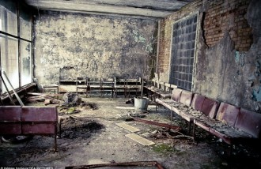
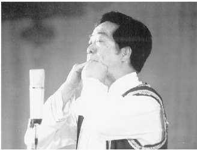
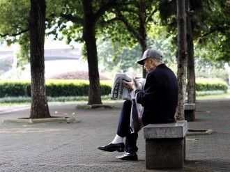

# 父亲的手笛

我回父亲的仓库为他整理遗物，风干的果子缀满了铁门，里面躺着一辆报废了的山地车、一把断了弦的吉他、一台手风琴，还有一架生了锈的鼓。我不知道父亲竟然玩过这些，在我记忆里，他永远是把双手交叠拱起，满眼得意地往里面吹气，奏出一首首像样不像样的小曲儿。

我的父亲是一名木匠，手笛是他锯木头时的乐子。木头吱吱呀呀地唱完了，他就呜呜呼呼地吹，一来一回不亦乐乎。日复一日，他终于练成了一首完整的曲子。还大汗淋漓地光着膀子，就激动地像阿基米德一样跑上了街。他挤到女人堆里，女人们都花容失色，惊慌躲避。只有一个女人倚在门边朝父亲卖笑搔首，父亲就犯了晕，靠近她，单膝跪下为她吹奏一曲。于是那位女人成了除木头外的第一名听众。一个月夜，父亲为她吹完了一首小夜曲，摊开双手里面竟躺着一枚戒指，她就这样成了我的母亲。

我的母亲耳朵不好使，但那时还不聋。在她生命的最后几年她是真的听不见了，任我们怎么叫她都没有反应。可当父亲吹起手笛来，她就会像得了神启，回头笑着望着父亲，你猜不到那么老的女人竟能笑得那么妩媚。

也许因为我在娘胎里时父亲就喜欢趴在母亲肚皮上给我吹手笛，我从记事起就对父亲的绝活有本能的排斥，总不肯当父亲的第二个忠实听众。于是父亲在我长到8岁时又给家里添了一条狗，他说这是我的妹妹小花。饭后父亲总喜欢来一首，并名之为家庭音乐会，小花就会把两只耳朵抬起来像兔子一样懒懒地听着，十分享受的样子。可我只觉得滑稽，我想我不属于这个家，或许就是这种力量促使我去到别处上学，并且和那儿的姑娘结了婚，当然这是后话。

我还记得14岁时第一次带喜欢的女孩到家里玩儿，父亲就不知从哪里跳出来：“多可爱的小姑娘，容我为你吹奏一曲。”姑娘吓了一跳，睁大了眼。父亲夸张地吹着，而我羞得满脸通红。回去的路上我不停地和她解释，我爸平时不是这样的，他一定是喝多了。女孩儿眨巴眨巴水汪汪的眼睛说：“你爸爸好恐怖哦。”后来那小妞儿和别人好了，那时年少，还以为一切的不喜欢都是有成因的，便认定了父亲是这件事的罪魁祸首。当时真怨恨父亲啊，就冲过去找他理论：“你能再别吹那玩意儿了吗？难听死了。”只记得父亲停下手中的锯子，淡定地抹了抹汗：“那可不行，这是我唯一的爱好。”“这不是爱好，是丢人。你怎么就不正儿八经地去学一样乐器呢？”

父亲听到这个居然笑了，“乐器不都要靠手操作吗？你看，我的掌纹里挤满了乐器。”

我离家很早，15岁就去了寄宿学校，大学如愿以偿地去了其他地方，工作后没多久就结了婚。小花在我读大学时离开了我们，母亲在我结婚后一年也去世了，就这样父亲的听众又回到了孤独的木头。我的儿子出生后，我问他要不要搬来和我们一起住，顺便照看一下刚出生的婴儿，前提是不能吹手笛吓到我的妻子和儿子。他挺不情愿的，可到底是来了。还真的再没吹过曲子。

离开了老屋的父亲老得飞快，或者是离开了他最后的听众木头。一日他躺在床上，自感时日无多，就把我叫去，说有很重要的话要对我说。我恭恭敬敬地坐到床边，看着衰老的父亲不胜唏嘘。没料到他居然狡黠地笑了一下，拱起交叠的双手吹了一首不知名的曲子。因为半躺着，所以吹出来的声音模模糊糊。他吹完一曲，朝我艰难地竖了一个大拇指，就满意地沉沉睡去。

我从没想过遗言是可以吹奏的，可父亲这么做了。清明时我带着妻儿去了老屋后面的墓园，父亲的边上躺着母亲和小花。我百感交集，交叠起双掌想着再来一次家庭音乐会吧。直到父亲过世后我才微微明白了父亲的骄傲，因为我也偷偷练习，可永远只能吹出一个音调。

妻子牵着儿子愣在身后，儿子却噗噗地笑了起来。

（采稿：刘铮；编辑：陈静；责编：刘铮）

[【父亲专题】继父](/archives/28950)——当你能够看透并怜悯敌人时，你才算真正战胜了他。当你能够平静地回忆并叙述时，你才算真正战胜了自己。 [【父亲专题】为君细写一联春](/archives/35046)——回首前尘，想起多年来父亲对于写春联、贴春联、读春联的用意变化，才发现他的孤愤嘲诮一年比一年深。我现在每年作一副春联，发现自己家门口老有父亲走过的影子。 [【父亲专题】父亲](/archives/35210)——我们每个人的意识深层都有对父母老去的恐惧，时间在运行中仿佛作了个交换，子女逐渐强大的代价是父母的迅速衰老，意识到这一点会让我们带突然陷入惊悚与战栗中。 [【父亲专题】我和他](/archives/26164)——当我们毫无挽回地长大，猛然回首，发现父亲就在那儿，在家里的沙发上，在我们的血和心上。 [【父亲专题】他们（独立影像第五十期）](/archives/35365)——父爱如山。因为不善于表达，他们总是被误读。本期介绍的四部是有关父亲的电影，他们有着不同的国籍，但是父爱没有国籍。 [【父亲专题】与父书](/archives/35424)——邻家有子，既富且贵，前程锦绣，夸示于父母。父母若脱不得桎梏，只得孩儿自骂狠心，亦无良策；若能炼到心如古井，波澜不起，只“由他去”三字足矣。
