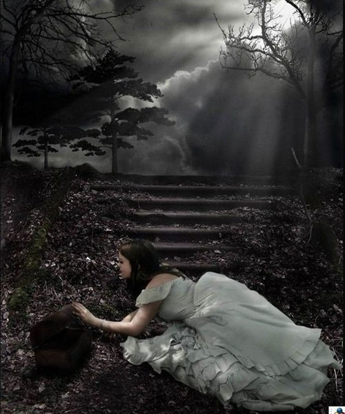

# 继父

“叫爸爸···”妈妈又推了推我的背。

“爸爸···”

我怯怯地看着眼前这个男人，那是记忆里我们的第一面。他埋着头喝稀饭，扫了我一眼，不笑，怒气冲冲拧开瓶子，里面泡着他自制的泡菜。那个瓶子后来被妈妈用来装白糖，搬了无数次家都没有扔掉。其他的都不记得了。

几个月后一天晚上，他要泡脚。叫我给他拿洗脚盆，我拿错了，然后被他用大铁盆砸在脑上。他转身回屋洗脚，我晕倒在屋外，血流了一地，额头上从此留了个疤。

我才开始认识他。

后来我翻出了当时穿的裙子，被血浸透，变成了暗红色。

那时我三岁吧。

他跟妈妈吵架，打架，有时候连带我一起。被邻居男孩欺负，一脚把我踢到墙上，他恰好从旁边经过，看都不看一眼就走开了。

夏天必须做的事情是拍苍蝇，“拍不够一百只不准吃饭！”。我就跑去公厕，一拍下去，黑乎乎的一片，我如获至宝地包回家。

就这样过了三年。

一年级，妈和他吵翻了，我于是和爷爷奶奶住在一起。过了段时间，他提着大包小包礼物和吃食来看我。他坐在堂屋和我的婶婆聊得哈哈大笑，我爷爷奶奶忙着给他们倒茶，也跟着笑。

晚上，我悄悄尝了块饼干。爷爷知道，马上让我灌了半瓶醋下去，忙把其他东西全部扔到了池塘里，然后想带我去镇上看医生，解毒。“你个狗日的，是不是要等他毒死我孙女你才安心？”爷爷一暴跳如雷，骂奶奶。然后抱着我哭了，“他这么对你，不要吃他东西啊。”

和爷爷奶奶这一年很快乐。

有一天，我们在堂屋吃午饭，突然隔壁屋子的墙倒了，砖块哗啦啦地倒下来，灰尘弥漫。“哦豁，饭不成了诶。”我笑嘻嘻地看着碗里的灰尘。房子是生父十多岁的时候建的砖瓦房，他已经过世五年了。房子也想归于尘土了。

妈妈回来了，和继父一起翻新房子。新房子修好那天，请邻居吃饭。他喝醉了，说胡话，然后坐在地上哭，“她是我婆娘···我晓得你们觉得我不是个东西···我对不起···”颠来倒去地说，说着说着看哭了。大家都去拉他。妈妈怒了，给了他一巴掌，“滚起来！喝不得又要跟到装疯！”

我在院子里一个人玩，冷笑着想，真恶心，你也有今天。

我又他们一起过了。日子好像好了一点，期末我拿了奖状，回家得意极了。他凑过来，笑嘻嘻地问我，“你知道你为什么拿奖状吗？”

“因为···因为我成绩好啊。”

“哪是哦，是你爸爸死了，你们老师觉得你可怜嘛。”他笑得更欢了，转身出门。

歇战一段时候，他俩的战斗力大大提高了。碎桌子碎碗，一片狼藉。我就急急跑到茶馆搬救兵，“叔叔，你到我们屋头去看下嘛···”，邻居都在那打牌。

“又打起来了啊，莫得事，他们打死了你给我当女就好了，哎哟，好乖个女哦。”

“等下嘛，这盘牌打了嘛。”

我就一旁眼巴巴地等着。

零一年，严打。他跟朋友打牌，派出所的来了。他听见声音立刻找了窗户，从三楼上跳下来，摔在水泥地上。然后，卧床养腰近两月。那时弟弟刚出生不久，每日哭闹，我哄不住。一天弟弟哭个不停，他柔声把我叫进里屋，“过来，爸爸跟你说句话。”

我不敢。

“过来嘛，走进点，给爸爸倒杯水。”

我怯怯地走近他。

他微笑着看着我，然后一把抓住我头发往墙上撞，“老子还没有死啊，你个烂娼妇，这么虐待老子娃儿···”

头撞在墙上，沉闷的响声。

一天我在院里玩虫子，把虫子装在蛋壳里，跟它们讲话。隔壁女孩走过来，“你还有心情耍虫虫，你看你妈老汉一天疯扯扯的，你不晓得专心学习！”

我继续埋着头对虫子讲话，我撕了碎布条把虫子按在里面，“嘻嘻，暖和吧？我对你好吧？”

虫子已经跑掉了，“诶，虫子，你别跑啊，我真的一个朋友都没有···你陪我说说话啊···我真的想找个人说说话啊。”

我把这些话写在作文里。

“给同学们念念！”语文老师把作文本扔我课桌上。

“不要···”

“嘿，这个女子才笑人哦，跟同学互相学习撒！过度谦虚就是骄傲哦···”

“不···”

“老师是觉得你写得好，我都把你请不动了撒？”

后面一片起哄声。

我拿起本子结结巴巴地读起来，读到难过处，鼻子一抽，慌忙捂住嘴，全班同学已经笑成一团，“哎呀，还哭了呀！”高中碰到这位老师，她还夸我，“嗯，作文写得有真情实感！”

也不是没有温情的时刻。是三年级的时候吧，夜里他开车送货，去另一个镇子，我跟车。夏夜，稻田和银河都很美。我坐在副驾驶，悄悄看他一眼···微笑自得的样子，也不是那么可恶嘛。他心情好极了，递给我一支烟，“幺儿，给老汉点一哈！”

我受宠若惊地接过来，点了几次都没有点着。

“硬是个傻东西！”他把烟一把夺回去。

后来，车陷在了泥坑里，荒郊野外，里面还有一车砖。“幺儿，你去那家人那里买根电筒嘛，就说你爸爸要用哈。”他递给我钱，十块还是二十块，记不清了。

很远处有一户人家，我急忙跑了过去，还是有点温馨，“他第一次说他是我爸爸呢···”

结果那家人死活不开门，也是，凌晨俩三点的···一个小姑娘凄厉的喊开门···

回去脑袋就被打了一巴掌，嗡嗡直响。

他决定倒掉半车砖，再重新发动。叫我站在车后给他看着，我想相信他是无意的：那半车砖都砸到了我的身上。

其实我只恨这件事。

是四五年级的时候吧，也是一个夏天。他喜欢钓鱼，亦擅长烹饪。请了很多生意上的朋友来家里吃鱼喝酒。

那年蜀柏毒蛾肆虐，门窗封得严严实实，飞蛾还是无孔不入地飞进来，密密麻麻围着日光灯，簌簌地掉粉。

他打了几次，还是密密麻麻一片。他于是把我卧室所有灯都打开，虫子就全飞过来了，余光也能把客厅照亮。然后在我卧室喷杀虫剂，喷成一片白茫茫，喷雾凝结成水，地板上湿漉漉的。我已经睡得迷迷糊糊了，闻到一股恶臭，日光灯的光刀一样捅醒我。我躺在床上，不敢动，怕一动又是一顿打。我假装熟睡，汗水打湿凉席，我觉得自己要死了。

从此我厌恶日光灯，觉得被它一照就心慌。一个人时，晚上很少开大灯。

 

然后我就被他赶出家门了。

是小学毕业的暑假，他认为他困顿许久，都是因为我克了他。妈妈叫我去舅舅家住两天，每次都是这样。住到舅舅认真地对我说：“你还是回你个人家去吧。”

这次我不想去了，我包里还有十块钱。我买了硫磺皂，筷子和白糖，去爷爷奶奶家。我要去永远不会嫌弃我的人那里。

我还记得硫磺皂是一块五的，家里的筷子是爷爷砍了竹子自己做的，所以我买了筷子。

爷爷病了很久，手是一把干枯的柴。躺在床上，艰难地给我撕一袋芝麻糊，“吃···”他已经发不出什么声音了。

我不想让他们看出什么，拿起弯刀去砍柴。捡了很多干木头和笋壳子，我还想砍后院那株高大的柏木，够他们烧一个冬天的。

每砍一刀，手臂就震痛一次。砍倒一半，我就筋疲力尽了，背起干木头回去，“下次来收拾你。”想柏树不久就会枯死，就可以烧了。

后来我回老家，发现爷爷奶奶去世很多年了，砍倒一半的柏树，却越发郁郁苍苍了。

 

然后我就去舅舅家了，路上下起夏日常见的暴雨，我摘了片荷叶顶在头上。路过小学同学家，想要是他请我去坐坐我就去吧···结果一只大狗猛地窜出来，他见了转身回屋。我一吓，人栽倒在稻田里。

后来他告诉我，“怕邻居说闲话，我不好意思···”

“嗯，没事儿。”我不想跟任何人聊这个了。

到舅舅家，雨停了。他已经知道了，怒气冲冲看我一眼，“每次我们要打谷子了，你们屋头就要打架。”

外公横他，“你跟娃儿说这些搞啥子···”

父子俩拌起了嘴。

我呆不下去了，去院子里坐着。雨后的天，蓝得晃眼。

 

妈出去工作，我于是在外公家常住。好在升了初中，周末才回去。我和表姐都住校，一周六块钱。外公会悄悄地给我两块钱，就是八块钱，可是还是吃不到什么。打了饭，我一个人把饭盒端得远远的，反正吃几口就没胃口了。从那时起严重失眠，每夜睁着大眼睛和黑夜对峙，把不多的钱都买了花茶，上课呆愣愣地看着花朵在开水里舒展开，觉得安心极了。

舅舅每周二来一次学校，在课间操的时候再单独给表姐拿一次钱。他摸出钱包前，总要四处张望下，我庆幸我们班在操场最后面，免得让他尴尬。我亦感谢他那一眼张望，照顾了我的自尊。我没有告诉他，其实我不会嫉妒的。

继父的女儿和我一个班，我俩心照不宣地照样好着，有男生欺负她，她跑来给我告状。我走过去一脚踢翻那个男生的课桌，她就得意洋洋地把那男生看着。

不久后，弟弟出事了。因为无人照看，他从货车上摔下，昏迷了。我买了玩具去医院看他，弟弟头上绑满绷带，睡着了。继父坐在小板凳下，我看一眼，惊了——头发快白完了。

我心想，报应总是来得很快的。

我把玩具放床边准备走，他抬头吼我一句，“拿起滚！”

呵，滚就滚。

只是可怜了我弟弟。

事后他想通了，想请我妈回家，顺便也请我回去。他带着弟弟去外公家找我，到了村口，小家伙死活不肯走了，“有狗···有狗···”他哭得头发上都是汗。

我知道弟弟在怕什么，心疼极了。想，算了，我还想杀了你爸的，看着你份上，算了。

我甚至做了计划，以失眠的名义去医生那里开安眠药，我从小跟那医生很熟，他或许会同意。然后碾成粉末，以看弟弟的名义去他家里，放他茶杯里，他喜欢喝浓茶，不会觉察出味道有异。他是司机，开车的时候睡着后果可想而知。不行的话，就下毒。

我也不知道自己是想来解气还是再走一步就做了。

他来外公家，收拾得溜光水滑。见我就问，“听说你病了，有钱吗？我带你去看看吧。”

那时我病了很久，瞒着大人，只有同学知道。他第一次对我说了这么多话，我不争气地鼻子一酸，扭头走了。

他让姐姐给我给钱，姐姐知道我不收，塞给我就跑。我拿着钱对着太阳看了一眼，撕成了渣渣。逗自己开心，看，真好看！

 

妈妈还是回来了，他对我们都好了一段时间，也就一小段而已。

初一我拿了一个轰动小镇的奖，主办方邀请我和老师去人民大会堂领奖。大人天天议论，他忍不住了，饭桌上问我，“你去北京不？”

我对他笑笑，心想关你球相干。

他的暴烈收敛了些，他们还是不时吵闹。好在到底是老了些，时间可以把混球打扮得慈目善目。

我在那群多半做了小姐和蹲牢房的儿时玩伴里，越发给他们长脸。中考的时候考了小镇第三，他们喜气洋洋跟邻居一起去学校外面看放榜。我早就料到这一天，于是在家长那栏写了生父的名字，算是回赠。

然后就是高考后的升学宴了，他压抑不住笑意，客气接受亲友的祝贺。吃喝到最后，舅舅让一帮人停下筷子，给我倒了杯酒，“必须敬你爸爸杯酒，养了你这么多年不容易。”

大家都看着我。他们都知道我多年没有叫过他“爸爸”的，我们一年说不上十句话。

“爸爸，这么多年你们带我们三姊妹不容易，我和姐姐会争气，好好孝顺你们，帮助弟娃的。”我话说的流畅极了，端起酒一饮而尽。

看谁比较难堪吧。

不想他手哆嗦着，居然开始啜泣，继而大哭。

我抱着他，他胖了老了，心里禁不住冷笑。

这场战争太漫长了，我终于赢了，而你再没有反转的可能。

“别哭啊，今天该高兴，有啥子好哭的嘛？”我和众人一起安慰他。

然后给陈家来吃酒的姊妹拿了些钱，就跟同学打麻将去了。牌桌上他们批我太冷静，你继父是真对你好···

 

那天他的母亲也不停地哭，拉着我的手不放，说我们家族终于出了个读书人，光宗耀祖，扬眉吐气，你陈家的先人也会高兴的。

诶，我陈家的先人，都死光了。

我想起每一年春节都是我最难捱的时候，必须回他们老家。回去没人理我，我一个人折卫生纸玩。他妹妹走过来，“你知道卫生纸现在多贵吗？”我翻出一张小时候的“全家福”，所有人热热闹闹抱成一团，我站在角落里，紧紧靠着无花果树。

现在我给你们光宗耀祖了。

我知道他在哭什么，他只是哭他时运不济的大半生：年少轻狂，成绩好却和老师赌气放弃高考；四岁的儿子溺死在池塘里，前妻病亡；因为女儿的抚养权和父亲反目，一起出来做生意的朋友早就发达了他是最不济的一个，这两年跟朋友吃饭还要我一杯一杯地给他挡那些烂货的白酒···值得哭的理由太多了。我七岁那年就把他看透了，他趴陈家门槛上嚎啕大哭的时候我就瞧不起他了，我们从此不公平地相处了十多年，他毫不节制地打骂我，我冷笑着再怎么痛都不哭，想你终有后悔的一天。他不知道他迟早会输。

我看透了他，也就理解了他。

所有人都在哭，所有人都有天大的委屈，所有人都觉得全世界都辜负了自己。可是，你有你以为的那么无辜吗？

别装了，你知道答案的。

 

我记得幼时，他们激烈的打架，我就拿起菜刀冲过去；他们温和地打架，我就笑嘻嘻地帮他。

对，帮他。

我知道这个时候他们都不会真的生气，我希望帮他可以换取他的一丝丝好感，我知道妈妈也希望我能换取到这一丝好感。我们心照不宣地合谋，希望他不再厌恶我。

然后失败了。

所以我不觉得自己有多无辜。

他的家人用最低劣的语言形容妈妈和他的关系时，我不也心安理得装作听不懂然后摔了口碗吗？

我当然不可能原谅他，因为我从来没有真正恨过他。恨一个人耗散太多能量，我暗自跟他都斗了十多年再也不想费这个神了。我知道他的无能他的委屈，他在外人那里口碑甚好，他其实心肠极软，对老人小孩都好，他看见路边一只野猫都会停下来喂食，除了对我。大家都对我不叫他很不解····我输了体面也没关系，反正你后半生还要靠我供养。

虽然我知道，你跟我母亲的婚姻，与我生父那笔巨额的死亡赔偿金有关，你成功地用完了它们，在你的烟酒、你开进河里的车、做失败的生意上···然后你买了保险，没有一份受益人是我，最末位的受益人都没有一个是我。

你该庆幸，把我折磨得不对你寄任何希望于是从此也不再失望，一丁点都不会有。

我在外面多蝇营狗苟都没关系，反正我从此是整个家族唯一一个大学生是你们的脸面和余生荣耀希望的来源。

就凭这个，我也会让自己混出个名堂来。世俗意义上再庸俗的成功我也欢喜。

其实你哭的时候你就知道了吧，我端起酒杯那一席场面话是真的。

我再不可能爱你依恋你，我看到你都嫌累嫌恶心，但我尽已所能地对你们好。或许还能让你余生都生活在愧疚里呢，虽然你多半没这个觉悟。

别怕，相信我，时间或许能把你打扮成一个慈目善目的老头，你哄我孩子吃糖的时候，我一定不告诉她我们间的恩怨。

复习马哲，想起一些旧事，相信写出来即是面对和告别。

在那次念作文被笑之后，我就深信暴露自己的痛楚是软弱和耻辱。而今我才渐渐觉得，袒露才能风干血迹，你在意的不是阅读者的评判而是自己今日的态度，这才是真正的勇敢。我希望自己能彻底放下这段所以放在日志里，但还是恳请大家不要当面跟我谈论这事吧，我估计我们没有那么熟。

写这些亦不是为了让人批评他或者同情我，时间自赏罚分明。

我只是想给那个惧怕日光灯的小女孩，一个唯自己懂得的交代。

（采编：杨松子；责编：刘铮）

[【父亲专题】我和他](/archives/26164)——当我们毫无挽回地长大，猛然回首，发现父亲就在那儿，在家里的沙发上，在我们的血和心上。

[【父亲专题】为君细写一联春](/archives/35046)——回首前尘，想起多年来父亲对于写春联、贴春联、读春联的用意变化，才发现他的孤愤嘲诮一年比一年深。我现在每年作一副春联，发现自己家门口老有父亲走过的影子。

[【父亲专题】父亲](/archives/35210)——我们每个人的意识深层都有对父母老去的恐惧，时间在运行中仿佛作了个交换，子女逐渐强大的代价是父母的迅速衰老，意识到这一点会让我们带突然陷入惊悚与战栗中。

[【父亲专题】父亲的手笛](/archives/35312)——父亲的手笛里，有他一生的欢喜和柔肠，他执拗地吹奏，却不再被懂得。

[【父亲专题】他们（独立影像第五十期）](/archives/35365)——父爱如山。因为不善于表达，他们总是被误读。本期介绍的四部是有关父亲的电影，他们有着不同的国籍，但是父爱没有国籍。

[【父亲专题】与父书](/archives/35424)——邻家有子，既富且贵，前程锦绣，夸示于父母。父母若脱不得桎梏，只得孩儿自骂狠心，亦无良策；若能炼到心如古井，波澜不起，只“由他去”三字足矣。
