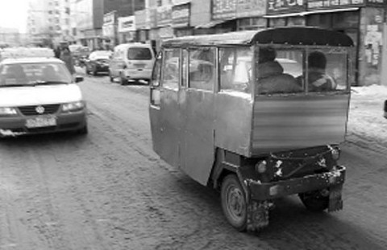
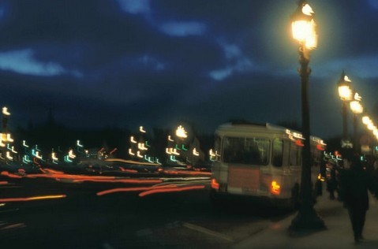

# 不过是流着眼泪吃着肉

人活着是为了实现和获得？我觉得不是，人在世上每一天都是在失去和承受。

人活着是靠理想和憧憬吗？我觉得不是，人能活下去，靠的是坚强。

明明懂得很多大道理，可当自己深陷其中时又迷茫脆弱得像个孩童，生活周遭的一切就是如此，发生在别人身上时，你会感到太过残酷和无情，可当落到你头上时，无论如何，你也得走下去。

7月中旬大学毕业后，我来到望京工作，离家挺远，坐一小时地铁，下了地铁到单位还有将近五公里的步行距离。好在望京这片儿有非常发达的三蹦子市场，北京俗称蹦子，就是那种烧油的三轮车，经常在路上和汽车彪，毫不示弱，还总是一蹦一蹦的，坐在里面总有种随时翻车的刺激感。从地铁口到公司十块钱，价钱合理，又能享受到飞起来的感觉，坐三蹦子就成了我每天必不可少的一件乐事。

三蹦子由于车身不稳，油门难以控制，又没有避震系统，所以翻车的几率较高，有很大的安全隐患，CityGod们，也就是城管，每周都会做一次三蹦子大扫荡，连车带人一块拉走，再加重罚款。基本上望京这一带干三蹦子生意的都是外地来京的打工人员，没钱没文化没人脉没技能，白天在地铁口扒活儿，一边拉客一边调动全身感官提防城管，晚上住在四百块钱一个月的地下室里，他们和三蹦子一样，每天拼尽全力不停地飞奔，随时要做好翻车倒地就此告别这片土地的准备。以上这些是一位优秀三蹦子驾驶员讲给我的。
他叫小六，来北京打工第三年，今年二十二，和我一样大，但坚持叫我大哥，他解释说坐他车的都是大哥，不是因为我有大哥的范儿。我常坐他的蹦子，后来慢慢熟悉，从老顾客成为了蹦友，每天清晨我走出地铁的时候他都会在路边叼根红梅等着我，这个时间点如果出现别的顾客他都会道歉拒绝，死心塌地地等我。

小六是我所体验过的最优秀的三蹦子驾驶员，他的招牌姿势是下身翘着二郎腿，就这样炫酷的姿势却能把车骑的极稳，实在天赋异禀。除了有一点不太好，他总喜欢在路上和我聊天，我倒不是担心他会因此分心，而是聊天的时候总喜欢扭回头来，用后脑勺目视前方。

小六每天都会乐着给我讲点生活趣事，昨天哪个竞争对手翻车了，也不称称自己几斤几两，以为三蹦子是谁都能开的吗！前天哪个哥们一不留神撞到了城管，当场就义愤填膺的抄起随时备好的钳子卸下了一个轱辘，死活咬定这不是三个轮的。还有他千里之外的家里事，他三代单传，去年媳妇给他生了个儿子，一家人高兴的不得了，只是造化弄人，小儿子半年前得了怪病，呼吸常出现困难，方圆百里看了一遍，还是没治好。“不要紧，山里的孩子都命硬，我再攒个半年钱就把儿子带到大北京的医院来，咱首都还能治不好？”讲这些时小六依然乐呵着，并且，还他娘的非要把头扭过来看着我讲。

我喜欢小六，因为他总是两眼眯成一条线，乐呵呵的，每天早上看到他，我都觉得阳光暖得可以融掉北京的雾霾。

9月中旬的一个早晨，我继续坐小六的三蹦子藐视所有一路被超过的汽车。那天小六没要我钱，他说他明天要回趟老家，估计月末才能回来，这段时间送不了我，给我推荐了两个同行好哥们，叫我以后坐他们的车，并告诉我他们是这一带排名第二和第三的三蹦子驾驶员。

生活还要继续，我依然坐着三蹦子去公司。不过第一天没有小六的日子，我乘坐的三蹦子就为了抢路和马路霸主公交车蹭上了，险些侧翻。那之后我很怀念小六。如果你遇见了一个优秀的三蹦子驾驶员之后，其他蹦子都会变成将就。

伟大的人都有着相同的伟大，平凡的人则有着不同的伟大。

一周过去，小六提前回来了，在地铁门口看到他时我蹦蹦跳跳的就过去上了他的车，他依然眼睛眯成一条细线，乐呵呵的，只是眼角的皱纹比走那天深了一些。我开心得不得了，策马奔腾的日子又回来了，我又可以在小六的蹦子上觊觎一切豪车了。小六的技术丝毫没有退步，驾起车来反而更加迅猛，像一头压抑许久的野兽，向这个世界怒吼。

那天到公司的时间较已往早了十分钟，下车时我想起还一直没问他的近况，“六子，那会怎么突然说走就走了，家里没出啥事吧？”“没事大哥，儿子病情严重了，媳妇和我娘着急，让我回去看看。”

“那现在好些了吧，看你没到月末就回来了。”

“死了，喘不上气，眼看着死的，小脸儿都憋紫了。“

“……”

我一时怔住，嗓子里像卡进了玻璃碎片，既说不出任何话语，也忘记了该如何吞咽。

“死就死了吧，这娃命苦，生下来就受这活罪，我没出息，实在没法治好他，早点投胎去个好人家，千万别再给我当儿子。”

不悲愤，不凄凉，甚至连情绪都不变化，小六平静地讲述着一个好像与他毫无关系的人的死亡。

可他眼角下那在一周里好像被锥子凿刻了的皱纹，没能藏住他内心的悲痛。

秋日清晨的暖阳照射到小六的脸上，他的眼睛又重新眯了起来，嘴角再次咧出弧度：“大哥，你快去上班吧，我回去扒活了，明见。”

就像春的生机盎然，夏的浪漫浮华，冬的安宁沉静，秋天，就像一位历经人间百态，谙熟命途多舛的中年男子，已经走过了盎然，穿过了浪漫，为了那最终的安宁，只得坚强到沧桑满面。

或许每个人，都逃不过这命里的秋天吧。

10月中旬的清晨，我继续坐着六子的三蹦子来到公司，下车离开时六子叫住了我：“大哥，晚上有空吗，想请你吃个饭。”“有啊，五点下班，楼下等我。”

“对了，给咱这座驾洗个澡，晚上咱去个上档次的饭店，就开着它去。”小六笑着眯起眼睛，爽快地答道“好嘞”。我也眯起了眼睛。

下班后，小六如约而至，还真给三蹦子洗了个澡，那铁皮锃亮，我当时想着如果下一部变形金刚里能出现一辆三蹦子能咔嚓咔嚓变形，绝对亮瞎中国观众。我上车给他指路，小六继续翘着二郎腿，老样子，一边开一边回过头和我聊天，在一家朝鲜烤串城前停下来。

小六下了车和我一起上楼，这是从七月相识至今，我第一次看到离开三蹦子的小六，我终于明白为什么他一直要要撬着一条二郎腿炫酷的开车，原来他的左腿是瘸的。

我把店里所有的招牌烤串点了一遍，满满一桌子的肉，然后要了一箱啤酒。

“先说好了，今这顿饭我结账。”我对小六说。

“凭啥啊，都说了我请你。”

“行，那咱就看谁最后能清醒着出门，这会说得再潇洒，一会喝的连爹妈都不认了也是抽自个嘴巴。”

“哈哈哈哈，大哥，你可别逞能啊，我每天早上起了都喝两盅才出去扒活的，你能看出我酒驾吗？“小六冲我扬了扬下巴，一脸的骄傲。

“我操你爹。”

我要了两个大碗，一碗差不多是半瓶啤酒，我俩谁也不服谁，比着大口吃肉，比着举起碗就一饮而尽。

我记着半箱下肚的时候，旁边桌两个韩国人，估计是被我们大碗喝酒的架势所震慑，倒了一杯啤的过来敬酒，用蹩脚的汉语说：“中国人，厉害！”小六直接抄起一瓶，用牙咬开，“我们是你们爹，”停了两秒钟，“思密达！”然后咕嘟咕嘟就干了。还没等我去解释，那两个韩国人就结账穿衣服走了，耸得令人很无奈。

基本上这就是当晚喝酒的前两个小时中，小六所说的唯一一句话。

我确实喝不过小六，七瓶下肚之后，酒就卡到嗓子眼了，再喝一口，我就有可能像喷泉那样吐小六一脸，他也喝多了，看刚才的豪侠之气，我真怕万一吐到他身上他会抄起酒瓶子揍我。他继续大口吃肉大碗喝酒，我抽着烟，养精蓄锐，等着结账。

等了一个小时。在我彻底甘拜下风后，小六继续神勇。我拿起根烟点燃后送到他嘴里时，他突然就像狼嚎一样开始哇哇大哭，我被吓了一个激灵，赶忙拿纸巾递给他，小六挥挥手，继续狠狠的吃肉，就那么泪流满面地大口吃肉。

“大哥，我以后送不了你了，家里媳妇跟别人跑了，我怪不了她，我没出息，出来打工三年多也没能混个人样，儿子也死了，我知道她恨我，恨我没能治好儿子。

“我俩从小在山里长大，真是青梅竹马的，她可是我们村里的美女，好看着呢！跟了我真是委屈，你说我有啥值得她跟的？听说她现在跟的那个人是我们那片最有钱的人家，好事啊！

“我娘年纪大了，一下给气病了，我得回去陪她，让她好起来。我再没出息，我也得让我娘好起来，你说是不是？”

“是。”我干了一碗。

小六笑了，“大哥原来你还能喝啊，能不能实在点。”小六的眼泪一直在淌，这是我第一次在眼前看着一个人，边哭边笑，还他妈一边大口的吃肉。

后来小六再也没提这些事，他开始跟我唠嗑扯淡，他讲了很多三蹦子兄弟的故事，讲他们为了能给家里多汇钱三个人挤在十平米的底下室里，讲他们离家多年，半年集体攒钱装回大款，去燕郊找小姐的经历。讲他们为了生活，做的那些偶失道德的疯狂事，讲他们每晚睡觉前都会一起唱家乡的歌。

我沉浸在他的话语里，比起平常朋友和同事讲的那些前天谁赚大钱升职了，昨天谁终于历经艰辛实现梦想，今天谁多么励志多么辉煌，更有趣。有趣的不是小六的讲述方式，而是他讲的每一句话，都太过真实，真实的更像生活。

我的太奶奶今年99岁，前年我回老家看望她时，她老远就喊，“是豪豪吗，豪豪回来看我了”，我跑过去像对待一个小女孩一样把她搂进怀里。一个大半身埋进土里的人，一个全身刻满皱纹像一棵枯朽老树的人，却依然耳聪目明头脑清晰，饿了的时候能用一口假牙啃半只烧鸡，太奶奶才是我的女神。

爷爷和我说，太奶奶是个了不起的人，她和在那个裹脚年代长大的人并无二异，了不起的是她一直活到了今天。她经历了那个时代每个人都要经历过的饥荒、混乱、文革，经历了这个世上每一个人都要经历的苦难、不如意、病痛、离别，和生活与岁月带给每个人的摧枯拉朽与孤单寂寥。

她至今依然站立在这片土地上，她没有成功和荣耀，没有策马红尘的青春，没有为了人生理想的一路奋战。但她从来没有被生活打败过，她没能从岁月那里获得些什么，可岁月也从未能从她身上剥夺摧毁掉什么。

她是一个真实的，平凡的，像这个世界上被无数人所鄙夷的又和无数人一样的为了活着而生活的人。

她是个了不起的人，是我心里的女神。

太奶奶没有所谓的人生哲学和长寿秘诀，活了将近百岁走过了一个世纪的人，每一句对生命的感慨都是经过时间验证的深刻，但她一如过去从不言感悟也不语遗恨。我从来无法从她那里获得些指点或和经验之谈，我俩一块的时候干的最多的事就是一起吃烧鸡。

关于她的人生过往，我从爷爷那里听到过一二。太爷爷在世时是那个年代的财主，生意做的很大，家里有两辆马车，大土豪。这当然一定是要被革命的，被大伙深恶痛绝的。嫁鸡随鸡嫁狗随狗，太奶奶只是命运的跟随者。命运弄人，太爷爷不到四十就离世了，不到三十的太奶奶成为了对丈夫阶级仇恨的转移者，批判的承载者。唾弃、咒骂、侮辱，这些基本上构成了她的后半生。她并没有悲愤和怨恨，像一块钟表一样继续生活，只是在每一年太爷爷的祭日时，她都会做上一锅肉，无论贫穷或富裕，然后一个人端起一碗肉坐在家里的门前，一边流泪痛哭，一边大口吃肉。

流着眼泪也要吃下肉——这就是太奶奶的这一辈子的人生哲学。

生活真的有那么多光鲜和靓丽吗，生活真的可以一如海面升起的太阳让人向往和着迷吗，生活真的是有那么多苦尽甘来的实现和获得吗。

与其说人生是为了实现和获得，不如坦诚的说，人生不过是不断地失去和承受。

生活就是这样，不如诗。

那晚我背着小六离开饭店，我走得战战兢兢，努力平稳脚步，只怕一个震荡他就吐我一头的啤酒加肉。小六好样的，一直没吐，就是一边撕着我的耳朵一边喊驾，我突然想到，他不过和我一个年纪，大学刚毕业的年龄，还是一个大男孩啊。

背他回去的路上，小六一直在笑，笑得酣畅淋漓，我问他，你到底在笑个蛋，“想让我哭？去你娘的吧！”然后又是一阵大笑。

那笑声震耳欲聋，在夜晚的空气中肆意飘荡，简直和战场上斩杀百敌的英雄一样荡气回肠。

对，小六是个英雄，生活里的真英雄。

愿他永远把酒当歌，以笑代哭，愿他永远这般倔强藐视人生一切的不如意。

生活啊，不过如此，流着眼泪也要吃下肉。

http://blog.renren.com/blog/278382840/918336960

(采编：有奖信息公布；责编：刘铮；)