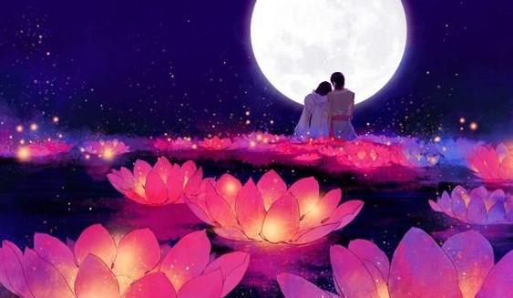

# 惊艳了时光，温柔了岁月

那天听朋友讲了一个故事，他的朋友，一对曾经相恋八年的恋人最后选择了分手，突然分别和一个相恋了只有三个月的人迅速结婚。这是我这一年中听过的最悲伤的爱情故事。

他们那三个月的时光是绚丽和浪漫的，一定绽放出了由于八年的爱情马拉松所憋坏了的久违的激情。谁不想自己的爱情永远像热恋般炙热，可时间偏要悄悄带走所有的激情，抚平伤痕的同时也要平淡了你的曾经最美好的流年。

人这一辈子会遇见两个人，一个惊艳了时光，一个温柔了岁月。

我曾看到过很多人转发这句话，这些人里也许有遇够了惊艳时光的，苦苦等候温柔岁月的人，也有被温柔过岁月，却觉得生活缺少激情，默默期待惊艳时光的人。

如果你此生已经遇见过这两种人，那你一定要知足，爱情的千万种味道概括起来无非也就是这两种。

你会偷偷怀念那个惊艳了时光的人，正如有一天你会厌烦那个温柔了岁月的人。

短暂的爱情，美好的情人，让人心动的艳遇，偶然浪漫的邂逅，生命中太多角色都可归入惊艳了时光的人，她们会给你一段充满激情，疯狂洒脱，好似只存在于电影中的一段刺激与浪漫的美好经历，只不过，无论那时的她们让你多么的痴迷，多么的浪漫，爱你爱的如何轰轰烈烈，奋不顾身，最后都只会在你生命里停留一小段时间。

因为惊艳了时光的人是不会在你身边停下脚步的，否则也就不会惊艳了。

可如果想温柔你的岁月，那就真的是一场智力与体力相结合，耗费青春和生命的马拉松了，因为她们必须停在你身边很久很久，久到你厌烦，久到你想甩开她，久到你开始偷偷出去玩不告诉她，久到你想尽办法躲开她的视线所及范围，可她还是会不依不饶的留在你身边，任你骂，任你抱怨，任你嫌弃，她就是执拗的相信你这个孩子没有她会生活不能自理，没有她会长不大，没有她会受委屈，没有她在你身边，你受挫而彷徨无助时，没有人能真的再像她一样，静静的坐在你身边陪伴着你，然后她就是这样偏执到近乎不可理喻的留在你身边，直到慢慢温柔了你的岁月。

这世上有很多人都可以惊艳你的时光，而他们也只愿惊艳你的时光，但很少有人愿留在你身边直到慢慢温柔了你的岁月。一生也许只有那么一个，错过了便不再有。

在这样一个喧嚣的青春，有谁会真的心甘情愿温柔一个人的岁月？那不是半年，一年可以做到的，那是需要五年，七年，甚至十年的马拉松爱情才可以修成的，更何况，谁不会怀疑，谁不会猜忌，我为这个人牺牲了青春年华，即便温柔了岁月，最后又是否能真的修成正果？现实中太多的例子证明，大多数女孩在好不容易教会了一个男孩如何去爱，如何去承担，如何去珍惜，成为了他的人生的爱情的导师后，用自己的遍体鳞伤拔掉了对方身上所有的刺，然后转身给下一个陌生的女人做了美丽的嫁衣。

温柔了岁月，太苦太累，而且结局看起来永远是那么扑朔迷离，这是最不划算的赌博。

惊艳你时光的人，她们会对你嘘寒问暖，会陪你有说有笑，她们可以陪你聊到天亮，陪你玩到疲倦，她们会做一切让你开心的事，她们不会管你，不会束缚你，陪你一起享受疯狂的青春，在身体上和精神上都给予你足够的愉悦和刺激。

而温柔了你岁月的人，她们会对你无微不至，会陪你有说有笑，但她们会跟你生气和你吵架，只是因为你没有听话，忘记照顾自己。她们也会陪你聊到睡着，陪你玩的仰天长笑只是她们最后会板着脸告诉你：“该睡觉了，再不睡明天就不理你了。”

她们也会陪你疯狂，只是总要给你那么一点束缚和界限，因为她们不只是想让你快乐，更想让你健康成长。

她们不是过于沉闷不解风情，只是一切都真的为你好。

比起那些惊艳了时光的人，她们更愿意在你失望伤心时悄悄的来到你的身边。这个时候的你是最容易无理取闹，乱发脾气，可这时的你也只有她容忍的了，她甚至都不会生气，只是微笑的看着你。

也许后来的你会慢慢发现，每一个可以温柔你岁月的人其实都是可以惊艳你时光的人，只要她说走就做，只要她不那么固执的留在你身边，这真的不难。何况人都一样，谁不想多感受几个异性，谁不会憧憬没有品尝过的味道，只是她不愿这样留在你的回忆里，她想永远的流淌在你的生命里，爱着你，呵护你，陪伴你。

《初夏荷花时期的爱情里》写道，爱情里最伤人的一句话便是“亲爱的，人都是会变的。”

是的，惊艳了时光，一定会变，可温柔了岁月，却永远不曾变过。惊艳了时光的人终要离开你，不会离开你的只有那个默默温柔了岁月的她。

如果有一个人守你的身边偏就不会变，那你真的幸福的让很多人羡慕，可我怕你不珍惜，最后反而对着那个对你从来不会变的人说了这句：“亲爱的，人都是会变的。”

有的人还没来得及留下任何记忆就已经离开，有的人虽然离开却留下了永远的记忆，有时你愿陪她永远，她却只能陪你一程，有时你只能陪她一程，她却愿陪你永远。

任岁月平淡了流年，任时光抹去了激情，那个人还是静静的坐在你的身旁，直到温柔了你的岁月，不管你曾经被伤害得有多深，她的出现，她的守候，都让你原谅了之前生活对你所有的刁难。

感谢那些曾经在你生命中驻停过一段日子，惊艳了时光的人，但一定要珍惜那个愿意苦苦等候傻傻相依直到温柔了你岁月的她，那才是你生命里真正的无可替代。

惊鸿一瞥是生命的美妙，细水长流是淡淡的幸福，你究竟想要哪个。

也许有一天我们终会明白，

用一世桃花，换一生相守，用一生惊艳，换一世温柔，爱一个人，就是要陪她看细水长流。

其实我想说的很简单，愿你珍惜，愿你我，终会明白，早些明白。

http://blog.renren.com/blog/278382840/871944194?bfrom=01020100200

(采编：有奖信息公布；责编：刘铮；)