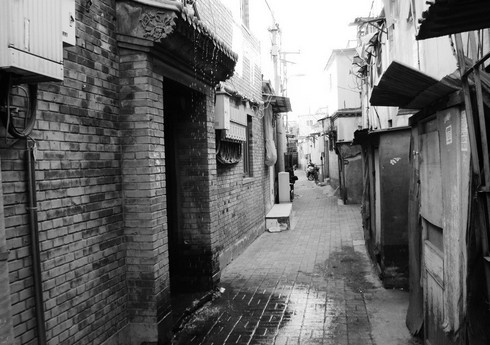
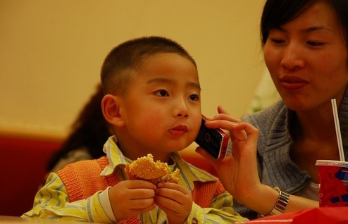

# 汉堡包

外面下着小雪，天气越来越冷，一个人坐在麦当劳里。我上课地方的周围除了一家麦当劳别无他物，每次上完课都来这里吃晚饭。

右边坐着一对母子，小男孩十岁左右，长得灵巧，讨人喜欢，妈妈上身穿着不合身的大衣，脚下放着一个很大的背包，我推算她应该三十多岁，看上去却有一副四十岁的面容，脸上写的是岁月的风霜。两人只点了一个套餐，小男孩吃的很开心，一脸的满足，两只小脚丫在椅子下面踢来踢去，妈妈喝着自己带来的矿泉水，疼爱地看着儿子，脸上的神情比小男孩还要幸福。男孩大口咬着手里的汉堡，水汪汪的大眼睛看着妈妈，嘴里的汉堡还没咽下去，咕咕囔囔的问：“妈妈为什么不吃呀，可好吃了。”妈妈摸了摸儿子的小脑瓜笑着说：“你好好吃，不够再要，我不爱吃这些东西。”小男孩天真的说：“妈妈真奇怪，这么好吃的东西你都不喜欢吃。”妈妈看着儿子，眼神里闪过一丝愧疚，“喜欢吃吗，等妈以后赚到钱了天天带你来吃。”

我看着自己手里的汉堡，这些话语听起来是那么的熟悉和亲切。

小时候家里条件紧迫，邻居一家则很富裕，家里有一个男孩，小我三岁。第一次看见肯德基就是在他家里，男孩的妈妈三天两头就带他去吃肯德基，每次还都会买回来很多。碰到我来时会送我一点鸡翅和薯条吃。那时候一个汉堡十多块钱，对于并不富裕的我的家庭来说还是奢侈品。后来身边很多小伙伴都吃过了肯德基，一起玩的时候常有人拿着有肯德基老爷爷的袋子一脸开心的说“今天我妈带我去吃肯德基了。”我也想吃，他们每个人都说汉堡香酥可口肉多味好，听得我直流口水，晚上回家吃饭的时候总会在脑子里想象汉堡的模样和味道。

小学六年级时，妈妈要带我和妹妹去城里吃肯德基，在周围的小伙伴里算是最后一个去吃肯德基的，那天的画面至今依然刻印在我的脑海里，妈妈一共点了两个套餐，一个辣汉堡一个不辣的，我和妹妹一人一个，她什么也没要，我吃的很香，汉堡真好吃，而心里更是满满的满足感，我也是吃过肯德基的孩子了。我在餐桌上问了妈妈同样的话，“妈妈，你为什么不吃呀？”她淡淡的说“我不喜欢吃，你和妹妹吃吧。”我觉得这么好吃的汉堡她要是不尝一口一定会后悔，便站起来踮起脚尖硬把汉堡包放到她嘴边，“你尝一口嘛，可香了！”她看着我一直笑，“儿子真好。”然后咬了一小口，咬下的只是汉堡周围的面包。我当时天真的在心里想“看来妈妈是真的不喜欢吃。”

那天回来，我高兴的手舞足蹈，还特意把有肯德基老爷爷的袋子带回来以纪念我也是去肯德基吃过汉堡包的人了，可晚上躺在床上时，心里一直在想妈妈为什么不喜欢吃，闻起来都这么香的汉堡她怎么可能会不喜欢吃。

她为什么连汉堡包周围的面包都舍不得咬一口。

小学时因为生了很怪的病，妈妈每天带着我去市里的中医研究所扎针灸，刮风下雨，寒风暴雪，一路上她都紧紧把我搂在怀里，一搂便是六年。那时爸妈的工资加起来一天只有一百，我每天的喝的两副药钱就是一百五。六个冬天里，妈妈穿的都是同一件羽绒服和毛衣，爸爸除了几身军服平常出门甚至都没有可换的衣服。因为休了学，她怕我每天去看病会觉得无聊，总是想给我些小快乐，医院附近有一个老胡同，里面都是北京的传统小吃，味道很正宗，在外面都能闻到飘来的香气，每天扎完针灸回来她都会给买串糖葫芦，或者童子鸡，糖耳朵，灌肠之类的，然后自己在旁边看着我吃，这六年她在外面花的每一分钱都是为我和妹妹花的，起码在我的记忆里，她从没在我眼前买过任何东西，哪怕是路边她很喜欢的三块钱的发卡。

而她对我说的最多的一句话就是“喜欢吗，喜欢妈以后每天都给你买”。

夏日的一天，太阳很毒，我又渴又热，想喝点冷饮，她在胡同里给我买了一瓶北京的老酸奶，那天在我和她倔了很久，要买就买两瓶，可最后还是没有说服她，我喝了两口便假装肚子疼，把剩下的都给了她，她喝的很享受，那种瓶装的老北京酸奶很好喝直到现在都卖的很好，喝完后我小大人似的一本正经的问她“妈，你喜欢喝吗？”她看着我说：“喜欢，一直都喜欢喝这个酸奶，就是贵，四块钱。”我挺直了腰板，拍了拍她的肩膀，霸气的对她说“喜欢就好，不就四块钱吗，我以后每天都给你买两瓶喝。”她笑开了花，摸着我的脑袋说，“那我可等着喝了。”

那一整天她都很开心，脸上挂满了幸福，只是因为她的儿子许诺以后每天给她买两瓶酸奶喝。

这些年家里慢慢富裕了，可她还是舍不得给自己花钱，看上一件衣服恨不得转遍所有店面，等打折等到快要下架了才会去买，可是对于我和妹妹，从来都是花钱不过脑，只要喜欢她就毫不犹豫的付钱，有时我嫌东西贵想再看看，她却突然倔强的像个孩子似的非要掏钱买下来。嘴上不情愿的唠叨着“我这辈子就是欠你们的”。可每次给我们花完钱后却比我俩还开心，为我俩花钱，不顾一切的把这世上最好的事物送到我们的手里，好像成为了她这一生最快乐的事。

高一的时候，她去香港旅游，回来的时候像个小女孩似的蹦蹦跳跳的过来告诉我给我买了一个DV和两双鞋，给妹妹买了一块女式高档手表。她一脸的满足，却没有给自己和爸爸没有买任何东西。我当时问她怎么也不给我爸带点东西，爸爸在一旁大气的挥手一笑，“没什么好东西可买的。”后来她告诉我在香港的时候爸爸特意打电话嘱咐她千万别给他买东西，留着钱给孩子和自己多买点。她把买来的东西给我时，嘴上还一直念叨着，“香港的衣服又便宜款式又多，我一人带不下太多东西，等下次再去时你给我列好想要的，我再给你买。”

晚上在自己卧室里看着DV和两双鞋时，心里愈发不是滋味，我都这么大了，可她还是把我和妹妹当小孩一样宠爱，一样的舍不得自己花一分钱，一样的总想把这世上最好的都留给我。

一样的连汉堡周围的面包都舍不得咬一口。

高二时和班主任谈心，我问了她一个问题，“一个人在什么时候才能真的长大，成熟起来？”本以为她会说现在的你已经长大了，或告诉我进了大学步入社会出去闯荡两年就会成熟起来。

可她看着我眯着眼睛，摇摇头笑了笑，“等你有了孩子，成为了父母那天起。”

上个月回家时，翻出了家里的老相册，我看着相册里的年轻女子，心里一阵酸痛，这个女子美丽脱俗，笑起来像一朵深夜里盛开的百合。我忽然想起姥姥曾给我讲过她大学的时候是班花，有一副好嗓子，唱起歌来优雅动听，她还有一手好文笔，校报上特地给你设了一个专栏。她出生在一个知识分子家庭，姥姥是重点高中的老师，姥爷是副校长，她是家里最小的，从小到大都受着宠爱，她是那个年代的大家闺秀，出类拔萃，亭亭玉立。

现在的她没有任何特长，没有兴趣爱好，甚至都没有什么朋友，偶尔和家里的姨舅打个长途电话唠叨着那些说了一遍又一遍的家长里短。她从不出去活动也从未参加过任何活动，生活的全部就是上班和回家，买件自己喜欢已久终于等到打折的衣服，继续增长自己的厨艺算是她生活中唯一能算上有色彩的事物。

我一直觉得她可能这一生都从未想过自己究竟喜欢什么，有过怎样的梦想，我甚至嫌弃她的人生太乏味，生活太单调，一生好像一幅铅笔素描一样。我不明白她是如何忍受过来的，又为何要如此甘愿荒废这一生。

可如今我才想起原来她的青春也曾经是绚丽多彩的，你也有过权力过自己想要的人生，而这一切的转变，这所有的失去，只是因为，她的生命里有了我。

我看着身旁的小男孩要了一个新的汉堡，吃得很香，她的妈妈依然坐在对面疼爱的看着他。

也许今晚回到家后他也会在心中疑问妈妈为什么不喜欢吃汉堡，也许他以后也会总不懂事的向妈妈一味索要，也许等他长大后也会叛逆，和父母吵架，厌倦他们的管教。也许有一天他也会不再把妈妈当作知己交心，习惯把秘密藏在自己的心里，也许有一天他也会不再理睬爸妈的关心，忘记了父母的担忧。也许有一天他也会想要逃离这个家，离父母越远越好，也许以后他也会在心里厌烦妈妈的唠叨，爸爸的古板。也许有一天他也会冷漠的对养育他多年父母大声喊道，“你们根本就不了解我，不爱我。”也许有一天他也会宁愿把时间和精力放在朋友身上和电脑前，也不愿陪爸爸看看电视陪妈妈聊聊天，也许以后他也会因为自己的任性和倔强，一次次的刺痛着父母的心。

也许，多年后的一天他也会想要回到旧时光里给那年的自己一个狠狠的嘴巴，告诉自己你有多么的不懂事。

也许更多年后你会忽然发现，是你，把年轻貌美的她变成了罗嗦唠叨的妇女，是你，把风华正茂的他变成了看着电视都能睡着的小老头，是你，把他们的青春全部悄悄偷走，是你，耗尽了他们生命里最好的时光，是你，苍老了他们的容颜，蹉跎了他们的一生。

当他们年迈以后，当他们再也不能走出屋门去看看外面的世界时，你的眼睛就是他们看到这个世界唯一的窗户。

急于走向未来的你，一定不要忘了身后渐渐老去的父母。

小男孩，现在的我很想走过去，在你耳旁悄悄的对你说句：“这个汉堡包里，是满满的爱。”

[原文链接http://blog.renren.com/blog/278382840/890117661?bfrom=01020100200]

（采编：有奖信息公布；责编：刘铮）