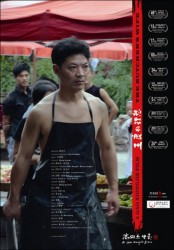

# 《王良的理想》放映暨交流@RIVERSIDE·河岸

 【时间】2012年12月22日 周六 14:00 - 17:00 【地点】上海市虹口区哈尔滨路160号“老洋行1913”创意园A301（近辽宁路） 【门票】15元 【问路】021-56320821；15201911941 Jessica 【公交】地铁4号线（10号线）海伦路站2号口出，步行5分钟可到 声明：青年沙龙 CICC 所放映的一切电影及影像作品，均已获得原版权所有者授权许可。我们郑重声明不复制、不上传网络、不向他人借阅影像拷贝。 -------------------------------------- 分 割 线 -------------------------------------- 【关于电影】 王良的理想 Wangliang's Ideal 剧情/中国/2010/彩色/HD/119分钟/中文对白/英文、中文字幕 Drama/China/2010/Color/HD/119min/Chinese with Chinese and English Subtitles 原著小说、出品人：王雪梅 / 主演：方野 汤慧华 俞长流 胡益波/摄影：郭嘉 / 录音：熊艺 / 剪辑：李方 / 鼓词、演唱：童兆基/监制：周松林 翁龙胤 / 执行导演：张琨剑 / 制片主任：张超 Director: Gao Xiongjie / Screenwriter: Gao Xiongjie / Principal cast: Fang Ye , Tang Huihua/Cinematography: Guo Jia / Editing: Li Fang / Music: Tong Zhaoji/Sound design: Xiong Yi / Production design: Xu Wenzheng 内容简介 忠厚老实的王良在镇上当屠夫，他举债娶了高考落榜的李俏。两人立下婚前协议：王良支持李俏再考一次大学，考上了就离婚，考不上两人好好过日子，此前两人不同房。镇上有人传王良的闲话，说他那玩意不行。王良为此跟人打了一架，但仍然遵守协议。李俏再次考试失利之后，王良希望能和她好好过日子，但李俏去往了城市。她决定进城打工，挣钱还王良的彩礼钱并与他离婚。王良决定追到城市，把妻子带回家。王良历经很多艰辛，终于找到了妻子。王良的理想是希望有个安稳的好日子，理想很朴素，但又有些难以企及。 参展、获奖情况 第46届卡罗维法利国际电影节“独立论坛”竞赛单元 第15届釜山国际电影节“亚洲电影之窗”单元 第17届法国沃苏勒国际电影节主竞赛单元 第5届华语青年影像论坛影像展“特别放映”单元 2010香港独立电影节“独立视野”单元 2011巴黎影子电影节“中国独立电影” 第12届卑尔根国际电影节（北欧最大的国际电影节） 第34届美国米尔谷电影节 第24届新加坡国际电影节 第60届德国曼恩海姆-海德堡国际电影节"国际发现"单元 导演阐述 这部电影没有什么使人意外的情节，只是讲述一个乡村男青年的“理想”，如何被一个乡村女青年的“愿望”毁灭了。李俏的愿望就是逃离乡村。这样一点可怜的愿望实现得却极艰难，她走向城市的过程近乎挣扎。王良是城市化的牺牲品，是这一历史过程中被刻意牺牲的边缘化的廉价劳动力。他们的贫困是城市化的恶果，他们的愚昧肯定不是他们自己造成的。我所能做的，就是讲述这样一个故事，算是对他们的祝福，又算是一种祭奠，祭奠一种微弱的底层的渴望和挣扎。牧歌时代结束了，即便农夫也不再有闲暇吟唱牧歌。我们的思虑不能不变得沉重和忧虑，那虽然会损失一些美，但更真实，更切近实际。我希望全世界都能看到这部电影，希望有更多的人来关心那些容易被遗忘的人们。希望他们了解我的家乡——浙江永康，在我的家乡曾经有一群人这样在这个世界上生活过，他们有血有肉有情感。我一直相信，百姓演绎的历史是最真诚、最真实的历史，百姓是最好的故事表演者和讲述者。 SynopsisWang Liang is an honest butcher in a small village in South China. He marries Li Qiao, whoisn’t willing to sleep with him because of the university exam that she’s very eager to prepare.He waits so long for her that he can hardly bear it.Not able to endure the humiliation any longer, he sends his wife to her mother’s home. Time passes, and Wang Liang hears that his wife is going to the city in search of jobs and wants a divorce as well. Wang begs her to come home to him.In order to survive, Li Qiao sells her own body. However, it is nothing to be compared withher drastic change of heart. Wang is gradually forced to the edge of insanity…As the city changes, so changes everyone in it. Awards and Festival Selections2010, 15th Pusan International Film Festival2010 Hong Kong Independent Film Festival2010, 5th Chinese Young Generation Film Forum2011, 17th FICA- Vesoul International Film Festival (FRANCE)2011 Shadows Festival-Cinema independent China (Paris, France)2011, 46th Kalovy Vary International Film Festival (CZECH)2011, 24th Singapore International Film Festival2011, 34th Mill Valley Film Festival(USA) 2011, 12th Bergen International Film Festival (Norway) 2011, 60th International Filmfestival Mannheim-Heidelberg (Germany) Director’s StatementWhile the whole country is boosting its unprecedented prosperity in cities, where residents enjoy higher and higher living standards and material happiness, there is still a large and humble group of people who are paying the heavy price for economic transformation andurbanization and personally struggling to reach the promised land.I hope that more people in the world can watch the film and that more attention can be paid tothose who are less fortunate and more easily forgotten. I also hope that those who watch the film can learn about my hometown Yongkang in Zhejiang Province. In my hometown, there is a group of people—living, breathing human beings—for whom this kind of life is a reality.I believe that the history recorded by ordinary people stands as true and without fabrication, and furthermore, that they are the best actors and narrators for their own stories.
