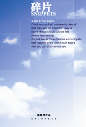
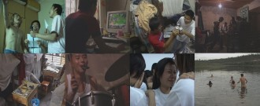
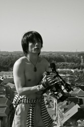

# 6月主题放映：再见，青春！

大学不是一点儿好处没有，它能洗去人的浮华，同时让人意志消磨，多愁善感，酒量大增……

我们终于来到以前憧憬的年纪，却发现已经有人订婚、有人结婚、有人出国、有人生活顺利、有人坚持梦想、有人碌碌无为……毕业时的那个蓝天早已消失不见，那个和你在操场边说着要一起走到未来的人，也早就不知道去了哪里。看着窗外的天，突然就黑了，感觉像我们的青春，突然就没了。

【展映时间】2013年6月

【参映城市】北京、广州、成都、南京、武汉、重庆、厦门、杭州、西安

【观影报名】http://site.douban.com/177837/room/2069620/

（PS：部分站点放映时间暂未确定，请关注瓢虫映像豆瓣小站、微信公众平台，或新浪微博@瓢虫映像，掌握一手活动信息。）

【展映影片】

《碎片》

彩色 / 84分钟 / DV / 2005年

相关视频：[http://v.youku.com/v_show/id_XMzUwMzI0NTY0.html](http://v.youku.com/v_show/id_XMzUwMzI0NTY0.html)

《碎片》作为作者的大学毕业作品，试图以“在影像中寻找自己”为命题，将整个大学阶段记录下来的许多碎片推上剪辑台。作者希望能通过纪录片理解什么是生活，同时也透过生活理解什么是纪录片，以便给当时的自己一个圆满的答复。

【参展、获奖情况】

美国加州大学 收藏

德国 第21届慕尼黑国际纪录片电影节（中国地区唯一入围影片）

德国 哥廷根国际电影节（中国地区唯一入围影片）

挪威 第26届北欧国际人类学电影

比利时 布鲁塞尔 "Underground China 2007" 影展

"看见中国”（Seeing China）澳大利亚国家大学、澳大利亚悉尼科技大学

“当代中国人的一生”中国独立电影放映全国巡展

第三届云之南纪录影像展

【导演阐述】

颜俊杰，2005年毕业于云南艺术学院电影电视艺术系导演专业。影像艺术爱好者，PADI潜水教练。任中国美术学院外聘教师，云南艺术学院专业教师，中央电视台导演。

有没有摄像机，我肯定都是一个正常的人。
